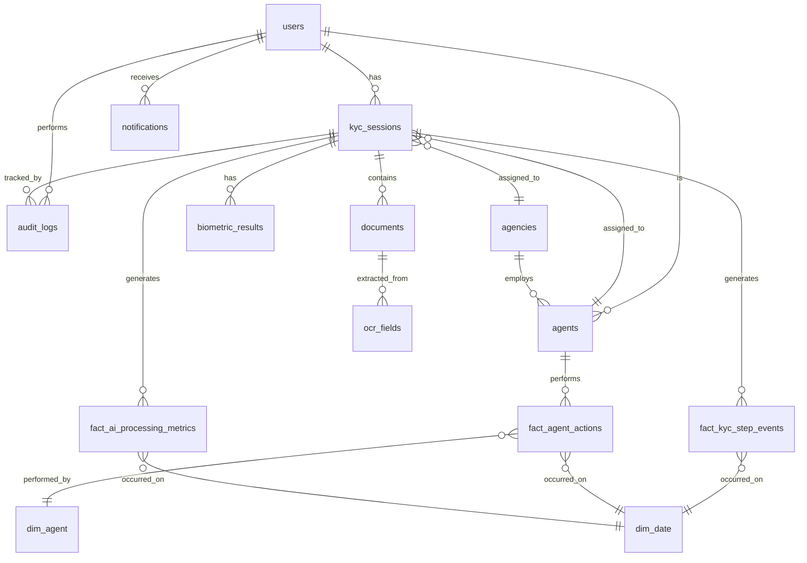

# Design Document: BICEC VeriPass Sovereign Digital KYC Platform

## Overview

### System Purpose

BICEC VeriPass is a sovereign digital KYC onboarding platform that transforms BICEC's manual 14-day identity verification process into a 15-minute digital journey. The system enables remote customer onboarding with AI-powered document verification, liveness detection, and comprehensive compliance workflows while maintaining 100% data sovereignty through on-premise processing.

### Key Objectives

1. **Digital Transformation**: Replace manual in-branch KYC with mobile-first digital onboarding
2. **Data Sovereignty**: Process all biometric and identity data on-premise without external cloud services
3. **Regulatory Compliance**: Meet COBAC R-2019/01, COBAC R-2023/01, and Cameroonian Law 2024-017 requirements
4. **Operational Efficiency**: Reduce KYC processing time from 14 days to 24-48 hours
5. **Fraud Prevention**: Implement AI-powered document verification, liveness detection, and AML screening
6. **Audit Traceability**: Maintain immutable audit logs with SHA-256 hashing for COBAC compliance

### System Boundaries

**In Scope:**
- Progressive Web Application (PWA) for client onboarding (Marie)
- Back-office web application for agents (Jean), compliance (Thomas), and operations (Sylvie)
- FastAPI backend with modular architecture
- On-premise AI processing (OCR, face matching, liveness detection)
- Local PEP/Sanctions screening
- Analytics and operational dashboards
- Integration with Sopra Banking Amplitude via Axway API Manager

**Out of Scope:**
- Core banking operations (handled by Sopra Amplitude)
- Payment processing
- Card issuance workflows
- Mobile banking features beyond KYC status visibility
- External cloud services or SaaS integrations

### Stakeholders

| Persona | Role | Primary Goals |
|---------|------|---------------|
| Marie | Client | Complete KYC onboarding quickly and securely from mobile device |
| Jean | KYC Agent | Validate dossiers efficiently with high-quality evidence |
| Thomas | AML/CFT Supervisor | Screen for sanctions/PEP, resolve identity conflicts, manage compliance |
| Sylvie | Operations Manager | Monitor system health, optimize conversion, ensure SLA compliance |
| Admin IT | System Administrator | Create/manage agent accounts, assign agents to branches, configure system parameters |
| BICEC IT | System Owner | Maintain data sovereignty, ensure regulatory compliance, minimize costs |

> **Note — Admin IT vs BICEC IT :** "Admin IT" désigne la personne qui administre opérationnellement la plateforme VeriPass (création de comptes agents, assignation aux agences, gestion de la configuration). "BICEC IT" désigne la DSI de BICEC en tant que propriétaire de l'infrastructure et garant de la souveraineté des données. Ce sont deux rôles distincts ; en MVP, la même personne peut occuper les deux.
>
> **Transition MVP → Production :** En MVP, Admin IT s'authentifie par email/mot de passe comme les autres agents back-office. La feuille de route prévoit une intégration LDAP/Active Directory BICEC pour remplacer cette authentification locale (dette technique planifiée, ADR à créer en Phase 2).


## Architecture

### High-Level Architecture

The system follows a modular monolith architecture deployed via Docker Compose, with clear separation between client interfaces, business logic, AI processing, and data persistence layers.

```
┌─────────────────────────────────────────────────────────────────┐
│                        Client Layer                              │
├──────────────────────────┬──────────────────────────────────────┤
│  PWA (Marie)             │  Back-Office SPA (Jean/Thomas/Sylvie)│
│  React/TypeScript        │  React/TypeScript                    │
│  MediaPipe WASM          │  Evidence Inspector                  │
│  Service Worker          │  Analytics Dashboards                │
└──────────────────────────┴──────────────────────────────────────┘
                              ↓ HTTPS/TLS 1.3
┌─────────────────────────────────────────────────────────────────┐
│                     Nginx Reverse Proxy                          │
│              TLS Termination | Rate Limiting                     │
└─────────────────────────────────────────────────────────────────┘
                              ↓
┌─────────────────────────────────────────────────────────────────┐
│                   FastAPI Backend (Modular Monolith)             │
├──────────────────────────┬──────────────────────────────────────┤
│  Auth Module             │  KYC Module                          │
│  Back-Office Module      │  AML Module                          │
│  Analytics Module        │  Notifications Module                │
└──────────────────────────┴──────────────────────────────────────┘
                              ↓
┌─────────────────────────────────────────────────────────────────┐
│                      Processing Layer                            │
├──────────────────────────┬──────────────────────────────────────┤
│  OCR Service             │  Biometrics Service                  │
│  - PaddleOCR PP-OCRv5    │  - DeepFace (face matching)          │
│  - GLM-OCR 0.9B fallback │  - MiniFASNet (liveness)             │
└──────────────────────────┴──────────────────────────────────────┘
                              ↓
┌─────────────────────────────────────────────────────────────────┐
│                    Asynchronous Workers                          │
│                    Celery + Redis Broker                         │
├──────────────────────────┬──────────────────────────────────────┤
│  glm_ocr_worker          │  notifications_worker                │
│  amplitude_batch_worker  │  sanctions_sync_worker               │
└──────────────────────────┴──────────────────────────────────────┘
                              ↓
┌─────────────────────────────────────────────────────────────────┐
│                      Data Layer                                  │
├──────────────────────────┬──────────────────────────────────────┤
│  PostgreSQL 16           │  Redis 7                             │
│  - OLTP (KYC sessions)   │  - OTP sessions (TTL)                │
│  - OLAP (Analytics DWH)  │  - Celery broker                     │
│  - PEP/Sanctions lists   │  - Anti-replay tokens                │
├──────────────────────────┴──────────────────────────────────────┤
│  Filesystem Volume (Docker)                                      │
│  - CNI images (encrypted AES-256)                               │
│  - Liveness videos                                               │
│  - Utility bills                                                 │
│  - 10-year retention (COBAC compliance)                          │
└─────────────────────────────────────────────────────────────────┘
                              ↓
┌─────────────────────────────────────────────────────────────────┐
│                    External Systems                              │
├──────────────────────────┬──────────────────────────────────────┤
│  Orange Cameroon SMS API │  Sopra Banking Amplitude             │
│  (OTP delivery)          │  (via Axway API Manager)             │
└──────────────────────────┴──────────────────────────────────────┘
```

### Architecture Decisions

**ADR-001: PWA React/TypeScript vs Flutter**
- Decision: PWA React/TypeScript
- Rationale: No Mac required for iOS builds, test on personal iPhone via localhost, coherent TypeScript stack, faster time-to-market
- Trade-off: Perceived as less "native" but functionally equivalent for KYC use case

**ADR-002: Modular Monolith vs Microservices**
- Decision: Modular Monolith deployed in Docker multi-containers
- Rationale: Simpler debugging, single deployment, optimized for 16GB RAM constraint, easily extractable to microservices in Phase 2
- Trade-off: No auto-scaling but acceptable for pilot (20-50 users)

**ADR-003: Hybrid OCR Strategy**
- Decision: PaddleOCR primary + GLM-OCR fallback
- Rationale: PaddleOCR fast (<1s) for structured CNI fields, GLM-OCR for low-confidence cases and unstructured utility bills
- Trade-off: Sequential processing to avoid CPU saturation on i3 node

**ADR-004: Polling-Based Notifications**
- Decision: Local polling (15s foreground, 60s background) + SMS fallback
- Rationale: 100% on-premise, no Firebase Cloud Messaging dependency, simple implementation
- Trade-off: Higher battery consumption than push notifications

**ADR-005: Filesystem Storage for Images**
- Decision: Docker volume with filesystem paths, not PostgreSQL BYTEA
- Rationale: COBAC requires 10-year retention of high-resolution originals, filesystem enables separate backup policies and cold archiving
- Trade-off: Requires volume management but better performance and flexibility


## Components and Interfaces

### Frontend Components

#### PWA (Marie's Client Interface)

**Technology Stack:**
- React 18 with TypeScript
- Vite for build tooling
- MediaPipe WASM for real-time camera processing
- Service Worker for offline resilience
- IndexedDB for encrypted local session storage
- Web Crypto API for client-side encryption

**Key Components:**

1. **Authentication Flow**
   - OTP input with SMS/Email toggle
   - PIN setup and biometric enrollment (WebAuthn)
   - Session resumption with PIN/biometric verification

2. **Document Capture Module**
   - Camera interface with getUserMedia API
   - Real-time quality gates (blur, glare, alignment detection via MediaPipe)
   - Auto-capture when quality thresholds met
   - Image compression before upload
   - Encrypted local storage until server confirmation

3. **Liveness Verification Module**
   - MediaPipe Face Mesh (478 landmarks)
   - Real-time gesture prompts (turn head, blink, smile)
   - Yaw angle calculation for head rotation
   - Eye Aspect Ratio (EAR) for blink detection
   - Strike counter with lockout mechanism (3 strikes = 60s cooldown)

4. **Form Modules**
   - OCR review with confidence badges (green ≥85%, orange 60-84%, red <60%)
   - Progressive address dropdowns (Ville → Commune → Quartier → Lieu-dit)
   - GPS capture with privacy notice
   - NIU declaration vs document upload toggle
   - Consent checkboxes with digital signature

5. **Status Dashboard**
   - Access level-based feature gating (RESTRICTED, LIMITED_ACCESS, FULL_ACCESS)
   - Banking plans preview (frontend-only demo)
   - Use-case personalization chips
   - Notification center with polling
   - Support messaging interface

**API Integration:**
- All API calls via Axios with JWT bearer tokens
- Automatic retry with exponential backoff
- Offline queue for failed requests
- SHA-256 verification of uploaded images

#### Back-Office SPA (Jean/Thomas/Sylvie)

**Technology Stack:**
- React 18 with TypeScript
- Vite for build tooling
- TanStack Query for server state management
- Recharts for analytics visualizations
- React Router for role-based routing

**Key Components:**

1. **Authentication & RBAC**
   - Email/password login
   - Role-based dashboard routing (JEAN → Validation Desk, THOMAS → AML/Compliance, SYLVIE → Command Center, ADMIN_IT → Admin Panel)
   - JWT with 8-hour expiry
   - Account lockout after 5 failed attempts (15-minute cooldown)

2. **Jean's Validation Desk**
   - Agent queue with priority sorting (escalated SLA → lowest confidence → FIFO)
   - Evidence Inspector with side-by-side image viewer
   - Pan/zoom on high-resolution images
   - Face matching panel (selfie vs CNI photo)
   - OCR field review with confidence highlighting
   - Decision actions: Approve, Reject (with reason), Request Info

3. **Thomas's AML/Compliance Dashboard**
   - AML alerts queue (PEP/Sanctions matches)
   - Side-by-side profile comparison (client vs sanctions entry)
   - False positive clearance with mandatory justification
   - Identity conflict resolver (duplicate detection)
   - Agency CRUD management
   - Amplitude provisioning batch monitor
   - Manual batch retry for OPS_ERROR cases

4. **Sylvie's Command Center**
   - Operational health dashboard (R/Y/G tiles)
   - Funnel analytics with drop-off visualization
   - Agent performance metrics
   - SLA violation alerts with escalation button
   - Load balancing redistribution
   - COBAC compliance pack export (ZIP with PDF + images + JSON audit log)

5. **Admin IT Panel** *(4e rôle back-office — Lifecycle des agents)*
   - **Gestion des comptes agents** : créer / modifier / désactiver les comptes Jean, Thomas et Sylvie
     - Formulaire de création : nom, prénom, email, rôle (JEAN/THOMAS/SYLVIE), agence
     - Mot de passe initial généré aléatoirement → envoyé par email sécurisé à l'agent
     - Désactivation immédiate (flag `status = DISABLED`, JWT invalidé via blacklist Redis)
   - **Assignation agence** : l'`agency_id` est défini à la création du compte et peut être modifié par Admin IT
   - **Réinitialisation de mot de passe** : génère un token temporaire (TTL 24h) envoyé par email
   - **CRUD des agences** *(partagé avec Thomas pour la partie visualisation)* : créer / modifier / activer / désactiver des agences BICEC
   - **Consultation de l'audit log complet** (lecture seule, toutes actions de tous agents)
   - **Configuration système** : seuils OCR, timeouts Celery, limites de capacité des files d'attente
   - **Seed initial** : le premier compte Admin IT est créé par script SQL au déploiement initial (`scripts/seed_admin_it.sql`) — aucune UI n'est nécessaire pour bootstrapper le système

**API Integration:**
- Role-based endpoint access enforcement
- Real-time polling for queue updates (30s interval)
- CSV/JSON export functionality
- Audit log integrity verification

### Backend Components

#### FastAPI Modular Monolith

**Module Structure:**

```
app/
├── modules/
│   ├── auth/
│   │   ├── routes.py          # OTP, PIN, JWT endpoints
│   │   ├── service.py         # OTP generation, bcrypt hashing
│   │   └── models.py          # User, Session schemas
│   ├── kyc/
│   │   ├── routes.py          # Capture, OCR, liveness, submit
│   │   ├── service.py         # State machine logic
│   │   ├── state_machine.py   # Session status transitions
│   │   └── models.py          # KYCSession, Document schemas
│   ├── backoffice/
│   │   ├── routes.py          # Queue, inspect, decision actions
│   │   ├── service.py         # Load balancing (WRR + Least Connections)
│   │   └── models.py          # Agent, Queue schemas
│   ├── aml/
│   │   ├── routes.py          # Alerts, screening, conflicts
│   │   ├── service.py         # Fuzzy matching (pg_trgm)
│   │   └── models.py          # PEPSanction, AMLAlert schemas
│   ├── analytics/
│   │   ├── routes.py          # Funnel, SLA, health endpoints
│   │   ├── service.py         # Star schema queries
│   │   └── models.py          # AnalyticsEvent schemas
│   ├── admin/
│   │   ├── routes.py          # Agency CRUD, batch provisioning
│   │   └── service.py         # Amplitude integration
│   └── notifications/
│       ├── routes.py          # Polling endpoint, mark read
│       └── service.py         # Celery task triggers
├── services/
│   ├── ocr_service.py         # PaddleOCR + GLM-OCR orchestration
│   ├── biometrics_service.py  # DeepFace + MiniFASNet
│   ├── audit_service.py       # SHA-256 hashing, append-only log
│   └── iso20022_parser.py     # Amplitude message parsing
├── core/
│   ├── config.py              # Environment variables, settings
│   ├── database.py            # SQLAlchemy session, connection pool
│   ├── security.py            # JWT utils, password hashing
│   └── logging.py             # Structured JSON logging
└── main.py                    # FastAPI app initialization
```

**Key Services:**

1. **OCR Service**
   - PaddleOCR PP-OCRv5 for CNI structured fields
   - Confidence scoring per field (0-100)
   - Automatic GLM-OCR fallback queue if confidence <85%
   - GLM-OCR for utility bill semantic extraction (agency name, date, address)

2. **Biometrics Service**
   - DeepFace for 1:1 face matching (selfie vs CNI photo)
   - MiniFASNet for liveness/anti-spoofing detection
   - Similarity score (0-100) and liveness score (0-100)
   - AES-256 encryption of biometric templates before storage

3. **Audit Service**
   - SHA-256 hashing of event payloads
   - Append-only PostgreSQL table (no DELETE/UPDATE)
   - Event types: DOSSIER_VIEWED, DOSSIER_APPROVED, DOSSIER_REJECTED, AML_CLEARED, AML_CONFIRMED_FREEZE, etc.
   - IP address and timestamp capture

4. **ISO 20022 Parser**
   - Parse Amplitude XML responses (pain.001, pain.002 schemas)
   - Serialize provisioning requests to XML
   - XSD schema validation
   - Round-trip property: parse → print → parse = equivalent object

#### Celery Workers

**Worker Queues:**

1. **glm_ocr_worker** (queue: `glm_ocr_jobs`)
   - Concurrency: 1 (sequential processing to avoid CPU saturation)
   - Processes low-confidence CNI fields and utility bills
   - Timeout: 30 seconds per task
   - Fallback to manual entry if GLM-OCR fails

2. **notifications_worker** (queue: `notifications`)
   - Concurrency: 4
   - Sends SMS via Orange Cameroon API
   - Sends email via SMTP
   - Retries: 3 attempts with exponential backoff

3. **amplitude_batch_worker** (queue: `provisioning_batch`)
   - Concurrency: 2
   - Sends ISO 20022 messages to Sopra Amplitude via Axway
   - Timeout: 5 minutes per batch
   - Transitions session status: PROVISIONING → VALIDATED_PENDING_AGENCY (success) or OPS_ERROR (failure)

4. **sanctions_sync_worker** (queue: `sanctions_sync`)
   - Concurrency: 1
   - Downloads PEP/Sanctions lists from OpenSanctions, UN, EU, OFAC
   - Normalizes and upserts into `pep_sanctions` table
   - Scheduled: Weekly via cron
   - Manual trigger available in Thomas's admin panel

### External Integrations

#### Orange Cameroon SMS API

**Purpose:** OTP delivery for authentication

**Integration Details:**
- HTTPS REST API with client_id/client_secret authentication
- Endpoint: `POST https://api.orange.cm/smsmessaging/v1/outbound/{sender}/requests`
- Payload: `{"address": "+237XXXXXXXXX", "senderAddress": "BICEC", "message": "Votre code OTP: 123456"}`
- Response: `{"deliveryInfoList": {"deliveryStatus": "DeliveredToNetwork"}}`
- Rate limit: 3 OTP per phone number per hour (enforced by backend)
- Fallback: Email OTP if SMS fails after 3 retries

#### Sopra Banking Amplitude

**Purpose:** Core banking account provisioning

**Integration Details:**
- Protocol: ISO 20022 XML messages via Axway API Manager
- Message types: pain.001 (account creation request), pain.002 (status response)
- Endpoint: `POST https://axway.bicec.internal/amplitude/provisioning`
- Authentication: Mutual TLS with client certificates
- Timeout: 5 minutes per request
- Error handling: Transition to OPS_ERROR status, notify Thomas for manual retry

#### OpenSanctions / UN / EU / OFAC

**Purpose:** PEP and sanctions list synchronization

**Integration Details:**
- OpenSanctions: `https://data.opensanctions.org/datasets/latest/default/targets.simple.csv`
- UN Consolidated List: `https://scsanctions.un.org/resources/xml/en/consolidated.xml`
- EU Financial Sanctions: `https://webgate.ec.europa.eu/fsd/fsf/public/files/csvFullSanctionsList_1_1/content`
- OFAC SDN List: `https://www.treasury.gov/ofac/downloads/sdn.csv`
- Frequency: Weekly batch download via Celery cron
- Storage: Local PostgreSQL `pep_sanctions` table
- Fuzzy matching: PostgreSQL pg_trgm extension for name similarity


## Data Models

### Core Entities

#### users
Primary table for all system users (clients and agents).

| Column | Type | Constraints | Description |
|--------|------|-------------|-------------|
| id | UUID | PK | Unique user identifier |
| phone_number | VARCHAR(20) | UNIQUE, NOT NULL | E.164 format (+237XXXXXXXXX) |
| email | VARCHAR(255) | UNIQUE | Optional email address |
| pin_hash | VARCHAR(255) | | bcrypt hash of PIN (clients only) |
| role | ENUM | NOT NULL | CLIENT, JEAN, THOMAS, SYLVIE, ADMIN_IT |
| status | ENUM | NOT NULL | ACTIVE, LOCKED, DISABLED |
| lockout_count_24h | INTEGER | DEFAULT 0 | Liveness strike counter (resets daily) |
| created_at | TIMESTAMP | NOT NULL | Account creation timestamp |
| updated_at | TIMESTAMP | NOT NULL | Last modification timestamp |

#### kyc_sessions
Tracks KYC onboarding sessions with state machine status.

| Column | Type | Constraints | Description |
|--------|------|-------------|-------------|
| id | UUID | PK | Session identifier |
| user_id | UUID | FK → users.id | Client user reference |
| status | ENUM | NOT NULL | DRAFT, PENDING_KYC, PENDING_INFO, COMPLIANCE_REVIEW, READY_FOR_OPS, PROVISIONING, OPS_ERROR, OPS_CORRECTION, VALIDATED_PENDING_AGENCY, ACTIVATED_LIMITED, ACTIVATED_PRE_FULL, ACTIVATED_FULL, EXPIRY_WARNING, PENDING_RESUBMIT, MONITORED, REJECTED, DISABLED, ABANDONED |
| access_level | ENUM | NOT NULL | RESTRICTED, PENDING_ACTIVATION, LIMITED_ACCESS, PRE_FULL_ACCESS, FULL_ACCESS, BLOCKED |
| liveness_strike_count | INTEGER | DEFAULT 0 | Current liveness failure count (max 3) |
| global_confidence_score | DECIMAL(5,2) | | Weighted score: OCR (40%) + liveness (30%) + face match (20%) + coherence (10%) |
| duplicate_suspected | BOOLEAN | DEFAULT FALSE | Flagged by fuzzy matching |
| aml_alert | BOOLEAN | DEFAULT FALSE | Flagged by PEP/Sanctions screening |
| niu_type | ENUM | | DOCUMENT, DECLARATIVE, NULL |
| niu_declarative | BOOLEAN | DEFAULT FALSE | True if NIU manually declared (not uploaded) |
| assigned_agency_id | UUID | FK → agencies.id | Routing based on utility bill zone |
| assigned_agent_id | UUID | FK → users.id | Jean assigned to this dossier |
| preferences | JSONB | | Use-case selections, language preference |
| address_ville | VARCHAR(100) | | Selected city |
| address_commune | VARCHAR(100) | | Selected commune |
| address_quartier | VARCHAR(100) | | Selected quartier |
| address_lieu_dit | VARCHAR(100) | | Selected lieu-dit |
| gps_coordinates_encrypted | TEXT | | AES-256 encrypted GPS coordinates |
| created_at | TIMESTAMP | NOT NULL | Session start timestamp |
| updated_at | TIMESTAMP | NOT NULL | Last state transition timestamp |
| submitted_at | TIMESTAMP | | Consent submission timestamp |
| approved_at | TIMESTAMP | | Jean approval timestamp |
| activated_at | TIMESTAMP | | Account activation timestamp |

#### documents
Stores metadata for uploaded documents (images stored on filesystem).

| Column | Type | Constraints | Description |
|--------|------|-------------|-------------|
| id | UUID | PK | Document identifier |
| session_id | UUID | FK → kyc_sessions.id | Parent session |
| document_type | ENUM | NOT NULL | CNI_RECTO, CNI_VERSO, PASSPORT, UTILITY_BILL, NIU_ATTESTATION, LIVENESS_VIDEO |
| format_variant | ENUM | | CNI_ANCIEN_LANDSCAPE, CNI_NOUVEAU_PORTRAIT, PASSPORT, N/A — voir note ci-dessous |
| file_path | VARCHAR(500) | NOT NULL | Filesystem path: /data/documents/{session_id}/{filename} |
| sha256_hash | VARCHAR(64) | NOT NULL | SHA-256 hash for integrity verification |
| file_size_bytes | INTEGER | | Original file size |
| status | ENUM | NOT NULL | UPLOADED, PROCESSING, PROCESSED, FAILED |
| created_at | TIMESTAMP | NOT NULL | Upload timestamp |

#### ocr_fields
Extracted OCR fields with confidence scores.

| Column | Type | Constraints | Description |
|--------|------|-------------|-------------|
| id | UUID | PK | Field identifier |
| document_id | UUID | FK → documents.id | Parent document |
| field_name | VARCHAR(100) | NOT NULL | Voir table complète des champs CNI ci-dessous |
| field_value | TEXT | | Extracted text value |
| confidence_score | DECIMAL(5,2) | | 0-100 confidence from OCR engine |
| engine | ENUM | NOT NULL | PADDLE, GLM |
| human_corrected | BOOLEAN | DEFAULT FALSE | True if Marie manually corrected |
| corrected_value | TEXT | | Valeur corrigée manuellement par Marie ou Jean |
| corrected_by | UUID | FK → users.id | Qui a corrigé (Marie = client, Jean = agent) |
| created_at | TIMESTAMP | NOT NULL | Extraction timestamp |

##### Champs CNI Camerounaise — référentiel complet des `field_name`

La CNI camerounaise existe en deux formats physiques qui impactent la position du visage et la disposition du texte :

| Format | Orientation | Époque | Position photo (recto) |
|--------|-------------|--------|----------------------|
| `CNI_ANCIEN_LANDSCAPE` | Paysage (carte bancaire) | Avant ~2021 | Droite du recto |
| `CNI_NOUVEAU_PORTRAIT` | Portrait (plus grand) | 2021+ | Haut du recto |

Le pipeline OCR détecte automatiquement le format via le ratio largeur/hauteur de l'image avant d'appliquer les zones de détection de visage et de texte.

**Champs recto (face avant) :**

| `field_name` | Libellé sur document | Type extrait | Obligatoire | Notes |
|---|---|---|---|---|
| `cni_nom` | NOMS | Texte | Oui | Nom de famille en majuscules |
| `cni_prenom` | PRENOMS | Texte | Oui | Prénom(s) |
| `cni_date_naissance` | DATE DE NAISSANCE | Date (DD/MM/YYYY) | Oui | |
| `cni_lieu_naissance` | LIEU DE NAISSANCE | Texte | Oui | Ville/Localité de naissance |
| `cni_sexe` | SEXE | Texte (M / F) | Oui | |
| `cni_taille` | TAILLE | Texte (ex: 1,75 m) | Non | Peut être illisible sur vieilles CNI |
| `cni_profession` | PROFESSION | Texte | Non | Peut être absent ou vide |
| `cni_signature_present` | SIGNATURE | Booléen | Non | Présence visuelle uniquement — pas de transcription texte |

**Champs verso (face arrière) :**

| `field_name` | Libellé sur document | Type extrait | Obligatoire | Notes |
|---|---|---|---|---|
| `cni_pere` | PERE | Texte (nom + prénoms) | Non | Peut être "INCONNU" ou absent |
| `cni_mere` | MERE | Texte (nom + prénoms) | Non | |
| `cni_situation_pro` | S.P | Texte | Non | Situation professionnelle |
| `cni_adresse` | ADRESSE | Texte | Non | Adresse déclarée au moment de l'émission |
| `cni_autorite_nom` | AUTORITE | Texte | Oui | Nom de l'autorité ayant délivré la CNI (sa signature est au-dessus) |
| `cni_date_delivrance` | DATE DE DELIVRANCE | Date (DD/MM/YYYY) | Oui | |
| `cni_date_expiration` | DATE D'EXPIRATION | Date (DD/MM/YYYY) | Oui | Vérifiée contre la date du jour pour flag doc_expiry |
| `cni_poste_identification` | POSTE D'IDENTIFICATION | Texte | Oui | Centre émetteur de la CNI |
| `cni_identifiant_unique` | IDENTIFIANT UNIQUE | Texte alphanumérique | Oui | **≠ NIU fiscal** — voir note critique ci-dessous |
| `cni_numero_cni` | (Numéro imprimé sur le document) | Texte | Oui | Numéro de la CNI |

> **⚠️ Note critique — Identifiant Unique ≠ NIU :**
> L'`identifiant_unique` imprimé sur la CNI est l'identifiant délivré par le Centre d'État Civil (état civil). Il est **différent** du NIU (Numéro d'Identification Unique fiscal), qui est délivré par la Direction Générale des Impôts (DGI). Ces deux identifiants peuvent coexister dans un dossier KYC et ne doivent **jamais** être stockés dans le même champ ou confondus. Dans la base de données : `cni_identifiant_unique` (de la CNI) et `niu_value` (de l'attestation NIU uploadée ou déclarée) sont deux colonnes distinctes.

**Note sur `format_variant` dans la table `documents` :**
La colonne `format_variant` est renseignée automatiquement par le service OCR lors du traitement de `CNI_RECTO`. Pour les autres types de documents (`UTILITY_BILL`, `SELFIE`, etc.), elle vaut `N/A`.

#### biometric_results
Face matching and liveness detection results.

| Column | Type | Constraints | Description |
|--------|------|-------------|-------------|
| id | UUID | PK | Result identifier |
| session_id | UUID | FK → kyc_sessions.id | Parent session |
| liveness_score | DECIMAL(5,2) | | 0-100 anti-spoofing score (MiniFASNet) |
| face_match_score | DECIMAL(5,2) | | 0-100 similarity score (DeepFace) |
| face_embedding_encrypted | TEXT | | AES-256 encrypted face embedding vector |
| model_version | VARCHAR(50) | | DeepFace/MiniFASNet version for audit |
| created_at | TIMESTAMP | NOT NULL | Processing timestamp |

#### audit_logs
Immutable append-only audit trail with SHA-256 integrity.

| Column | Type | Constraints | Description |
|--------|------|-------------|-------------|
| id | UUID | PK | Log entry identifier |
| event_type | ENUM | NOT NULL | DOSSIER_VIEWED, DOSSIER_APPROVED, DOSSIER_REJECTED, AML_CLEARED, AML_CONFIRMED_FREEZE, CONSENT_SIGNED, SESSION_RESUMED, IDENTITY_LINKED, IDENTITY_FRAUD_REJECTED, SANCTIONS_SYNC_COMPLETE, AGENCY_CREATED, AGENCY_UPDATED, PROVISIONING_STARTED, PROVISIONING_SUCCESS, PROVISIONING_FAILED, EXPORT_COMPLIANCE_PACK |
| actor_id | UUID | FK → users.id | User who performed action |
| dossier_id | UUID | FK → kyc_sessions.id | Related session (if applicable) |
| timestamp | TIMESTAMP | NOT NULL | Event occurrence time |
| ip_address | INET | | Client IP address |
| payload | JSONB | | Event-specific data (justifications, field changes, etc.) |
| sha256_hash | VARCHAR(64) | NOT NULL | SHA-256(event_type + actor_id + timestamp + payload) |

**Integrity Verification:**
```sql
-- Verify audit log integrity
SELECT id, event_type, 
       sha256_hash = encode(digest(event_type::text || actor_id::text || timestamp::text || payload::text, 'sha256'), 'hex') AS is_valid
FROM audit_logs
WHERE is_valid = FALSE;
```

#### notifications
In-app notification queue for polling.

| Column | Type | Constraints | Description |
|--------|------|-------------|-------------|
| id | UUID | PK | Notification identifier |
| user_id | UUID | FK → users.id | Recipient user |
| type | ENUM | NOT NULL | OTP_SENT, DOSSIER_APPROVED, DOSSIER_REJECTED, INFO_REQUESTED, ACCOUNT_ACTIVATED, AML_ALERT, ESCALATION, AGENT_REPLY, NEW_MESSAGE |
| message | TEXT | NOT NULL | Localized notification text |
| delivery_method | ENUM | NOT NULL | IN_APP, SMS, EMAIL |
| read | BOOLEAN | DEFAULT FALSE | Read status |
| created_at | TIMESTAMP | NOT NULL | Notification creation time |

#### agents
Agent-specific metadata for load balancing.

| Column | Type | Constraints | Description |
|--------|------|-------------|-------------|
| id | UUID | PK | Agent identifier (FK → users.id) |
| agency_id | UUID | FK → agencies.id | Assigned agency |
| availability_status | ENUM | NOT NULL | AVAILABLE, BUSY, AWAY |
| active_dossier_count | INTEGER | DEFAULT 0 | Current workload (2-10 range) |
| total_validated | INTEGER | DEFAULT 0 | Lifetime validation count |
| avg_validation_time_seconds | INTEGER | | Performance metric |
| created_at | TIMESTAMP | NOT NULL | Agent onboarding date |

#### agencies
BICEC branch locations for dossier routing.

| Column | Type | Constraints | Description |
|--------|------|-------------|-------------|
| id | UUID | PK | Agency identifier |
| name | VARCHAR(200) | NOT NULL | Agency name (e.g., "BICEC Douala Akwa") |
| region | VARCHAR(100) | NOT NULL | Cameroonian region |
| zone_coordinates | GEOGRAPHY(POINT) | | GPS centroid for proximity routing |
| max_agent_capacity | INTEGER | DEFAULT 10 | Maximum concurrent agents |
| status | ENUM | NOT NULL | ACTIVE, INACTIVE |
| created_at | TIMESTAMP | NOT NULL | Agency creation date |

#### pep_sanctions
Local PEP and sanctions list for offline screening.

| Column | Type | Constraints | Description |
|--------|------|-------------|-------------|
| id | UUID | PK | Entry identifier |
| full_name | VARCHAR(500) | NOT NULL | Full name (normalized) |
| aliases | TEXT[] | | Known aliases |
| date_of_birth | DATE | | Date of birth (if available) |
| country | VARCHAR(100) | | Nationality or country of residence |
| sanctions_programs | TEXT[] | | UN, EU, OFAC, PEP, etc. |
| list_source | VARCHAR(100) | NOT NULL | OpenSanctions, UN, EU, OFAC |
| last_updated | TIMESTAMP | NOT NULL | Last sync timestamp |

**Fuzzy Matching Index:**
```sql
CREATE EXTENSION IF NOT EXISTS pg_trgm;
CREATE INDEX idx_pep_sanctions_name_trgm ON pep_sanctions USING gin (full_name gin_trgm_ops);
```

### Analytics Data Warehouse (Star Schema)

#### fact_kyc_step_events
Fact table for funnel analytics.

| Column | Type | Constraints | Description |
|--------|------|-------------|-------------|
| id | UUID | PK | Event identifier |
| session_id | UUID | FK → kyc_sessions.id | Session reference |
| step_name | VARCHAR(100) | NOT NULL | Inscription, CNI_Recto, CNI_Verso, Liveness, Adresse, NIU, Consentement, Soumis, Approuvé, Activé |
| timestamp | TIMESTAMP | NOT NULL | Step completion time |
| duration_seconds | INTEGER | | Time spent on this step |
| success_flag | BOOLEAN | NOT NULL | True if step completed successfully |
| date_key | INTEGER | FK → dim_date.date_key | Date dimension reference |
| agent_key | INTEGER | FK → dim_agent.agent_key | Agent dimension reference (if applicable) |

#### fact_agent_actions
Fact table for agent performance analytics.

| Column | Type | Constraints | Description |
|--------|------|-------------|-------------|
| id | UUID | PK | Action identifier |
| agent_key | INTEGER | FK → dim_agent.agent_key | Agent dimension reference |
| action_type | ENUM | NOT NULL | VIEWED, APPROVED, REJECTED, INFO_REQUESTED |
| session_id | UUID | FK → kyc_sessions.id | Session reference |
| timestamp | TIMESTAMP | NOT NULL | Action timestamp |
| duration_seconds | INTEGER | | Time spent on dossier |
| date_key | INTEGER | FK → dim_date.date_key | Date dimension reference |

#### fact_ai_processing_metrics
Fact table for AI/ML observability.

| Column | Type | Constraints | Description |
|--------|------|-------------|-------------|
| id | UUID | PK | Metric identifier |
| session_id | UUID | FK → kyc_sessions.id | Session reference |
| processing_type | ENUM | NOT NULL | OCR_PADDLE, OCR_GLM, FACE_MATCH, LIVENESS |
| duration_seconds | DECIMAL(10,3) | | Processing time |
| confidence_score | DECIMAL(5,2) | | Output confidence (0-100) |
| success_flag | BOOLEAN | NOT NULL | True if processing succeeded |
| timestamp | TIMESTAMP | NOT NULL | Processing timestamp |
| date_key | INTEGER | FK → dim_date.date_key | Date dimension reference |

#### dim_date
Date dimension for time-based analytics.

| Column | Type | Constraints | Description |
|--------|------|-------------|-------------|
| date_key | INTEGER | PK | YYYYMMDD format |
| full_date | DATE | NOT NULL | Actual date |
| day_of_week | VARCHAR(10) | | Monday, Tuesday, etc. |
| month | VARCHAR(10) | | January, February, etc. |
| quarter | INTEGER | | 1, 2, 3, 4 |
| year | INTEGER | | YYYY |
| is_weekend | BOOLEAN | | True if Saturday/Sunday |

#### dim_agent
Agent dimension for performance analytics.

| Column | Type | Constraints | Description |
|--------|------|-------------|-------------|
| agent_key | INTEGER | PK | Surrogate key |
| agent_id | UUID | FK → users.id | Natural key |
| agent_name | VARCHAR(200) | | Agent full name |
| agency_name | VARCHAR(200) | | Assigned agency |
| role | VARCHAR(50) | | JEAN, THOMAS, SYLVIE |

#### dim_session_status
Session status dimension for state analytics.

| Column | Type | Constraints | Description |
|--------|------|-------------|-------------|
| status_key | INTEGER | PK | Surrogate key |
| status_name | VARCHAR(100) | | DRAFT, PENDING_KYC, etc. |
| status_category | VARCHAR(50) | | IN_PROGRESS, COMPLETED, REJECTED, ERROR |

### Entity Relationship Diagram



### State Machine

The KYC session follows a strict state machine with defined transitions:

```
DRAFT → LOCKED_LIVENESS (3 liveness failures)
DRAFT → PENDING_KYC (consent submitted)
PENDING_KYC → PENDING_INFO (Jean requests info)
PENDING_INFO → PENDING_KYC (Marie provides info)
PENDING_KYC → COMPLIANCE_REVIEW (AML alert triggered)
COMPLIANCE_REVIEW → PENDING_KYC (Thomas clears false positive)
COMPLIANCE_REVIEW → MONITORED (Thomas confirms PEP, account active but monitored)
COMPLIANCE_REVIEW → DISABLED (Thomas confirms fraud)
PENDING_KYC → REJECTED (Jean rejects)
PENDING_KYC → READY_FOR_OPS (Jean approves)
READY_FOR_OPS → PROVISIONING (Thomas launches Amplitude batch)
PROVISIONING → OPS_ERROR (Amplitude timeout/error)
PROVISIONING → OPS_CORRECTION (Format error, NIU collision)
OPS_ERROR → PROVISIONING (Thomas retries)
OPS_CORRECTION → PROVISIONING (Thomas corrects and retries)
PROVISIONING → VALIDATED_PENDING_AGENCY (Amplitude success)
VALIDATED_PENDING_AGENCY → ACTIVATED_LIMITED (NIU declarative)
VALIDATED_PENDING_AGENCY → ACTIVATED_PRE_FULL (NIU document uploaded)
ACTIVATED_PRE_FULL → ACTIVATED_FULL (Wet signature at agency)
ACTIVATED_LIMITED → ACTIVATED_PRE_FULL (Marie uploads NIU document)
ACTIVATED_FULL → EXPIRY_WARNING (Document expiring <30 days)
EXPIRY_WARNING → PENDING_RESUBMIT (Jean notifies Marie)
PENDING_RESUBMIT → ACTIVATED_FULL (Marie resubmits, Jean approves)
PENDING_RESUBMIT → ACTIVATED_LIMITED (Deadline passed, access downgraded)
MONITORED → ACTIVATED_FULL (Surveillance lifted)
MONITORED → DISABLED (Fraud confirmed after surveillance)
```

**Terminal States:** REJECTED, DISABLED, ABANDONED


## Correctness Properties

A property is a characteristic or behavior that should hold true across all valid executions of a system—essentially, a formal statement about what the system should do. Properties serve as the bridge between human-readable specifications and machine-verifiable correctness guarantees.

The following properties are derived from the acceptance criteria in the requirements document. Each property is universally quantified (applies to all valid inputs) and references the specific requirements it validates.

### Authentication and Session Management Properties

#### Property 1: OTP Anti-Replay Protection

For any valid OTP verification, once the OTP is successfully verified, it SHALL be immediately deleted from Redis and SHALL NOT be reusable for subsequent authentication attempts.

**Validates: Requirements 1.4**

#### Property 2: OTP TTL Enforcement

For any OTP generated and stored in Redis, the OTP SHALL expire and become invalid exactly 5 minutes after creation, regardless of whether it has been used.

**Validates: Requirements 1.3**

#### Property 3: Rate Limiting After Failed OTP Attempts

For any phone number or email, after 3 consecutive incorrect OTP submissions, the 4th and subsequent attempts SHALL be blocked for 60 seconds.

**Validates: Requirements 1.5**

#### Property 4: JWT Issuance on Successful Authentication

For any successful OTP verification, the system SHALL issue a JWT access token with exactly 24-hour expiry from the moment of issuance.

**Validates: Requirements 1.6**

#### Property 5: PIN Storage Security

For any PIN set by a user, the PIN SHALL never be stored in plaintext in the database; it SHALL always be hashed using bcrypt with work factor ≥12 or Argon2.

**Validates: Requirements 1.9, 33.5**

#### Property 6: Session Resumption Performance

For any session resumption after network restoration, the PWA SHALL complete the resumption process within 2 seconds.

**Validates: Requirements 5.3, 32.4**

### Document Capture and Processing Properties

#### Property 7: Image Encryption Before Local Storage

For any confirmed document image (CNI, passport, utility bill), the PWA SHALL encrypt the image using Web Crypto API before storing it in IndexedDB.

**Validates: Requirements 2.5, 33.8**

#### Property 8: SHA-256 Hash Computation for All Uploads

For any document uploaded to the backend, the system SHALL compute a SHA-256 hash of the file contents and store it in the documents table.

**Validates: Requirements 2.8, 2.9**

#### Property 9: Document Upload Integrity Verification

For any document upload, when the server confirms receipt with HTTP 200 and a matching SHA-256 hash, the PWA SHALL purge the local encrypted copy from IndexedDB.

**Validates: Requirements 5.6**

#### Property 10: CNI Recto and Verso Requirement

For any KYC session, the system SHALL NOT allow progression to the liveness capture step unless both CNI Recto AND CNI Verso documents have been successfully uploaded and processed.

**Validates: Requirements 2.10**

#### Property 11: Quality Gate Consistency

For any document capture (CNI Recto or CNI Verso), the system SHALL apply the same quality gate thresholds for blur, glare, and alignment detection.

**Validates: Requirements 2.11**

#### Property 12: Auto-Capture Trigger

For any camera frame that passes blur threshold AND glare threshold AND alignment threshold simultaneously, the PWA SHALL trigger auto-capture within 1 second.

**Validates: Requirements 2.4**

### OCR and AI Processing Properties

#### Property 13: OCR Field Extraction Completeness

For any CNI Recto image processed by the OCR service, the system SHALL attempt to extract all required fields: `cni_nom`, `cni_prenom`, `cni_date_naissance`, `cni_lieu_naissance`, `cni_sexe`, `cni_taille`, `cni_profession`, `cni_numero_cni`.

For any CNI Verso image processed by the OCR service, the system SHALL attempt to extract: `cni_pere`, `cni_mere`, `cni_situation_pro`, `cni_adresse`, `cni_autorite_nom`, `cni_date_delivrance`, `cni_date_expiration`, `cni_poste_identification`, `cni_identifiant_unique`.

For any CNI Recto image, the OCR service SHALL also detect the document format variant (`CNI_ANCIEN_LANDSCAPE` vs `CNI_NOUVEAU_PORTRAIT`) based on the image aspect ratio, and store the result in `documents.format_variant` to adapt the face-detection bounding box accordingly.

The `cni_identifiant_unique` field SHALL never be mapped to the NIU field — they are distinct identifiers from different issuing authorities (État Civil vs DGI).

**Validates: Requirements 4.1, 45.2**

#### Property 14: OCR Confidence Score Range

For any field extracted by the OCR service, the confidence score SHALL be a decimal value in the range [0, 100].

**Validates: Requirements 4.4**

#### Property 15: GLM-OCR Fallback Trigger

For any OCR extraction where at least one field has confidence below 85%, the system SHALL automatically queue a Celery task for GLM-OCR fallback processing.

**Validates: Requirements 4.5**

#### Property 16: OCR Processing Performance

For any CNI document processed by PaddleOCR, the extraction SHALL complete within 5 seconds on the benchmark i3 node.

**Validates: Requirements 4.3, 31.1**

#### Property 17: GLM-OCR Processing Performance

For any document processed by GLM-OCR fallback, the extraction SHALL complete within 30 seconds.

**Validates: Requirements 4.6, 31.5**

#### Property 18: Human Correction Flagging

For any OCR field that Marie manually corrects, the system SHALL set the human_corrected flag to TRUE in the ocr_fields table.

**Validates: Requirements 4.10**

### Biometric Processing Properties

#### Property 19: Liveness Score Range

For any liveness video processed by the Anti_Spoofing_Service, the liveness score SHALL be a decimal value in the range [0, 100].

**Validates: Requirements 3.4**

#### Property 20: Face Match Score Range

For any selfie processed by the Face_Matching_Service, the face match score SHALL be a decimal value in the range [0, 100].

**Validates: Requirements 3.5**

#### Property 21: Liveness Strike Counter Increment

For any liveness attempt where the liveness score is below the configured threshold, the system SHALL increment the session's liveness_strike_count by exactly 1.

**Validates: Requirements 3.6**

#### Property 22: Liveness Lockout Trigger

For any KYC session where the liveness_strike_count reaches 3, the system SHALL transition the session status to LOCKED_LIVENESS and prevent further liveness attempts for 60 seconds.

**Validates: Requirements 3.7**

#### Property 23: Biometric Template Encryption

For any biometric template (face embedding) generated by the Face_Matching_Service, the system SHALL encrypt the template using AES-256 before storing it in the biometric_results table.

**Validates: Requirements 10.10, 33.1**

#### Property 24: Biometric Processing Performance

For any session requiring biometric processing (liveness + face matching), the combined processing time SHALL NOT exceed 10 seconds on the benchmark i3 node.

**Validates: Requirements 10.9, 31.2, 31.3**

### State Machine and Workflow Properties

#### Property 25: Initial Session Status

For any new KYC session created after first-time OTP verification, the session status SHALL be initialized to DRAFT.

**Validates: Requirements 1.7, 39.1**

#### Property 26: Consent Submission State Transition

For any session in DRAFT status where Marie submits consent (all 3 checkboxes checked), the system SHALL transition the session status to PENDING_KYC.

**Validates: Requirements 9.8, 39.2**

#### Property 27: Agent Approval State Transition

For any session in PENDING_KYC status where Jean approves the dossier, the system SHALL transition the session status to READY_FOR_OPS.

**Validates: Requirements 14.1, 39.7**

#### Property 28: Agent Rejection State Transition

For any session in PENDING_KYC status where Jean rejects the dossier with a reason, the system SHALL transition the session status to REJECTED (terminal state).

**Validates: Requirements 14.5, 39.13**

#### Property 29: AML Alert State Transition

For any session in PENDING_KYC status where an AML alert is triggered (fuzzy match score ≥75%), the system SHALL transition the session status to COMPLIANCE_REVIEW.

**Validates: Requirements 16.3, 39.5**

#### Property 30: Amplitude Provisioning State Transition

For any session in READY_FOR_OPS status where Thomas launches Amplitude provisioning, the system SHALL transition the session status to PROVISIONING.

**Validates: Requirements 19.3, 39.8**

#### Property 31: Provisioning Success State Transition

For any session in PROVISIONING status where Amplitude responds with success within 5 minutes, the system SHALL transition the session status to VALIDATED_PENDING_AGENCY.

**Validates: Requirements 19.5, 39.9**

#### Property 32: Provisioning Error State Transition

For any session in PROVISIONING status where Amplitude does not respond within 5 minutes OR responds with an error, the system SHALL transition the session status to OPS_ERROR.

**Validates: Requirements 19.6, 39.10**

#### Property 33: NIU-Based Access Level Assignment

For any session transitioning to ACTIVATED status, IF the session has niu_declarative=TRUE, THEN the access_level SHALL be set to LIMITED_ACCESS; IF the session has a valid NIU document uploaded, THEN the access_level SHALL be set to PRE_FULL_ACCESS or FULL_ACCESS.

**Validates: Requirements 8.7, 26.3, 26.6**

### Audit and Compliance Properties

#### Property 34: Audit Log Immutability

For any event recorded in the audit_logs table, the system SHALL compute a SHA-256 hash of the event payload (event_type + actor_id + timestamp + payload) and store it; the audit_logs table SHALL NOT allow DELETE or UPDATE operations.

**Validates: Requirements 14.11, 22.5, 22.6**

#### Property 35: Audit Log Integrity Verification

For any audit log entry, recomputing the SHA-256 hash from the stored fields SHALL produce a hash that matches the stored sha256_hash value.

**Validates: Requirements 22.8**

#### Property 36: Agent Decision Audit Logging

For any agent decision action (approve, reject, request info), the system SHALL record an audit log event with the agent's user ID, timestamp, IP address, and decision details.

**Validates: Requirements 14.2, 14.6, 14.11**

#### Property 37: AML Action Audit Logging

For any AML alert action (clear false positive, confirm match), the system SHALL record an audit log event with Thomas's user ID, timestamp, IP address, and mandatory justification text.

**Validates: Requirements 16.9, 16.11**

#### Property 38: COBAC Compliance Pack Contents

For any COBAC compliance pack export, the generated ZIP archive SHALL contain: (1) a PDF summary with client identity, OCR fields, biometric scores, agent decisions, and timestamps; (2) all original high-resolution images (CNI Recto, CNI Verso, liveness selfie, utility bill); (3) a JSON file with the complete audit log for the dossier.

**Validates: Requirements 23.2, 23.3, 23.4**

#### Property 39: Document Retention Period

For any KYC document (CNI, liveness video, utility bill) stored in the filesystem, the system SHALL retain the encrypted file for at least 10 years to comply with COBAC requirements.

**Validates: Requirements 34.8**

### Analytics and Performance Properties

#### Property 40: Funnel Event Recording

For any KYC session step completion (Inscription, CNI_Recto, CNI_Verso, Liveness, Adresse, NIU, Consentement, Soumis, Approuvé, Activé), the system SHALL insert a record in the kyc_step_events table within 1 second.

**Validates: Requirements 21.6, 36.4**

#### Property 41: Funnel Conversion Rate Calculation

For any funnel step, the conversion rate SHALL be calculated as (completions / starts) × 100, where completions is the count of sessions that completed the step and starts is the count of sessions that began the step.

**Validates: Requirements 21.3**

#### Property 42: Dashboard Query Performance

For any analytics dashboard query (funnel, SLA, health metrics) spanning up to 90 days of data, the system SHALL return results within 3 seconds.

**Validates: Requirements 20.9, 21.10, 36.10**

#### Property 43: Health Endpoint Response Time

For any request to the GET /health endpoint, the system SHALL respond within 500 milliseconds with service status, database connectivity, Redis connectivity, and disk usage.

**Validates: Requirements 37.10**

### Security and Encryption Properties

#### Property 44: TLS 1.3 for All Client-Server Communication

For any communication between the PWA and FastAPI backend, OR between the Back-Office SPA and FastAPI backend, the system SHALL use TLS 1.3 encryption.

**Validates: Requirements 33.3, 33.4**

#### Property 45: No Plaintext Sensitive Data Logging

For any log entry generated by the system, the log SHALL NOT contain plaintext passwords, OTPs, biometric templates, or PINs.

**Validates: Requirements 33.11, 37.7**

#### Property 46: JWT Secret Key Rotation

For any JWT secret key in use, the system SHALL rotate the key every 90 days.

**Validates: Requirements 33.10**

#### Property 47: CNI Image Encryption at Rest

For any CNI image stored in the Docker filesystem volume, the image SHALL be encrypted using AES-256.

**Validates: Requirements 33.2**

### Data Sovereignty Properties

#### Property 48: No External AI API Calls

For any OCR, face matching, or liveness detection operation, the system SHALL NOT make external API calls to cloud services; all AI processing SHALL occur on-premise using PaddleOCR, GLM-OCR, DeepFace, and MiniFASNet.

**Validates: Requirements 34.1, 34.2, 34.3, 34.4, 34.5**

#### Property 49: Local PEP/Sanctions Storage

For any PEP or sanctions screening operation, the system SHALL query the local pep_sanctions PostgreSQL table; the system SHALL NOT make real-time API calls to external sanctions databases.

**Validates: Requirements 34.6, 34.7**

### Rate Limiting and Abuse Prevention Properties

#### Property 50: OTP Request Rate Limiting

For any phone number, the system SHALL allow a maximum of 3 OTP requests per hour; the 4th request within the same hour SHALL be rejected with HTTP 429.

**Validates: Requirements 42.1**

#### Property 51: Login Attempt Rate Limiting

For any user account, the system SHALL allow a maximum of 5 login attempts per 15 minutes; the 6th attempt within the same 15-minute window SHALL be rejected, and the account SHALL be locked for 15 minutes.

**Validates: Requirements 42.2, 28.8**

#### Property 52: API Request Rate Limiting

For any authenticated user, the system SHALL allow a maximum of 100 API requests per minute; requests exceeding this limit SHALL be rejected with HTTP 429 and a retry-after header.

**Validates: Requirements 42.3, 42.4**

#### Property 53: IP Blocking After Failed Authentication

For any IP address with more than 50 failed authentication attempts within 1 hour, the system SHALL block all requests from that IP for 24 hours.

**Validates: Requirements 42.6, 42.7**

### Parser and Serializer Properties

#### Property 54: ISO 20022 Round-Trip Property

For any valid ProvisioningResponse object, parsing the object to XML, then printing the XML, then parsing the XML back to an object SHALL produce an object equivalent to the original.

**Validates: Requirements 40.8, 44.7**

#### Property 55: ISO 20022 XSD Validation

For any ISO 20022 message generated by the system (pain.001 provisioning request), the message SHALL validate successfully against the official ISO 20022 XSD schema before being sent to Amplitude.

**Validates: Requirements 40.9**

### Load Balancing and Queue Management Properties

#### Property 56: Agent Queue Prioritization

For any agent queue, dossiers SHALL be sorted in the following order: (1) escalated SLA flags first, (2) then by lowest global_confidence_score, (3) then by FIFO (oldest submitted_at timestamp first).

**Validates: Requirements 12.2**

#### Property 57: Agent Load Balancing Bounds

For any agent, the system SHALL NOT assign new dossiers if the agent's active_dossier_count is ≥10; the system SHALL prioritize assigning new dossiers to agents with active_dossier_count <2.

**Validates: Requirements 12.5, 12.8, 12.9**

#### Property 58: Agent Availability Exclusion

For any agent with availability_status set to AWAY, the system SHALL NOT assign new dossiers to that agent.

**Validates: Requirements 12.10**

### Notification and Messaging Properties

#### Property 59: Notification Polling Frequency

For any PWA session in foreground, the PWA SHALL poll GET /notifications?since={timestamp} every 15 seconds; for any PWA session in background, the PWA SHALL poll every 60 seconds.

**Validates: Requirements 27.3, 27.4**

#### Property 60: SMS Fallback After Polling Failures

For any in-app notification that fails to be delivered after 3 consecutive polling attempts, the system SHALL send an SMS fallback notification via Orange Cameroon SMS API.

**Validates: Requirements 27.7**

### Accessibility and Internationalization Properties

#### Property 61: WCAG 2.1 Level AA Compliance

For any core onboarding flow in the PWA (registration, CNI capture, liveness, address entry, NIU declaration, consent, submission), the flow SHALL achieve WCAG 2.1 Level AA compliance.

**Validates: Requirements 43.10**

#### Property 62: Color Contrast Ratios

For any text displayed in the PWA or Back-Office, normal text SHALL have a color contrast ratio of at least 4.5:1, and large text SHALL have a color contrast ratio of at least 3:1.

**Validates: Requirements 43.6, 43.7**

#### Property 63: Language Support

For any user-facing message in the PWA or Back-Office, the system SHALL provide translations in both French and English.

**Validates: Requirements 35.1, 35.5**

#### Property 64: Date and Currency Formatting

For any date displayed to users in Cameroon, the system SHALL format the date as DD/MM/YYYY; for any currency amount, the system SHALL use the XAF (Central African CFA franc) symbol.

**Validates: Requirements 35.7, 35.8**

### Performance and Resource Management Properties

#### Property 65: PWA Cold Start Performance

For any PWA cold start on a mid-range Android 8.0 device, the app SHALL achieve a cold start time of less than 4 seconds.

**Validates: Requirements 32.3**

#### Property 66: PWA Size Constraint

For any PWA build, the total app size SHALL be less than 40 megabytes, with an initial download size of less than 20 megabytes.

**Validates: Requirements 32.1, 32.2**

#### Property 67: MediaPipe Frame Processing Rate

For any camera session using MediaPipe WASM for quality gates, the PWA SHALL process frames at a minimum of 15 frames per second on Android 8.0 devices.

**Validates: Requirements 2.2, 31.7**

#### Property 68: Concurrent Session Support

For any system load scenario, the system SHALL support 5 concurrent active onboarding sessions without CPU or RAM throttling.

**Validates: Requirements 31.8**

#### Property 69: Disk Cleanup Trigger

For any disk usage monitoring check, IF disk usage exceeds 85% of the 200GB partition, THEN the system SHALL automatically trigger the docker_prune.sh script to remove unused Docker images, containers, and logs older than 30 days.

**Validates: Requirements 38.2, 38.3, 38.4**

### Error Handling and Graceful Degradation Properties

#### Property 70: OCR Failure Fallback

For any OCR extraction that fails completely (no fields extracted), the system SHALL allow Marie to manually enter all required fields instead of blocking submission.

**Validates: Requirements 41.3**

#### Property 71: Biometric Failure Fallback

For any face matching or liveness detection that fails due to service error (not low score), the system SHALL flag the dossier for Jean's manual review instead of blocking submission.

**Validates: Requirements 41.4, 41.5**

#### Property 72: Amplitude API Unreachable Handling

For any Amplitude provisioning request where the Amplitude API is unreachable, the system SHALL transition the session to OPS_ERROR status and notify Thomas, instead of blocking the agent queue.

**Validates: Requirements 41.6**

#### Property 73: Redis Unavailability Fallback

For any scenario where Redis is unavailable, the system SHALL log an error and fall back to database-backed sessions instead of returning HTTP 500.

**Validates: Requirements 41.7**

#### Property 74: PostgreSQL Unavailability Response

For any API request when PostgreSQL is unavailable, the system SHALL return HTTP 503 Service Unavailable with a retry-after header.

**Validates: Requirements 41.8**


## Error Handling

### Error Classification

The system categorizes errors into four levels:

1. **User Errors**: Invalid input, missing required fields, failed validation
2. **Service Errors**: AI processing failures, external API timeouts, rate limit exceeded
3. **System Errors**: Database unavailability, Redis failure, disk full
4. **Security Errors**: Authentication failures, authorization violations, suspicious activity

### Error Handling Strategies

#### User Errors

**Strategy**: Provide clear, actionable error messages in the user's selected language with recovery options.

**Examples**:
- Invalid OTP: "Code incorrect. Il vous reste 2 tentatives." + "Renvoyer le code" button
- Empty task description: "Veuillez saisir une description pour votre tâche."
- Invalid NIU format: "Format NIU invalide (ex: M0XX12345678A)"
- Network error during upload: "Erreur de connexion. Vérifiez votre réseau et réessayez." + "Réessayer" button

**Implementation**:
```typescript
// PWA error handling
try {
  await api.uploadDocument(image);
} catch (error) {
  if (error.code === 'NETWORK_ERROR') {
    showError('Erreur de connexion. Vérifiez votre réseau et réessayez.', {
      action: 'Réessayer',
      onAction: () => retryUpload(image)
    });
  } else if (error.code === 'INVALID_FORMAT') {
    showError(error.message, {
      action: 'Corriger',
      onAction: () => focusField(error.field)
    });
  }
}
```

#### Service Errors

**Strategy**: Implement fallback mechanisms and flag for manual review instead of blocking user progress.

**Examples**:
- OCR extraction fails: Allow manual field entry
- Face matching service error: Flag dossier for Jean's manual review
- Liveness detection fails (3 strikes): 60-second cooldown + "Recommencer" or "Aller en agence" options
- Amplitude API timeout: Transition to OPS_ERROR, notify Thomas for manual retry

**Implementation**:
```python
# Backend OCR fallback
try:
    ocr_result = paddle_ocr_service.extract(image)
    if ocr_result.min_confidence < 0.85:
        # Queue GLM-OCR fallback
        celery_app.send_task('glm_ocr_worker', args=[image_path, doc_type])
except OCRServiceError as e:
    logger.error(f"OCR extraction failed: {e}", extra={"session_id": session_id})
    # Allow manual entry
    return {"status": "manual_entry_required", "error": str(e)}
```

#### System Errors

**Strategy**: Graceful degradation with appropriate HTTP status codes and retry mechanisms.

**Examples**:
- Redis unavailable: Fall back to database-backed sessions, log error
- PostgreSQL unavailable: Return HTTP 503 with retry-after header
- Disk usage >85%: Trigger docker_prune.sh script automatically
- Celery worker crash: Retry task with exponential backoff (3 attempts)

**Implementation**:
```python
# Database connection error handling
from fastapi import HTTPException, status

@app.get("/kyc/session/{session_id}")
async def get_session(session_id: str, db: Session = Depends(get_db)):
    try:
        session = db.query(KYCSession).filter(KYCSession.id == session_id).first()
        if not session:
            raise HTTPException(status_code=404, detail="Session not found")
        return session
    except OperationalError as e:
        logger.critical(f"Database unavailable: {e}")
        raise HTTPException(
            status_code=503,
            detail="Service temporarily unavailable. Please try again in 30 seconds.",
            headers={"Retry-After": "30"}
        )
```

#### Security Errors

**Strategy**: Log suspicious activity, enforce rate limits, and provide minimal information to prevent enumeration attacks.

**Examples**:
- 3 failed OTP attempts: Rate limit for 60 seconds
- 5 failed login attempts: Lock account for 15 minutes
- 50 failed auth attempts from IP: Block IP for 24 hours
- Invalid JWT: Return HTTP 401, redirect to login (no details about why token is invalid)

**Implementation**:
```python
# Rate limiting with Redis
from fastapi import Request, HTTPException
import redis

redis_client = redis.Redis(host='redis', port=6379, decode_responses=True)

async def rate_limit_otp(phone_number: str):
    key = f"otp_attempts:{phone_number}"
    attempts = redis_client.get(key)
    
    if attempts and int(attempts) >= 3:
        raise HTTPException(
            status_code=429,
            detail="Trop de tentatives. Veuillez réessayer dans 60 secondes.",
            headers={"Retry-After": "60"}
        )
    
    redis_client.incr(key)
    redis_client.expire(key, 3600)  # 1 hour TTL
```

### Error Logging

All errors are logged in structured JSON format with the following fields:

```json
{
  "timestamp": "2026-03-15T14:32:10.123Z",
  "level": "ERROR",
  "service": "kyc-service",
  "message": "OCR extraction failed for session abc-123",
  "trace_id": "7f3d8e2a-1b4c-4d9e-8f2a-3c5d6e7f8a9b",
  "session_id": "abc-123",
  "error_type": "OCRServiceError",
  "error_code": "OCR_EXTRACTION_FAILED",
  "stack_trace": "...",
  "user_id": "user-456",
  "ip_address": "192.168.1.100"
}
```

**Log Levels**:
- **DEBUG**: Detailed diagnostic information (disabled in production)
- **INFO**: General informational messages (API requests, state transitions)
- **WARNING**: Potentially harmful situations (low confidence scores, approaching rate limits)
- **ERROR**: Error events that might still allow the application to continue (OCR failures, external API errors)
- **CRITICAL**: Severe error events that might cause the application to abort (database unavailable, disk full)

**Sensitive Data Exclusion**:
The logging system MUST never log plaintext passwords, OTPs, biometric templates, or PINs. All sensitive fields are redacted:

```python
# Logging utility with sensitive data redaction
import logging
import json

SENSITIVE_FIELDS = ['password', 'pin', 'otp', 'biometric_template', 'face_embedding']

def redact_sensitive_data(data: dict) -> dict:
    redacted = data.copy()
    for field in SENSITIVE_FIELDS:
        if field in redacted:
            redacted[field] = '***REDACTED***'
    return redacted

logger = logging.getLogger(__name__)
logger.info(json.dumps(redact_sensitive_data(event_data)))
```

### Error Recovery Workflows

#### Network Interruption Recovery

1. PWA detects network loss
2. Service Worker caches pending operations in IndexedDB
3. User sees: "Connexion perdue. Votre progression est sauvegardée."
4. Network restored
5. PWA automatically resumes session within 2 seconds
6. Pending uploads are retried with exponential backoff
7. User sees: "Reprise de votre session... Nous avons sauvegardé votre progression."

#### Liveness Failure Recovery

1. Marie fails liveness check (strike 1/3)
2. PWA displays: "Vérification échouée. Assurez-vous d'être dans un endroit bien éclairé. Il vous reste 2 tentatives."
3. Marie retries (strike 2/3)
4. PWA displays: "Il vous reste 1 tentative."
5. Marie fails again (strike 3/3)
6. Session transitions to LOCKED_LIVENESS
7. PWA displays 60-second cooldown timer
8. After cooldown, Marie can choose:
   - "Recommencer" → Purge IndexedDB, create new session
   - "Aller en agence" → Display nearest BICEC branch locations

#### Amplitude Provisioning Failure Recovery

1. Thomas launches Amplitude batch provisioning
2. Amplitude API times out after 5 minutes
3. Session transitions to OPS_ERROR
4. System sends notification to Thomas
5. Thomas views error details in Back-Office
6. Thomas clicks "Réessayer le provisioning"
7. System queues new Celery task
8. If error persists, Thomas can:
   - Correct data in OPS_CORRECTION state
   - Contact Amplitude support
   - Manually provision in Amplitude and mark as resolved


## Testing Strategy

### Testing Philosophy

The BICEC VeriPass testing strategy employs a dual approach combining unit tests for specific examples and edge cases with property-based tests for universal correctness guarantees. This comprehensive approach ensures both concrete bug detection and general correctness verification.

### Testing Pyramid

```
                    ┌─────────────────┐
                    │   E2E Tests     │  ← 10% (Critical user journeys)
                    │   (Playwright)  │
                    └─────────────────┘
                  ┌───────────────────────┐
                  │  Integration Tests    │  ← 20% (API endpoints, DB)
                  │  (pytest + TestClient)│
                  └───────────────────────┘
              ┌─────────────────────────────────┐
              │      Property-Based Tests       │  ← 30% (Universal properties)
              │         (Hypothesis)             │
              └─────────────────────────────────┘
          ┌─────────────────────────────────────────┐
          │           Unit Tests                    │  ← 40% (Functions, services)
          │      (pytest + Jest/Vitest)             │
          └─────────────────────────────────────────┘
```

### Unit Testing

**Purpose**: Verify specific examples, edge cases, and error conditions.

**Scope**:
- Individual functions and methods
- Service layer logic (OCR, biometrics, audit)
- Utility functions (hashing, encryption, parsing)
- React components (PWA and Back-Office)

**Tools**:
- Backend: pytest with pytest-asyncio for async tests
- Frontend: Vitest with React Testing Library

**Coverage Targets**:
- Backend services: ≥80% code coverage
- PWA components: ≥70% code coverage
- Back-Office components: ≥70% code coverage

**Example Unit Tests**:

```python
# Backend: test_ocr_service.py
import pytest
from app.services.ocr_service import OCRService

def test_paddle_ocr_extracts_all_cni_fields():
    """Test that PaddleOCR extracts all required CNI fields."""
    ocr_service = OCRService()
    image_path = "tests/fixtures/cni_recto_valid.jpg"
    
    result = ocr_service.extract_cni_fields(image_path)
    
    assert "nom" in result.fields
    assert "prenom" in result.fields
    assert "date_naissance" in result.fields
    assert "numero_cni" in result.fields
    assert result.engine == "PADDLE"

def test_ocr_confidence_below_threshold_triggers_glm_fallback():
    """Test that low confidence triggers GLM-OCR fallback."""
    ocr_service = OCRService()
    image_path = "tests/fixtures/cni_recto_low_quality.jpg"
    
    result = ocr_service.extract_cni_fields(image_path)
    
    assert result.fallback_triggered is True
    assert result.min_confidence < 0.85

def test_ocr_handles_empty_image_gracefully():
    """Test that OCR service handles empty/corrupt images without crashing."""
    ocr_service = OCRService()
    image_path = "tests/fixtures/empty.jpg"
    
    with pytest.raises(OCRServiceError) as exc_info:
        ocr_service.extract_cni_fields(image_path)
    
    assert "Invalid image" in str(exc_info.value)
```

```typescript
// Frontend: OTPInput.test.tsx
import { render, screen, fireEvent } from '@testing-library/react';
import { OTPInput } from './OTPInput';

describe('OTPInput', () => {
  it('displays error message after 3 failed attempts', async () => {
    const mockVerify = jest.fn().mockRejectedValue({ code: 'OTP_INVALID' });
    render(<OTPInput onVerify={mockVerify} />);
    
    // Simulate 3 failed attempts
    for (let i = 0; i < 3; i++) {
      fireEvent.change(screen.getByLabelText('Code OTP'), { target: { value: '000000' } });
      fireEvent.click(screen.getByText('Vérifier'));
      await screen.findByText(/tentative/i);
    }
    
    expect(screen.getByText(/Trop de tentatives/i)).toBeInTheDocument();
    expect(screen.getByText(/60 secondes/i)).toBeInTheDocument();
  });

  it('clears input field after successful verification', async () => {
    const mockVerify = jest.fn().mockResolvedValue({ token: 'jwt-token' });
    render(<OTPInput onVerify={mockVerify} />);
    
    const input = screen.getByLabelText('Code OTP');
    fireEvent.change(input, { target: { value: '123456' } });
    fireEvent.click(screen.getByText('Vérifier'));
    
    await waitFor(() => {
      expect(input).toHaveValue('');
    });
  });
});
```

### Property-Based Testing

**Purpose**: Verify universal properties that should hold for all valid inputs through randomized testing.

**Scope**:
- State machine transitions
- Cryptographic operations (hashing, encryption)
- Parsing and serialization (ISO 20022 round-trip)
- Score calculations (confidence, global score)
- Rate limiting and throttling
- Data integrity (SHA-256 verification)

**Tools**:
- Backend: Hypothesis (Python property-based testing library)
- Frontend: fast-check (TypeScript property-based testing library)

**Configuration**:
- Minimum 100 iterations per property test (due to randomization)
- Each test tagged with: **Feature: bicec-veripass-complete-implementation, Property {number}: {property_text}**

**Example Property-Based Tests**:

```python
# Backend: test_properties_auth.py
from hypothesis import given, strategies as st
import pytest
from app.services.auth_service import AuthService

@given(st.text(min_size=4, max_size=6, alphabet=st.characters(whitelist_categories=('Nd',))))
def test_property_otp_anti_replay(otp_code):
    """
    Property 1: OTP Anti-Replay Protection
    
    For any valid OTP verification, once the OTP is successfully verified,
    it SHALL be immediately deleted from Redis and SHALL NOT be reusable.
    
    Feature: bicec-veripass-complete-implementation, Property 1: OTP Anti-Replay Protection
    """
    auth_service = AuthService()
    phone_number = "+237612345678"
    
    # Generate and store OTP
    auth_service.send_otp(phone_number, otp_code)
    
    # First verification should succeed
    result1 = auth_service.verify_otp(phone_number, otp_code)
    assert result1.success is True
    
    # Second verification with same OTP should fail (anti-replay)
    result2 = auth_service.verify_otp(phone_number, otp_code)
    assert result2.success is False
    assert result2.error == "OTP_INVALID"

@given(st.text(min_size=4, max_size=8))
def test_property_pin_never_stored_plaintext(pin):
    """
    Property 5: PIN Storage Security
    
    For any PIN set by a user, the PIN SHALL never be stored in plaintext;
    it SHALL always be hashed using bcrypt with work factor ≥12.
    
    Feature: bicec-veripass-complete-implementation, Property 5: PIN Storage Security
    """
    auth_service = AuthService()
    user_id = "test-user-123"
    
    # Set PIN
    auth_service.set_pin(user_id, pin)
    
    # Retrieve stored PIN hash from database
    stored_hash = auth_service.get_pin_hash(user_id)
    
    # Verify it's a bcrypt hash (starts with $2b$ or $2a$)
    assert stored_hash.startswith('$2b$') or stored_hash.startswith('$2a$')
    
    # Verify it's not the plaintext PIN
    assert stored_hash != pin
    
    # Verify bcrypt work factor is ≥12
    work_factor = int(stored_hash.split('$')[2])
    assert work_factor >= 12
```

```python
# Backend: test_properties_state_machine.py
from hypothesis import given, strategies as st
from hypothesis.stateful import RuleBasedStateMachine, rule, invariant
from app.models.kyc_session import KYCSession, SessionStatus

class KYCStateMachine(RuleBasedStateMachine):
    """
    Property 26: Consent Submission State Transition
    
    For any session in DRAFT status where Marie submits consent,
    the system SHALL transition the session status to PENDING_KYC.
    
    Feature: bicec-veripass-complete-implementation, Property 26: Consent Submission State Transition
    """
    
    def __init__(self):
        super().__init__()
        self.session = KYCSession(status=SessionStatus.DRAFT)
    
    @rule()
    def submit_consent(self):
        if self.session.status == SessionStatus.DRAFT:
            self.session.submit_consent()
    
    @invariant()
    def consent_submission_transitions_to_pending_kyc(self):
        if self.session.consent_submitted:
            assert self.session.status == SessionStatus.PENDING_KYC

TestKYCStateMachine = KYCStateMachine.TestCase
```

```python
# Backend: test_properties_parser.py
from hypothesis import given, strategies as st
from app.services.iso20022_parser import ISO20022Parser, ProvisioningResponse

@st.composite
def provisioning_response_strategy(draw):
    """Generate random valid ProvisioningResponse objects."""
    return ProvisioningResponse(
        account_id=draw(st.text(min_size=10, max_size=20)),
        status=draw(st.sampled_from(['SUCCESS', 'FAILED', 'PENDING'])),
        message=draw(st.text(max_size=200)),
        timestamp=draw(st.datetimes())
    )

@given(provisioning_response_strategy())
def test_property_iso20022_round_trip(response):
    """
    Property 54: ISO 20022 Round-Trip Property
    
    For any valid ProvisioningResponse object, parsing the object to XML,
    then printing the XML, then parsing the XML back to an object SHALL
    produce an object equivalent to the original.
    
    Feature: bicec-veripass-complete-implementation, Property 54: ISO 20022 Round-Trip Property
    """
    parser = ISO20022Parser()
    
    # Serialize to XML
    xml_string = parser.serialize(response)
    
    # Parse back to object
    parsed_response = parser.parse(xml_string)
    
    # Verify equivalence
    assert parsed_response.account_id == response.account_id
    assert parsed_response.status == response.status
    assert parsed_response.message == response.message
    assert parsed_response.timestamp == response.timestamp
```

```typescript
// Frontend: properties.test.ts
import fc from 'fast-check';
import { encryptSessionState, decryptSessionState } from './crypto';

describe('Property-Based Tests', () => {
  it('Property: Session state encryption round-trip', () => {
    fc.assert(
      fc.property(
        fc.record({
          sessionId: fc.uuid(),
          step: fc.constantFrom('CNI_RECTO', 'CNI_VERSO', 'LIVENESS', 'ADDRESS'),
          data: fc.dictionary(fc.string(), fc.anything())
        }),
        (sessionState) => {
          // Encrypt then decrypt should produce equivalent object
          const encrypted = encryptSessionState(sessionState);
          const decrypted = decryptSessionState(encrypted);
          
          expect(decrypted.sessionId).toBe(sessionState.sessionId);
          expect(decrypted.step).toBe(sessionState.step);
          expect(decrypted.data).toEqual(sessionState.data);
        }
      ),
      { numRuns: 100 } // Minimum 100 iterations
    );
  });
});
```

### Integration Testing

**Purpose**: Verify interactions between components, API endpoints, and database operations.

**Scope**:
- FastAPI endpoint testing with TestClient
- Database transactions and rollbacks
- Celery task execution
- Redis operations
- File system operations

**Tools**:
- pytest with FastAPI TestClient
- pytest-postgresql for test database
- fakeredis for Redis mocking

**Example Integration Tests**:

```python
# Backend: test_integration_kyc_flow.py
import pytest
from fastapi.testclient import TestClient
from app.main import app

client = TestClient(app)

def test_complete_kyc_submission_flow(test_db, test_redis):
    """Integration test for complete KYC submission flow."""
    # 1. Send OTP
    response = client.post("/auth/otp/send", json={"phone_number": "+237612345678"})
    assert response.status_code == 200
    
    # 2. Verify OTP (mock)
    response = client.post("/auth/otp/verify", json={
        "phone_number": "+237612345678",
        "code": "123456"  # Test OTP
    })
    assert response.status_code == 200
    token = response.json()["access_token"]
    
    # 3. Upload CNI Recto
    with open("tests/fixtures/cni_recto.jpg", "rb") as f:
        response = client.post(
            "/kyc/capture/cni",
            files={"image": f},
            data={"side": "RECTO"},
            headers={"Authorization": f"Bearer {token}"}
        )
    assert response.status_code == 200
    session_id = response.json()["session_id"]
    
    # 4. Upload CNI Verso
    with open("tests/fixtures/cni_verso.jpg", "rb") as f:
        response = client.post(
            "/kyc/capture/cni",
            files={"image": f},
            data={"side": "VERSO"},
            headers={"Authorization": f"Bearer {token}"}
        )
    assert response.status_code == 200
    
    # 5. Submit liveness
    response = client.post(
        "/kyc/liveness",
        json={"session_id": session_id, "landmarks_data": [...]},
        headers={"Authorization": f"Bearer {token}"}
    )
    assert response.status_code == 200
    assert response.json()["liveness"] == "PASS"
    
    # 6. Submit consent
    response = client.post(
        "/kyc/submit",
        json={
            "session_id": session_id,
            "consent_cgu": True,
            "consent_privacy": True,
            "consent_biometric": True
        },
        headers={"Authorization": f"Bearer {token}"}
    )
    assert response.status_code == 200
    
    # 7. Verify session status transitioned to PENDING_KYC
    response = client.get(
        f"/kyc/session/{session_id}",
        headers={"Authorization": f"Bearer {token}"}
    )
    assert response.json()["status"] == "PENDING_KYC"
    
    # 8. Verify audit log entry created
    response = client.get(
        f"/audit/logs?dossier_id={session_id}",
        headers={"Authorization": f"Bearer {admin_token}"}
    )
    audit_logs = response.json()
    assert any(log["event_type"] == "CONSENT_SIGNED" for log in audit_logs)
```

### End-to-End Testing

**Purpose**: Verify critical user journeys from browser to database.

**Scope**:
- Marie's complete onboarding flow
- Jean's dossier validation workflow
- Thomas's AML alert resolution
- Sylvie's dashboard interactions

**Tools**:
- Playwright for browser automation
- Docker Compose test environment

**Example E2E Tests**:

```typescript
// e2e/marie-onboarding.spec.ts
import { test, expect } from '@playwright/test';

test('Marie completes full KYC onboarding', async ({ page }) => {
  // 1. Navigate to PWA
  await page.goto('https://localhost:3000');
  
  // 2. Enter phone number and request OTP
  await page.fill('input[name="phone"]', '+237612345678');
  await page.click('button:has-text("Envoyer le code")');
  
  // 3. Enter OTP (use test OTP in test environment)
  await page.fill('input[name="otp"]', '123456');
  await page.click('button:has-text("Vérifier")');
  
  // 4. Wait for redirect to CNI capture
  await expect(page).toHaveURL(/.*cni-capture/);
  
  // 5. Upload CNI Recto (mock camera)
  await page.setInputFiles('input[type="file"]', 'tests/fixtures/cni_recto.jpg');
  await page.click('button:has-text("Confirmer")');
  
  // 6. Wait for OCR processing
  await expect(page.locator('text=Extraction en cours')).toBeVisible();
  await expect(page.locator('text=Vérifiez vos informations')).toBeVisible({ timeout: 10000 });
  
  // 7. Verify OCR fields displayed
  await expect(page.locator('input[name="nom"]')).toHaveValue(/\w+/);
  await expect(page.locator('input[name="prenom"]')).toHaveValue(/\w+/);
  
  // 8. Confirm OCR fields
  await page.click('button:has-text("Confirmer")');
  
  // 9. Upload CNI Verso
  await page.setInputFiles('input[type="file"]', 'tests/fixtures/cni_verso.jpg');
  await page.click('button:has-text("Confirmer")');
  
  // 10. Complete liveness (mock)
  await page.click('button:has-text("Démarrer la vérification")');
  await page.waitForTimeout(3000); // Simulate liveness capture
  await page.click('button:has-text("Terminer")');
  
  // 11. Fill address
  await page.selectOption('select[name="ville"]', 'Douala');
  await page.selectOption('select[name="commune"]', 'Akwa');
  await page.selectOption('select[name="quartier"]', 'Bonanjo');
  await page.click('button:has-text("Continuer")');
  
  // 12. Upload utility bill
  await page.setInputFiles('input[type="file"]', 'tests/fixtures/eneo_bill.jpg');
  await page.click('button:has-text("Continuer")');
  
  // 13. Declare NIU
  await page.fill('input[name="niu"]', 'M0XX12345678A');
  await page.click('button:has-text("Continuer")');
  
  // 14. Accept consent
  await page.check('input[name="consent_cgu"]');
  await page.check('input[name="consent_privacy"]');
  await page.check('input[name="consent_biometric"]');
  await page.click('button:has-text("Soumettre mon dossier")');
  
  // 15. Verify success message
  await expect(page.locator('text=Dossier Soumis avec Succès')).toBeVisible();
  await expect(page.locator('text=24-48 heures')).toBeVisible();
});
```

### Load Testing

**Purpose**: Verify system performance under concurrent load.

**Scope**:
- 5 concurrent onboarding sessions
- Agent queue with 100+ dossiers
- Analytics dashboard queries with 1000+ records

**Tools**:
- Locust for load testing
- pytest-benchmark for performance regression testing

**Example Load Test**:

```python
# load_tests/locustfile.py
from locust import HttpUser, task, between

class KYCUser(HttpUser):
    wait_time = between(1, 3)
    
    def on_start(self):
        """Authenticate before starting tasks."""
        response = self.client.post("/auth/otp/send", json={
            "phone_number": f"+23761234{self.user_id:04d}"
        })
        self.client.post("/auth/otp/verify", json={
            "phone_number": f"+23761234{self.user_id:04d}",
            "code": "123456"
        })
        self.token = response.json()["access_token"]
    
    @task(3)
    def upload_cni(self):
        """Simulate CNI upload."""
        with open("tests/fixtures/cni_recto.jpg", "rb") as f:
            self.client.post(
                "/kyc/capture/cni",
                files={"image": f},
                data={"side": "RECTO"},
                headers={"Authorization": f"Bearer {self.token}"}
            )
    
    @task(1)
    def check_session_status(self):
        """Simulate status polling."""
        self.client.get(
            f"/kyc/session/{self.session_id}",
            headers={"Authorization": f"Bearer {self.token}"}
        )

# Run: locust -f locustfile.py --users 5 --spawn-rate 1 --host https://localhost:8000
```

### Test Coverage Requirements

| Component | Unit Tests | Integration Tests | Property Tests | E2E Tests | Coverage Target |
|-----------|------------|-------------------|----------------|-----------|-----------------|
| Backend Services | ✓ | ✓ | ✓ | - | ≥80% |
| FastAPI Endpoints | ✓ | ✓ | - | ✓ | ≥80% |
| PWA Components | ✓ | - | ✓ | ✓ | ≥70% |
| Back-Office Components | ✓ | - | - | ✓ | ≥70% |
| State Machine | ✓ | ✓ | ✓ | - | 100% |
| Parsers/Serializers | ✓ | - | ✓ | - | 100% |

### Continuous Integration

All tests run automatically in the CI/CD pipeline before deployment:

```yaml
# .github/workflows/ci.yml
name: CI Pipeline

on: [push, pull_request]

jobs:
  test:
    runs-on: ubuntu-latest
    steps:
      - uses: actions/checkout@v3
      
      - name: Set up Python
        uses: actions/setup-python@v4
        with:
          python-version: '3.11'
      
      - name: Install dependencies
        run: |
          pip install -r requirements.txt
          pip install pytest pytest-cov hypothesis
      
      - name: Run unit tests
        run: pytest tests/unit --cov=app --cov-report=xml
      
      - name: Run property-based tests
        run: pytest tests/properties --hypothesis-profile=ci
      
      - name: Run integration tests
        run: pytest tests/integration
      
      - name: Check coverage threshold
        run: |
          coverage report --fail-under=80
      
      - name: Run E2E tests
        run: |
          docker-compose -f docker-compose.test.yml up -d
          npx playwright test
          docker-compose -f docker-compose.test.yml down
```

### Test Data Management

**Fixtures**:
- CNI images (valid, low quality, corrupt)
- Utility bills (ENEO, CAMWATER)
- Liveness videos (pass, fail, spoofing attempts)
- ISO 20022 XML samples (valid, invalid)

**Test Database**:
- Seeded with sample users, sessions, agents, agencies
- Reset between test runs
- Isolated from production data

**Mock Services**:
- Orange SMS API (fakeredis for OTP storage)
- Amplitude API (mock responses for provisioning)
- External sanctions lists (static CSV fixtures)


## Summary

### Design Highlights

The BICEC VeriPass design implements a sovereign digital KYC platform with the following key characteristics:

1. **Modular Monolith Architecture**: FastAPI backend with clear module boundaries (auth, kyc, backoffice, aml, analytics) deployed via Docker Compose, optimized for 16GB RAM constraint while remaining extractable to microservices in Phase 2.

2. **Hybrid AI Strategy**: PaddleOCR for fast structured field extraction (<5s) with GLM-OCR fallback for low-confidence cases and unstructured documents, all running on-premise for 100% data sovereignty.

3. **Progressive Web Application**: React/TypeScript PWA with MediaPipe WASM for real-time camera quality gates, Service Worker for offline resilience, and IndexedDB for encrypted session storage.

4. **Strict State Machine**: 18-state KYC workflow with defined transitions, audit logging at every step, and terminal states (REJECTED, DISABLED, ABANDONED) for compliance traceability.

5. **Multi-Role Back-Office**: Role-based dashboards for Jean (validation), Thomas (AML/compliance), and Sylvie (operations), with load balancing (Smooth WRR + Least Connections) and SLA monitoring.

6. **Comprehensive Security**: TLS 1.3 for all communication, AES-256 for data at rest, bcrypt/Argon2 for passwords, SHA-256 for audit integrity, and no plaintext logging of sensitive data.

7. **Analytics Data Warehouse**: Star schema in PostgreSQL with fact tables (kyc_step_events, agent_actions, ai_processing_metrics) and dimension tables (dim_date, dim_agent, dim_session_status) for funnel analytics and operational insights.

8. **Property-Based Testing**: 74 correctness properties derived from 44 requirements, validated through Hypothesis (Python) and fast-check (TypeScript) with minimum 100 iterations per property.

### Critical Design Decisions

| Decision | Rationale | Trade-off |
|----------|-----------|-----------|
| PWA vs Native App | No Mac for iOS builds, test on personal iPhone, coherent TypeScript stack | Perceived as less "native" but functionally equivalent |
| Modular Monolith vs Microservices | Simpler debugging, optimized for 16GB RAM, easily extractable | No auto-scaling but acceptable for pilot (20-50 users) |
| Filesystem vs BYTEA for Images | COBAC 10-year retention, separate backup policies, better performance | Requires volume management |
| Polling vs Push Notifications | 100% on-premise, no Firebase dependency, simple implementation | Higher battery consumption |
| PaddleOCR + GLM-OCR Hybrid | Fast primary engine, semantic fallback for edge cases, sequential to avoid CPU saturation | GLM-OCR adds 10-30s latency for fallback cases |
| Local PEP/Sanctions Lists | Data sovereignty, offline screening, weekly batch sync | Manual sync required, potential staleness |

### Performance Characteristics

| Metric | Target | Validation Method |
|--------|--------|-------------------|
| OCR Extraction (PaddleOCR) | <5 seconds | Property test with 100 random CNI images |
| Biometric Processing (DeepFace + MiniFASNet) | <10 seconds | Property test with 100 random selfies |
| Total AI Processing | <15 seconds | Integration test with complete dossier |
| PWA Cold Start | <4 seconds | Lighthouse CI on Android 8.0 emulator |
| Session Resumption | <2 seconds | E2E test with network interruption simulation |
| Dashboard Queries (90 days) | <3 seconds | Load test with 1000+ dossiers |
| Health Endpoint | <500 milliseconds | Integration test with concurrent requests |
| Concurrent Sessions | 5 without throttling | Load test with Locust |

### Security Posture

**Encryption**:
- TLS 1.3 for all client-server communication
- AES-256 for biometric templates, CNI images, GPS coordinates
- Web Crypto API for IndexedDB session state
- bcrypt (work factor ≥12) or Argon2 for passwords

**Authentication**:
- OTP via Orange SMS API (5-minute TTL, anti-replay)
- PIN with biometric fallback (WebAuthn)
- JWT with HS256 and 24-hour expiry (90-day key rotation)
- Rate limiting: 3 OTP/hour, 5 login attempts/15min, 100 API requests/min

**Audit**:
- SHA-256 hashing of all audit events
- Append-only audit_logs table (no DELETE/UPDATE)
- IP address and timestamp capture
- Integrity verification endpoint

**Data Sovereignty**:
- Zero external AI API calls (PaddleOCR, GLM-OCR, DeepFace, MiniFASNet all on-premise)
- Local PEP/Sanctions lists (weekly batch sync)
- 10-year document retention in encrypted filesystem volume
- COBAC compliance pack export (PDF + images + JSON audit log)

### Scalability Considerations

**Current Capacity (MVP)**:
- Hardware: Intel Core i3 @ 2.5GHz, 16GB RAM, 200GB disk
- Concurrent sessions: 5 active onboarding flows
- Agent capacity: 10 agents × 10 dossiers each = 100 concurrent validations
- Database: PostgreSQL with connection pooling (max 20 connections)
- Redis: 2GB memory limit for OTP sessions and Celery broker

**Phase 2 Scaling Path**:
1. Extract modules to microservices (auth, kyc, aml as separate containers)
2. Add PostgreSQL read replicas for analytics queries
3. Implement Redis Cluster for distributed caching
4. Deploy Kubernetes for auto-scaling and load balancing
5. Add dedicated GPU node for GLM-OCR acceleration (Ryzen 7 with Radeon 780M iGPU)
6. Implement CDN for PWA static assets
7. Add Prometheus + Grafana for observability

### Compliance Alignment

| Regulation | Requirement | Implementation |
|------------|-------------|----------------|
| COBAC R-2019/01 | 10-year document retention | Encrypted filesystem volume with backup rotation |
| COBAC R-2023/01 | AML/CFT screening | Local PEP/Sanctions lists with fuzzy matching (pg_trgm) |
| Law 2024-017 (Cameroon) | Data sovereignty, biometric consent | 100% on-premise AI, explicit consent checkboxes with audit logging |
| GDPR-equivalent | Data minimization, DSAR | Collect only required KYC fields, provide data export endpoint |
| WCAG 2.1 Level AA | Accessibility | Alt text, ARIA labels, keyboard navigation, 4.5:1 contrast ratios |

### Known Limitations

1. **OCR Authenticity**: PaddleOCR and GLM-OCR extract text but do not verify physical document authenticity (hologramsholograms, microprint, UV features). Jean performs visual validation of high-resolution originals. Phase 2 may add CNN-based authenticity classifier trained on legitimate Cameroonian CNI samples.

2. **Liveness Detection**: MiniFASNet detects basic spoofing (photos, masks) but may not catch advanced deepfake attacks. Acceptable for MVP; Phase 2 may upgrade to more robust models.

3. **Offline Functionality**: Service Worker caches app shell and session state, but requires network for document upload and OCR processing. Fully offline KYC is not feasible due to AI processing requirements.

4. **Scalability**: Docker Compose on single i3 node limits to ~5 concurrent sessions. Phase 2 requires Kubernetes and horizontal scaling for >100 concurrent users.

5. **Real-Time Notifications**: Polling-based notifications (15s foreground, 60s background) have higher latency than push notifications. Acceptable for KYC use case where instant delivery is not critical.

6. **Sanctions List Staleness**: Weekly batch sync means PEP/Sanctions lists may be up to 7 days stale. Acceptable for MVP; Phase 2 may add daily sync or real-time API integration (subject to data sovereignty constraints).

### References

**Architecture Documentation**:
- [BICEC VeriPass Architecture Document](../_bmad-output/planning-artifacts/archive/architecture-bicec-veripass.md) - Complete C4 diagrams, ERD, state machines, sequence diagrams, API contracts
- [State Machine KYC v3](../docs/diagrams/state-machine-kyc-v3-updated.md) - Detailed 18-state workflow with transitions
- [UX Design Specification v2](../_bmad-output/planning-artifacts/ux-design-specification-v2.md) - User flows, wireframes, interaction patterns

**Requirements and Planning**:
- [Requirements Document](./requirements.md) - 44 detailed requirements with acceptance criteria
- [Product Requirements Document](../_bmad-output/planning-artifacts/prd.md) - Business context, user personas, success metrics
- [Epics Breakdown](../_bmad-output/planning-artifacts/epics.md) - 8 epics with user stories
- [Complete Backlog](../bicec-veripass-complete-backlog.md) - 154 issues across 14 sprints

**Technical Standards**:
- ISO 20022 Financial Services Messaging: https://www.iso20022.org/
- COBAC R-2019/01: Banking Regulation (Central African Banking Commission)
- COBAC R-2023/01: AML/CFT Requirements
- Cameroonian Law 2024-017: Data Protection and Biometric Processing
- WCAG 2.1 Level AA: Web Content Accessibility Guidelines

**Technology References**:
- PaddleOCR PP-OCRv5: https://github.com/PaddlePaddle/PaddleOCR
- GLM-OCR 0.9B: https://github.com/THUDM/GLM-4
- DeepFace: https://github.com/serengil/deepface
- MiniFASNet: https://github.com/minivision-ai/Silent-Face-Anti-Spoofing
- MediaPipe Face Mesh: https://google.github.io/mediapipe/solutions/face_mesh
- Hypothesis (Python PBT): https://hypothesis.readthedocs.io/
- fast-check (TypeScript PBT): https://fast-check.dev/

**Best Practices**:
- C4 Model for Software Architecture: https://c4model.com/
- Property-Based Testing: "Property-Based Testing with PropEr, Erlang, and Elixir" by Fred Hebert
- Modular Monolith Architecture: "Modular Monoliths" by Simon Brown
- EARS (Easy Approach to Requirements Syntax): NASA/ESA requirements engineering standard

---

**Document Version**: 1.0  
**Last Updated**: 2026-03-15  
**Status**: Ready for Implementation  
**Next Steps**: Begin Sprint 1 (Foundation & Infrastructure) with Docker Compose setup and database schema migrations

