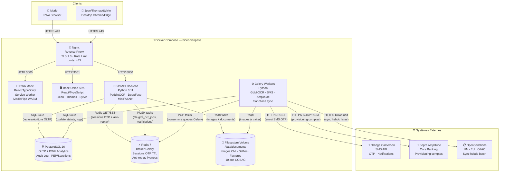
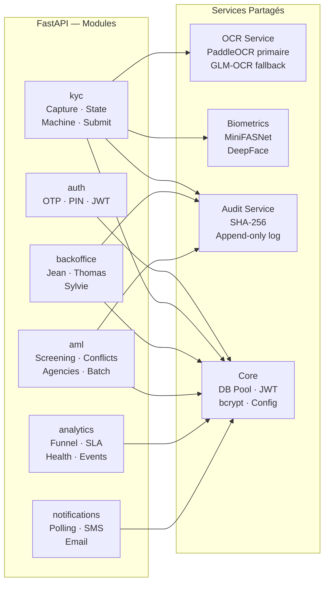
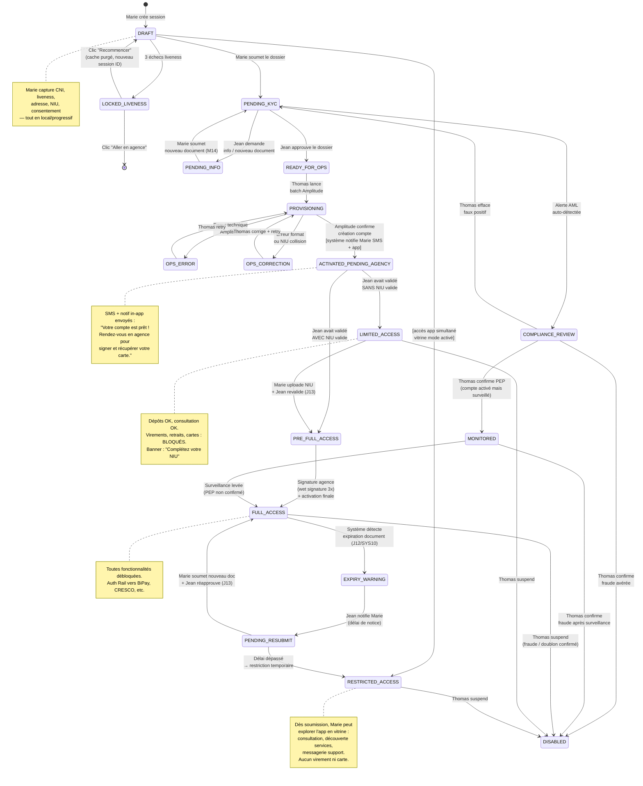
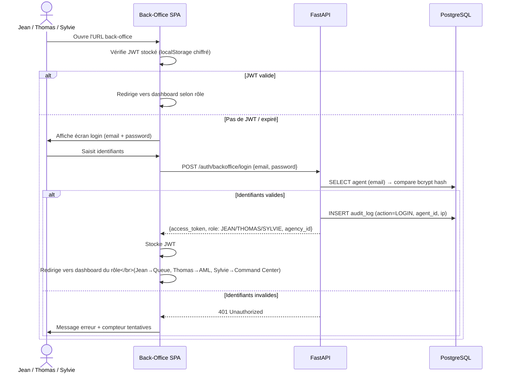
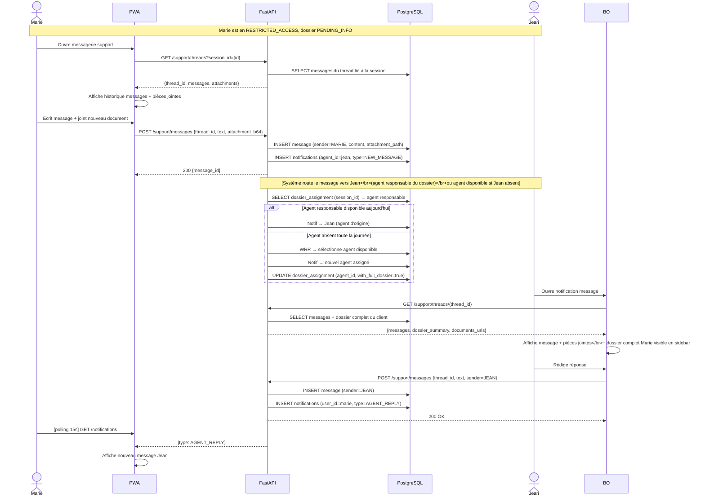
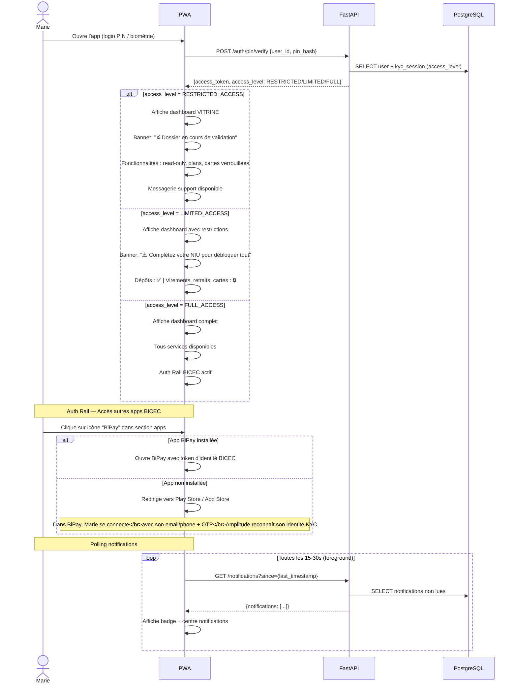
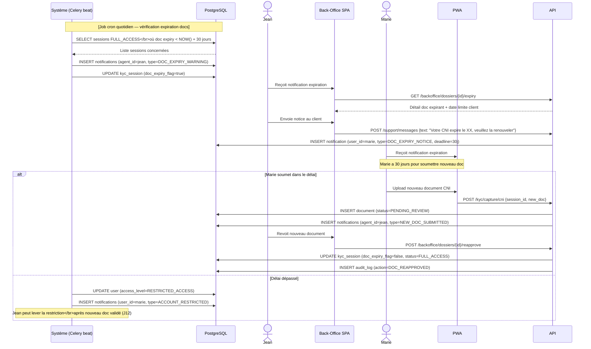

# Architecture bicec-veripass — Corrections v2
**Sections corrigées :** Guide lecture + C4 L2/L3 + Use Case + State Machine + Séquences clés  
**À fusionner avec** `architecture-bicec-veripass.md` v1.0

---

## 🗺️ GUIDE DE LECTURE DES DIAGRAMMES

### Comment lire un diagramme C4

Le modèle C4 décrit un système à 4 niveaux de zoom croissants, comme une carte géographique :

| Niveau | Analogie | Ce qu'on voit |
|---|---|---|
| **C4 L1 – Contexte** | Vue satellite | Le système entier + les acteurs humains + systèmes externes qui l'entourent |
| **C4 L2 – Conteneurs** | Vue du quartier | Les grandes "boîtes" déployées (serveurs, apps, bases de données) et leurs connexions |
| **C4 L3 – Composants** | Plan d'un bâtiment | À l'intérieur d'une boîte, les modules logiciels et leurs interactions internes |
| **C4 L4 – Code** | Plan d'une pièce | Classes, fonctions (non produit ici — niveau implémentation) |

**Symboles utilisés :**
- **Personne** (icône humain) = acteur externe (Marie, Jean…)
- **Boîte pleine** = composant interne au système
- **Boîte en pointillés** = système externe (Orange SMS, Amplitude)
- **Flèche →** = direction du flux de données ou appel
- **Label sur flèche** = protocole ou rôle du lien (ex: `HTTPS/443`, `SQL/5432`)

---

### Comment lire un diagramme de Séquence

Se lit **de haut en bas**, comme une conversation dans le temps :

```
Acteur A          Acteur B          Système C
   |                 |                  |
   |----requête----->|                  |     ← A appelle B
   |                 |----traitement--->|     ← B appelle C
   |                 |<---réponse-------|     ← C répond à B
   |<----résultat----|                  |     ← B répond à A
```

- Les **barres verticales** = lignes de vie des acteurs
- Les **rectangles sur une ligne de vie** = période d'activité (traitement en cours)
- `alt / else` = bloc conditionnel (si/sinon)
- `Note over X` = commentaire sur un acteur
- `loop` = répétition
- Flèche **pleine** `—>` = appel synchrone (attend réponse)
- Flèche **pointillée** `-->` = réponse ou appel asynchrone

---

### Comment lire un Use Case

- **Ellipses** = fonctionnalités (ce que le système fait)
- **Bonhommes** = acteurs (qui utilise cette fonctionnalité)
- **Trait plein acteur→UC** = "cet acteur utilise cette fonctionnalité"
- **`<<include>>`** = ce UC inclut obligatoirement un autre (ex: toute action nécessite un login)
- **`<<extend>>`** = ce UC peut optionnellement déclencher un autre
- **Boîtes/subgraphs** = regroupement par domaine

---

### Comment lire un State Machine (Diagramme d'états)

- **`[*]`** = point de départ ou de fin
- **Rectangle arrondi** = un état stable du système
- **Flèche entre états** = transition (déclenchée par un événement)
- **Label sur flèche** = condition ou action qui déclenche la transition
- **`note`** = clarification sur un état

---

### Comment lire un ERD (Entity-Relationship Diagram)

| Notation | Signification |
|---|---|
| `\|\|--o{` | Un (obligatoire) → Plusieurs (optionnel) = **1:N** |
| `\|\|--\|\|` | Un → Un obligatoire = **1:1** |
| `}o--\|\|` | Plusieurs (optionnel) → Un = **N:1** |
| `PK` | Clé primaire — identifiant unique de la table |
| `FK` | Clé étrangère — référence vers une autre table |
| `UK` | Unique Key — valeur unique (mais pas la PK) |

Exemple de lecture : `users ||--o{ kyc_sessions` = **un user peut avoir plusieurs sessions KYC** (mais une session appartient à un seul user).

---

## 3bis. C4 Level 2 — Conteneurs (CORRIGÉ)

> **Corrections apportées :**  
> - Labels Redis clarifiés : rôle distinct API vs Celery  
> - C4 Level 3 simplifié (moins de connexions, lecture améliorée)



> **Note Redis :** L'API **pousse** les tâches dans Redis (PUSH/SET). Celery les **consomme** (POP). L'API lit aussi Redis directement pour vérifier les OTP et les tokens anti-replay liveness. Redis joue donc deux rôles distincts : **broker de messages** (pour Celery) et **cache sessions** (pour l'API).

---

### C4 Level 3 — Composants Backend (CORRIGÉ — version simplifiée)



---

## 4. Diagramme Use Case (CORRIGÉ)

```mermaid
graph TB
    subgraph "👤 Marie — Onboarding"
        M1[S'inscrire OTP SMS/Email]
        M2[Configurer PIN & Biométrie]
        M3[Capturer CNI Recto/Verso]
        M4[Passer liveness]
        M5[Saisir adresse + GPS optionnel]
        M6[Uploader facture utilitaire]
        M7[Déclarer ou uploader NIU]
        M8[Accepter CGU & Signer digitalement]
        M9[Soumettre dossier KYC]
    end

    subgraph "👤 Marie — Post-Onboarding"
        M10[Suivre état dossier</br>en RESTRICTED_ACCESS]
        M11[Explorer services BICEC</br>vitrine — plans · cartes · épargne]
        M12[Reprendre session</br>après coupure réseau]
        M13[Contacter support client</br>messagerie in-app]
        M14[Renvoyer documents</br>sur demande agent]
        M15[S'authentifier vers</br>autres apps BICEC</br>Auth Rail ID]
        M16[Utiliser app en</br>LIMITED_ACCESS</br>dépôts · consultation]
        M17[Utiliser app en</br>FULL_ACCESS</br>tous services débloqués]
    end

    subgraph "👤 Jean — Validation Desk"
        J1[Se connecter</br>Email/Password]
        J2[Consulter SA queue</br>assignée à lui]
        J3[Inspecter dossier</br>complet soumis]
        J4[Consulter images</br>haut résolution]
        J5[Zoomer sur image</br>librement]
        J6[Comparer selfie</br>vs photo CNI]
        J7[Valider ou corriger</br>données OCR inline]
        J8[Approuver le dossier]
        J9[Demander info</br>complémentaire au client]
        J10[Voir message client</br>messagerie support]
        J11[Répondre au message</br>client + voir PJ]
        J12[Restreindre compte</br>après expiration doc]
        J13[Réapprouver après</br>nouvelle soumission]
    end

    subgraph "👤 Thomas — AML/CFT Supervision"
        T1[Se connecter</br>Email/Password]
        T2[Examiner alertes</br>PEP/Sanctions]
        T3[Effacer faux positif</br>avec justification]
        T4[Confirmer match AML</br>et surveiller compte]
        T5[Résoudre conflits</br>d'identité/doublons]
        T6[Gérer agences CRUD]
        T7[Surveiller batch</br>Amplitude]
        T8[Relancer batch</br>en erreur]
        T9[Provisionner comptes</br>Amplitude par batch]
        T10[Suspendre compte</br>fraude/doublon confirmé]
    end

    subgraph "👤 Sylvie — Command Center"
        S1[Se connecter</br>Email/Password]
        S2[Dashboard R/Y/G</br>30-second scan]
        S3[Analyser funnel</br>drop-off par étape]
        S4[Escalader dossier</br>SLA > 2h]
        S5[Redistribuer charge</br>entre agents]
        S6[Surveiller santé</br>système AI/API/DB]
        S7[Exporter pack</br>conformité COBAC]
    end

    subgraph "⚙️ Système Automatique"
        SYS1[Scorer dossier</br>globalement]
        SYS2[Allouer dossier</br>à une agence</br>zone géographique]
        SYS3[Allouer dossier</br>à un agent WRR</br>Least Connections]
        SYS4[Détecter doublons</br>d'identité]
        SYS5[Déclencher alerte</br>SLA 2h dépassé]
        SYS6[Sync PEP/Sanctions</br>hebdomadaire]
        SYS7[Backup DB quotidien</br>+ prune si disk >85%]
        SYS8[Router message chat</br>vers agent responsable</br>ou agent disponible]
        SYS9[Transmettre chat</br>avec dossier complet</br>du client]
        SYS10[Notifier expiration</br>documents actifs]
    end

    Marie --> M1 & M2 & M3 & M4 & M5 & M6 & M7 & M8 & M9
    Marie --> M10 & M11 & M12 & M13 & M14 & M15 & M16 & M17
    Jean --> J1 & J2 & J3 & J4 & J5 & J6 & J7 & J8 & J9 & J10 & J11 & J12 & J13
    Thomas --> T1 & T2 & T3 & T4 & T5 & T6 & T7 & T8 & T9 & T10
    Sylvie --> S1 & S2 & S3 & S4 & S5 & S6 & S7
```



---

## 5. State Machine KYC (CORRIGÉ)

> **Corrections majeures :**
> - Distinction claire entre `session_status` (workflow back-office) et `access_level` (expérience Marie dans l'app)
> - RESTRICTED_ACCESS dès la soumission (Marie voit l'app en vitrine immédiatement)
> - PEP = compte actif mais **surveillé** (pas rejeté)
> - DISABLED depuis n'importe quel état actif (fraude/doublon)
> - Expiration document → notification → resoumission → retour état normal
> - Agents demandent info (pas de rejet direct sauf fraude avérée)


[![](https://mermaid.ink/img/pako:eNqVV8tu20YU_ZUpN40b2Y5syQ-hCEBTdMBEr5KyUzcKhAk1kgYhOcxwqFoxDHRVoNuiHxF13T_Qn-RLemeGFEnZclotDGse594599yH7gyfTYjRMhKBBWlTPOM43F8cjSIEnwnlxBeURWh4MYr02rsf3qP9_Zeo7ZqXQ9RCXcwpQT5frwhKSJLA6fxoxARBnM7mArGpvqA35Ce7h2ORcoKsnlNDAV2QCCBqxSk84bBAaqjnXNWQz6KERIKE8Kc48_W3v5BgqUAkQgHzcXAYczaT9-hUnyLRRDmTO6Z9l6_o9K03dnvcca7tnu158J5jtF75c-InG3f0ne2TZQ6sgPpoZLjEZyH45hM-Mn48_MBfPvMxYKE45bP1qgY-pAuC05wn5LT3doNLojfQZhAQLh-IZxJ_ZDx8ysDutZ3eq_GbG2sTloSlIREoIGjCwCT4tXXJtb2h61hDMG5almbgHfb99ZcE4ThGCQ3TQOBovVLvWVDBaURQCKJBGKSxWK_ePx7uB8hFwNoSXbpGFQ21zNmYpKWokts4YBweHXwvHYGn58ZbxSEpCOmfUDATiJxkmAspRb6gPilrKQTWgT7FSxrHjIuDYtNM_VSa4EpcKKIgTcA5eFxAZa7L3Du9yz4w-JrgCE1IiKMJUbzRaMrQ4Sb-E-anhYYrl5-OpALbRkHPuvXG3i7XrH530HHMnmWPXfvasd8CpBkojsxuRwHiVLB9IE9AskMa50gPbz50bjhnIU4QmU6xr586xektillChcy-p5C6_Z4z7Lt2u8CBeE4pDwlYGWQJxMJYbLSGQkxBOilfEBoE69Xe0xbajmdedB4zoF3lOJU6BmBeevc2g65ttm_Gl3133B94eXRBk1zGoZJb-n71vOLM7V87ngPv7b0qfAlwlHH2AQt_jswwDqgAjzaOlK9JHMAb267bdwHE5pykHEHM5hH9lGqgEoQEKM7v9oITwZdPWrT6rmtbQ1gtzE4ZD7GWI0tlcQZmg4Dq6p-bLl3cbd9nHGoGQc-_4YkJQNemLCd5fMxXds-6kXLOX10Nr-xJqjIgLSK1-C5ZJmL9BSQG-UynkFk6v7yuBy5AVDflbKdB1TecrlMpmloUC0wFWuCATrKC6Zk9T9GjFsl_QB649vjyqtP5JrR5bVsV6Meq8C5TReHTD1dkIBrt61q7YMv1KilX2pFxzQQnGZWIJALFfP23QN8VZ1wok-Tz_oKlSdGqoBakvDiT0FkkO5lAEB0_jSH14OtCY-uKa-youVvESLKqRHmAjdU4oU3rCvIr2Eo2O8e3e2r5uS4pWh9TGuFgY2grto8HRasmhR6FQXcQhgxVBYsTHRP07HX9eO_xyFStlJvjKl7_IxLUf1Or9DdYKPWr66xTJTWVNyAO-E8RCGFDF53-T1frP7zShQscSeJbEEkLYhjIcv85Ix7c38V61ekSBwXyEGYvsDplkZoVgUoqpHpAqB8C9imF0ppUOq2YIxfTAEGnTtAFHeBlDVkwL1j9GgjD39Fzt2Nv_zxw3JvxW9PNCoqXZ3bWynT8YY6gXBNYNMzX9aND78arv8jmry2scp8Dv64uIFR5IlbKhlYY2AswhYavNn2yV-0jG4SHiq1MaaW-XhETVLG82WR62on-2DjXzrwDXeEkyYrH19__BN0kMFDp-R5mahiIMIgqp7vozv-jk0JJ-FL0Z9nfdkXvIWCSJjHEXFOaAR4CGSmIKMrNqZa_I0l3QuZteZub_3CpysJWuSk9E8YAmCIyPcDwAsEs-2zUjBmnE6M1xQH8mjFCAu1TfjfupJ2RIeaQzSNDZueEwAgViJFR01sBXkKC6T0SfNyswy82LvpRBwqQ3BQ8JdmOOtVCd_oJI2ltRuzJjCRyWbuQ7_lLPyAXnOCPNJp5UEgEmS21Mac3tF3VQGxdHe5H0T28JMbRL4yFRkuZNECZs_nmZWk8KX5Ibo7IxsAtlkbCaDXPjuoKxGjdGbdGa79-XD87OG02zs5eNE4aJ0eNo5qxlOvn5wenp2dnzcZp4_i8Xj9u3teMz8py86DROKk3Ts5Pmi-OTs6azWbNIBMqGO_qn7OK-plx_y9uo7yI?type=png)](https://mermaid.ai/live/edit#pako:eNqVV8tu20YU_ZUpN40b2Y5syQ-hCEBTdMBEr5KyUzcKhAk1kgYhOcxwqFoxDHRVoNuiHxF13T_Qn-RLemeGFEnZclotDGse594599yH7gyfTYjRMhKBBWlTPOM43F8cjSIEnwnlxBeURWh4MYr02rsf3qP9_Zeo7ZqXQ9RCXcwpQT5frwhKSJLA6fxoxARBnM7mArGpvqA35Ce7h2ORcoKsnlNDAV2QCCBqxSk84bBAaqjnXNWQz6KERIKE8Kc48_W3v5BgqUAkQgHzcXAYczaT9-hUnyLRRDmTO6Z9l6_o9K03dnvcca7tnu158J5jtF75c-InG3f0ne2TZQ6sgPpoZLjEZyH45hM-Mn48_MBfPvMxYKE45bP1qgY-pAuC05wn5LT3doNLojfQZhAQLh-IZxJ_ZDx8ysDutZ3eq_GbG2sTloSlIREoIGjCwCT4tXXJtb2h61hDMG5almbgHfb99ZcE4ThGCQ3TQOBovVLvWVDBaURQCKJBGKSxWK_ePx7uB8hFwNoSXbpGFQ21zNmYpKWokts4YBweHXwvHYGn58ZbxSEpCOmfUDATiJxkmAspRb6gPilrKQTWgT7FSxrHjIuDYtNM_VSa4EpcKKIgTcA5eFxAZa7L3Du9yz4w-JrgCE1IiKMJUbzRaMrQ4Sb-E-anhYYrl5-OpALbRkHPuvXG3i7XrH530HHMnmWPXfvasd8CpBkojsxuRwHiVLB9IE9AskMa50gPbz50bjhnIU4QmU6xr586xektillChcy-p5C6_Z4z7Lt2u8CBeE4pDwlYGWQJxMJYbLSGQkxBOilfEBoE69Xe0xbajmdedB4zoF3lOJU6BmBeevc2g65ttm_Gl3133B94eXRBk1zGoZJb-n71vOLM7V87ngPv7b0qfAlwlHH2AQt_jswwDqgAjzaOlK9JHMAb267bdwHE5pykHEHM5hH9lGqgEoQEKM7v9oITwZdPWrT6rmtbQ1gtzE4ZD7GWI0tlcQZmg4Dq6p-bLl3cbd9nHGoGQc-_4YkJQNemLCd5fMxXds-6kXLOX10Nr-xJqjIgLSK1-C5ZJmL9BSQG-UynkFk6v7yuBy5AVDflbKdB1TecrlMpmloUC0wFWuCATrKC6Zk9T9GjFsl_QB649vjyqtP5JrR5bVsV6Meq8C5TReHTD1dkIBrt61q7YMv1KilX2pFxzQQnGZWIJALFfP23QN8VZ1wok-Tz_oKlSdGqoBakvDiT0FkkO5lAEB0_jSH14OtCY-uKa-youVvESLKqRHmAjdU4oU3rCvIr2Eo2O8e3e2r5uS4pWh9TGuFgY2grto8HRasmhR6FQXcQhgxVBYsTHRP07HX9eO_xyFStlJvjKl7_IxLUf1Or9DdYKPWr66xTJTWVNyAO-E8RCGFDF53-T1frP7zShQscSeJbEEkLYhjIcv85Ix7c38V61ekSBwXyEGYvsDplkZoVgUoqpHpAqB8C9imF0ppUOq2YIxfTAEGnTtAFHeBlDVkwL1j9GgjD39Fzt2Nv_zxw3JvxW9PNCoqXZ3bWynT8YY6gXBNYNMzX9aND78arv8jmry2scp8Dv64uIFR5IlbKhlYY2AswhYavNn2yV-0jG4SHiq1MaaW-XhETVLG82WR62on-2DjXzrwDXeEkyYrH19__BN0kMFDp-R5mahiIMIgqp7vozv-jk0JJ-FL0Z9nfdkXvIWCSJjHEXFOaAR4CGSmIKMrNqZa_I0l3QuZteZub_3CpysJWuSk9E8YAmCIyPcDwAsEs-2zUjBmnE6M1xQH8mjFCAu1TfjfupJ2RIeaQzSNDZueEwAgViJFR01sBXkKC6T0SfNyswy82LvpRBwqQ3BQ8JdmOOtVCd_oJI2ltRuzJjCRyWbuQ7_lLPyAXnOCPNJp5UEgEmS21Mac3tF3VQGxdHe5H0T28JMbRL4yFRkuZNECZs_nmZWk8KX5Ibo7IxsAtlkbCaDXPjuoKxGjdGbdGa79-XD87OG02zs5eNE4aJ0eNo5qxlOvn5wenp2dnzcZp4_i8Xj9u3teMz8py86DROKk3Ts5Pmi-OTs6azWbNIBMqGO_qn7OK-plx_y9uo7yI)

---

## 6. Séquences — Corrections & Nouvelles (v2)

### SEQ-02b : Séquence Login — Back-Office (Jean, Thomas, Sylvie)

> **Correction :** Sylvie doit aussi se connecter. Tous les agents partagent la même plateforme, login commun, rôle différent.



---

### SEQ-06 : Messagerie Support — Marie ↔ Jean



---

### SEQ-07 : Marie utilise l'App Post-Onboarding (États d'accès)

> **Nouvelle séquence** — manquait dans la v1.



---

### SEQ-08 : Expiration Document — Flow Jean + Marie



---

## Tables/entités supplémentaires identifiées

Ces tables sont à **ajouter** au LDM (section 7.2) :

```sql
-- Messagerie support client ↔ agent
CREATE TABLE support_threads (
    id UUID PRIMARY KEY DEFAULT gen_random_uuid(),
    session_id UUID REFERENCES kyc_sessions(id),
    created_at TIMESTAMPTZ DEFAULT NOW(),
    status TEXT DEFAULT 'OPEN'  -- OPEN, RESOLVED
);

CREATE TABLE support_messages (
    id UUID PRIMARY KEY DEFAULT gen_random_uuid(),
    thread_id UUID REFERENCES support_threads(id),
    sender_type TEXT NOT NULL,  -- USER, AGENT
    sender_id UUID NOT NULL,    -- user.id ou agent.id
    content TEXT,
    attachment_path TEXT,       -- fichier joint (nouveau doc)
    attachment_sha256 TEXT,
    sent_at TIMESTAMPTZ DEFAULT NOW(),
    read_at TIMESTAMPTZ
);

-- Flag expiration documents
-- Ajouter à kyc_sessions :
ALTER TABLE kyc_sessions ADD COLUMN doc_expiry_flag BOOLEAN DEFAULT FALSE;
ALTER TABLE kyc_sessions ADD COLUMN doc_expiry_notified_at TIMESTAMPTZ;
ALTER TABLE kyc_sessions ADD COLUMN doc_expiry_deadline TIMESTAMPTZ;
```

---

*Corrections v2 — 2026-03-02 | À fusionner avec architecture-bicec-veripass v1.0*
