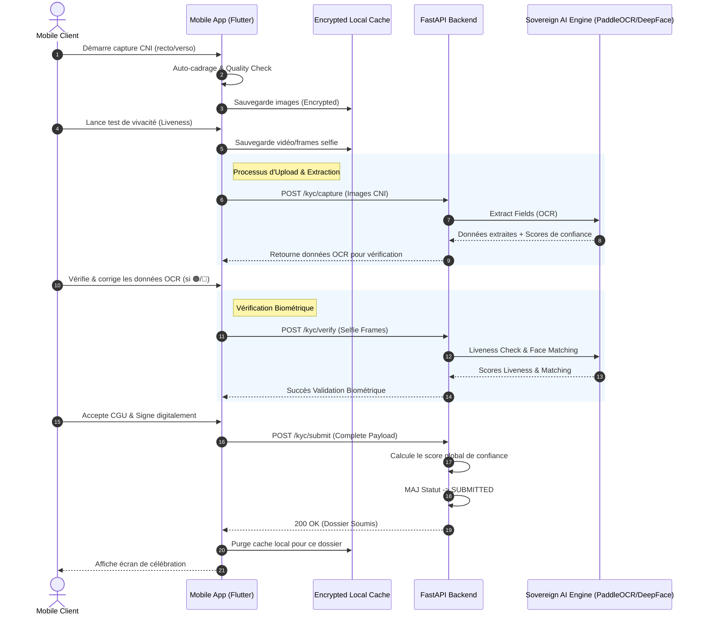
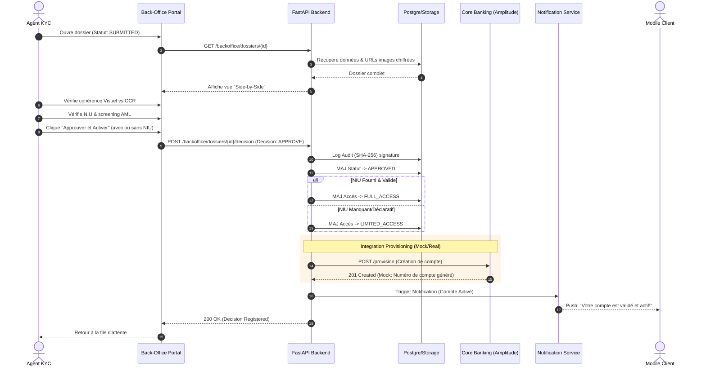

# Architecture Deliverables: Bicec Veripass

**Date:** 2026-02-27
**Status:** Rebuilt based on updated PRD, UX Specs v2.1, and Document de Cadrage Projet.

---

## 1. Domain Use-Case Diagrams

These use-case diagrams represent the high-level goals of the actors within each specific domain of the Bicec Veripass system.

### 1.1 Mobile Domain (Marie - The Customer)

```mermaid
usecaseDiagram
    actor "Client Mobile (Marie)" as Client
    
    rectangle "Mobile Onboarding & Discovery" {
        usecase "S'inscrire / S'authentifier" as UC1
        usecase "Soumettre le Dossier KYC" as UC2
        usecase "Découvrir les Services Bancaires" as UC3
        usecase "Consulter l'état du compte" as UC4
        
        usecase "Capturer les Pièces d'Identité" as UC2a
        usecase "Passer le Test de Vivacité (Liveness)" as UC2b
        usecase "Fournir le NIU & Domicile" as UC2c
    }
    
    Client --> UC1
    Client --> UC2
    Client --> UC3
    Client --> UC4
    
    UC2 ..> UC2a : <<include>>
    UC2 ..> UC2b : <<include>>
    UC2 ..> UC2c : <<include>>
```

### 1.2 Back-Office KYC Domain (Jean - The Validator)

```mermaid
usecaseDiagram
    actor "Agent KYC (Jean)" as Agent
    
    rectangle "Validation Back-Office" {
        usecase "Traiter la file d'attente KYC" as UC5
        usecase "Vérifier la cohérence des documents" as UC6
        usecase "Corriger les données OCR" as UC7
        usecase "Prendre une décision sur le dossier" as UC8
        
        usecase "Approuver (Activation)" as UC8a
        usecase "Demander un complément" as UC8b
        usecase "Rejeter définitivement" as UC8c
    }
    
    Agent --> UC5
    Agent --> UC6
    Agent --> UC7
    Agent --> UC8
    
    UC8 <|-- UC8a
    UC8 <|-- UC8b
    UC8 <|-- UC8c
```

### 1.3 Command Center / Ops Domain (Thomas / Sylvie)

```mermaid
usecaseDiagram
    actor "Superviseur AML/Ops (Thomas)" as Thomas
    actor "Manager (Sylvie)" as Sylvie
    
    rectangle "Supervision & Command Center" {
        usecase "Gérer les alertes AML/PEP" as UC9
        usecase "Résoudre les conflits d'identité (Déduplication)" as UC10
        usecase "Monitorer la création des comptes (Batch)" as UC11
        usecase "Désactiver un compte frauduleux" as UC12
        usecase "Suivre les performances SLA & Funnel" as UC13
        usecase "Administrer les agences" as UC14
    }
    
    Thomas --> UC9
    Thomas --> UC10
    Thomas --> UC11
    Thomas --> UC14
    
    Sylvie --> UC12
    Sylvie --> UC13
```

---

## 2. Key Sequence Diagrams

### 2.1 Capture → Upload → OCR/Biometrics → Submit

*This sequence demonstrates the resilient mobile capture process with offline caching and real-time AI processing.*



### 2.2 Jean Reviews → Decision → Notify → (Mock) Provisioning

*This sequence details the human-in-the-loop compliance validation and the transition to account creation.*



---

## 3. API Contract Outline

### 3.1 Canonical State Mapping (Enums)

Aligned with Bicec Veripass validation and restriction logic:

```json
// Dossier KYC States (Operational Status)
export enum KYCState {
  DRAFT = "DRAFT",             // En cours de saisie sur mobile
  SUBMITTED = "SUBMITTED",     // Soumis, en attente agent
  IN_REVIEW = "IN_REVIEW",     // Ouvert par un agent (lock)
  INFO_NEEDED = "INFO_NEEDED", // Renvoyé au client pour correction
  APPROVED = "APPROVED",       // Validé par l'agent
  REJECTED = "REJECTED"        // Rejeté pour fraude ou non-conformité
}

// Account Access States (Authorization Level)
export enum AccessState {
  RESTRICTED_ACCESS = "RESTRICTED_ACCESS", // Pré-validation (Read-only vitrine)
  LIMITED_ACCESS = "LIMITED_ACCESS",       // Actif mais sans NIU (Cash-in OK, Cash-out KO)
  FULL_ACCESS = "FULL_ACCESS",             // KYC complet + NIU validé (Toutes fonctions)
  DISABLED = "DISABLED"                    // Suspendu (Fraude/Fermé)
}
```

### 3.2 Key Endpoints & Payloads

#### Mobile API (Client-Facing)

**1. POST `/api/v1/kyc/capture`** (Multipart Form)
*Uploads an identity document, triggers AI extraction, and returns structured data.*
- **Request:** `file` (Binary), `document_type` (String: CNI_RECTO, CNI_VERSO, UTILITY_BILL, NIU_ATTESTATION)
- **Response (200 OK):**
  ```json
  {
    "document_id": "doc_12345",
    "extracted_data": {
      "first_name": { "value": "Marie", "confidence": 0.98 },
      "last_name": { "value": "Ndiaye", "confidence": 0.96 },
      "cni_number": { "value": "123456789", "confidence": 0.82 }
    }
  }
  ```

**2. POST `/api/v1/kyc/verify-biometrics`**
*Submits liveness frames for anti-spoofing and face-matching against CNI.*
- **Request:** `video_payload` or `frames` (Binary array), `cni_recto_doc_id`
- **Response (200 OK):**
  ```json
  {
    "success": true,
    "liveness_score": 0.99,
    "face_match_score": 0.97,
    "status": "PASSED"
  }
  ```

**3. POST `/api/v1/kyc/submit`**
*Final submission of the KYC dossier, registering consent and moving state to SUBMITTED.*
- **Request:** 
  ```json
  {
    "personal_info": { },
    "document_ids": ["doc_123", "doc_124", "doc_125"],
    "consents": { "cgu": true, "privacy": true, "data_processing": true },
    "niu_declarative": "P123456789012N"
  }
  ```
- **Response (200 OK):** `{"dossier_id": "dossier_789", "state": "SUBMITTED", "access_state": "RESTRICTED_ACCESS"}`

#### Back-Office API (Internal)

**4. GET `/api/v1/backoffice/dossiers`**
*Retrieves prioritized queue of pending dossiers for Jean.*
- **Response:** Array of `{ dossier_id, status, global_confidence_score, submission_date, priority_flags }`

**5. POST `/api/v1/backoffice/dossiers/{id}/decision`**
*Registers the human decision, applying audit trail and state transitions.*
- **Request:**
  ```json
  {
    "decision": "APPROVE",
    "reason": null,
    "niu_validated": false,
    "corrected_ocr_fields": {
      "cni_number": "123456780"
    }
  }
  ```
- **Response (200 OK):**
  ```json
  {
    "success": true,
    "new_kyc_state": "APPROVED",
    "new_access_state": "LIMITED_ACCESS",
    "audit_hash": "a1b2c3d4..."
  }
  ```
