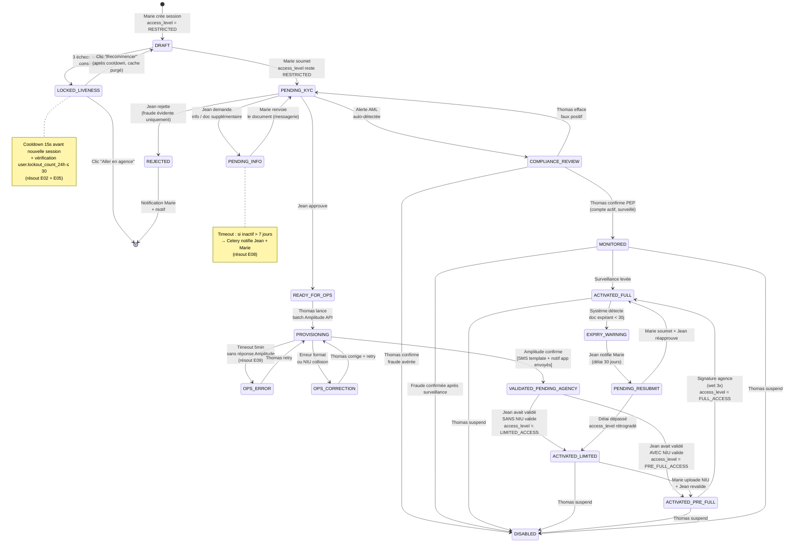
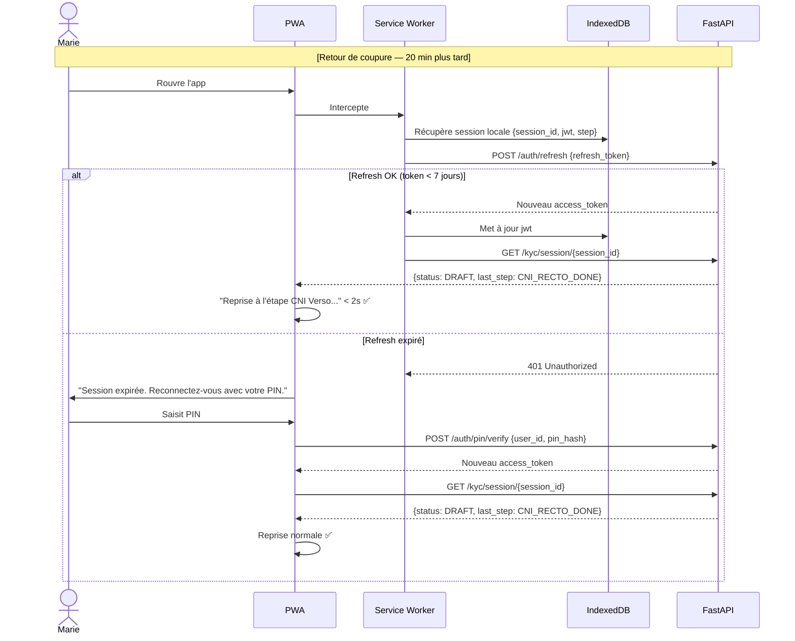
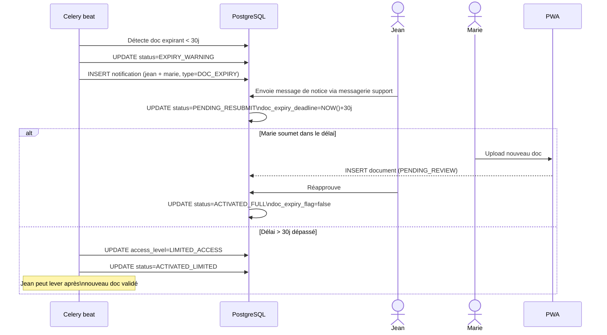
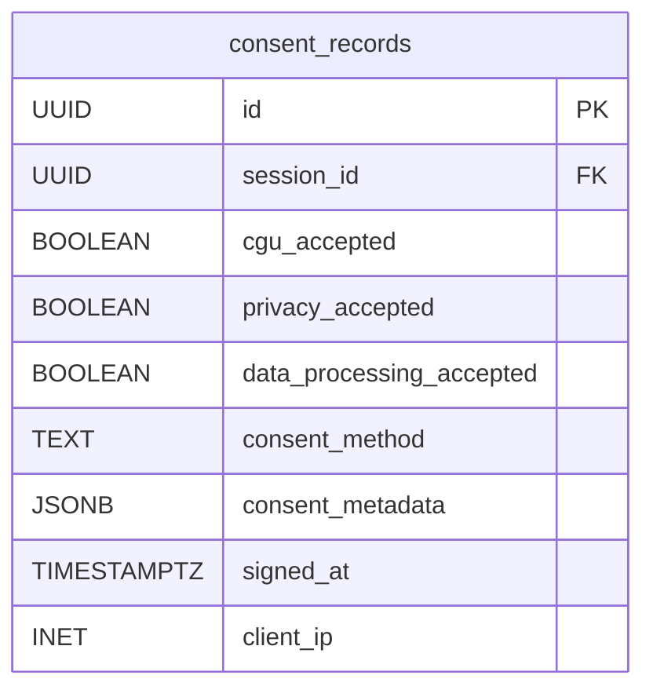
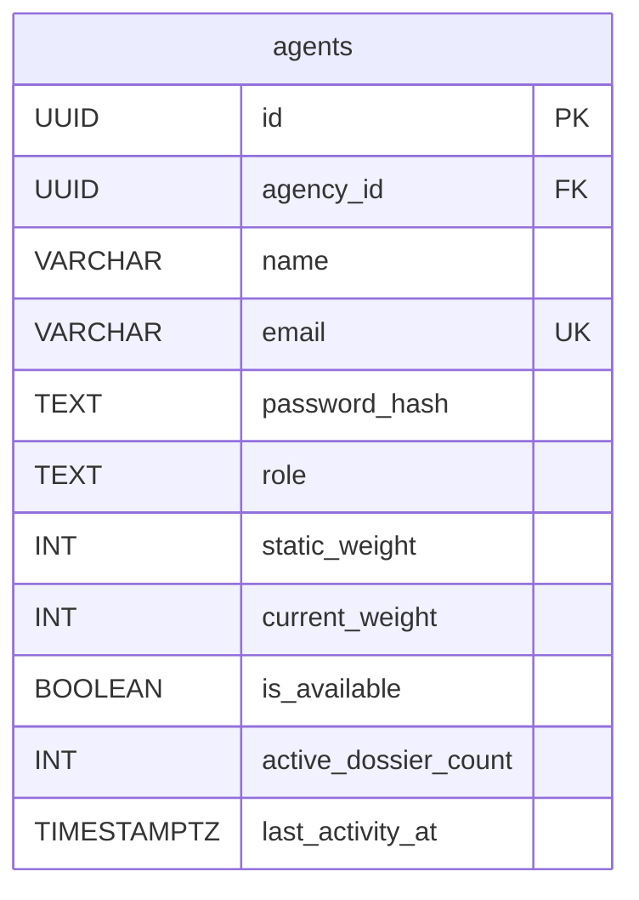
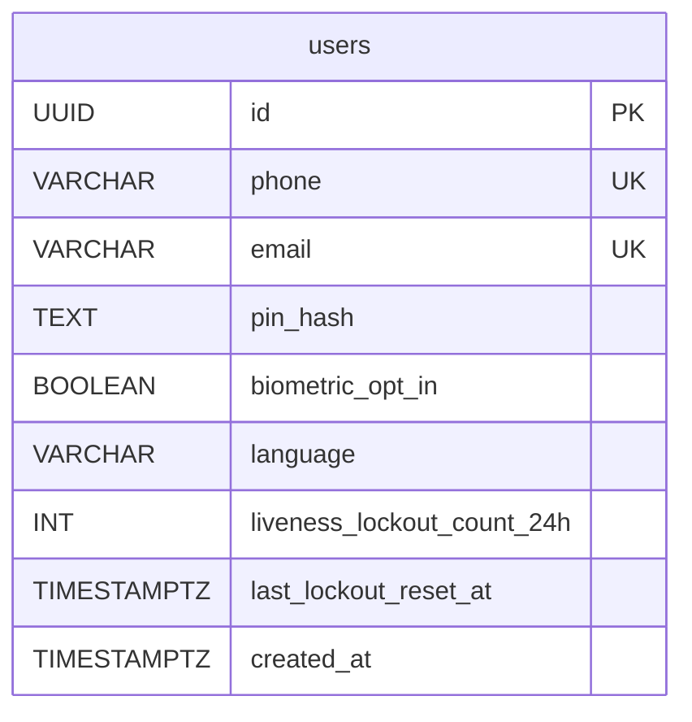
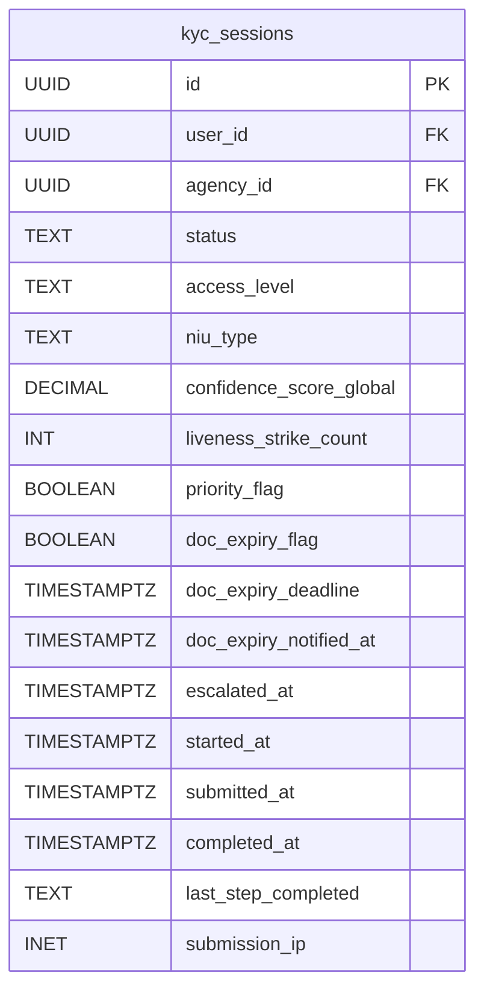
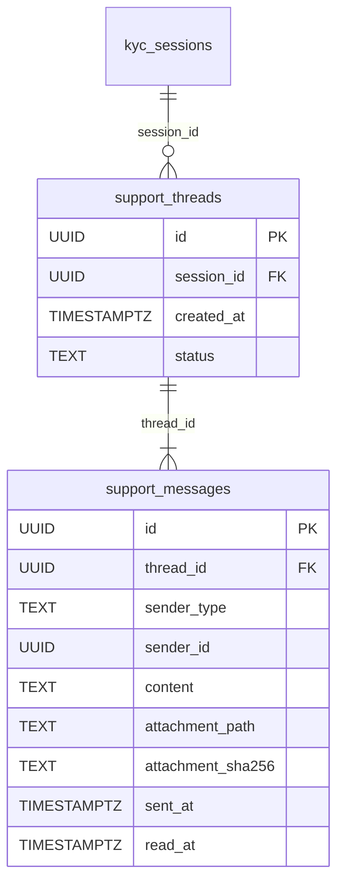

# Architecture bicec-veripass — Patch v3
**Sections corrigées :** ECH findings (23/23) + Encadreur + Erreurs propres v2  
**À fusionner avec** v1.0 + corrections v2  
**Date :** 2026-03-02

---

## ⚠️ TABLE DES CORRECTIONS (résumé rapide)

| # | Source | Localisation | Gravité | Statut |
|---|---|---|---|---|
| E01 | ECH | State machine DRAFT→RESTRICTED_ACCESS ambigu | 🔴 | ✅ Corrigé §5 |
| E02 | ECH | LOCKED_LIVENESS sans cooldown anti-brute-force | 🔴 | ✅ Corrigé §5 |
| E03 | ECH | OTP sans rate limit → SMS bombing | 🔴 | ✅ Corrigé §8 + §11 |
| E04 | ECH | PaddleOCR→GLM comportement partiel non défini | 🟡 | ✅ Corrigé §12 |
| E05 | ECH | Strike count sur session, pas sur user → contournable | 🔴 | ✅ Corrigé §5 + §7 |
| E06 | ECH | JWT expiré pendant ENEO blackout | 🟡 | ✅ Corrigé §6 SEQ-05 |
| E07 | ECH | Double-submission possible sur /kyc/submit | 🔴 | ✅ Corrigé §8 |
| E08 | ECH | PENDING_INFO sans timeout → dossiers orphelins | 🟡 | ✅ Corrigé §5 |
| E09 | ECH | PROVISIONING sans timeout → stuck forever | 🟡 | ✅ Corrigé §5 |
| E10 | ECH | Conflit nommage états v1 vs v2 | 🔴 | ✅ Corrigé §5 (table renommage) |
| E11 | ECH | consent_records.digital_signature_path incorrect | 🟡 | ✅ Corrigé §7 LDM |
| E12 | ECH | RAM Docker 8GB OOM si API + celery_ocr simultané | 🔴 | ✅ Corrigé §9 |
| E13 | ECH | Signed URLs sur filesystem local incorrect | 🟡 | ✅ Corrigé §8 |
| E14 | ECH | Polling notifications clock skew | 🟡 | ✅ Corrigé §8 |
| E15 | ECH | agents.role sans CHECK constraint | 🟡 | ✅ Corrigé §7 |
| E16 | ECH | Nouveau agent sans contexte dossier | 🟡 | ✅ Corrigé v2 SEQ-06 (confirmé) |
| E17 | ECH | SEQ-08 saute EXPIRY_WARNING | 🟡 | ✅ Corrigé §6 |
| E18 | ECH | Prototype status enum décalé | 🟡 | ✅ Noté §14 |
| E19 | ECH | Landmarks spoofables côté client | 🔴 | ✅ Corrigé §12 |
| E20 | ECH | MONITORED état sans API ni UI | 🟡 | ✅ Corrigé §8 |
| E21 | ECH | access_level + status combinaisons illégales | 🔴 | ✅ Corrigé §7 |
| E22 | ECH | dropout_step jamais populé | 🟡 | ✅ Corrigé §13 |
| E23 | ECH | Wet signature dans prototype contradictoire | 🟡 | ✅ Noté §14 |
| A01 | Encadreur | Amplitude = API v11.6 AIF + ISO 20022 | 🔴 | ✅ Corrigé §10 |
| A02 | Encadreur | Intro sécurité simple | 🟡 | ✅ Ajouté §11 |
| A03 | Encadreur | Red Hat + LTS + packages payants | 🟡 | ✅ Ajouté §9 |
| P01 | Propre | Nouvelles tables en SQL au lieu de Mermaid LDM | 🟡 | ✅ Corrigé §7 |

---

## §5. State Machine KYC — Version Définitive (v3)

### Table de renommage officiel (résout E10)

| Ancien nom (v1) | Nom définitif (v3) | Rôle |
|---|---|---|
| `ACTIVATED` | `VALIDATED_PENDING_AGENCY` | Jean a validé, Amplitude provisionné, en attente signature agence |
| `RESTRICTED_ACCESS` (post-activation) | `PRE_FULL_ACCESS` | Compte activé Amplitude, NIU OK, en attente signature agence |
| `RESTRICTED_ACCESS` (post-soumission) | Colonne `access_level = RESTRICTED` | Pas un état machine, juste le niveau d'accès de Marie à l'app |

### Clarification fondamentale (résout E01 et Ken)

> `status` = état du **workflow KYC** (visible back-office)  
> `access_level` = niveau d'**accès aux fonctionnalités de l'app** pour Marie  
> Ces deux valeurs coexistent sur `kyc_sessions` mais sont **indépendantes**.

| `status` | `access_level` forcé | Explication |
|---|---|---|
| `DRAFT` | `RESTRICTED` | Onboarding en cours |
| `PENDING_KYC` | `RESTRICTED` | Dossier soumis, Jean n'a pas encore validé |
| `PENDING_INFO` | `RESTRICTED` | Jean attend un document supplémentaire |
| `COMPLIANCE_REVIEW` | `RESTRICTED` | Alerte AML en cours |
| `READY_FOR_OPS` | `RESTRICTED` | Jean a validé, attend provisioning Thomas |
| `PROVISIONING` | `RESTRICTED` | Batch Amplitude en cours |
| `VALIDATED_PENDING_AGENCY` | `LIMITED` (sans NIU) ou `PRE_FULL` (avec NIU) | Amplitude confirme, attend signature agence |
| `ACTIVATED` | `LIMITED_ACCESS` ou `FULL_ACCESS` | Après signature agence |
| `MONITORED` | `FULL_ACCESS` (ou LIMITED) | PEP confirmé, compte actif mais surveillé |
| `DISABLED` | `BLOCKED` | Fraude/doublon confirmé |

> Contrainte DB (résout E21) : trigger PostgreSQL vérifiant que `(status, access_level)` suit la matrice ci-dessus.



---

## §6. Séquences — Corrections ciblées

### SEQ-05 corrigée : JWT expiré pendant ENEO Blackout (résout E06)



---

### SEQ-08 corrigée : Expiration doc — états complets (résout E17)



---

## §7. LDM — Corrections ERD (résout E11, E15, E21, P01)

### 7a. Corrections sur tables existantes



> **E11 résolu :** `digital_signature_path` → remplacé par `consent_method TEXT` (valeur : `'CHECKBOX_3X'` ou `'CANVAS'`) + `consent_metadata JSONB` (timestamps, device, user-agent).



> **E15 résolu :** Ajouter constraint `CHECK (role IN ('JEAN', 'THOMAS', 'SYLVIE'))` — notée dans le DDL d'implémentation.



> **E05 résolu :** `liveness_lockout_count_24h` sur `users` (pas sur `kyc_sessions`) — Celery reset quotidien. Si count ≥ 3 en 24h → blocage création nouvelle session.



> **E21 résolu :** Trigger DB validera `(status, access_level)` sur toute UPDATE.

### 7b. Nouvelles tables (résout P01 — en Mermaid, pas en SQL)



---

## §8. API Contract — Corrections et ajouts (résout E03, E07, E13, E14, E20)

### Endpoints modifiés

| Méthode | Endpoint | Garde ajoutée | Résout |
|---|---|---|---|
| POST | `/auth/otp/send` | Rate limit : max 5 envois/15min/numéro → 429 si dépassé (Redis counter TTL 15min) | E03 |
| POST | `/auth/otp/verify` | Max 5 tentatives/OTP → lock 30min si dépassé (Redis counter) | E03 |
| POST | `/kyc/submit` | Guard : `if session.status != 'DRAFT' → 409 Conflict` | E07 |
| POST | `/kyc/capture/cni` | Guard : payload > 10MB → 413 avant décodage base64 | E04 (indirect) |
| GET | `/notifications` | Remplace `?since=timestamp` par `?after_id={last_notification_id}` (cursor-based) | E14 |

### Endpoints ajoutés

| Méthode | Endpoint | Description | Résout |
|---|---|---|---|
| GET | `/documents/{session_id}/{filename}` | Sert les images via FastAPI avec vérification JWT + RBAC (remplace "signed URLs") | E13 |
| POST | `/aml/alerts/{id}/monitor` | Thomas place un compte en MONITORED (PEP confirmé, actif surveillé) | E20 |
| GET | `/support/threads?session_id=` | Liste threads messagerie d'une session | v2 SEQ-06 |
| POST | `/support/messages` | Envoie message (Marie ou agent) | v2 SEQ-06 |
| GET | `/support/threads/{id}` | Détail thread + dossier complet (pour agent) | v2 SEQ-06 |

---

## §9. Docker Compose — Corrections (résout E12, A03)

### E12 — RAM OOM : API + celery_ocr simultané

**Problème :** API (3GB cap) + celery_ocr (4GB cap) = 7GB + autres services ~1.8GB = 8.8GB > cap WSL2 8GB.

**Solution : réduction des caps + lock Celery applicatif**

```yaml
# CORRECTION mem_limits
api:
  mem_limit: 2g        # Réduit de 3g : PaddleOCR ONNX ~1.5GB + workers 400MB
  # PaddleOCR chargé à la demande (lazy load), pas au démarrage

celery_ocr:
  mem_limit: 3g        # Réduit de 4g : GLM-OCR quantifié ~2.5GB max
  # Celery task lock Redis : une seule tâche GLM à la fois, impossible simultanéité

# Budget corrigé : 2 + 3 + 0.5 + 0.25 + 0.25 + 0.5 = 6.5GB ✅ dans les 8GB
```

**Lock applicatif Celery (dans le worker) :**
```
Avant démarrage tâche GLM-OCR :
  Redis SET glm_lock NX EX 120  (lock 2 min max)
  Si lock déjà pris → requeue avec delay 30s
  Après tâche → Redis DEL glm_lock
```

### Healthchecks (résout E12 indirect)

```yaml
# À ajouter sur chaque service critique :
api:
  healthcheck:
    test: ["CMD", "curl", "-f", "http://localhost:8000/health"]
    interval: 30s
    timeout: 10s
    retries: 3
    start_period: 60s

postgres:
  healthcheck:
    test: ["CMD-SHELL", "pg_isready -U vp_user -d veripass"]
    interval: 30s
    retries: 3
```

### A03 — Compatibilité Red Hat + LTS

> **Note pour l'encadreur / BICEC IT** : Le déploiement final sur serveur Red Hat Enterprise Linux (RHEL) nécessite une vérification préalable :

| Composant | Version utilisée | Type licence | Action BICEC |
|---|---|---|---|
| PostgreSQL 16 | Disponible RHEL via PGDG repo | Open Source | Gratuit |
| Redis 7 | Disponible RHEL | Open Source | Gratuit |
| Nginx | Disponible RHEL | Open Source | Gratuit |
| Python 3.11 | LTS jusqu'à oct. 2027 | Open Source | Gratuit |
| Node.js 20 LTS | LTS jusqu'à avril 2026 | Open Source | Gratuit — **⚠️ upgrader vers Node 22 LTS** |
| Docker Engine | Disponible RHEL | Open Source | Gratuit |
| PaddleOCR | Apache 2.0 | Open Source | Gratuit |
| GLM-OCR 0.9B | MIT | Open Source | Gratuit |
| DeepFace | MIT | Open Source | Gratuit |
| **RHEL lui-même** | — | **Licence payante** | **À acheter — BICEC IT** |
| **RHEL Container Tools** | — | Inclus RHEL | Via contrat RHEL |

> Node.js 20 LTS atteint fin de vie avril 2026 — **migrer vers Node 22 LTS** pour éviter des vulnérabilités non patchées en production.

---

## §10. Amplitude API v11.6 AIF — Révision ADR-002 et §7 (résout A01)

### Révision de l'approche Amplitude

> **Encadreur :** Amplitude Sopra (version BICEC : **11.6 AIF** avec middleware **API Manager WebServices**) expose des APIs REST/SOAP pour le provisioning — pas uniquement un SDK Python.

**Approche révisée :**

| Aspect | Avant (v1) | Après (v3) |
|---|---|---|
| Mécanisme | "Amplitude Python SDK + batch" | **API Manager Webservices v11.6 AIF** (REST/SOAP selon endpoint) |
| Format messages | JSON libre | **ISO 20022 obligatoire** (MX messages) depuis 2025 |
| IBU generation | Shadow IBU modulo 97 (MVP) | Amplitude génère l'IBU automatiquement via ses APIs |
| Déclencheur | Thomas clique "lancer batch" | Thomas initie via interface → appel API Manager |

**ISO 20022 — Impact architecture :**
- Les messages envoyés à Amplitude (création compte, mise à jour client) doivent être structurés en **XML ISO 20022** (ou JSON équivalent selon la version AIF)
- Format pour création compte : `pain.001` (initiation paiement) ou `acmt.009/010` (account management)
- Le worker Celery `amplitude_batch_worker` doit sérialiser les données KYC en **MX ISO 20022** avant envoi

```
Données KYC PostgreSQL
    → Mapper vers schéma ISO 20022 (acmt.009 Account Opening Instruction)
    → POST vers Amplitude API Manager v11.6 AIF endpoint
    → Parser réponse (acmt.010 Account Opening Confirmation)
    → UPDATE kyc_sessions (status=VALIDATED_PENDING_AGENCY)
```

> **Note ADR :** L'encadreur précise être ouvert à de nouvelles découvertes sur la documentation exacte de l'API Amplitude 11.6 AIF. Une investigation des endpoints disponibles dans l'environnement BICEC est nécessaire avant implémentation. Le format ISO 20022 est confirmé (directive BEAC 2025).

---

## §11. Sécurité — Introduction simplifiée (résout A02)

> Cette section est destinée au jury et à l'encadreur — elle précède les détails techniques.

### Pourquoi la sécurité est critique dans ce projet

bicec-veripass traite des **données parmi les plus sensibles** : photos de carte nationale d'identité, vidéos de visage (biométrie), numéros fiscaux (NIU), et informations bancaires. Deux cadres légaux s'appliquent :

- **Loi 2024-017** (RGPD camerounais, effectif juin 2026) : les données biométriques sont classées "données sensibles" — leur traitement requiert consentement explicite, chiffrement, et journalisation des accès.
- **COBAC R-2023/01** : les images et vidéos KYC originales doivent être conservées **10 ans** avec traçabilité complète de chaque décision humaine.

L'architecture implémente une défense en **5 couches** :

```
1. TLS 1.3          → Tout échange réseau est chiffré (comme HTTPS bancaire)
2. Authentification  → OTP + PIN + JWT : chaque acteur prouve son identité
3. Contrôle d'accès → Jean ne voit que ses dossiers, Thomas voit le national
4. Intégrité        → SHA-256 sur chaque document : impossible de falsifier
5. Audit immuable   → Chaque action est enregistrée, personne ne peut l'effacer
```

Cette architecture s'aligne sur l'**OWASP Mobile Top 10** (standard international de sécurité des applications mobiles/web) — détaillé dans la section 11 du document principal.

---

## §12. Pipeline AI/ML — Corrections (résout E04, E19)

### E04 — Comportement PaddleOCR→GLM sur confidence partielle

**Comportement défini :**

```
PaddleOCR extrait 7 champs CNI.
→ Si TOUS les champs ≥ 85% : résultat direct, GLM non sollicité.
→ Si AU MOINS UN champ < 85% :
    - GLM-OCR reçoit : image COMPLÈTE + liste {field_names_low_confidence}
    - GLM re-extrait UNIQUEMENT les champs flaggés (prompt ciblé)
    - Les champs PaddleOCR ≥ 85% sont CONSERVÉS (non écrasés)
    - Résultat fusionné : PaddleOCR high-confidence + GLM low-confidence
    - engine = 'PADDLE_THEN_GLM_PARTIAL'
```

### E19 — Validation landmarks anti-spoofing serveur

**Guards ajoutés sur `POST /kyc/liveness` :**

1. `len(landmarks) == 478` (478 points MediaPipe Face Mesh obligatoires)
2. Coordonnées `x, y` dans `[0.0, 1.0]` (normalisées — si hors bounds → rejet)
3. `z` dans plage physiologique `[-0.3, 0.3]`
4. **Cohérence temporelle** : si plusieurs frames envoyées, vérifier que les deltas de position entre frames consécutives sont physiologiquement plausibles (pas de téléportation de landmarks)
5. Timestamp de chaque frame < 5s par rapport à `request.received_at` (empêche replay d'une session enregistrée)

---

## §13. Analytics — Correction (résout E22)

### E22 — dropout_step : mécanisme de détection

**Celery beat job (quotidien — 03h00) :**

```
SELECT sessions WHERE status = 'DRAFT'
  AND updated_at < NOW() - INTERVAL '24 hours'
→ Pour chaque session :
    INSERT fact_analytics_events (
        event_name = 'Session_Abandoned',
        step_name  = last_step_completed,  ← champ existant kyc_sessions
        session_id, user_dim_id, time_dim_id
    )
    UPDATE fact_kyc_sessions SET dropout_step = last_step_completed
    UPDATE kyc_sessions SET status = 'ABANDONED'  ← nouvel état terminal
```

> **Nouvel état** `ABANDONED` à ajouter à la state machine : `DRAFT → ABANDONED` (via cron, silent). Pas de notification Marie — c'est uniquement analytique. Elle peut recréer une session.

---

## §14. Alignement Prototype (résout E18, E23)

> Ces points concernent le code TSX existant (`MobileOnboarding.tsx`, `BackOffice.tsx`). Pas de changement d'architecture — note de réconciliation pour l'implémentation.

**E18 — Status enum prototype vs architecture :**

| Prototype (`types.ts`) | Architecture définitive | Action |
|---|---|---|
| `'pending'` | `'PENDING_KYC'` | Renommer |
| `'approved'` | `'READY_FOR_OPS'` | Renommer |
| `'rejected'` | `'REJECTED'` | Conserver |
| `'limited'` | `'ACTIVATED_LIMITED'` | Renommer |
| *(manquant)* | `'DRAFT'`, `'COMPLIANCE_REVIEW'`, `'MONITORED'`, etc. | Ajouter |

**E23 — Wet signature dans prototype :**

Dans `STEP_SEQUENCE` de `MobileOnboarding.tsx`, l'étape `signature` doit être renommée `consent` et ne doit **pas** rendre un canvas de signature — uniquement les 3 checkboxes (CGU + Privacy + DataProcessing). Le canvas de signature physique est **exclusif à l'agence** (FR19 confirmé).

---

*Patch v3 — 2026-03-02 | 23 ECH findings traités | 4 points encadreur | 1 erreur propre*  
*À fusionner séquentiellement : v1.0 → corrections-v2 → ce patch v3*
