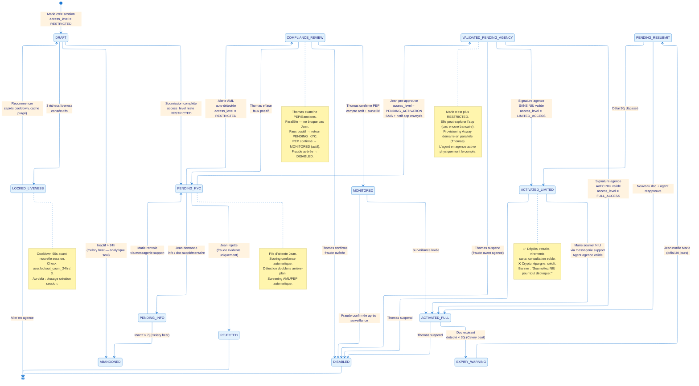
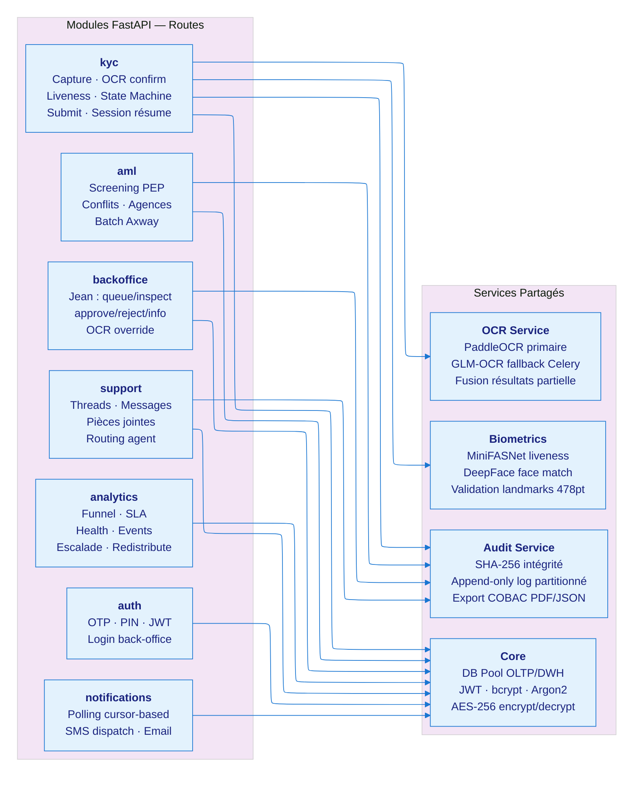

# Architecture bicec-veripass — Patch v3-bis
**Sections :** State Machine (définitive), C4 L3, Analytics OLAP/OLTP, Format Mermaid  
**Date :** 2026-03-04

---

## §0. Convention Mermaid — Format adopté pour tous les diagrammes

Chaque diagramme suit ce patron en deux parties :

**Partie 1 — Code source (avec config ELK) :**
```
%%{init: {"layout": "elk", ...}}%%
stateDiagram-v2 / graph / erDiagram ...
```
GitHub affiche "Unable to render rich display / Unknown layout: elk" — c'est normal et attendu. Le code reste lisible et modifiable.

**Partie 2 — Image SVG exportée :**
```

```
Copier le code dans [mermaid.live](https://mermaid.live) → Export SVG → uploader sur Gist → coller le lien `mermaid.ink/svg/pako:...`.

**Labels :** utiliser `<br>` pour les sauts de ligne (plus compatible que `\n`).

---

## §5-DEF. State Machine KYC — Version Définitive

### Les deux dimensions indépendantes

**`status`** = état du workflow KYC (piloté par Jean, Thomas, le système — visible back-office)  
**`access_level`** = niveau de permission de Marie dans l'app (évolue en parallèle du workflow)

### Matrice access_level

| Status courant | `access_level` | Ce que Marie peut faire dans l'app |
|---|---|---|
| DRAFT → PENDING_KYC → PENDING_INFO | `RESTRICTED` | Vitrine lecture seule, messagerie support |
| COMPLIANCE_REVIEW (PEP en cours d'examen) | `RESTRICTED` | Idem + message "vérification complémentaire en cours" |
| VALIDATED_PENDING_AGENCY | `PENDING_ACTIVATION` | Exploration app élargie — pas encore de fonctions bancaires |
| ACTIVATED_LIMITED | `LIMITED_ACCESS` | Dépôts, retraits, virements, carte, solde |
| ACTIVATED_FULL | `FULL_ACCESS` | Tout débloqué + Auth Rail BICEC |
| MONITORED (PEP confirmé, compte actif) | `FULL_ACCESS` ou `LIMITED_ACCESS` | Selon NIU — compte actif, sous surveillance |
| DISABLED | `BLOCKED` | Accès suspendu |

### Règle Thomas : non-bloquant sur le flow principal

Thomas intervient **en parallèle**. Ses actions ont du poids quand elles surviennent (suspension, MONITORED, provisioning Axway) mais ne bloquent jamais Jean ni la venue en agence de Marie — sauf si fraude avérée confirmée.

Le **provisioning Axway/Sopra Amplitude** est entièrement parallèle et non-bloquant. Il s'exécute indépendamment de l'activation du compte côté BICEC. C'est un bonus fin de MVP — priorité 3 dans la roadmap.



> **Exporter en SVG :** [mermaid.live](https://mermaid.live) → coller le code → Export SVG → Gist → lien `mermaid.ink/svg/pako:...`
![state-diagram-v2](https://mermaid.ink/svg/pako:eNqNV81u20YQfpUFC8N2Izv6sSxHSAPQIhUwkWVBUpymVSGsyZW8Nrlkl0vFimGglxYo0FPRYwv00EN07xvoTfwknd2lJMqU3OgkkrPfzH7zzczuneGGHjHqxs7OHWVU1NHdwBBXJCADo44GxiWO4V8B_vl4GiZCvyX-jX6pLC8wp_jSJ7H8CMsjTgPMp43QD7m2_8quNMtNS69JP_fJrcialMxypWavmZyG3CN8zehF7dgqpwFRRrZ9i4kbMu9REM1ms2IX08AJF_Tx94pdbVYHxv39_c7OgMUCC2JRPOY4OJiUBwzBz6OcuIKGDPVPB0y_-_7rH9DBwStkdc1mH9XRGfBBkMvnM4JiEsdg_fKSv8KuCw9Dn0yIj75BXbvX7zqNvm0tcPR6idQ6b7y1rWHLubDbdq8HmBU0n7lXxI2RTyeEAZCEhE3G8D4RdBRrDBYKgjgdXwkUjh7jaBP5a4Sh74UfGTouxghPMBOwMoHA_GXIhxlrcHyDkpjwQz90b0AGQzdMmBiWj67Qw6__oErG2EwOPOLP_4agL8EajzUVWJG2jk2YpwLWT483naW0C_kMAsJcwuW-93DE559j5KbbKCAXAzsoSvh4PtvfjidTVUcmbJODdwTBAWSef_PUbFvnbdsCY4dhSPgIvUKwW-W8QWD5FF0SLNDDT38gzLA_FfTHRHKX-PuP0Tp223Lar4dvPzQArxcmAVUsQPhB5M8_C5KTBycx5DEvkfX0ZoBX_Dcp5NDbxUIQBsZvCM6msueGnLIxuGYjimHzCCciDLAKP2NnzWciFboXJpBIBjrhnM4_c3IQ-Y8wOSFMoppnrecdu7MBc5Vq_ZzlJMuR026eA0kyauSRADNPkUPZKETPIRQXxUkEpM1ADAJDMa7DqeV5znVFcsImIVV4E4pRAHSDAOQXiRlysQVrsxpq1yirhP1tO2ucn3Vajtlu2MOufeHY75UAof0QSZfKPLB14GnCoWf8T6_IyyDnYZWa_hXkIUbkFgfQLSG2zvMeZF3mNc5ksIM59kGJoBwpaLCEjEs9R7D4kYKaOLlFURhTScPDL78DrSJMeHbfWWRQg9IaD-YzZX523nb6511gc09RuZ_F5jjxQJKT-Ux1T2lvOT3ztGVbG3tGntx88hccjEbYVeSOMjt4CmYV6RIk3YpiUjfgIIJUaE08Ax3xCaHA5Owp3MWO8rAqunUOtsmqa7-xpSAWxcLJNRG6k-ylEPPZhHqqCSRMlqIsmbQ5LVenTXGblwuz5VgmGA4XX8zXdrvxYeE1gm6Ao4jL2bFBt8tFjb5zYfad87Y06p31gCtIInAGi5Esy-l8Fm9ucttCWKlGVzfbhZ6JIj-JM-WS0ZYtZ1tEEgHVEMHQhwng70r3e1LkMAfgFbqE4pBdJSvKDg8nVPZr1eFuP-IpgmKF8wnYwwyJVrWzp9OZXdzalTNGrIaN0soEIrmaxoukIFirlbSlW25Ng2pPmlw16s4cLYkeHTMsEohQe1W0m-0eajvv0AT71NuUrnQ9pKuxPC18oevmu1Zri1_zwm487Vcu_nKn-fKJkzgCyrLa12caHcT-ZmHleFtl7eHPn-UEjOb_irggGxzHVP6bgDRkwvThC0MPL8jajRNfpOcbOI-QQ_n14a_fUINPIxEWoBBBJGMmjaGkPSqUxSlmDEQoj57yTCCr95PiKZLtFHqqkDrTjZgfDozN0shnf2NidI3Eyo90sn0IqpQpzaaC1WnL-1PI0pn9bcfpfhi-N7ttSBU4s2BMQ5FRDjmQcMvZhl6iSjE3N1V1rmNkuzhU87tT2Nqi56jGAfGqLamcA76PKUCja6Au3l_vZcv1G4lpy9aFE3W0eIZ0scrjatrUvghqVXfWIpJrmTtoLLEcBRpkNU42l046O9ShDCpD9f78uoz602m5HK-gen0sjjNQT-RtayE9pawnFqXn3oVBOlqMgjHm1DPqgiekYASEB1g-GnfSfu2y6REYzT7cMQv6U-7KOWD3ABdh9l0YBgtEyNP4yqiPsB_DUxJ5q2vb0gTikxdJuLMY9dJR9ViBGPU749aoH5TL1cNisVopHZVqL05qlXKtYEzh_VHtsFwslUqV6kmlVCkeVe8LxifluHR4fFQulUvH1eOTSrFWLZ4UDAJ1HfIzfZtWl-r7_wBkGOrL)
---

## §3-L3. C4 Level 3 — Composants FastAPI (dagre + directives)

> C4 Mermaid ne supporte pas ELK actuellement — dagre avec directives de padding.



---

## §13-OLAP. OLTP vs OLAP — Explication simple

### En une phrase chacun

**OLTP** (Online Transaction Processing) = la base de données opérationnelle, temps réel.  
Optimisée pour les **écritures rapides et lectures unitaires** ("donne-moi le dossier de Marie", "Jean approuve cette session"). Chaque opération touche **1 ou quelques lignes** — doit être rapide (<100ms).

**OLAP** (Online Analytical Processing) = l'entrepôt d'analyse (Data Warehouse).  
Optimisée pour les **requêtes d'agrégation sur de grands volumes** ("combien de dossiers ont été abandonnés à l'étape CNI par région en mars ?"). Chaque requête parcourt **des milliers de lignes** pour produire un chiffre ou un graphe.

> Dans bicec-veripass MVP : PostgreSQL sert les deux, isolés par schéma (`public` = OLTP, `dwh` = OLAP, `audit` = audit log). En Phase 2, on peut migrer l'OLAP vers DuckDB (in-process, ultra-rapide pour l'analytique locale, 0 infra supplémentaire).

---

## §13-ANALYTICS. Périmètre complet — Dashboard Sylvie

### A. Analytics Opérationnels VeriPass

| Métrique | Source données | Visuel Sylvie |
|---|---|---|
| Funnel drop-off étape A→G | `fact_analytics_events GROUP BY step` | Graphe entonnoir % conversion |
| Durée par étape p50/p90 | `fact_analytics_events.duration_ms` | Heatmap friction |
| Taux retry/corrections OCR | `ocr_fields.human_corrected` | Courbe confiance vs correction humaine |
| Taux succès liveness 1er essai | `biometric_results.liveness_score` | KPI card |
| SLA Jean (% dossiers < 2h) | `fact_validation_actions.sla_met` | Gauge R/Y/G |
| Charge agents (queue depth) | `agents.active_dossier_count` | Bar chart load balancing |
| Temps onboarding total p90 | `fact_kyc_sessions.total_duration_s` | Histogramme vs cible < 15min |
| Taux abandon par étape | `fact_kyc_sessions.dropout_step` | Sankey / Funnel |
| Alertes AML par semaine | `aml_alerts` | Timeline |
| Uptime / latence API p95 | Health endpoint + logs Nginx | Sparkline vert/rouge |

### B. Qualité Données & OCR Observability (focus jury PFE)

| Métrique | Source | Intérêt jury |
|---|---|---|
| Distribution confidence PaddleOCR vs GLM | `documents.confidence_per_field` | ★ Comparaison moteurs OCR |
| CER estimé (OCR vs correction Jean) | `ocr_fields` delta | ★ Précision sur CNI camerounaises |
| Laplacian Variance images capturées | `documents.capture_quality_metrics` | Impact guidance UX sur qualité |
| Luminance histogram (surexposition/sous-ex) | `documents.capture_quality_metrics` | Conditions capture Cameroun |
| Champs OCR les plus corrigés | `ocr_fields.field_name WHERE human_corrected` | ★ Identifier faiblesses extraction |

### C. Analytics Dataset / Cadrage Documentaire

> Sources : Document cadrage dataset (§L95–L115), document cadrage projet (§L1261–L1327)

| Métrique | Description |
|---|---|
| Volume CNI collectées (pilote) | Nb paires CNI recto/verso exploitables en entraînement futur |
| Distribution qualité images | % nettes / floues / surexposées avant/après guidance UX |
| Répartition types factures | ENEO vs CAMWATER vs autre — impact extraction GLM-OCR |
| Couverture géographique | Région → Ville → Agence — biais géographique dataset |
| Taux complétude NIU | % UPLOADED vs DECLARATIF vs ABSENT |
| Distribution langues | Français vs Anglais — usage effectif |
| Volumétrie stockage | Go/utilisateur moyen → projection capacité 10 ans COBAC |
| Diversité tonalités peau | Distribution pour valider équité MiniFASNet sur corpus local |

### D. KPIs Stratégiques Direction

| Indicateur | Cible | Seuil alerte |
|---|---|---|
| Onboardings complétés / jour | ↗ tendance | 🔴 si régression 2 jours consécutifs |
| MTTA (Mean Time To Activation) | < 24h | 🔴 > 48h |
| CAC vs agence physique | × 3 moins cher | Comparatif mensuel |
| Dossiers SLA > 2h | 0 | 🔴 dès 1 |
| Queue depth Jean | < 10 | 🟡 > 5, 🔴 > 10 |
| Taux conformité dossiers (COBAC-ready) | > 95% | Export audit |

---

*Patch v3-bis — 2026-03-04*
*State Machine définitive · C4 L3 épuré · OLAP/OLTP expliqué · Analytics complet · `<br>` + %%init%% appliqués*
