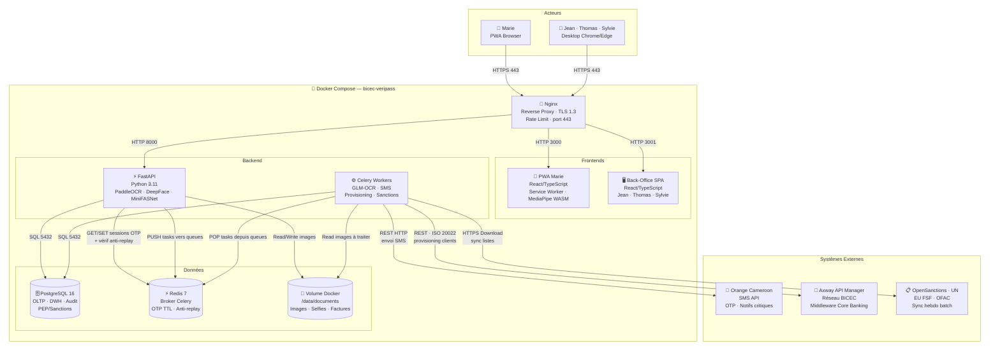
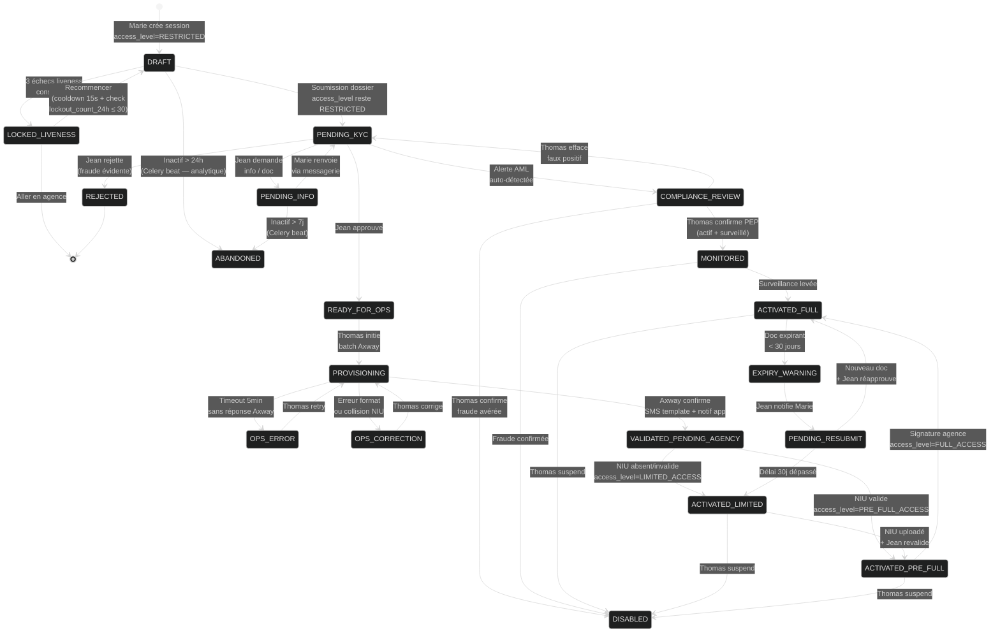
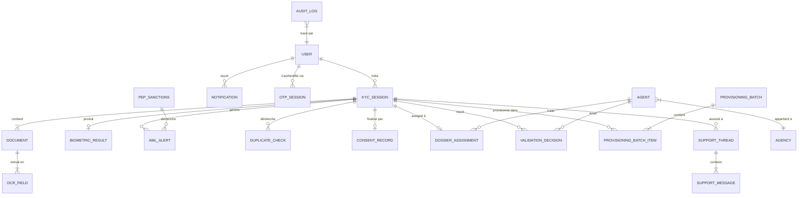
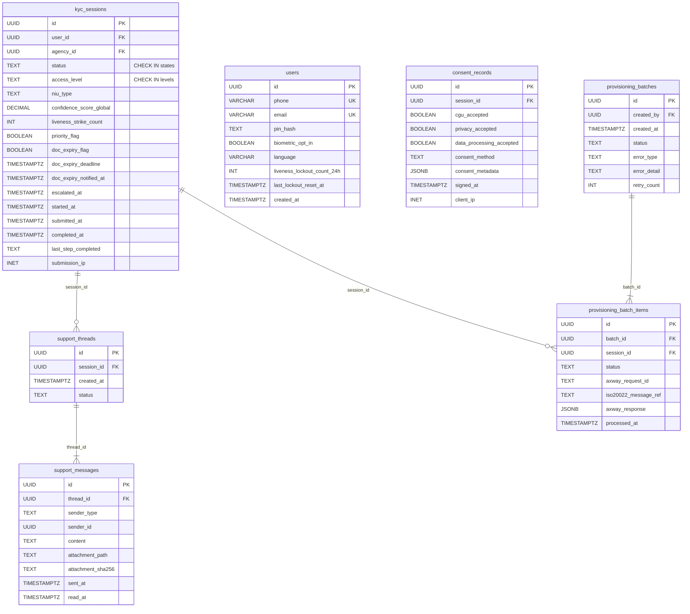

# Architecture bicec-veripass — Patch v3-bis
**Traite :** 15 findings Adversarial Review + correction Amplitude + directives Mermaid  
**Annule et remplace les sections concernées de v1 + v2 + v3**  
**Date :** 2026-03-04

---

## 0. INSTRUCTION DE FUSION — SOURCE DE VÉRITÉ UNIQUE (répond AR1)

> **Pour tout implémenteur :** Le seul document de référence est la **version consolidée finale** qui intègre dans cet ordre :
> `v1.0 (base) → corrections-v2 (replace §4,§5,§6) → patch-v3 (replace §7,§8,§9,§12,§13) → patch-v3-bis (replace §10,§13bis,§15 + ajoute §16,§17)`

| Section | Document actif | Statut v1 |
|---|---|---|
| §3 C4 L1 | v1.0 | ✅ Conservé |
| §3 C4 L2/L3 | corrections-v2 | ❌ v1 obsolète |
| §4 Use Case | corrections-v2 | ❌ v1 obsolète |
| §5 State Machine | patch-v3 (version définitive) | ❌ v1 + v2 obsolètes |
| §6 Séquences | corrections-v2 + patch-v3 | ❌ v1 partiellement obsolète |
| §7 ERD/LDM | patch-v3-bis §7bis | ❌ v1 + v3 partiellement obsolètes |
| §8 API Contract | patch-v3 + v3-bis §8bis | ❌ v1 partiellement obsolète |
| §9 Docker Compose | patch-v3 (mem_limits) | ❌ v1 partiellement obsolète |
| §10 RAM Budget | patch-v3-bis §10bis | ❌ v1 + v3 obsolètes |
| §13.3 Amplitude SDK | **SUPPRIMÉ** (voir §13bis) | ❌ v1 §13.3 entièrement supprimé |

---

## §3bis. C4 Level 2 — Conteneurs (Mermaid v3-bis, directives appliquées)



---

## §5bis. State Machine — Diagramme (Mermaid v3-bis, directives appliquées)

> Contenu identique au patch-v3 §5, syntaxe Mermaid améliorée.



---

## §7bis. ERD LDM — Version complète corrigée (répond AR12, AR14, AR15)

> **AR12 résolu :** `digital_signature_path` remplacé.  
> **AR14 résolu :** `status` et `access_level` avec contraintes CHECK explicites + trigger.  
> **AR15 résolu :** `support_threads`, `support_messages` intégrés au CDM/LDM.

### 7.1bis — CDM mis à jour



### 7.2bis — LDM : tables modifiées ou ajoutées



> **Contraintes DB à ajouter en DDL (pas dans Mermaid — Mermaid ne supporte pas les CHECK) :**
> ```
> status   : CHECK IN ('DRAFT','PENDING_KYC','PENDING_INFO','COMPLIANCE_REVIEW',
>                      'READY_FOR_OPS','PROVISIONING','OPS_ERROR','OPS_CORRECTION',
>                      'VALIDATED_PENDING_AGENCY','ACTIVATED_LIMITED','ACTIVATED_PRE_FULL',
>                      'ACTIVATED_FULL','EXPIRY_WARNING','PENDING_RESUBMIT',
>                      'MONITORED','REJECTED','DISABLED','ABANDONED')
> access_level : CHECK IN ('RESTRICTED','LIMITED_ACCESS','PRE_FULL_ACCESS',
>                           'FULL_ACCESS','BLOCKED')
> agents.role  : CHECK IN ('JEAN','THOMAS','SYLVIE')
> ```
> Trigger PostgreSQL validant les combinaisons `(status, access_level)` légales selon la matrice du §5.

---

## §8bis. API Contract — Versioning + Schéma d'erreurs (répond AR13)

### Préfixe de version

Tous les endpoints sont préfixés `/api/v1/`. Exemple : `POST /api/v1/auth/otp/send`.

### Schéma d'erreur standard (toutes les routes)

```json
{
  "error": {
    "code": "OTP_RATE_LIMIT_EXCEEDED",
    "message": "Trop de tentatives. Réessayez dans 15 minutes.",
    "retry_after_seconds": 900,
    "request_id": "req_abc123"
  }
}
```

| Code HTTP | Code erreur métier | Déclencheur |
|---|---|---|
| 400 | `VALIDATION_ERROR` | Champ manquant ou format incorrect |
| 401 | `TOKEN_EXPIRED` | JWT expiré |
| 401 | `TOKEN_INVALID` | JWT invalide ou falsifié |
| 403 | `RBAC_DENIED` | Rôle insuffisant pour cette action |
| 409 | `SESSION_ALREADY_SUBMITTED` | Double-soumission /kyc/submit |
| 413 | `PAYLOAD_TOO_LARGE` | Image > 10MB |
| 422 | `OCR_ALL_FIELDS_FAILED` | Confidence = 0% sur tous les champs |
| 429 | `OTP_RATE_LIMIT_EXCEEDED` | >5 envois OTP/15min |
| 429 | `LIVENESS_LOCKOUT` | 3 strikes consécutifs |
| 500 | `INTERNAL_ERROR` | Erreur serveur non anticipée |
| 503 | `OCR_SERVICE_UNAVAILABLE` | PaddleOCR ou GLM-OCR indisponible |

---

## §10bis. RAM Budget — Version honnête (répond AR3)

**Problème identifié :** Au démarrage `docker-compose up`, tous les containers démarrent simultanément. `celery_ocr` charge GLM-OCR en mémoire au lancement → pic RAM simultané avec FastAPI chargeant PaddleOCR → OOM sur i3/16GB WSL2 (cap 8GB).

**Solution : lazy loading + démarrage séquentiel**

```yaml
# docker-compose.yml - ajouts critiques

api:
  mem_limit: 2g
  environment:
    - PADDLE_LAZY_LOAD=true   # PaddleOCR chargé à la 1ère requête OCR
  healthcheck:
    test: ["CMD", "curl", "-f", "http://localhost:8000/health"]
    interval: 30s
    start_period: 60s

celery_ocr:
  mem_limit: 3g
  depends_on:
    api:
      condition: service_healthy  # Ne démarre qu'après API prête
  environment:
    - GLM_LAZY_LOAD=true      # GLM-OCR chargé à la 1ère tâche de la queue
```

**Budget RAM révisé (honnête) :**

| Phase | Mémoire | Condition |
|---|---|---|
| Démarrage à froid (aucune requête) | ~2.2GB | Nginx + PG + Redis + API (sans modèles) |
| API active, PaddleOCR chargé | ~3.7GB | Après 1ère requête OCR |
| Celery actif, GLM en attente | ~4.2GB | Workers prêts, pas de tâche GLM |
| **Peak : PaddleOCR en cours + GLM en cours** | **~7.2GB** | **⚠️ Séquentiel obligatoire (Redis lock)** |
| Peak absolu théorique (si lock échoue) | ~9GB | ❌ OOM — le lock Redis l'empêche |

> Le Redis lock applicatif (voir patch-v3 §12) est **la seule protection** contre l'OOM. Il doit être implémenté avant toute mise en production, même sur i3.

---

## §13bis. Amplitude — SUPPRESSION SDK + Architecture corrigée (répond AR2)

### ❌ SUPPRIMER ENTIÈREMENT — Section 13.3 de v1

> La section 13.3 "Amplitude Python SDK" du document v1 est **entièrement supprimée**. Elle référençait `amplitude.com` (SaaS analytics américain) sous le nom "Sopra Amplitude" — deux produits sans aucun rapport. Ce code viole la souveraineté (données envoyées vers cloud étranger) et ne correspond à rien dans notre architecture.

### ✅ Architecture Axway — Provisioning Sopra Amplitude Core Banking

**Ce que "Amplitude" signifie dans ce projet :** Sopra Banking Software — Amplitude, Core Banking System de BICEC. L'accès se fait via le middleware **Axway API Manager** sur le réseau interne BICEC. VeriPass n'a **jamais** accès direct au Core.

```
Table provisioning_batches (PostgreSQL VeriPass)
    ↓  Thomas initie via interface back-office
Celery Worker amplitude_batch_worker
    ↓  Appels REST séquentiels (ou mini-batch)
Axway API Manager v11.6 AIF (réseau BICEC — intranet)
    ↓  Route + authentifie + transforme
Sopra Amplitude Core Banking
    ↓  Confirme création/mise à jour
Celery Worker ← réponse Axway
    ↓
UPDATE provisioning_batch_items (status, axway_request_id, iso20022_message_ref)
UPDATE kyc_sessions (status=VALIDATED_PENDING_AGENCY)
```

**Format des messages — ISO 20022 (obligatoire depuis 2025, directive BEAC) :**

| Action | Message ISO 20022 |
|---|---|
| Création compte | `acmt.009` — AccountOpeningInstruction |
| Confirmation création | `acmt.010` — AccountOpeningConfirmation |
| Mise à jour client existant | `acmt.003` — AccountModificationInstruction |
| Confirmation mise à jour | `acmt.004` — AccountModificationConfirmation |

> **Note investigation :** La documentation exacte des endpoints Axway disponibles dans l'environnement BICEC doit être demandée à l'équipe IT BICEC avant implémentation. L'encadreur confirme que v11.6 AIF expose des WebServices API Manager — les endpoints REST spécifiques et la structure exacte des messages sont à confirmer en contexte d'intégration réelle.

**Cas client existant (update) :**
> Un client BICEC existant qui passe par VeriPass pour mettre à jour ses infos expirées → Celery vérifie d'abord si un compte existe (recherche par téléphone/NIU dans Axway) → si oui : `acmt.003` mise à jour uniquement des champs expirés → Axway répond "client updated" → pas de doublon créé.

---

## §15. Findings restants Adversarial Review (AR4 à AR11)

### AR4 — PRD dit Flutter, ADR dit PWA

> **Réconciliation officielle :** Le PRD (line 161, `projectType`) est **antérieur** à la décision ADR-001. Le PRD n'a pas été mis à jour car c'est un document de planification figé — il n'est pas re-généré pendant l'architecture. La **source de vérité technique** est l'ADR-001 (architecture document). Pour tout développeur : ADR-001 > PRD sur les choix technologiques. Une note de réconciliation est ajoutée en tête du PRD.

### AR5 — Chiffrement Phase 1 vs NFR5 PRD

> **NFR5 :** "100% of biometric templates and CNI images must be encrypted using AES-256 inside Docker volumes."  
> **Réconciliation :** L'ADR-006 (§14 du document principal) différait le chiffrement au repos. C'est une **contradiction réelle** avec le PRD. **Décision révisée :** Le chiffrement au repos s'applique dès le départ sur le **volume `/data/documents`** via chiffrement applicatif Python (Fernet/AES-256) sur l'écriture des images — avant de toucher le disque. Seules les données de debug non-sensibles (logs, métadonnées JSON) restent en clair. Cela résout la contradiction avec NFR5 sans bloquer le développement (un helper `encrypt_file()` / `decrypt_file()` suffit).

### AR6 — Error UX non spécifiée

**États d'erreur Marie — à implémenter sur la PWA :**

| Scénario | Message affiché | Action proposée |
|---|---|---|
| OTP SMS jamais arrivé | "SMS non reçu ? Attendez 60s puis réessayez. Ou recevez par email." | Bouton "Renvoyer" + bouton "Recevoir par email" |
| OCR 0% confiance sur tous les champs | "Nous n'avons pas pu lire votre document. Recapturez dans un endroit plus lumineux." | Bouton "Réessayer" avec conseils photo |
| Upload timeout 3G (>30s) | "Connexion lente détectée. Votre document est sauvegardé localement, l'upload reprendra automatiquement." | Indicateur "En attente de réseau" |
| Erreur 500 backend | "Une erreur inattendue s'est produite. Votre progression est sauvegardée." | Bouton "Réessayer" (retry idempotent) |
| session_id invalide côté serveur | "Session expirée. Reconnectez-vous avec votre PIN pour reprendre." | Redirect PIN auth → GET /kyc/session/{id} |

### AR7 — AML fuzzy matching non défini

**Algorithme retenu : pg_trgm (trigram PostgreSQL)**

- Natif PostgreSQL, zéro dépendance externe
- `similarity(nom_client, nom_sanctions)` → score entre 0 et 1
- **Seuil alerte :** `≥ 0.65` → INSERT aml_alert (review humain Thomas)
- **Seuil auto-clear :** `< 0.40` → pas d'alerte créée
- Complété par : comparaison `date_of_birth` (± 2 ans tolérance) + `nationality`
- Données périmées : `pep_sanctions.last_synced_at` affiché dans l'interface Thomas — si > 8 jours → banner ⚠️ "Données de sanctions potentiellement périmées"

### AR9 — Notifications polling et scalabilité

**Cache Redis pour notifications (50 users pilote → scalable Phase 2) :**

```
GET /api/v1/notifications?after_id={cursor}
    → Redis GET notif_cache:{user_id}
    → Si miss : SELECT FROM notifications WHERE id > cursor AND user_id = X
    → SET Redis (TTL 30s)
    → Retourne {notifications, next_cursor}
```

- Le cache Redis (TTL 30s) absorbe les requêtes polling répétées
- À 500 users (Phase 2) : 1000-2000 req/min → Redis répond en <1ms, PostgreSQL consulté seulement si cache miss
- Si croissance > 500 users : migration SSE (`GET /api/v1/notifications/stream`) sans changer le contrat API client

### AR10 — OLTP et DWH sur même PostgreSQL

**Isolation par schéma PostgreSQL :**

```
Base veripass (PostgreSQL unique, 512MB)
├── schema: public        → Tables OLTP (kyc_sessions, users, agents...)
├── schema: dwh           → Tables analytics (fact_*, dim_*)
└── schema: audit         → audit_log (partitionnée, append-only)
```

**Isolation des requêtes analytiques :**
- Rôle DB `vp_analytics` avec accès READ-ONLY sur `schema dwh` uniquement
- `SET statement_timeout = '5s'` sur la connexion analytics (SQLAlchemy pool dédié)
- Les requêtes Sylvie partent d'un pool de connexions séparé → ne bloquent pas Jean

### AR11 — Partitions audit_log non automatisées

**Celery Beat — création automatique partitions mensuelles :**

```
Tâche Celery : create_audit_partition
Schedule     : 1er de chaque mois à 00h01
Action       : CREATE TABLE IF NOT EXISTS audit.audit_log_{YYYY_MM}
               PARTITION OF audit.audit_log
               FOR VALUES FROM ('{YYYY-MM-01}') TO ('{YYYY-MM+1-01}')
```

> Celery Beat envoie cette tâche dans la queue `maintenance` — un worker Celery normal l'exécute. Si la partition existe déjà (`IF NOT EXISTS`), la tâche est idempotente. Une alerte est envoyée à Thomas si la création échoue (INSERT audit impossible le 1er du mois à 00h02 = signal d'échec).

---

## §16. Réconciliation Prototype (AR8)

> Le prototype (`MobileOnboarding.tsx`, `BackOffice.tsx`) est un **prototype de démonstration UI**, pas le code de production. Il ne prétend pas implémenter l'architecture complète. Les divergences documentées sont des **dettes de réconciliation** à traiter lors de l'implémentation, pas des bugs d'architecture.

**Checklist de réconciliation prototype → production :**

- [ ] Renommer status enum : `pending→PENDING_KYC`, `approved→READY_FOR_OPS`, `limited→ACTIVATED_LIMITED`
- [ ] Ajouter états manquants : `DRAFT`, `COMPLIANCE_REVIEW`, `MONITORED`, `VALIDATED_PENDING_AGENCY`, etc.
- [ ] Étape `signature` → renommer `consent`, supprimer canvas, conserver 3 checkboxes uniquement
- [ ] Ajouter champ `access_level` distinct de `status` dans `ApplicationData`
- [ ] Aligner `STEP_SEQUENCE` avec les modules A→G de la UX Spec v2.1

---

*Patch v3-bis — 2026-03-04*  
*AR findings traités : 15/15 | Amplitude SDK supprimé | Mermaid directives appliquées*
