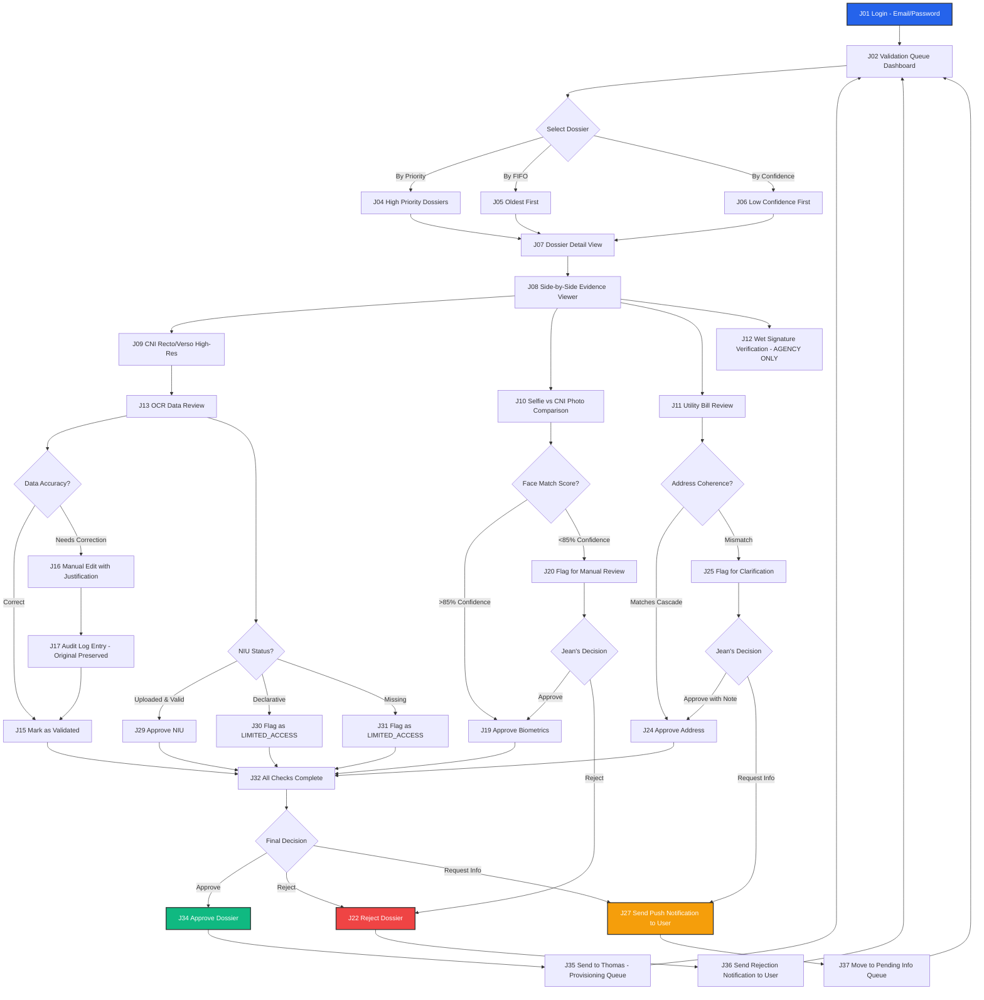
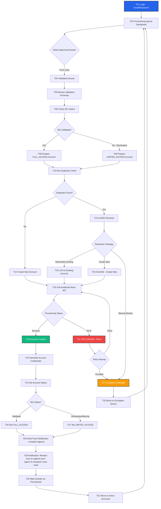

[//]: # (---)
[//]: # (version: 2.0)
[//]: # (date: 2026-02-18)
[//]: # (revisionNotes: "Critical corrections integrated from Ken's 2026-02-18 review: Auto-extraction paradigm, wet signature removal from mobile, RESTRICTED vs LIMITED_ACCESS clarification, Mermaid expansion, timer update to 15min")
[//]: # (stepsCompleted: [1, 2, 3, 4, 5, 6, 7, 8, 9, 10, 11, 12, 13, 14])
[//]: # (lastStep: 14)
[//]: # (inputDocuments:)
[//]: # (  - "_bmad-output/planning-artifacts/prd.md")
[//]: # (  - "_bmad-output/planning-artifacts/adversarial-review-findings-UPDATED.md")
[//]: # (  - "_bmad-output/planning-artifacts/ux-design-specification.md")
[//]: # (  - "docs/Screenshot_References.csv")
[//]: # (  - "docs/Fonctionnalité_Interaction_Erreurs.md")
[//]: # (---)

# UX Design Specification bicec-veripass v2.0

**Author:** Ken  
**Date:** 2026-02-18  
**Version:** 2.0 (Major Revision)

---

## 1. Executive Summary

### Project Vision
**The Client Relationship Hub**: We are building a modern Client Relationship and Service Discovery platform (Revolut-styled) that transforms KYC onboarding into a premium entry point for personal banking. Our goal is to bridge the "Trust Gap" by turning a 14-day manual process into a **15-minute digital breakthrough (11-minute stretch goal)**, while educating users on BICEC's modern service ecosystem (Plans, Savings, Cards) during the validation period.

### Target Users
- **Marie (The Entrepreneur)**: Tech-savvy but resource-constrained. Fighting 3G drops and power cuts on an Android 7 device. Needs resilience and clear, non-jargon guidance.
- **Jean (The Guardian)**: Internal validator needing "side-by-side" evidence to perform 3-minute sanity checks with total audit trails.
- **Sylvie (The Commander)**: Manager needing R/Y/G operational health visibility and funnel analytics.

### Key Design Challenges
- **The Hardware Ceiling**: Maintaining >15 FPS camera guidance on legacy Android 7 (NFR2).
- **The Resilience Paradox**: Managing session persistence (NFR8) and chunked uploads (FR6) without adding UX friction.
- **The Compliance Burden**: Capturing CNI recto/verso, liveness, and proof of address without overwhelming the user.
- **The Auto-Extraction Paradigm**: Users upload documents; AI extracts data. Users only confirm/correct, never fill blank forms.

### Design Opportunities
- **Revolut-Grade Experience**: Bringing premium, confidence-building UI to the Cameroonian banking sector.
- **Evidence-First UX**: Turning a regulatory burden into a speed-to-market advantage by producing "evidence that screams."
- **AI-Powered Efficiency**: PaddleOCR + DeepFace eliminate manual data entry, reducing completion time from 14 days to 15 minutes.

---

## 2. Core User Experience

### Defining Experience
The bicec-veripass experience is defined by **Resilient Speed & Anticipated Value**. It must feel like a "safe passage" through a complex regulatory landscape that opens doors to immediate banking benefits. The **15-minute onboarding** is the primary entry point, optimized for zero data loss and maximum feature discovery.

### Platform Strategy
- **Mobile First**: Flutter-based app optimized for Android 7 (minSdk 24).
- **Tablet/Desktop Back-Office**: Web-based portal for agents, optimized for side-by-side evidence review.
- **Offline-First Resilience**: SQLite/Hive local persistence to handle "Délestage."

### Effortless Interactions
- **The Safety Net**: Automatic session resumption (<2s) prevents frustration.
- **Automated Capture**: Blur/glare detection handles the "heavy lifting" for Marie.
- **Bottom-Sheet Context**: Keeping secondary info tucked away but accessible.
- **Zero Manual Entry**: AI extracts all data from documents. Users only confirm or correct pre-filled fields.

### Critical Success Moments
- **The 15-Minute Breakthrough**: First-time completion of a digital account opening and service personalization.
- **The "Dual Auth Setup"**: Collecting and verifying both phone (SMS) and email during onboarding enables flexible login options (phone OR email + code).
- **The "Service Discovery" Spark**: Seeing high-fidelity banking previews (Ultra/Standard plans) while the dossier is PENDING, proving value immediately.
- **The "Saved Progress" Reassurance**: Recovering a session after a power failure without re-entering data.
- **The "OCR Review" Confidence**: Seeing extracted data with confidence badges (🟢 High, 🟠 Low) builds trust in the AI system.

### Experience Principles
1. **Revolut Structure, BICEC Soul**: Clean card layouts with vibrant #E37B03 highlights and premium neobank aesthetics.
2. **Discovery during Validation**: The UI stays "alive" while KYC is being processed, showcasing future account capabilities.
3. **Compliance-First, Evidence-First**: Designs that prioritize the creation of a bulletproof audit trail.
4. **Resilience as a Safety Net**: Failures are framed as "We saved your spot," not errors.
5. **AI-Assisted, Human-Verified**: Automation accelerates, humans validate. No blank forms to fill.

---

## 3. Desired Emotional Response

### Primary Emotional Goals
- **Protected, not Policed**: Compliance should feel like security, not surveillance.
- **Empowered & Confident**: Users feel they are making a smart business move with a Tier-1 bank.
- **Relieved, not Burdened**: AI handles data extraction; users just confirm accuracy.

### Emotional Journey Mapping
- **Entry**: Welcome and reassurance (Splash → OTP).
- **Effort**: Focus and guidance (Capture → Liveness).
- **Validation**: Confidence and trust (OCR Review with badges).
- **Integrity**: Solemnity and commitment (Signatures → Contract).
- **Submission**: Relief and anticipation (Progress → Success).

### Micro-Emotions
- **Trust**: Generated by high-quality illustrations and BICEC branding.
- **Clarity**: Generated by confidence badges on OCR review.
- **Delight**: Generated by celebration moments (confetti, success animations).

### Design Implications
- Use **illustrative icons** to decouple from language barriers.
- **Vibrant Orange (#E37B03)** for primary actions to drive energy.
- **Soft card shadows** to provide depth and modern feel.
- **Confidence badges** (🟢/🟠/🔴) to communicate AI extraction quality.

---

## 4. UX Pattern Analysis & Inspiration

### Inspiring Products Analysis
- **Revolut iOS (Latest)**: The "Gold Standard" for digital-first financial onboarding.
    - **Successes**: Card-based layouts, seamless transitions, immediate feedback loops.
    - **Innovative Interactions**: Progressive disclosure, confidence-building status toasts, celebration moments.
    - **Adopted Patterns**: Success animations after each capture, inline editing, biometric opt-in.
    
- **Nubank (Brazil/Mexico)**: Master of emotional onboarding in emerging markets.
    - **Successes**: Confetti celebrations, plain language, helpful microcopy, trust-building through transparency.
    - **Innovative Interactions**: Progress timeline, "Why we need this" explanations, delight moments.
    - **Adopted Patterns**: Welcome value prop screen, success celebration, progress stepper.
    
- **Trade Republic (Germany)**: Minimalist efficiency with premium feel.
    - **Successes**: Clean UI, fast KYC flow, smart defaults, minimal friction.
    - **Innovative Interactions**: Auto-capture with real-time feedback, smart form validation.
    - **Adopted Patterns**: Capture success feedback, inline data review, biometric security.

### Transferable UX Patterns (Expanded)
- **Card-Based Hierarchy**: Revolut's clean cards for data entry and review, adapted with BICEC's #E37B03 accents.
- **Progressive Bottom Sheets**: For supplementary info (e.g., "Why we need your NIU") to keep main flow uncluttered.
- **Illustration-Driven Guidance**: Low-text, high-contrast 2D flat illustrations to overcome digital literacy barriers.
- **Celebration Moments**: Nubank's confetti animations and success messages to build emotional connection.
- **Progress Transparency**: Trade Republic's visual stepper to reduce anxiety about process length.
- **Inline Editing**: Revolut's tap-to-edit pattern for OCR review instead of separate edit modes.
- **Smart Defaults**: Pre-selecting most common options (e.g., Standard plan) to reduce decision fatigue.
- **Biometric Opt-in**: Offering Face ID/Fingerprint after PIN setup, not forcing it upfront.
- **Legal Clarity**: Checkbox consent with hyperlinks instead of forced scrolling through dense text.
- **Micro-feedback**: Immediate visual/haptic feedback on every successful action (capture, validation, etc.).
- **Confidence Indicators**: Visual badges showing AI extraction confidence to build trust.

### Design Inspiration Strategy (Enhanced)
- **Adopt from Revolut**: Card layouts, inline editing, biometric security, real-time validation.
- **Adopt from Nubank**: Celebration moments, plain language, progress transparency, trust-building microcopy.
- **Adopt from Trade Republic**: Minimalist efficiency, auto-capture feedback, smart defaults.
- **Adapt for Cameroon**: 3G-optimized animations, offline-first architecture, French/English bilingual, BICEC brand colors (#E37B03).
- **Avoid**: Dense legal text, forced scrolling, high-bandwidth animations, complex multi-step forms, jargon-heavy copy, blank forms requiring manual data entry.
- **Innovate**: Combine Revolut's premium feel + Nubank's emotional warmth + Trade Republic's efficiency, tailored for Cameroonian banking context with AI-powered auto-extraction.

---

## 5. Design System Strategy

### Visual DNA
- **Palette**: 
    - Primary: #E37B03 (Mango Orange) for primary buttons/highlights
    - Action Color: #2563EB (Link Blue)
    - Success: #10B981 (Emerald)
    - Warning: #F59E0B (Amber)
    - Error: #EF4444 (Red)
    - Neutrals: Light Gray #F3F4F6, Dark Gray #1F2937 (WCAG AA-compliant)
- **Typography**: SF Pro (iOS) / Roboto (Android) for maximum performance on legacy devices.
- **Iconography**: Outline-style, high-contrast, easily identifiable.
- **Illustrations**: Flat 2D, vibrant, focused on physical document alignment.
- **Confidence Badges**:
    - 🟢 High Confidence (>85%): Green checkmark, non-editable by default
    - 🟠 Low Confidence (50-85%): Orange warning, tap to edit inline
    - 🔴 Not Detected (<50%): Red alert, mandatory correction required

### Interaction Patterns
- **Bottom Sheets**: Primary container for secondary choices and educational context.
- **Progress Indicator**: Subtle "Step X of Y" or timeline to build momentum.
- **Resilience UX**: Custom toast-style notifications: "Resuming session... We saved your progress."
- **Inline Editing**: Tap any field with 🟠 or 🔴 badge to edit directly in card (no modal, no separate screen).
- **Auto-Submit**: "Confirmer et continuer" button remains disabled until all 🟠/🔴 badges are resolved.

---

## 6. Mobile Screen Inventory & Flow Map

### Journey Flow Map (Mermaid) - Expanded with Agent Validation & Access States

```mermaid
graph TD
    %% ========== PHASE 1: Entry & Authentication ==========
    A01[A01 Splash & Language] --> A02[A02 Welcome Value Prop]
    A02 --> A03[A03 Phone Entry]
    A03 --> A04[A04 OTP Verify Phone]
    A04 --> A05[A05 Email Entry]
    A05 --> A06[A06 Email Verification]
    A06 --> A07[A07 App PIN Setup]
    A07 --> A08[A08 Biometric Opt-in]
    
    %% ========== PHASE 2: Onboarding Context ==========
    A08 --> A09[A09 What You Need]
    A09 --> A10[A10 Progress Timeline]
    
    %% ========== PHASE 3: Identity Capture ==========
    A10 --> B01[B01 CNI Intro]
    B01 --> B02[B02 CNI Recto Guidance]
    B02 --> B03[B03 CNI Recto Capture]
    B03 --> B04[B04 Capture Success]
    B04 --> B05[B05 CNI Verso Guidance]
    B05 --> B06[B06 CNI Verso Capture]
    B06 --> B07[B07 OCR Processing]
    B07 --> B08[B08 OCR Review & Edit]
    
    %% ========== PHASE 4: Liveness ==========
    B08 --> B09[B09 Liveness Intro]
    B09 --> B10[B10 Liveness Challenge]
    B10 -->|3 Strikes| B10_Fail[B10_Fail Lockout & Fresh Start]
    B10_Fail --> B10_Restart{User Clicks Recommencer?}
    B10_Restart -->|Yes - Data Wiped| A01
    B10_Restart -->|No - Exit App| Z01[Exit]
    B10 -->|Success| B11[B11 Liveness Success]
    
    %% ========== PHASE 5: Address & Fiscal ==========
    B11 --> C01[C01 Address Cascade]
    C01 --> C02[C02 GPS Button Optional]
    C02 --> C03[C03 Utility Proof Intro]
    C03 --> C04[C04 Utility Capture]
    C04 --> C05[C05 NIU Choice]
    C05 --> C06[C06 NIU Entry/Upload]
    
    %% ========== PHASE 6: Legal & Consent (MOBILE ONLY) ==========
    C06 --> D01[D01 CGU Acceptance]
    D01 --> D02[D02 Digital Signature]
    
    %% ========== PHASE 7: Submission & Discovery ==========
    D02 --> E01[E01 Review Summary]
    E01 --> E02[E02 Secure Upload]
    E02 --> E03[E03 Success Celebration]
    E03 --> E04[E04 Plan Discovery]
    E04 --> E05[E05 Personalization]
    E05 --> E06[E06 RESTRICTED_ACCESS Dashboard]
    
    %% ========== AGENT VALIDATION PATH (BACKEND) ==========
    E06 -.->|Dossier Submitted| WAIT_JEAN[Jean Validates Dossier]
    WAIT_JEAN -->|Approved| WAIT_THOMAS[Thomas Provisions Account]
    WAIT_THOMAS -->|Success| F00[F00 Push Notification - Invitation Agence]
    
    %% ========== PHYSICAL AGENCY PATH ==========
    F00 --> F01_AGENCY[F01_AGENCY Physical Signature + Card Pickup]
    F01_AGENCY -->|NIU Validated| F02[F02 Home Dashboard - FULL_ACCESS]
    F01_AGENCY -->|NIU Missing/Declarative| F03[F03 Home Dashboard - LIMITED_ACCESS]
    
    %% ========== ACCESS STATE BRANCHES ==========
    F02 --> G01[G01 All Features Unlocked]
    F03 --> G02[G02 Transfers/Cards Locked]
    G02 -.->|User Completes NIU| WAIT_JEAN_NIU[Jean Validates NIU]
    WAIT_JEAN_NIU -->|Approved| F02
    
    %% ========== REJECTION PATH ==========
    WAIT_JEAN -->|Rejected| E07[E07 Rejection Notification]
    E07 --> E08{User Action?}
    E08 -->|Retry| B01
    E08 -->|Contact Support| Z02[Support Channel]
    
    %% ========== RESILIENCE & RECOVERY ==========
    E02 -.->|Network Drop| E02_Retry[Auto Resume from Cache]
    E02_Retry -.-> E02
    
    %% ========== STYLING ==========
    style A01 fill:#E37B03,stroke:#333,stroke-width:2px,color:#fff
    style E03 fill:#10B981,stroke:#333,stroke-width:2px,color:#fff
    style E06 fill:#F59E0B,stroke:#333,stroke-width:2px,color:#fff
    style F02 fill:#2563EB,stroke:#333,stroke-width:2px,color:#fff
    style F03 fill:#F59E0B,stroke:#333,stroke-width:2px,color:#fff
    style B10_Fail fill:#EF4444,stroke:#333,stroke-width:2px,color:#fff
```

### Access State Definitions (Critical Correction)

#### RESTRICTED_ACCESS (Post-Submission, Pre-Validation)
**When**: After E06 (dossier submitted), waiting for Jean's validation  
**What User Sees**: Full app in "vitrine" (discovery) mode  
**Allowed Actions**:
- Browse all screens and features (read-only)
- View plan comparisons (Ultra/Premium/Standard)
- Explore banking feature descriptions
- Withdraw existing funds (if any)
- Move money between own pockets

**Blocked Actions**:
- ALL financial operations (deposits, transfers, card issuance)
- Account activation

**UI Indicators**:
- Persistent banner: "⏳ Votre dossier est en cours de validation. Vous découvrez votre futur espace bancaire."
- All action buttons show "Disponible après validation" tooltip

#### LIMITED_ACCESS (Account Active, NIU Missing/Declarative)
**When**: After F01_AGENCY (account activated) but NIU not validated  
**What User Sees**: Partially functional banking app  
**Allowed Actions**:
- Cash-In (deposits, receive transfers) ✅
- View balance ✅
- Account settings ✅
- Service discovery ✅
- Outbound transfers ✅
- Cash-Out (withdrawals) ✅
- Card issuance ✅

**Blocked Actions**:

- Crypto ❌
- Investments ❌
- Savings products ❌

**UI Indicators**:
- Persistent banner: "⚠️ Complétez votre NIU pour débloquer toutes les fonctionnalités"
- Locked features show padlock icon + "NIU requis" tooltip

#### FULL_ACCESS (Complete KYC + NIU Validated)
**When**: After Jean validates NIU (from LIMITED_ACCESS) or initial validation with NIU  
**What User Sees**: Fully functional banking app  
**All Features Unlocked**: Transfers, cards, crypto, investments, savings, etc.

### Module A: Secure Entry & Context (Enhanced - Revolut/Nubank Pattern)
| ID | Screen Name | Key UX Elements | FR/NFR Traceability |
| :--- | :--- | :--- | :--- |
| **A01** | Splash & Language | BICEC logo animation, EN/FR toggle, Cold start <4s. | FR1, NFR3 |
| **A02** | Welcome Value Prop | Hero illustration + 3 value pillars (Speed/Security/Modern). | NFR8, Marketing |
| **A03** | Phone Entry | +237 locked, numeric keypad, "Déjà client?" link. | FR1 |
| **A04** | OTP Verify (Phone) | 6-digit auto-fill, SMS auto-read, Resend timer. | FR1, FR41 |
| **A05** | Email Entry | Email input with validation, "Hide My Email" option. | FR1, FR41 |
| **A06** | Email Verification | 6-digit code or link verification, Resend timer. | FR1, FR41 |
| **A07** | PIN Setup | 6-digit PIN with strength indicator, Confirm screen. | NFR4 |
| **A08** | Biometric Opt-in | Face ID/Fingerprint toggle, "Skip for now" option. | NFR4 (Enhanced) |
| **A09** | What You Need | Checklist with icons, ~15 min estimate, "Let's go" CTA. | NFR8 |
| **A10** | Progress Timeline | Visual stepper (Identity → Address → Legal → Done). | NFR8, UX |

### Module B: Identity & Liveness (Enhanced - Trade Republic Pattern + Auto-Extraction)
| ID | Screen Name | Key UX Elements | FR/NFR Traceability |
| :--- | :--- | :--- | :--- |
| **B01** | CNI Intro | Illustration + "Why we need this" explanation. | FR2, UX |
| **B02** | CNI Recto Guidance | Animated tips (Glare/Blur/Alignment), "Got it" CTA. | FR2, NFR2 |
| **B03** | CNI Recto Capture | Camera overlay, auto-capture, real-time feedback. | FR2, FR20, NFR2 |
| **B04** | Capture Success | Green checkmark animation, "Great!" message. | UX, Feedback |
| **B05** | CNI Verso Guidance | "Now the back side" with flip animation. | FR2, NFR2 |
| **B06** | CNI Verso Capture | Same quality guardrails, auto-capture. | FR2, FR20, NFR2 |
| **B07** | OCR Processing | Loading animation with "Analyzing..." message. | FR5, UX |
| **B08** | OCR Review & Edit | **CRITICAL**: Card-based layout with confidence badges. All data PRE-FILLED by AI. 🟢 = validated, 🟠 = tap to edit inline, 🔴 = not detected (mandatory fix). NO blank forms. CTA disabled until all 🟠/🔴 resolved. | FR5, FR24 |
| **B09** | Liveness Intro | "Quick selfie check" with privacy reassurance. | FR3, FR4 |
| **B10** | Liveness Challenge | Circular frame, randomized prompts, 3-strike system. | FR3, FR4, FR7 |
| **B10_Fail** | Lockout & Fresh Start | **CRITICAL**: After 3 strikes, show Ken's exact copy: "Désolé pour la gêne, mais pour des raisons techniques/de sécurité, nous sommes obligés de terminer cette session. Ne vous inquiétez pas, vous avez toujours la possibilité d'aller dans une agence locale proche de chez vous, ou de recommencer dès le début." Single button: [Recommencer]. Data wipes AFTER user clicks button. | FR7 |
| **B11** | Liveness Success | Success animation, "Identity verified!" message. | UX, Feedback |

### Module C: Localization & Fiscal Identity
| ID | Screen Name | Key UX Elements | FR/NFR Traceability |
| :--- | :--- | :--- | :--- |
| **C01** | Address Cascade | Region → Ville → Quartier dropdowns (mandatory). | FR9, FR10 |
| **C02** | GPS Button (Optional) | **CRITICAL**: Single button "Utiliser ma position actuelle" (optional). NO map embed. If used, show privacy notice modal. If GPS distance > X km from Quartier, show non-blocking warning. | FR10, FR11 |
| **C03** | Utility Proof Intro | ENEO/CAMWATER toggle, "Why we need this" explanation. | FR12, FR13 |
| **C04** | Utility Capture | Camera capture with quality checks. | FR12, FR13 |
| **C05** | NIU Choice | Upload vs Manual Entry toggle. | FR14, FR15 |
| **C06** | NIU Entry/Upload | If manual: show LIMITED_ACCESS warning bottom sheet. | FR16 |

### Module D: Consent & Signatures (MOBILE FLOW - WET SIGNATURE REMOVED)
| ID | Screen Name | Key UX Elements | FR/NFR Traceability |
| :--- | :--- | :--- | :--- |
| **D01** | CGU Acceptance | **CRITICAL**: Checkbox consent with hyperlinks to legal docs (NO scroll-gate). Optional marketing opt-in checkbox (unchecked by default). | FR17 |
| **D02** | Digital Signature | Sign-on-glass canvas with "Sign here" guidance. | FR18 |

**REMOVED FROM MOBILE FLOW:**
- ~~D03 Wet Sign Intro~~ → Moved to physical agency visit (F01_AGENCY)
- ~~D04 Wet Sign Capture~~ → Moved to physical agency visit (F01_AGENCY)

**Rationale**: Wet signature (3x paper capture) happens at physical agency when user picks up card, not during mobile onboarding. Mobile flow ends at D02.

### Module E: Submission & Discovery (Enhanced - Nubank Celebration Pattern)
| ID | Screen Name | Key UX Elements | FR/NFR Traceability |
| :--- | :--- | :--- | :--- |
| **E01** | Review Summary | Final checklist of all captured data, "Submit" CTA. | FR6, UX |
| **E02** | Secure Upload | Chunked progress with file names, resilient retry. | FR6, NFR8 |
| **E03** | Success Celebration | Confetti animation, "Dossier soumis!" hero message. | UX, Delight |
| **E04** | Plan Discovery | Swipeable cards (Ultra/Premium/Standard), "Explore" CTA. | FR39, FR47 |
| **E05** | Personalization | Interest chips (Invest/Save/Travel), multi-select. | FR40, FR47 |
| **E06** | RESTRICTED_ACCESS Dashboard | **CRITICAL**: Full app in "vitrine" mode. Banner: "⏳ Votre dossier est en cours de validation. Vous découvrez votre futur espace bancaire." All features visible but read-only. Can withdraw existing funds or move between pockets. NO deposits, transfers, or card issuance. | FR41, FR45 |
| **E07** | Rejection Notification | Push notification + in-app message with reason. Options: Retry or Contact Support. | FR29 |

### Module F: Account Management Dashboard (Post-Activation)
| ID | Screen Name | Key UX Elements | FR/NFR Traceability |
| :--- | :--- | :--- | :--- |
| **F00** | Push Notification - Invitation Agence | "Votre compte est prêt! Rendez-vous en agence pour signer et récupérer votre carte." | FR46 |
| **F01_AGENCY** | Physical Agency Visit | User signs wet signature (3x paper), picks up card, agent validates NIU if needed. | FR19, FR30 |
| **F02** | Home Dashboard - FULL_ACCESS | Main account, Pockets, Savings cards. All features unlocked. | FR41, FR45 |
| **F03** | Home Dashboard - LIMITED_ACCESS | Same UI as F02 but with locked features (padlock icons). Banner: "⚠️ Complétez votre NIU pour débloquer toutes les fonctionnalités." | FR41, FR45 |
| **F04** | Account Detail | Add money, Withdraw, Goal tracking. | FR42, FR45 |
| **F05** | Cards Manager | Online, Virtual, ATM Finder map. | FR44, FR45 |
| **F06** | Linked Accounts | "See all bank accounts in one place". | FR41, FR47 |

### Module G: Feature Shells (Service Education)
| ID | Screen Name | Key UX Elements | FR/NFR Traceability |
| :--- | :--- | :--- | :--- |
| **G01** | Recurring Transfers | Schedule modal (Date, Frequency). | FR43, FR47 |
| **G02** | Add Money Flow | Payment amount, Confirm button (Blue). | FR42, FR47 |
| **G03** | Withdraw Flow | Greyed out state with compliance tooltip if LIMITED_ACCESS. | FR45, FR47 |

---

## 7. Low-Fidelity Wireframes: "Hard Screens" (Revolut/Nubank-Inspired)

> [!NOTE]
> All mockup placeholders below will be generated via Google Stitch following the prompt guide at https://discuss.ai.google.dev/t/stitch-prompt-guide/83844/121. No fake image links are included.

### A02: Welcome Value Prop (New - Nubank Pattern)
**[MOCKUP_A02 — À générer via Stitch]**

- **Layout**: Full-screen hero with gradient background (#E37B03 to lighter orange).
- **Hero Illustration**: Modern 3D illustration of mobile banking (person with phone + floating cards).
- **Headline**: "Votre banque moderne, en 15 minutes" (Bold, 28px).
- **Value Pillars** (3 cards stacked):
    1. Icon: Lightning bolt. Text: "Ouverture rapide - 15 min chrono"
    2. Icon: Shield. Text: "Sécurité bancaire de niveau 1"
    3. Icon: Sparkles. Text: "Services modernes - Cartes, Épargne, Investissement"
- **CTA**: Large button "Commencer" (#E37B03, white text).
- **Footer**: Small text "Déjà client? Se connecter" (link).
- **UX Note**: This screen builds trust and sets expectations before asking for phone number.

### A05: Email Entry (New - Onboarding Pattern)
**[MOCKUP_A05 — À générer via Stitch]**

- **Layout**: Full-screen white background.
- **Header**: "Créez votre compte" (Bold, 34px, left-aligned, 24px margins, 80px from top).
- **Subtitle**: "Entrez votre adresse email" (Gray #6B7280, 17px, 8px below title).
- **Email Field**: 56px height, light gray background (#F5F5F5), rounded corners 12px, 32px below subtitle.
    - Left: Envelope icon gray 20px, 16px from edge
    - Center: Input placeholder "exemple@mail.com" gray medium 17px, padding left 48px
    - Right: Clear button (X) gray circle 24px when filled
- **Suggestion**: "Hide My Email" button blue (#0075FF) 15px, Apple icon 16px left, 16px below field
- **Primary CTA**: "Continuer" orange (#E37B03) 100% width 56px rounded corners 28px, 24px below suggestion, disabled (40% opacity) if empty
- **Keyboard**: Email keyboard iOS native 40% bottom screen with @ and . keys
- **Validation**: Real-time email format, red border if invalid
- **UX Note**: Collects email for dual authentication (phone + email) enabling login flexibility.

### A06: Email Verification (New - OTP Pattern)
**[MOCKUP_A06 — À générer via Stitch]**

- **Layout**: Full-screen white background.
- **Header**: Back button 44px top left.
- **Title**: "Code à 6 chiffres" (Bold, 32px, left-aligned, 24px margins, 80px from top).
- **Subtitle**: "Entrez le code envoyé à votre email" (Gray 17px, 8px below title).
- **OTP Fields**: 6 squares 56px×56px spaced 8px horizontally, centered, light gray background (#F5F5F5), rounded corners 12px.
    - Visual format: XXX-XXX (dash separator between 3rd and 4th)
    - Empty state: gray border 1px
    - Focus state: orange border 2px (#E37B03)
    - Filled state: black bold digit 24px centered
- **Keyboard**: Numeric keyboard iOS native 40% bottom screen
- **Auto-focus**: First field, automatic progression
- **Email Auto-read**: Automatic code detection from email (iOS/Android)
- **Timer**: "Renvoyer le code dans 00:17" gray 15px centered, 24px below fields, countdown active
- **Resend Link**: Becomes "Renvoyer le code" orange clickable when timer = 00:00
- **Validation**: Auto-submit after 6th digit
- **Alternative**: "Vérifier via lien email" link gray 15px, 16px below timer
- **UX Note**: Dual verification method (code or link) for flexibility. Email verified = login via email enabled.

### A10: Progress Timeline (New - Trade Republic Pattern)
**[MOCKUP_A10 — À générer via Stitch]**

- **Header**: "Votre progression" with close button.
- **Body**: Vertical stepper with 4 stages:
    1. ✓ Identité (Completed - Green)
    2. → Adresse (Current - Orange pulse)
    3. ○ Documents légaux (Upcoming - Gray)
    4. ○ Finalisation (Upcoming - Gray)
- **Each Stage**: Icon + Label + Estimated time (e.g., "~3 min").
- **Bottom**: "Temps restant: ~8 minutes" with progress bar.
- **CTA**: "Continuer" button.
- **UX Note**: Provides orientation and reduces anxiety about process length.

### B02/B04: CNI Capture Layout
**[MOCKUP_B02 — À générer via Stitch]**

- **Header**: Back button, Progress Bar (Step 2 of 15+).
- **Body**: Active Camera View (Full screen).
- **Overlay**: 
    - Translucent dark mask with clear CNI-sized rectangle in center.
    - Animated alignment corners (Pulse Orange #E37B03 when aligned).
    - Top Banner: "Recto du CNI" / "Back of CNI".
    - Bottom Tip: "Alignez la carte dans le cadre. Évitez les reflets."
- **NFR Note**: Guidance overlays stay >15 FPS on Android 7 by using lean Flutter CustomPainters.

### B04: Capture Success (New - Revolut Feedback Pattern)
**[MOCKUP_B04 — À générer via Stitch]**

- **Layout**: Full-screen with blurred captured image as background.
- **Center**: Large green checkmark animation (scale + fade in).
- **Message**: "Parfait!" (Bold, 24px, centered).
- **Sub-message**: "Recto de votre CNI capturé" (Regular, 16px).
- **Auto-transition**: After 1.5s, automatically proceeds to next screen.
- **UX Note**: Immediate positive feedback builds confidence and momentum.

### B08: OCR Review Layout (CRITICAL - Auto-Extraction Paradigm)
**[MOCKUP_B08 — À générer via Stitch]**

- **Header**: "Vérifiez vos informations" with edit icon.
- **Body**: Scrollable list of Cards with confidence indicators.
    - Each card: [Field Label] - [Value PRE-FILLED by AI] - [Confidence Badge].
    - **Confidence badges**: 
        - 🟢 Green checkmark (>85% confidence): Field validated, non-editable by default
        - 🟠 Orange warning (50-85% confidence): Tap to edit inline directly in card
        - 🔴 Red alert (<50% confidence): "Non détecté — veuillez corriger" - mandatory fix
    - **Inline Edit**: Tap any field with 🟠 or 🔴 to edit directly (no modal, no separate screen).
- **Smart Validation**: Real-time format checking (e.g., CNI number format).
- **Footer**: Sticky CTA [Confirmer et Continuer] - DISABLED until all 🟠/🔴 badges resolved.
- **UX Note**: NO blank forms. All data is pre-filled by AI. User only confirms or corrects.

### B10_Fail: 3-Strike Lockout (CRITICAL - Ken's Exact Copy)
**[MOCKUP_B10_FAIL — À générer via Stitch]**

- **Layout**: Full-screen white background.
- **Icon**: Locked/Grayed Face illustration centered.
- **Message**: "Désolé pour la gêne, mais pour des raisons techniques/de sécurité, nous sommes obligés de terminer cette session. Ne vous inquiétez pas, vous avez toujours la possibilité d'aller dans une agence locale proche de chez vous, ou de recommencer dès le début." (Gray text, 17px, centered, line-height 1.5)
- **Primary CTA**: [Recommencer] button (#E37B03, white text, full width).
- **Logic**: Data wipes AFTER user clicks "Recommencer" button (not immediately on 3rd failure).
- **UX Note**: Single-button flow. No separate "Find Agency" CTA - just informational text.

### C02: GPS Button (CRITICAL - Simplified Strategy)
**[MOCKUP_C02 — À générer via Stitch]**

- **Layout**: Full-screen white background.
- **Header**: "Localisez votre domicile" (Bold, 28px).
- **Subtitle**: "Optionnel - Aide à vérifier votre adresse" (Gray, 16px).
- **Body**: Single button "Utiliser ma position actuelle" (Blue #2563EB, icon: location pin).
- **Privacy Notice**: Small text below button: "Nous collectons votre position GPS pour vérifier votre adresse à des fins de conformité. Ces données sont cryptées et jamais partagées (Enregistré pour des fins de contrôle réglementaire de KYC)."
- **Warning Logic**: If GPS distance > X km from selected Quartier, show non-blocking warning: "⚠️ La position GPS semble loin du quartier sélectionné, vérifier ?"
- **Skip Option**: "Passer cette étape" link at bottom.
- **UX Note**: NO map embed. NO manual pin placement. Just a button.

### D01: Legal Consent Layout (Improved - Nubank/Revolut Style)
**[MOCKUP_D01 — À générer via Stitch]**

- **Header**: "Dernière étape légale" with progress indicator.
- **Body**: Clean card layout with checkboxes (NOT scroll-gate).
    - **Checkbox 1**: "J'accepte les [Conditions Générales d'Utilisation](link)" (Hyperlink in blue #2563EB).
    - **Checkbox 2**: "J'accepte la [Politique de Confidentialité](link)" (Hyperlink).
    - **Checkbox 3**: "J'accepte les [Conditions Tarifaires](link)" (Hyperlink).
    - **Optional Checkbox**: "Je souhaite recevoir des offres personnalisées par email" (Marketing opt-in, unchecked by default).
- **Legal Note**: Small gray text "En continuant, vous confirmez avoir lu et compris ces documents."
- **Footer**: Sticky CTA [Accepter et Continuer] (Disabled until all required checkboxes checked).
- **UX Principle**: Following Revolut/Trade Republic pattern - NO forced scrolling, just clear consent with accessible links.

### E03: Success Celebration (New - Nubank Delight Pattern)
**[MOCKUP_E03 — À générer via Stitch]**

- **Layout**: Full-screen with animated confetti particles.
- **Hero Icon**: Large checkmark in circle (Green #10B981), scale animation.
- **Headline**: "Félicitations!" (Bold, 32px, centered).
- **Message**: "Votre dossier BICEC est soumis" (Regular, 18px).
- **Sub-message**: "Nous validons vos informations. Vous recevrez une notification dans 24-48h."
- **Illustration**: Happy person with phone (bottom third of screen).
- **CTA**: "Découvrir mes services" (Orange button).
- **UX Note**: Celebrates the achievement and sets clear expectations for next steps.

### E04/E05: Plan & Use-Case Discovery (Enhanced)
**[MOCKUP_E04 — À générer via Stitch]**

- **E04 (Plans)**:
    - **Header**: "Choisissez votre formule" with "Skip" link.
    - **Body**: Horizontal swipeable cards (Revolut-styled):
        - **Ultra**: Purple gradient, "4.75% d'intérêt", "Accès salons", Badge "Recommandé".
        - **Premium**: Blue gradient, "3% d'intérêt", "Protection achats 2,500 FCFA".
        - **Standard**: Gray gradient, "Gratuit", "L'essentiel bancaire", Badge "Actif".
    - **Pagination Dots**: Below cards to show position.
    - **Footer**: [Commencer l'essai gratuit] or [Continuer avec Standard].

**[MOCKUP_E05 — À générer via Stitch]**

- **E05 (Personalization)**:
    - **Header**: "Qu'aimeriez-vous faire?" with subtitle "Sélectionnez vos intérêts".
    - **Grid of Chips** (2 columns, scrollable):
        - Row 1: "💰 Épargner", "📈 Investir"
        - Row 2: "💳 Payer", "✈️ Voyager"
        - Row 3: "🏠 Budgéter", "🎓 Éducation"
    - **Interactive**: Selected chips have Orange background + white text.
    - **Footer**: "Continuer" button (enabled after 1+ selection).

### E06: RESTRICTED_ACCESS Dashboard (CRITICAL)
**[MOCKUP_E06 — À générer via Stitch]**

- **Greeting**: "Bonjour Marie", Account Status Badge "EN ATTENTE DE VALIDATION".
- **Banner**: Persistent orange banner at top: "⏳ Votre dossier est en cours de validation. Vous découvrez votre futur espace bancaire."
- **Balances**: Mock 0 FCFA balance with currency flag toggle (read-only).
- **Feature Cards**: All banking features visible but with "Disponible après validation" overlay.
- **Allowed Actions**: 
    - Browse plans (read-only)
    - View feature descriptions (read-only)
    - Withdraw existing funds button (if any balance exists)
    - Move between pockets button (if pockets exist)
- **Locked Actions**: Deposits, transfers, card issuance all show lock icon.
- **UX Note**: Full app in "vitrine" mode. NOT LIMITED_ACCESS (which comes after activation).

### F02/F03: Home Dashboard - FULL_ACCESS vs LIMITED_ACCESS
**[MOCKUP_F02 — À générer via Stitch]**

- **F02 (FULL_ACCESS)**:
    - **Greeting**: "Bonjour Marie", Account Status Badge "COMPTE ACTIF".
    - **Main Account**: Balance display, country selector, Accounts button.
    - **Pockets**: Custom savings pockets with individual balances.
    - **Savings**: "Add Savings" card showing interest rate (4.75%).
    - **Linked Accounts**: "Add Linked" card.
    - **All Features Unlocked**: No padlock icons, all buttons active.

**[MOCKUP_F03 — À générer via Stitch]**

- **F03 (LIMITED_ACCESS)**:
    - **Banner**: Persistent warning banner: "⚠️ Complétez votre NIU pour débloquer toutes les fonctionnalités"
    - **Same UI as F02** but with locked features:
        - Transfers: Padlock icon + "NIU requis" tooltip
        - Cards: Padlock icon + "NIU requis" tooltip
        - Crypto: Padlock icon + "NIU requis" tooltip
        - Investments: Padlock icon + "NIU requis" tooltip
    - **Unlocked**: Cash-In (deposits), View balance, Settings.

---

## 8. Back-Office Agent Journeys (Mermaid Diagrams)

### Jean's Validation Journey (KYC Agent)

### Thomas's Provisioning Journey (Ops Agent)

### Sylvie's Management Journey (Manager)

```mermaid
graph TD
    %% ========== SYLVIE'S ENTRY ==========
    S01[S01 Login - Email/Password] --> S02[S02 Command Center Dashboard]
    
    %% ========== DASHBOARD OVERVIEW ==========
    S02 --> S03[S03 Big Numbers View]
    S03 --> S04[S04 Avg Validation Time - SLA]
    S03 --> S05[S05 Success Rate - FTR]
    S03 --> S06[S06 Active Agents Count]
    S03 --> S07[S07 Queue Depth]
    
    %% ========== FUNNEL ANALYSIS ==========
    S02 --> S08[S08 Funnel Graph]
    S08 --> S09[S09 Drop-off by Module]
    S09 --> S10{Identify Bottleneck}
    S10 -->|Module A - Auth| S11[S11 OTP Issues]
    S10 -->|Module B - Identity| S12[S12 Liveness Failures]
    S10 -->|Module C - Address| S13[S13 GPS/Utility Issues]
    S10 -->|Module D - Legal| S14[S14 Signature Issues]
    S10 -->|Module E - Submission| S15[S15 Upload Failures]
    
    %% ========== SYSTEM HEALTH ==========
    S02 --> S16[S16 System Health - R/Y/G]
    S16 --> S17[S17 AI Services Status]
    S17 --> S18{OCR Service}
    S18 -->|Green| S19[S19 Operational]
    S18 -->|Yellow| S20[S20 Degraded Performance]
    S18 -->|Red| S21[S21 Service Down]
    
    S17 --> S22{Liveness Service}
    S22 -->|Green| S19
    S22 -->|Yellow| S20
    S22 -->|Red| S21
    
    S16 --> S23[S23 API Latency]
    S23 --> S24{Latency Check}
    S24 -->|<500ms| S19
    S24 -->|500-1000ms| S20
    S24 -->|>1000ms| S21
    
    %% ========== AGENT PERFORMANCE ==========
    S02 --> S25[S25 Agent Performance View]
    S25 --> S26[S26 Jean's Metrics]
    S26 --> S27[S27 Avg Validation Time]
    S26 --> S28[S28 FTR Rate]
    S26 --> S29[S29 Dossiers Processed]
    
    S25 --> S30[S30 Thomas's Metrics]
    S30 --> S31[S31 Provisioning Success Rate]
    S30 --> S32[S32 Conflict Resolution Time]
    S30 --> S33[S33 Accounts Activated]
    
    %% ========== LOAD BALANCING ==========
    S02 --> S34[S34 Load Balancing View]
    S34 --> S35[S35 Agent Capacity]
    S35 --> S36{Agent Load}
    S36 -->|<5 Dossiers| S37[S37 Green - Available]
    S36 -->|5-8 Dossiers| S38[S38 Yellow - Busy]
    S36 -->|>8 Dossiers| S39[S39 Red - Overloaded]
    
    %% ========== ALERTS & ACTIONS ==========
    S20 --> S40[S40 Yellow Alert - Investigate]
    S21 --> S41[S41 Red Alert - Escalate]
    S39 --> S42[S42 Redistribute Load]
    
    S40 --> S43[S43 Create Task for Sprint]
    S41 --> S44[S44 Contact DevOps/IT]
    S42 --> S45[S45 Assign Dossiers to Available Agents]
    
    %% ========== AUDIT & COMPLIANCE ==========
    S02 --> S46[S46 Audit Trail View]
    S46 --> S47[S47 Export Compliance Report]
    S47 --> S48[S48 Generate PDF + JSON + Images]
    S48 --> S49[S49 COBAC Audit Package]
    
    %% ========== RETURN TO DASHBOARD ==========
    S43 --> S02
    S44 --> S02
    S45 --> S02
    S49 --> S02
    
    %% ========== STYLING ==========
    style S01 fill:#2563EB,stroke:#333,stroke-width:2px,color:#fff
    style S19 fill:#10B981,stroke:#333,stroke-width:2px,color:#fff
    style S20 fill:#F59E0B,stroke:#333,stroke-width:2px,color:#fff
    style S21 fill:#EF4444,stroke:#333,stroke-width:2px,color:#fff
```

---

## 9. Back-Office Command Center Layouts

### Jean: Validation Desk
**[MOCKUP_JEAN_DESK — À générer via Stitch]**

- **Queue Left Rail**: List of dossiers sorted by "Global Confidence". Alerts for SLA breach (Red/Yellow).
- **Side-by-Side View**:
    - **Left (Evidence)**: Carousel of high-res captures (CNI, Signature, Bill). Zoom-on-hover enabled.
    - **Right (Data)**: Extracted OCR fields with edit toggles. Audit trail mandatory for any change.
- **Bottom Panel**: Large [Approve] / [Reject] buttons with mandatory "Reason" dropdown for Rejections.
- **Load Balancing Indicator**: Badge showing current load (e.g., "5/10 dossiers").

### Thomas: Provisioning Desk
**[MOCKUP_THOMAS_DESK — À générer via Stitch]**

- **Queue View**: List of approved dossiers from Jean.
- **Conflict Resolver**: Side panel showing duplicate detection results with options:
    - [Reactivate Existing Account]
    - [Create New Account]
    - [Escalate to Manager]
- **Provisioning Status**: Real-time status indicator (Pending/Success/Error).
- **Amplitude Mock Integration**: Visual representation of API call status.

### Sylvie: Manager Dashboard
**[MOCKUP_SYLVIE_DASHBOARD — À générer via Stitch]**

- **Top Row (Big Numbers)**: Avg Validation Time (SLA), Success Rate (FTR), active agents.
- **Funnel Graph**: Visual map of Marie's journey with drop-off percentages at each module (A-E).
- **System Health**: R/Y/G status of AI Services (OCR/Liveness) and API latency.
- **Agent Performance**: Table showing Jean and Thomas's metrics (validation time, FTR, dossiers processed).
- **Load Balancing**: Visual representation of agent capacity (Green/Yellow/Red indicators).

---

## 10. UI Direction Board (Style Guide)

### Colors
- **Primary**: #E37B03 (Mango Orange) - Primary buttons, highlights, active states
- **Action Color**: #2563EB (Link Blue) - Links, secondary actions
- **Success**: #10B981 (Emerald) - Success states, checkmarks, positive feedback
- **Warning**: #F59E0B (Amber) - Warnings, low confidence badges, pending states
- **Error**: #EF4444 (Red) - Errors, rejections, critical alerts
- **Neutrals**: 
    - Light Gray #F3F4F6 (Backgrounds)
    - Medium Gray #6B7280 (Secondary text)
    - Dark Gray #1F2937 (Primary text)
    - White #FFFFFF (Cards, surfaces)

### Typography
- **Headers**: Roboto Medium (Android) / SF Pro Semibold (iOS)
    - H1: 34px Bold
    - H2: 28px Bold
    - H3: 24px Bold
- **Body**: Roboto Regular / SF Pro Regular
    - Body Large: 18px Regular
    - Body: 17px Regular
    - Body Small: 15px Regular
- **Captions**: 14px Regular
- **Line Height**: 1.4-1.5 for readability

### Buttons
- **Primary CTA**: 
    - Background: #E37B03
    - Text: White
    - Height: 56px
    - Border Radius: 28px (fully rounded)
    - Full width on mobile
    - Disabled state: 40% opacity
- **Secondary CTA**:
    - Background: Transparent
    - Border: 1px solid #E37B03
    - Text: #E37B03
    - Same dimensions as primary
- **Text Link**:
    - Color: #2563EB
    - Underline on hover
    - 15-17px size

### Cards
- **Background**: White #FFFFFF
- **Border**: 1px solid #F3F4F6
- **Shadow**: 0 2px 8px rgba(0,0,0,0.08)
- **Border Radius**: 12px
- **Padding**: 16-24px
- **Hover State**: Shadow increases to 0 4px 12px rgba(0,0,0,0.12)

### Iconography
- **Style**: Feather/Outline style
- **Size**: 24px default, 20px small, 32px large
- **Color**: Inherits from parent or #6B7280 (gray)
- **Confidence Badges**:
    - 🟢 Green checkmark (>85%)
    - 🟠 Orange warning (50-85%)
    - 🔴 Red alert (<50%)

### Spacing System
- **Base Unit**: 8px
- **Common Spacings**: 8px, 16px, 24px, 32px, 40px, 48px
- **Margins**: 24px horizontal on mobile
- **Padding**: 16px for cards, 24px for screens

---

## 11. Responsive Design & Accessibility

### Responsive Strategy
- **Mobile (Android 7 baseline)**: Full-bleed camera views, bottom-mounted primary actions for thumb reachability, and large touch targets (48x48dp minimum).
- **Back-Office (Web/Tablet)**: Flexible 12-column grid. Agents use split-screen (50/50) for "Side-by-Side" evidence verification.
- **Breakpoints**:
    - Mobile: <768px
    - Tablet: 768-1024px
    - Desktop: >1024px

### Accessibility Strategy (WCAG AA)
- **Vision**: 
    - Contrast ratio >= 4.5:1 for all text
    - Dynamic text scaling support (except camera overlays)
    - Color is not the only indicator (use icons + text)
- **Cognitive**: 
    - Step-by-step progressive disclosure
    - Illustration-first guidance to support low-literacy users
    - Clear error messages with actionable solutions
- **Motor**: 
    - "Safe areas" around interactive elements
    - No complex multi-touch gestures required
    - Minimum touch target: 48x48dp
- **Auditory**: 
    - No audio-only feedback
    - Visual alternatives for all audio cues

### WCAG AA Color Audit
- **Primary Orange (#E37B03) on White**: 2.8:1 - FAILS for text
    - **Solution**: Use #C75000 (darker orange) for text on white backgrounds
    - **Alternative**: Use #E37B03 only for button backgrounds (white text on orange = 4.6:1 - PASSES)
- **Blue (#2563EB) on White**: 4.5:1 - PASSES
- **Gray (#6B7280) on White**: 4.6:1 - PASSES
- **Dark Gray (#1F2937) on White**: 16.1:1 - PASSES

---

## 12. Copywriting Strategy (FR/NFR Traceable)

| Logic Area | Copywriting Principle | Example UX Copy (FR) | Example UX Copy (EN) | Inspiration |
| :--- | :--- | :--- | :--- | :--- |
| **Welcome (A02)** | Aspirational & Clear | "Votre banque moderne, en 15 minutes" | "Your modern bank, in 15 minutes" | Nubank |
| **Email Collection (A05)** | Reassuring & Flexible | "Votre email vous permettra de vous connecter facilement" | "Your email will allow you to log in easily" | Revolut |
| **Email Verification (A06)** | Clear & Alternative | "Code envoyé à votre email. Vous pouvez aussi cliquer sur le lien." | "Code sent to your email. You can also click the link." | Trade Republic |
| **Resilience (NFR8)** | Reassuring & Professional | "Nous avons sauvegardé votre progression. Reprise à l'étape [X]." | "We saved your progress. Resuming at step [X]." | Revolut |
| **Liveness (FR3/FR4)** | Direct & Simple | "Souriez à l'écran maintenant." | "Smile at the screen now." | Trade Republic |
| **OCR Review (B08)** | Confidence-Building | "Vérifiez les informations extraites. Tapez pour corriger." | "Verify extracted information. Tap to correct." | Revolut |
| **Success (E03)** | Celebratory & Clear | "Félicitations! Votre dossier est soumis." | "Congratulations! Your application is submitted." | Nubank |
| **Gating (FR39)** | Value-Centric | "Finalisez votre compte pour débloquer les virements et cartes virtuelles." | "Complete your account to unlock transfers and virtual cards." | Revolut |
| **Errors (Module B)** | Solution-Oriented | "Image trop floue. Veuillez stabiliser votre téléphone." | "Image too blurry. Please stabilize your phone." | Trade Republic |
| **Legal (D01)** | Transparent & Accessible | "J'accepte les [Conditions Générales]" (hyperlink, not scroll-gate) | "I accept the [Terms & Conditions]" (hyperlink) | Revolut |
| **Progress (A10)** | Motivating & Specific | "Temps restant: ~8 minutes" | "Time remaining: ~8 minutes" | Nubank |
| **3-Strike Lockout (B10_Fail)** | Empathetic & Clear | "Désolé pour la gêne, mais pour des raisons techniques/de sécurité, nous sommes obligés de terminer cette session. Ne vous inquiétez pas, vous avez toujours la possibilité d'aller dans une agence locale proche de chez vous, ou de recommencer dès le début." | "Sorry for the inconvenience, but for technical/security reasons, we must end this session. Don't worry, you can still visit a local branch near you, or start over." | Ken's Specification |
| **RESTRICTED_ACCESS (E06)** | Anticipatory & Transparent | "⏳ Votre dossier est en cours de validation. Vous découvrez votre futur espace bancaire." | "⏳ Your application is being validated. You're discovering your future banking space." | Revolut |
| **LIMITED_ACCESS (F03)** | Actionable & Clear | "⚠️ Complétez votre NIU pour débloquer toutes les fonctionnalités" | "⚠️ Complete your NIU to unlock all features" | Revolut |

---

## 13. Visual Mockups & Revolut UI Mapping

### Revolut UI Mapping Table
> [!NOTE]
> This table maps Revolut's premium design patterns to equivalent bicec-veripass screens to ensure a high-fidelity, neobank-grade user experience. All mockups will be generated via Google Stitch.

| Screen Name | Interaction Type | Description | Options | Error/Status State | Source Image Reference |
| :--- | :--- | :--- | :--- | :--- | :--- |
| **CNI Capture** | Camera Overlay | Revolut-style doc scan with frame. | Auto-crop, Retry | "Stabilisez l'appareil" | Screenshot_References.csv #40 |
| **Liveness Selfie**| Facial Detection | Circular frame with pulsing guide. | Smile, Turn Head | "3 attempts remaining" | Screenshot_References.csv #31, #35 |
| **Plan Selection** | Swipeable Tabs | Ultra/Metal/Premium tier comparison. | Start Trial, Skip | N/A | Screenshot_References.csv #42, #43, #44 |
| **Dashboard** | Card Grid | Gated features based on validation status. | Accounts, Pockets | "Locked" state badges | Screenshot_References.csv #50, #54 |
| **Account View** | Detail Reveal | Main balance vs Pockets tracking. | Add Money, More | "LIMITED_ACCESS" banner | Screenshot_References.csv #50 |
| **Recurring Modal**| Modal Overlay | Minimalist date/freq selection. | Date Picker, Freq | N/A | Screenshot_References.csv (Recurring transfers) |
| **OCR Review** | Card-based List | Pre-filled fields with confidence badges. | Inline Edit | 🟢🟠🔴 badges | Custom Design (Revolut-inspired) |
| **Success Celebration** | Full-screen Animation | Confetti + hero message. | Continue | N/A | Nubank-inspired |

### Mockup Generation Plan
All mockups will be generated using Google Stitch MCP following the prompt guide at https://discuss.ai.google.dev/t/stitch-prompt-guide/83844/121.

**Priority Order:**
1. **Critical Screens** (Auto-Extraction Paradigm):
    - B08 OCR Review (card-based with badges)
    - B10_Fail 3-Strike Lockout (Ken's copy)
    - C02 GPS Button (simplified)
    - E06 RESTRICTED_ACCESS Dashboard
    - F03 LIMITED_ACCESS Dashboard

2. **Core Journey Screens**:
    - A02 Welcome Value Prop
    - A05/A06 Email Entry/Verification
    - B02/B04 CNI Capture/Success
    - D01 Legal Consent
    - E03 Success Celebration

3. **Back-Office Screens**:
    - Jean's Validation Desk
    - Thomas's Provisioning Desk
    - Sylvie's Command Center

---

## 14. Implementation Notes

### Critical Corrections Integrated (v2.0)
1. ✅ **Auto-Extraction Paradigm**: Users never fill blank forms. AI extracts all data from documents. Users only confirm/correct pre-filled fields with confidence badges.
2. ✅ **Wet Signature Removal from Mobile**: D03/D04 removed from mobile flow. Wet signature happens at physical agency (F01_AGENCY).
3. ✅ **RESTRICTED vs LIMITED_ACCESS**: Clear definitions and UI states for both access levels.
4. ✅ **Mermaid Expansion**: Added agent validation path, access state branches, rejection path, and complete agent journeys (Jean, Thomas, Sylvie).
5. ✅ **Timer Update**: All references changed from "11 minutes" to "15 minutes" (with 11-min stretch goal in internal notes only).
6. ✅ **GPS Simplification**: C02 now shows single button "Utiliser ma position actuelle" (optional). No map embed, no manual pin.
7. ✅ **3-Strike Lockout**: B10_Fail uses Ken's exact French copy with single [Recommencer] button. Data wipes AFTER user clicks.
8. ✅ **OCR Review (B08)**: Card-based layout with 🟢🟠🔴 confidence badges. Inline editing. CTA disabled until all 🟠🔴 resolved.

### Next Steps
1. Generate all mockups using Stitch MCP
2. Create Revolut UI mapping table with actual screenshot references
3. Validate WCAG AA compliance for all color combinations
4. Add English copywriting column (currently FR only)
5. Expand navigation Mermaid with error loops and back button behavior

---

**Document Version:** 2.0  
**Last Updated:** 2026-02-18  
**Status:** Ready for Architecture Phase (Step 5/10 BMAD)

