[//]: # (---)
[//]: # (version: 2.0)
[//]: # (date: 2026-02-18)
[//]: # (revisionNotes: "Critical corrections integrated from Ken's 2026-02-18 review: Auto-extraction paradigm, wet signature removal from mobile, RESTRICTED vs LIMITED_ACCESS clarification, Mermaid expansion, timer update to 15min")
[//]: # (stepsCompleted: [1, 2, 3, 4, 5, 6, 7, 8, 9, 10, 11, 12, 13, 14])
[//]: # (lastStep: 14)
[//]: # (inputDocuments:)
[//]: # (  - "_bmad-output/planning-artifacts/prd.md")
[//]: # (  - "_bmad-output/planning-artifacts/adversarial-review-findings-UPDATED.md")
[//]: # (  - "_bmad-output/planning-artifacts/ux-design-specification.md")
[//]: # (  - "docs/Screenshot_References.csv")
[//]: # (  - "docs/Fonctionnalité_Interaction_Erreurs.md")
[//]: # (---)

# UX Design Specification bicec-veripass v2.0

**Author:** Ken  
**Date:** 2026-02-18  
**Version:** 2.0 (Major Revision)

---

## 1. Executive Summary

### Project Vision
**The Client Relationship Hub**: We are building a modern Client Relationship and Service Discovery platform (Revolut-styled) that transforms KYC onboarding into a premium entry point for personal banking. Our goal is to bridge the "Trust Gap" by turning a 14-day manual process into a **15-minute digital breakthrough (11-minute stretch goal)**, while educating users on BICEC's modern service ecosystem (Plans, Savings, Cards) during the validation period.

### Target Users
- **Marie (The Entrepreneur)**: Tech-savvy but resource-constrained. Fighting 3G drops and power cuts on an Android 7 device. Needs resilience and clear, non-jargon guidance.
- **Jean (The Guardian)**: Internal validator needing "side-by-side" evidence to perform 3-minute sanity checks with total audit trails.
- **Sylvie (The Commander)**: Manager needing R/Y/G operational health visibility and funnel analytics.

### Key Design Challenges
- **The Hardware Ceiling**: Maintaining >15 FPS camera guidance on legacy Android 7 (NFR2).
- **The Resilience Paradox**: Managing session persistence (NFR8) and chunked uploads (FR6) without adding UX friction.
- **The Compliance Burden**: Capturing CNI recto/verso, liveness, and proof of address without overwhelming the user.
- **The Auto-Extraction Paradigm**: Users upload documents; AI extracts data. Users only confirm/correct, never fill blank forms.

### Design Opportunities
- **Revolut-Grade Experience**: Bringing premium, confidence-building UI to the Cameroonian banking sector.
- **Evidence-First UX**: Turning a regulatory burden into a speed-to-market advantage by producing "evidence that screams."
- **AI-Powered Efficiency**: PaddleOCR + DeepFace eliminate manual data entry, reducing completion time from 14 days to 15 minutes.

---

## 2. Core User Experience

### Defining Experience
The bicec-veripass experience is defined by **Resilient Speed & Anticipated Value**. It must feel like a "safe passage" through a complex regulatory landscape that opens doors to immediate banking benefits. The **15-minute onboarding** is the primary entry point, optimized for zero data loss and maximum feature discovery.

### Platform Strategy
- **Mobile First**: Flutter-based app optimized for Android 7 (minSdk 24).
- **Tablet/Desktop Back-Office**: Web-based portal for agents, optimized for side-by-side evidence review.
- **Offline-First Resilience**: SQLite/Hive local persistence to handle "Délestage."

### Effortless Interactions
- **The Safety Net**: Automatic session resumption (<2s) prevents frustration.
- **Automated Capture**: Blur/glare detection handles the "heavy lifting" for Marie.
- **Bottom-Sheet Context**: Keeping secondary info tucked away but accessible.
- **Zero Manual Entry**: AI extracts all data from documents. Users only confirm or correct pre-filled fields.

### Critical Success Moments
- **The 15-Minute Breakthrough**: First-time completion of a digital account opening and service personalization.
- **The "Dual Auth Setup"**: Collecting and verifying both phone (SMS) and email during onboarding enables flexible login options (phone OR email + code).
- **The "Service Discovery" Spark**: Seeing high-fidelity banking previews (Ultra/Standard plans) while the dossier is PENDING, proving value immediately.
- **The "Saved Progress" Reassurance**: Recovering a session after a power failure without re-entering data.
- **The "OCR Review" Confidence**: Seeing extracted data with confidence badges (🟢 High, 🟠 Low) builds trust in the AI system.

### Experience Principles
1. **Revolut Structure, BICEC Soul**: Clean card layouts with vibrant #E37B03 highlights and premium neobank aesthetics.
2. **Discovery during Validation**: The UI stays "alive" while KYC is being processed, showcasing future account capabilities.
3. **Compliance-First, Evidence-First**: Designs that prioritize the creation of a bulletproof audit trail.
4. **Resilience as a Safety Net**: Failures are framed as "We saved your spot," not errors.
5. **AI-Assisted, Human-Verified**: Automation accelerates, humans validate. No blank forms to fill.

---

## 3. Desired Emotional Response

### Primary Emotional Goals
- **Protected, not Policed**: Compliance should feel like security, not surveillance.
- **Empowered & Confident**: Users feel they are making a smart business move with a Tier-1 bank.
- **Relieved, not Burdened**: AI handles data extraction; users just confirm accuracy.

### Emotional Journey Mapping
- **Entry**: Welcome and reassurance (Splash → OTP).
- **Effort**: Focus and guidance (Capture → Liveness).
- **Validation**: Confidence and trust (OCR Review with badges).
- **Integrity**: Solemnity and commitment (Signatures → Contract).
- **Submission**: Relief and anticipation (Progress → Success).

### Micro-Emotions
- **Trust**: Generated by high-quality illustrations and BICEC branding.
- **Clarity**: Generated by confidence badges on OCR review.
- **Delight**: Generated by celebration moments (confetti, success animations).

### Design Implications
- Use **illustrative icons** to decouple from language barriers.
- **Vibrant Orange (#E37B03)** for primary actions to drive energy.
- **Soft card shadows** to provide depth and modern feel.
- **Confidence badges** (🟢/🟠/🔴) to communicate AI extraction quality.

---

## 4. UX Pattern Analysis & Inspiration

### Inspiring Products Analysis
- **Revolut iOS (Latest)**: The "Gold Standard" for digital-first financial onboarding.
    - **Successes**: Card-based layouts, seamless transitions, immediate feedback loops.
    - **Innovative Interactions**: Progressive disclosure, confidence-building status toasts, celebration moments.
    - **Adopted Patterns**: Success animations after each capture, inline editing, biometric opt-in.
    
- **Nubank (Brazil/Mexico)**: Master of emotional onboarding in emerging markets.
    - **Successes**: Confetti celebrations, plain language, helpful microcopy, trust-building through transparency.
    - **Innovative Interactions**: Progress timeline, "Why we need this" explanations, delight moments.
    - **Adopted Patterns**: Welcome value prop screen, success celebration, progress stepper.
    
- **Trade Republic (Germany)**: Minimalist efficiency with premium feel.
    - **Successes**: Clean UI, fast KYC flow, smart defaults, minimal friction.
    - **Innovative Interactions**: Auto-capture with real-time feedback, smart form validation.
    - **Adopted Patterns**: Capture success feedback, inline data review, biometric security.

### Transferable UX Patterns (Expanded)
- **Card-Based Hierarchy**: Revolut's clean cards for data entry and review, adapted with BICEC's #E37B03 accents.
- **Progressive Bottom Sheets**: For supplementary info (e.g., "Why we need your NIU") to keep main flow uncluttered.
- **Illustration-Driven Guidance**: Low-text, high-contrast 2D flat illustrations to overcome digital literacy barriers.
- **Celebration Moments**: Nubank's confetti animations and success messages to build emotional connection.
- **Progress Transparency**: Trade Republic's visual stepper to reduce anxiety about process length.
- **Inline Editing**: Revolut's tap-to-edit pattern for OCR review instead of separate edit modes.
- **Smart Defaults**: Pre-selecting most common options (e.g., Standard plan) to reduce decision fatigue.
- **Biometric Opt-in**: Offering Face ID/Fingerprint after PIN setup, not forcing it upfront.
- **Legal Clarity**: Checkbox consent with hyperlinks instead of forced scrolling through dense text.
- **Micro-feedback**: Immediate visual/haptic feedback on every successful action (capture, validation, etc.).
- **Confidence Indicators**: Visual badges showing AI extraction confidence to build trust.

### Design Inspiration Strategy (Enhanced)
- **Adopt from Revolut**: Card layouts, inline editing, biometric security, real-time validation.
- **Adopt from Nubank**: Celebration moments, plain language, progress transparency, trust-building microcopy.
- **Adopt from Trade Republic**: Minimalist efficiency, auto-capture feedback, smart defaults.
- **Adapt for Cameroon**: 3G-optimized animations, offline-first architecture, French/English bilingual, BICEC brand colors (#E37B03).
- **Avoid**: Dense legal text, forced scrolling, high-bandwidth animations, complex multi-step forms, jargon-heavy copy, blank forms requiring manual data entry.
- **Innovate**: Combine Revolut's premium feel + Nubank's emotional warmth + Trade Republic's efficiency, tailored for Cameroonian banking context with AI-powered auto-extraction.

---

## 5. Design System Strategy

### Visual DNA
- **Palette**: 
    - Primary: #E37B03 (Mango Orange) for primary buttons/highlights
    - Action Color: #2563EB (Link Blue)
    - Success: #10B981 (Emerald)
    - Warning: #F59E0B (Amber)
    - Error: #EF4444 (Red)
    - Neutrals: Light Gray #F3F4F6, Dark Gray #1F2937 (WCAG AA-compliant)
- **Typography**: SF Pro (iOS) / Roboto (Android) for maximum performance on legacy devices.
- **Iconography**: Outline-style, high-contrast, easily identifiable.
- **Illustrations**: Flat 2D, vibrant, focused on physical document alignment.
- **Confidence Badges**:
    - 🟢 High Confidence (>85%): Green checkmark, non-editable by default
    - 🟠 Low Confidence (50-85%): Orange warning, tap to edit inline
    - 🔴 Not Detected (<50%): Red alert, mandatory correction required

### Interaction Patterns
- **Bottom Sheets**: Primary container for secondary choices and educational context.
- **Progress Indicator**: Subtle "Step X of Y" or timeline to build momentum.
- **Resilience UX**: Custom toast-style notifications: "Resuming session... We saved your progress."
- **Inline Editing**: Tap any field with 🟠 or 🔴 badge to edit directly in card (no modal, no separate screen).
- **Auto-Submit**: "Confirmer et continuer" button remains disabled until all 🟠/🔴 badges are resolved.
- **Restart Flow**: Notifying user how much retries left when retrying liveness test.

---

## 6. Mobile Screen Inventory & Flow Map

### Journey Flow Map (Mermaid) - Expanded with Agent Validation & Access States

```mermaid
graph TD
    %% ========== PHASE 1: Entry & Authentication ==========
    A01[A01 Splash & Language] --> A02[A02 Welcome Value Prop]
    A02 --> A03[A03 Phone Entry]
    A03 --> A04[A04 OTP Verify Phone]
    A04 --> A05[A05 Email Entry]
    A05 --> A06[A06 Email Verification]
    A06 --> A07[A07 App PIN Setup]
    A07 --> A08[A08 Biometric Opt-in]
    
    %% ========== PHASE 2: Onboarding Context ==========
    A08 --> A09[A09 What You Need]
    A09 --> A10[A10 Progress Timeline]
    
    %% ========== PHASE 3: Identity Capture ==========
    A10 --> B01[B01 CNI Intro]
    B01 --> B02[B02 CNI Recto Guidance]
    B02 --> B03[B03 CNI Recto Capture]
    B03 --> B04[B04 Capture Success]
    B04 --> B05[B05 CNI Verso Guidance]
    B05 --> B06[B06 CNI Verso Capture]
    B06 --> B07[B07 OCR Processing]
    B07 --> B08[B08 OCR Review & Edit]
    
    %% ========== PHASE 4: Liveness ==========
    B08 --> B09[B09 Liveness Intro]
    B09 --> B10[B10 Liveness Challenge]
    B10 -->|3 Strikes| B10_Fail[B10_Fail Lockout & Fresh Start]
    B10_Fail --> B10_Restart{User Clicks Recommencer?}
    B10_Restart -->|Yes - Data Wiped| A01
    B10_Restart -->|No - Exit App| Z01[Exit]
    B10 -->|Success| B11[B11 Liveness Success]
    
    %% ========== PHASE 5: Address & Fiscal ==========
    B11 --> C01[C01 Address Cascade]
    C01 --> C02[C02 GPS Button Optional]
    C02 --> C03[C03 Utility Proof Intro]
    C03 --> C04[C04 Utility Capture]
    C04 --> C05[C05 NIU Choice]
    C05 --> C06[C06 NIU Entry/Upload]
    
    %% ========== PHASE 6: Legal & Consent (MOBILE ONLY) ==========
    C06 --> D01[D01 CGU Acceptance]
    D01 --> D02[D02 Digital Signature]
    
    %% ========== PHASE 7: Submission & Discovery ==========
    D02 --> E01[E01 Review Summary]
    E01 --> E02[E02 Secure Upload]
    E02 --> E03[E03 Success Celebration]
    E03 --> E04[E04 Plan Discovery]
    E04 --> E05[E05 Personalization]
    E05 --> E06[E06 RESTRICTED_ACCESS Dashboard]
    
    %% ========== AGENT VALIDATION PATH (BACKEND) ==========
    E06 -.->|Dossier Submitted| WAIT_JEAN[Jean Validates Dossier]
    WAIT_JEAN -->|Approved| WAIT_THOMAS[Thomas Provisions Account]
    WAIT_THOMAS -->|Success| F00[F00 Push Notification - Invitation Agence]
    
    %% ========== PHYSICAL AGENCY PATH ==========
    F00 --> F01_AGENCY[F01_AGENCY Physical Signature + Card Pickup]
    F01_AGENCY -->|NIU Validated| F02[F02 Home Dashboard - FULL_ACCESS]
    F01_AGENCY -->|NIU Missing/Declarative| F03[F03 Home Dashboard - LIMITED_ACCESS]
    
    %% ========== ACCESS STATE BRANCHES ==========
    F02 --> G01[G01 All Features Unlocked]
    F03 --> G02[G02 Transfers/Cards Locked]
    G02 -.->|User Completes NIU| WAIT_JEAN_NIU[Jean Validates NIU]
    WAIT_JEAN_NIU -->|Approved| F02
    
    %% ========== REJECTION PATH ==========
    WAIT_JEAN -->|Rejected| E07[E07 Rejection Notification]
    E07 --> E08{User Action?}
    E08 -->|Retry| B01
    E08 -->|Contact Support| Z02[Support Channel]
    
    %% ========== RESILIENCE & RECOVERY ==========
    E02 -.->|Network Drop| E02_Retry[Auto Resume from Cache]
    E02_Retry -.-> E02
    
    %% ========== STYLING ==========
    style A01 fill:#E37B03,stroke:#333,stroke-width:2px,color:#fff
    style E03 fill:#10B981,stroke:#333,stroke-width:2px,color:#fff
    style E06 fill:#F59E0B,stroke:#333,stroke-width:2px,color:#fff
    style F02 fill:#2563EB,stroke:#333,stroke-width:2px,color:#fff
    style F03 fill:#F59E0B,stroke:#333,stroke-width:2px,color:#fff
    style B10_Fail fill:#EF4444,stroke:#333,stroke-width:2px,color:#fff
```

### Access State Definitions (Critical Correction)

#### RESTRICTED_ACCESS (Post-Submission, Pre-Validation)
**When**: After E06 (dossier submitted), waiting for Jean's validation; After in the time and Id or any KYC verification documents expire; User did something suspicious and maybe against our terms conditions
**What User Sees**: Full app in "vitrine" (discovery) mode  
**Allowed Actions**:
- Browse all screens and features (read-only)
- View plan comparisons (Ultra/Premium/Standard(Free))
- Explore banking feature descriptions
- Withdraw existing funds (if any)
- Move money between own pockets

**Blocked Actions**:
- ALL financial operations (deposits, transfers, card issuance)
- Account activation

**UI Indicators**:
- Persistent banner: "⏳ Votre dossier est en cours de validation. Vous découvrez votre futur espace bancaire."
- All action buttons show "Disponible après validation" tooltip

#### LIMITED_ACCESS (Account Active, NIU Missing/Declarative)
**When**: After F01_AGENCY (account activated) but NIU not validated  
**What User Sees**: Partially functional banking app  
**Allowed Actions**:
- Cash-In (deposits, receive transfers) ✅
- View balance ✅
- Account settings ✅
- Service discovery ✅
- Outbound transfers ✅
- Cash-Out (withdrawals) ✅
- Card issuance ✅

**Blocked Actions**:
- Crypto ❌
- Investments ❌
- Savings products ❌
- Credit issuance (Deeplink auth to Bi-Cresco) ❌
**UI Indicators**:
- Persistent banner: "⚠️ Complétez votre NIU pour débloquer toutes les fonctionnalités"
- Locked features show padlock icon + "NIU requis" tooltip

#### FULL_ACCESS (Complete KYC + NIU Validated)
**When**: After Jean validates NIU (from LIMITED_ACCESS) or initial validation with NIU  
**What User Sees**: Fully functional banking app  
**All Features Unlocked**: Transfers, cards, crypto, investments, savings, etc.

### Module A: Secure Entry & Context (Enhanced - Revolut/Nubank Pattern)
| ID | Screen Name | Key UX Elements | FR/NFR Traceability |
| :--- | :--- | :--- | :--- |
| **A01** | Splash & Language | BICEC logo animation, EN/FR toggle, Cold start <4s. | FR1, NFR3 |
| **A02** | Welcome Value Prop | Hero illustration + 3 value pillars (Speed/Security/Modern). | NFR8, Marketing |
| **A03** | Phone Entry | +237 locked, numeric keypad, "Déjà client?" link. | FR1 |
| **A04** | OTP Verify (Phone) | 6-digit auto-fill, SMS auto-read, Resend timer. | FR1, FR41 |
| **A05** | Email Entry | Email input with validation, "Hide My Email" option. | FR1, FR41 |
| **A06** | Email Verification | 6-digit code or link verification, Resend timer. | FR1, FR41 |
| **A07** | PIN Setup | 6-digit PIN with strength indicator, Confirm screen. | NFR4 |
| **A08** | Biometric Opt-in | Face ID/Fingerprint toggle, "Skip for now" option. | NFR4 (Enhanced) |
| **A09** | What You Need | Checklist with icons, ~15 min estimate, "Let's go" CTA. | NFR8 |
| **A10** | Progress Timeline | Visual stepper (Identity → Address → Legal → Done). | NFR8, UX |

### Module B: Identity & Liveness (Enhanced - Trade Republic Pattern + Auto-Extraction)
| ID | Screen Name | Key UX Elements | FR/NFR Traceability |
| :--- | :--- | :--- | :--- |
| **B01** | CNI Intro | Illustration + "Why we need this" explanation. | FR2, UX |
| **B02** | CNI Recto Guidance | Animated tips (Glare/Blur/Alignment), "Got it" CTA. | FR2, NFR2 |
| **B03** | CNI Recto Capture | Camera overlay, auto-capture, real-time feedback. | FR2, FR20, NFR2 |
| **B04** | Capture Success | Green checkmark animation, "Great!" message. | UX, Feedback |
| **B05** | CNI Verso Guidance | "Now the back side" with flip animation. | FR2, NFR2 |
| **B06** | CNI Verso Capture | Same quality guardrails, auto-capture. | FR2, FR20, NFR2 |
| **B07** | OCR Processing | Loading animation with "Analyzing..." message. | FR5, UX |
| **B08** | OCR Review & Edit | **CRITICAL**: Card-based layout with confidence badges. All data PRE-FILLED by AI. 🟢 = validated, 🟠 = tap to edit inline, 🔴 = not detected (mandatory fix). NO blank forms. CTA disabled until all 🟠/🔴 resolved. | FR5, FR24 |
| **B09** | Liveness Intro | "Quick selfie check" with privacy reassurance. | FR3, FR4 |
| **B10** | Liveness Challenge | Circular frame, randomized prompts, 3-strike system. | FR3, FR4, FR7 |
| **B10_Fail** | Lockout & Fresh Start | **CRITICAL**: After 3 strikes, show Ken's exact copy: "Désolé pour la gêne, mais pour des raisons techniques/de sécurité, nous sommes obligés de terminer cette session. Ne vous inquiétez pas, vous avez toujours la possibilité d'aller dans une agence locale proche de chez vous, ou de recommencer dès le début." Single button: [Recommencer]. Data wipes AFTER user clicks button. | FR7 |
| **B11** | Liveness Success | Success animation, "Identity verified!" message. | UX, Feedback |

### Module C: Localization & Fiscal Identity
| ID | Screen Name | Key UX Elements | FR/NFR Traceability |
| :--- | :--- | :--- | :--- |
| **C01** | Address Cascade | Region → Ville → Quartier dropdowns (mandatory). | FR9, FR10 |
| **C02** | GPS Button (Optional) | **CRITICAL**: Single button "Utiliser ma position actuelle" (optional). NO map embed. If used, show privacy notice modal. If GPS distance > X km from Quartier, show non-blocking warning. | FR10, FR11 |
| **C03** | Utility Proof Intro | ENEO/CAMWATER toggle, "Why we need this" explanation. | FR12, FR13 |
| **C04** | Utility Capture | Camera capture with quality checks. | FR12, FR13 |
| **C05** | NIU Choice | Upload vs Manual Entry toggle. | FR14, FR15 |
| **C06** | NIU Entry/Upload | If manual: show LIMITED_ACCESS warning bottom sheet. | FR16 |

### Module D: Consent & Signatures (MOBILE FLOW - WET SIGNATURE REMOVED)
| ID | Screen Name | Key UX Elements | FR/NFR Traceability |
| :--- | :--- | :--- | :--- |
| **D01** | CGU Acceptance | **CRITICAL**: Checkbox consent with hyperlinks to legal docs (NO scroll-gate). Optional marketing opt-in checkbox (unchecked by default). | FR17 |
| **D02** | Digital Signature | Sign-on-glass canvas with "Sign here" guidance. | FR18 |

**REMOVED FROM MOBILE FLOW:**
- ~~D03 Wet Sign Intro~~ → Moved to physical agency visit (F01_AGENCY)
- ~~D04 Wet Sign Capture~~ → Moved to physical agency visit (F01_AGENCY)

**Rationale**: Wet signature (3x paper capture) happens at physical agency when user picks up card, not during mobile onboarding. Mobile flow ends at D02.

### Module E: Submission & Discovery (Enhanced - Nubank Celebration Pattern)
| ID | Screen Name | Key UX Elements | FR/NFR Traceability |
| :--- | :--- | :--- | :--- |
| **E01** | Review Summary | Final checklist of all captured data, "Submit" CTA. | FR6, UX |
| **E02** | Secure Upload | Chunked progress with file names, resilient retry. | FR6, NFR8 |
| **E03** | Success Celebration | Confetti animation, "Dossier soumis!" hero message. | UX, Delight |
| **E04** | Plan Discovery | Swipeable cards (Ultra/Premium/Standard), "Explore" CTA. | FR39, FR47 |
| **E05** | Personalization | Interest chips (Invest/Save/Travel), multi-select. | FR40, FR47 |
| **E06** | RESTRICTED_ACCESS Dashboard | **CRITICAL**: Full app in "vitrine" mode. Banner: "⏳ Votre dossier est en cours de validation. Vous découvrez votre futur espace bancaire." All features visible but read-only. Can withdraw existing funds or move between pockets. NO deposits, transfers, or card issuance. | FR41, FR45 |
| **E07** | Rejection Notification | Push notification + in-app message with reason. Options: Retry or Contact Support. | FR29 |

### Module F: Account Management Dashboard (Post-Activation)
| ID | Screen Name | Key UX Elements | FR/NFR Traceability |
| :--- | :--- | :--- | :--- |
| **F00** | Push Notification - Invitation Agence | "Votre compte est prêt! Rendez-vous en agence pour signer et récupérer votre carte." | FR46 |
| **F01_AGENCY** | Physical Agency Visit | User signs wet signature (3x paper), picks up card, agent validates NIU if needed. | FR19, FR30 |
| **F02** | Home Dashboard - FULL_ACCESS | Main account, Pockets, Savings cards. All features unlocked. | FR41, FR45 |
| **F03** | Home Dashboard - LIMITED_ACCESS | Same UI as F02 but with locked features (padlock icons). Banner: "⚠️ Complétez votre NIU pour débloquer toutes les fonctionnalités." | FR41, FR45 |
| **F04** | Account Detail | Add money, Withdraw, Goal tracking. | FR42, FR45 |
| **F05** | Cards Manager | Online, Virtual, ATM Finder map. | FR44, FR45 |
| **F06** | Linked Accounts | "See all bank accounts in one place". | FR41, FR47 |

### Module G: Feature Shells (Service Education)
| ID | Screen Name | Key UX Elements | FR/NFR Traceability |
| :--- | :--- | :--- | :--- |
| **G01** | Recurring Transfers | Schedule modal (Date, Frequency). | FR43, FR47 |
| **G02** | Add Money Flow | Payment amount, Confirm button (Blue). | FR42, FR47 |
| **G03** | Withdraw Flow | Greyed out state with compliance tooltip if LIMITED_ACCESS. | FR45, FR47 |

