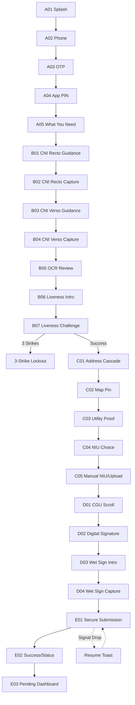

[//]: # (---)

[//]: # (stepsCompleted: [1, 2, 3, 4, 5, 6, 7, 8, 9, 10, 11, 12, 13, 14])

[//]: # (lastStep: 14)

[//]: # (inputDocuments:)

[//]: # (  - "_bmad-output/planning-artifacts/prd.md")

[//]: # (  - "_bmad-output/planning-artifacts/product-brief-bicec-veripass-2026-02-07.md")

[//]: # (  - "_bmad-output/planning-artifacts/research/research_report_kyc_bicec.md")

[//]: # (  - "_bmad-output/planning-artifacts/research/technical-Bicec-Veripass-research-2026-02-03.md")

[//]: # (  - "Document de Cadrage Projet.md")

[//]: # (  - "M1  Cadrage & Dataset.txt")

[//]: # (  - "README-bmad.md")

[//]: # (  - "_bmad-output/planning-artifacts/implementation-plan.md")

[//]: # (---)

# UX Design Specification bicec-veripass

**Author:** Ken
**Date:** 2026-02-09

---

## 1. Executive Summary

### Project Vision
**The Client Relationship Hub**: We are building a modern Client Relationship and Service Discovery platform (Revolut-styled) that transforms KYC onboarding into a premium entry point for personal banking. Our goal is to bridge the "Trust Gap" by turning a 14-day manual process into a **15-minute digital breakthrough (11-minute stretch goal)**, while educating users on BICEC's modern service ecosystem (Plans, Savings, Cards) during the validation period.

### Target Users
- **Marie (The Entrepreneur)**: Tech-savvy but resource-constrained. Fighting 3G drops and power cuts on an Android 7 device. Needs resilience and clear, non-jargon guidance.
- **Jean (The Guardian)**: Internal validator needing "side-by-side" evidence to perform 3-minute sanity checks with total audit trails.
- **Sylvie (The Commander)**: Manager needing R/Y/G operational health visibility and funnel analytics.

### Key Design Challenges
- **The Hardware Ceiling**: Maintaining >15 FPS camera guidance on legacy Android 7 (NFR2).
- **The Resilience Paradox**: Managing session persistence (NFR8) and chunked uploads (FR6) without adding UX friction.
- **The Compliance Burden**: Capturing CNI recto/verso, liveness, and multiple forms of signature (Wet + Digital) without overwhelming the user.

### Design Opportunities
- **Revolut-Grade Experience**: Bringing premium, confidence-building UI to the Cameroonian banking sector.
- **Evidence-First UX**: Turning a regulatory burden into a speed-to-market advantage by producing "evidence that screams."

---

## 2. Core User Experience

### Defining Experience
The bicec-veripass experience is defined by **Resilient Speed & Anticipated Value**. It must feel like a "safe passage" through a complex regulatory landscape that opens doors to immediate banking benefits. The **15-minute onboarding** is the primary entry point, optimized for zero data loss and maximum feature discovery.

### Platform Strategy
- **Mobile First**: Flutter-based app optimized for Android 7 (minSdk 24).
- **Tablet/Desktop Back-Office**: Web-based portal for agents, optimized for side-by-side evidence review.
- **Offline-First Resilience**: SQLite/Hive local persistence to handle "Délestage."

### Effortless Interactions
- **The Safety Net**: Automatic session resumption (<2s) prevents frustration.
- **Automated Capture**: Blur/glare detection handles the "heavy lifting" for Marie.
- **Bottom-Sheet Context**: Keeping secondary info tucked away but accessible.

### Critical Success Moments
- **The 15-Minute Breakthrough**: First-time completion of a digital account opening and service personalization.
- **The "Service Discovery" Spark**: Seeing high-fidelity banking previews (Ultra/Standard plans) while the dossier is PENDING, proving value immediately.
- **The "Saved Progress" Reassurance**: Recovering a session after a power failure without re-entering data.

### Experience Principles
1. **Revolut Structure, BICEC Soul**: Clean card layouts with vibrant #E37B03 highlights and premium neobank aesthetics.
2. **Discovery during Validation**: The UI stays "alive" while KYC is being processed, showcasing future account capabilities.
3. **Compliance-First, Evidence-First**: Designs that prioritize the creation of a bulletproof audit trail.
4. **Resilience as a Safety Net**: Failures are framed as "We saved your spot," not errors.

---

## 3. Desired Emotional Response

### Primary Emotional Goals
- **Protected, not Policed**: Compliance should feel like security, not surveillance.
- **Empowered & Confident**: Users feel they are making a smart business move with a Tier-1 bank.

### Emotional Journey Mapping
- **Entry**: Welcome and reassurance (Splash -> OTP).
- **Effort**: Focus and guidance (Capture -> Liveness).
- **Integrity**: Solemnity and commitment (Signatures -> Contract).
- **Submission**: Relief and anticipation (Progress -> Success).

### Micro-Emotions
- **Trust**: Generated by high-quality illustrations and BICEC branding.
- **Clarity**: Generated by confidence badges on OCR review.

### Design Implications
- Use **illustrative icons** to decouple from language barriers.
- **Vibrant Orange (#E37B03)** for primary actions to drive energy.
- **Soft card shadows** to provide depth and modern feel.

---

## 4. UX Pattern Analysis & Inspiration

### Inspiring Products Analysis
- **Revolut iOS (Latest)**: The "Gold Standard" for digital-first financial onboarding.
    - **Successes**: Card-based layouts, seamless transitions, and immediate feedback loops.
    - **Innovative Interactions**: Progressive disclosure (only showing what's needed), and confidence-building status toasts.

### Transferable UX Patterns
- **Card-Based Hierarchy**: Revolut's use of clean cards for data entry and review is ideal for BICEC's #E37B03 soul.
- **Progressive Bottom Sheets**: For supplementary info (e.g., "Why we need your NIU") to keep the main flow uncluttered.
- **Illustration-Driven Guidance**: Low-text, high-contrast 2D flat illustrations to overcome digital literacy barriers.

### Design Inspiration Strategy
- **Adopt**: The "clean and confident" Revoult interaction model.
- **Adapt**: For Cameroonian infrastructure (3G/Offline) and BICEC brand colors.
- **Avoid**: Dense text screens, jargon, and high-bandwidth-dependent animations.

---

## 5. Design System Strategy

### Visual DNA
- **Palette**: #E37B03 (Mango Orange) for primary buttons/highlights. WCAG AA-compliant Neutrals (Light Gray #F3F4F6, Dark Gray #1F2937).
- **Typography**: SF Pro (iOS) / Roboto (Android) for maximum performance on legacy devices.
- **Iconography**: Outline-style, high-contrast, easily identifiable.
- **Illustrations**: Flat 2D, vibrant, focused on physical document alignment.

### Interaction Patterns
- **Bottom Sheets**: Primary container for secondary choices and educational context.
- **Progress Indicator**: Subtle "Step X of Y" or timeline to build momentum.
- **Resilience UX**: Custom toast-style notifications: "Resuming session... We saved your progress."

---

## 6. Mobile Screen Inventory & Flow Map

### Journey Flow Map (Mermaid)

### Module A: Secure Entry & Context
| ID | Screen Name | Key UX Elements | FR/NFR Traceability |
| :--- | :--- | :--- | :--- |
| **A01** | Splash & Language | Logo, EN/FR toggle, Cold start <4s. | FR1, NFR3 |
| **A02** | Phone Number | +237 locked, numeric keypad. | FR1 |
| **A03** | OTP Verify | 6-digit input, SMS auto-read. | FR1, FR41 |
| **A04** | App PIN | 6-digit local PIN setup/confirm. | NFR4 |
| **A05** | "What You Need" | Checklist illustration, ~11 min timer. | NFR8 (Entry Point) |

### Module B: Identity & Liveness
| ID | Screen Name | Key UX Elements | FR/NFR Traceability |
| :--- | :--- | :--- | :--- |
| **B01** | CNI Recto Guidance | Tip-driven illustration (Glare/Blur). | FR2, NFR2 |
| **B02** | CNI Recto Capture | Camera overlay, auto-capture trigger. | FR2, FR20, NFR2 |
| **B03** | CNI Verso Guidance | Focus on the back of ID. | FR2, NFR2 |
| **B04** | CNI Verso Capture | Real-time quality guardrail. | FR2, FR20, NFR2 |
| **B05** | OCR Review | confidence badges (G/Y), edit pads. | FR5, FR24 |
| **B06** | Liveness Intro | Randomized challenge explanation. | FR3, FR4 |
| **B07** | Liveness Challenge | Video circle, active prompt guidance. | FR3, FR4, FR7 |

### Module C: Localization & Fiscal Identity
| ID | Screen Name | Key UX Elements | FR/NFR Traceability |
| :--- | :--- | :--- | :--- |
| **C01** | Address Cascade | Region -> Ville -> Quartier dropdowns. | FR9, FR10 |
| **C02** | Localiser mon domicile | Bouton "Utiliser ma position actuelle". | FR10, FR11 |
| **C03** | Utility Proof | ENEO/CAMWATER toggle, capture. | FR12, FR13 |
| **C04** | NIU Choice | Upload vs Manual Entry toggle. | FR14, FR15 |
| **C05** | Manual NIU | LimitedAccess warning bottom sheet. | FR16 |

### Module D: Consent & Signatures
| ID | Screen Name | Key UX Elements | FR/NFR Traceability |
| :--- | :--- | :--- | :--- |
| **D01** | CGU Scroll | Scroll gate, check-to-continue. | FR17 |
| **D02** | Digital Signature | Sign-on-glass canvas. | FR18 |
| **D03** | Wet Sign Intro | Physical paper prep instructions. | FR19 |
| **D04** | Wet Sign Capture | Multi-capture (3x) doc camera. | FR19 |

### Module E: Submission \u0026 Discovery (Plans \u0026 Personalization)
| ID | Screen Name | Key UX Elements | FR/NFR Traceability |
| :--- | :--- | :--- | :--- |
| **E01** | Secure Submission | Chunked progress (Step X of 4). | FR6, NFR8 |
| **E02** | Success / Status | "PENDING" status, Push explanation. | FR41, FR45 |
| **E03** | Plan Selection | Swipeable tab (Ultra/Premium/Standard). | FR39, FR47 |
| **E04** | Use-Case Selection | Chip/Tag selection for interests. | FR40, FR47 |

### Module F: Account Management Dashboard (Frontend Demo)
| ID | Screen Name | Key UX Elements | FR/NFR Traceability |
| :--- | :--- | :--- | :--- |
| **F01** | Home Dashboard | Main account, Pockets, Savings cards. | FR41, FR45 |
| **F02** | Account Detail | Add money, Withdraw, Goal tracking. | FR42, FR45 |
| **F03** | Cards Manager | Online, Virtual, ATM Finder map. | FR44, FR45 |
| **F04** | Linked Accounts | "See all bank accounts in one place". | FR41, FR47 |

### Module G: Feature Shells (Service Education)
| ID | Screen Name | Key UX Elements | FR/NFR Traceability |
| :--- | :--- | :--- | :--- |
| **G01** | Recurring Transfers | Schedule modal (Date, Frequency). | FR43, FR47 |
| **G02** | Add Money Flow | Payment amount, Confirm button (Blue). | FR42, FR47 |
| **G03** | Withdraw Flow | Greyed out state with compliance tooltip. | FR45, FR47 |

---

## 7. Low-Fidelity Wireframes: "Hard Screens"

### B02/B04: CNI Capture Layout
- **Header**: Back button, Progress Bar (Step 2 of 15+).
- **Body**: Active Camera View (Full screen).
- **Overlay**: 
    - Translucent dark mask with clear CNI-sized rectangle in center.
    - Animated alignment corners (Pulse Orange #E37B03 when aligned).
    - Top Banner: "Recto du CNI" / "Back of CNI".
    - Bottom Tip: "Alignez la carte dans le cadre. Évitez les reflets."
- **NFR Note**: Guidance overlays stay >15 FPS on Android 7 by using lean Flutter CustomPainters.

### B07: Liveness Challenge Layout
- **Header**: Progress Bar, "Vérification de présence".
- **Body**: Circular Camera View (User's face).
- **Prompt Card (Bottom Sheet style)**:
    - Randomized Prompt: "Tournez la tête à droite" / "Souriez".
    - Sequence indicator: 1 of 3 prompts.
    - 3-Strike Count: "Tentative 2 sur 3" (Only shown after first failure).
- **Lockout Screen**: (Shown after 3 strikes)
    - Icon: Locked/Grayed Face.
    - Message: "Désolé pour la gêne, mais pour des raisons techniques/de sécurité, nous sommes obligés de terminer cette session. Ne vous inquiétez pas, vous avez toujours la possibilité d'aller dans une agence locale proche de chez vous, ou de recommencer dès le début."
    - Primary CTA: [Recommencer] (#E37B03).
    - **Logic**: Data wiped AFTER clicking Recommencer.
- **Privacy Note (C02)**: "Nous collectons votre position GPS pour vérifier votre adresse à des fins de conformité. Ces données sont cryptées et jamais partagées (Enregistré pour des fins de contrôle réglementaire de KYC)."

### B05: OCR Review Layout
- **Header**: "Vérifiez vos informations".
- **Body**: Scrollable list of Cards.
    - Each card: [Field Label] - [Value Input Field] - [Confidence Badge].
    - confidence badges: `(Check)` Orange for low confidence, `(OK)` Green for high.
- **Footer**: Sticky CTA [Confirmer et Continuer].

### E03/E04: Plan \u0026 Use-Case Discovery
- **E03 (Plans)**:
    - **Header**: "Choose your plan".
    - **Body**: Swipeable horizontal cards (Revolut-styled).
        - **Ultra (Platinum)**: Highlights 4.75% interest, Lounge access.
        - **Standard**: "Free" with basic features.
    - **Footer**: [Start Trial / Continue] CTA.
- **E04 (Personalization)**:
    - **Header**: "What would you like to achieve?".
    - **Grid of Chips**: "Invest", "Save", "Budget", "Travel", "Daily Spending".
    - **Interactive**: Chips turn Orange #E37B03 on selection.

### F01/F03: Banking Dashboard \u0026 Cards (Status Gated)
- **F01 (Home Dashboard)**:
    - **Greeting**: "Bonjour Marie", Account Status Badge (e.g., "LIMITED_ACCESS").
    - **Balances**: Mock £0 balance with currency flag toggle.
    - **Locked States**: Padlock icon on "Invest" and "Crypto" tabs if status < FULL_ACCESS.
- **F03 (Cards)**:
    - **Visual**: Stack of virtual cards (Pink shopping card, Black virtual).
    - **Callout**: "Submit missing information" badge on card images if KYC pending.
    - **Secondary CTA**: [Reactivate terminated card] link at bottom.

### G01: Recurring Transfers Modal
- **Visual**: Minimalist calendar overlay.
- **Inputs**: [Select Start Date] -> [Select Frequency: Monthly/Weekly].
- **Summary Text**: "Monthly, starting on December 15, 2023" (Auto-updating).
- **CTA**: [Set schedule] (Bright Blue).

---

## 8. Back-Office Command Center Layouts

### Jean: Validation Desk
- **Queue Left Rail**: List of dossiers sorted by "Global Confidence". Alerts for SLA breach (Red/Yellow).
- **Side-by-Side View**:
    - **Left (Evidence)**: Carousel of high-res captures (CNI, Signature, Bill). Zoom-on-hover enabled.
    - **Right (Data)**: Extracted OCR fields with edit toggles. Audit trail mandatory for any change.
- **Bottom Panel**: Large [Approve] / [Reject] buttons with mandatory "Reason" dropdown for Rejections.

### Sylvie: Manager Dashboard
- **Top Row (Big Numbers)**: Avg Validation Time (SLA), Success Rate (FTR), active agents.
- **Funnel Graph**: Visual map of Marie's journey with drop-off percentages at each module (A-E).
- **System Health**: R/Y/G status of AI Services (OCR/Liveness) and API latency.

---

## 9. UI Direction Board (Style Guide)

- **Colors**:
    - Primary: #E37B03 (Mango Orange)
    - Action Color: #2563EB (Link Blue)
    - Success: #10B981 (Emerald)
    - Warning: #F59E0B (Amber)
- **Buttons**:
    - Big, rounded (R8), full-width primary CTAs with white text.
- **Cards**:
    - White background, #F9FAFB border, subtle (4px) shadow.
- **Typography**:
    - Headers: Roboto Medium (Android) / SF Pro Semibold (iOS).
    - Body: Roboto Regular / SF Pro Regular.
- **Iconography**:
    - Feather/Outline style, 24px default size.

---

## 10. Responsive Design & Accessibility

### Responsive Strategy
- **Mobile (Android 7 baseline)**: Full-bleed camera views, bottom-mounted primary actions for thumb reachability, and large touch targets (48x48dp).
- **Back-Office (Web/Tablet)**: Flexible 12-column grid. Agents use split-screen (50/50) for "Side-by-Side" evidence verification.

### Accessibility Strategy (WCAG AA)
- **Vision**: Contrast ratio >= 4.5:1 for all text. Dynamic text scaling support (except camera overlays).
- **Cognitive**: Step-by-step progressive disclosure. Illustration-first guidance to support low-literacy users.
- **Motor**: "Safe areas" around interactive elements; no complex multi-touch gestures required.

---

## 11. Copywriting Strategy (FR/NFR Traceable)

| Logic Area | Copywriting Principle | Example UX Copy (FR) |
| :--- | :--- | :--- |
| **Resilience (NFR8)** | Reassuring & Professional | "Nous avons sauvegardé votre progression. Reprise à l'étape [X]." |
| **Liveness (FR3/FR4)** | Direct & Simple | "Souriez à l'écran maintenant." (No technical jargon like "1:1 matching"). |
| **Gating (FR39)** | Value-Centric | "Finalisez votre compte pour débloquer les virements et cartes virtuelles." |
| **Errors (Module B)** | Solution-Oriented | "Image trop floue. Veuillez stabiliser votre téléphone." |

---

## 12. Visual Mockups

### CNI Capture Flow (B02)

*Revolut-styled interface optimized for Android 7. Features pulsing orange alignment corners and high-contrast French guidance.*

### Pending Dashboard & Gating (E03)

*High-fidelity banking shell showing the 'Pending' state. Active features like Cash-In are accessible, while premium features are greyed out with a contextual lock.*

### 13. Revolut UI Mapping Table
> [!NOTE]
> This table maps Revolut's premium design patterns to equivalent bicec-veripass screens to ensure a high-fidelity, neobank-grade user experience.

| Screen Name | Interaction Type | Description | Options | Error/Status State | Source Image |
| :--- | :--- | :--- | :--- | :--- | :--- |
| **CNI Capture** | Camera Overlay | Revolut-style doc scan with frame. | Auto-crop, Retry | "Stabilisez l'appareil" | Image 3 |
| **Liveness Selfie**| Facial Detection | Circular frame with pulsing blue guide. | Smile, Turn Head | "3 attempts remaining" | Image 5 |
| **Plan Selection** | Swipeable Tabs | Ultra/Metal/Premium tier comparison. | Start Trial, Skip | N/A | Image 1 |
| **Dashboard** | Card Grid | Gated features based on validation status. | Accounts, Pockets | "Locked" state badges | Image 2 |
| **Account View** | Detail Reveal | Main balance vs Pockets tracking. | Add Money, More | "LIMITED_ACCESS" banner | Image 4 |
| **Recurring Modal**| Modal Overlay | Minimalist date/freq selection. | Date Picker, Freq | N/A | Image (CSV) |

---
