[//]: # (---)

[//]: # (stepsCompleted: [1, 2, 3, 4, 5, 6, 7, 8, 9, 10, 11, 12, 13, 14])

[//]: # (lastStep: 14)

[//]: # (inputDocuments:)

[//]: # (  - "_bmad-output/planning-artifacts/prd.md")

[//]: # (  - "_bmad-output/planning-artifacts/product-brief-bicec-veripass-2026-02-07.md")

[//]: # (  - "_bmad-output/planning-artifacts/research/research_report_kyc_bicec.md")

[//]: # (  - "_bmad-output/planning-artifacts/research/technical-Bicec-Veripass-research-2026-02-03.md")

[//]: # (  - "Document de Cadrage Projet.md")

[//]: # (  - "M1  Cadrage & Dataset.txt")

[//]: # (  - "README-bmad.md")

[//]: # (  - "_bmad-output/planning-artifacts/implementation-plan.md")

[//]: # (---)

# UX Design Specification bicec-veripass

**Author:** Ken
**Date:** 2026-02-09

---

## 1. Executive Summary

### Project Vision
**The Client Relationship Hub**: We are building a modern Client Relationship and Service Discovery platform (Revolut-styled) that transforms KYC onboarding into a premium entry point for personal banking. Our goal is to bridge the "Trust Gap" by turning a 14-day manual process into a **15-minute digital breakthrough (11-minute stretch goal)**, while educating users on BICEC's modern service ecosystem (Plans, Savings, Cards) during the validation period.

### Target Users
- **Marie (The Entrepreneur)**: Tech-savvy but resource-constrained. Fighting 3G drops and power cuts on an Android 7 device. Needs resilience and clear, non-jargon guidance.
- **Jean (The Guardian)**: Internal validator needing "side-by-side" evidence to perform 3-minute sanity checks with total audit trails.
- **Sylvie (The Commander)**: Manager needing R/Y/G operational health visibility and funnel analytics.

### Key Design Challenges
- **The Hardware Ceiling**: Maintaining >15 FPS camera guidance on legacy Android 7 (NFR2).
- **The Resilience Paradox**: Managing session persistence (NFR8) and chunked uploads (FR6) without adding UX friction.
- **The Compliance Burden**: Capturing CNI recto/verso, liveness, and multiple forms of signature (Wet + Digital) without overwhelming the user.

### Design Opportunities
- **Revolut-Grade Experience**: Bringing premium, confidence-building UI to the Cameroonian banking sector.
- **Evidence-First UX**: Turning a regulatory burden into a speed-to-market advantage by producing "evidence that screams."

---

## 2. Core User Experience

### Defining Experience
The bicec-veripass experience is defined by **Resilient Speed & Anticipated Value**. It must feel like a "safe passage" through a complex regulatory landscape that opens doors to immediate banking benefits. The **15-minute onboarding** is the primary entry point, optimized for zero data loss and maximum feature discovery.

### Platform Strategy
- **Mobile First**: Flutter-based app optimized for Android 7 (minSdk 24).
- **Tablet/Desktop Back-Office**: Web-based portal for agents, optimized for side-by-side evidence review.
- **Offline-First Resilience**: SQLite/Hive local persistence to handle "Délestage."

### Effortless Interactions
- **The Safety Net**: Automatic session resumption (<2s) prevents frustration.
- **Automated Capture**: Blur/glare detection handles the "heavy lifting" for Marie.
- **Bottom-Sheet Context**: Keeping secondary info tucked away but accessible.

### Critical Success Moments
- **The 15-Minute Breakthrough**: First-time completion of a digital account opening and service personalization.
- **The "Dual Auth Setup"**: Collecting and verifying both phone (SMS) and email during onboarding enables flexible login options (phone OR email + code).
- **The "Service Discovery" Spark**: Seeing high-fidelity banking previews (Ultra/Standard plans) while the dossier is PENDING, proving value immediately.
- **The "Saved Progress" Reassurance**: Recovering a session after a power failure without re-entering data.

### Experience Principles
1. **Revolut Structure, BICEC Soul**: Clean card layouts with vibrant #E37B03 highlights and premium neobank aesthetics.
2. **Discovery during Validation**: The UI stays "alive" while KYC is being processed, showcasing future account capabilities.
3. **Compliance-First, Evidence-First**: Designs that prioritize the creation of a bulletproof audit trail.
4. **Resilience as a Safety Net**: Failures are framed as "We saved your spot," not errors.

---

## 3. Desired Emotional Response

### Primary Emotional Goals
- **Protected, not Policed**: Compliance should feel like security, not surveillance.
- **Empowered & Confident**: Users feel they are making a smart business move with a Tier-1 bank.

### Emotional Journey Mapping
- **Entry**: Welcome and reassurance (Splash -> OTP).
- **Effort**: Focus and guidance (Capture -> Liveness).
- **Integrity**: Solemnity and commitment (Signatures -> Contract).
- **Submission**: Relief and anticipation (Progress -> Success).

### Micro-Emotions
- **Trust**: Generated by high-quality illustrations and BICEC branding.
- **Clarity**: Generated by confidence badges on OCR review.

### Design Implications
- Use **illustrative icons** to decouple from language barriers.
- **Vibrant Orange (#E37B03)** for primary actions to drive energy.
- **Soft card shadows** to provide depth and modern feel.

---

## 4. UX Pattern Analysis & Inspiration

### Inspiring Products Analysis
- **Revolut iOS (Latest)**: The "Gold Standard" for digital-first financial onboarding.
    - **Successes**: Card-based layouts, seamless transitions, immediate feedback loops.
    - **Innovative Interactions**: Progressive disclosure, confidence-building status toasts, celebration moments.
    - **Adopted Patterns**: Success animations after each capture, inline editing, biometric opt-in.
    
- **Nubank (Brazil/Mexico)**: Master of emotional onboarding in emerging markets.
    - **Successes**: Confetti celebrations, plain language, helpful microcopy, trust-building through transparency.
    - **Innovative Interactions**: Progress timeline, "Why we need this" explanations, delight moments.
    - **Adopted Patterns**: Welcome value prop screen, success celebration, progress stepper.
    
- **Trade Republic (Germany)**: Minimalist efficiency with premium feel.
    - **Successes**: Clean UI, fast KYC flow, smart defaults, minimal friction.
    - **Innovative Interactions**: Auto-capture with real-time feedback, smart form validation.
    - **Adopted Patterns**: Capture success feedback, inline data review, biometric security.

### Transferable UX Patterns (Expanded)
- **Card-Based Hierarchy**: Revolut's clean cards for data entry and review, adapted with BICEC's #E37B03 accents.
- **Progressive Bottom Sheets**: For supplementary info (e.g., "Why we need your NIU") to keep main flow uncluttered.
- **Illustration-Driven Guidance**: Low-text, high-contrast 2D flat illustrations to overcome digital literacy barriers.
- **Celebration Moments**: Nubank's confetti animations and success messages to build emotional connection.
- **Progress Transparency**: Trade Republic's visual stepper to reduce anxiety about process length.
- **Inline Editing**: Revolut's tap-to-edit pattern for OCR review instead of separate edit modes.
- **Smart Defaults**: Pre-selecting most common options (e.g., Standard plan) to reduce decision fatigue.
- **Biometric Opt-in**: Offering Face ID/Fingerprint after PIN setup, not forcing it upfront.
- **Legal Clarity**: Checkbox consent with hyperlinks instead of forced scrolling through dense text.
- **Micro-feedback**: Immediate visual/haptic feedback on every successful action (capture, validation, etc.).

### Design Inspiration Strategy (Enhanced)
- **Adopt from Revolut**: Card layouts, inline editing, biometric security, real-time validation.
- **Adopt from Nubank**: Celebration moments, plain language, progress transparency, trust-building microcopy.
- **Adopt from Trade Republic**: Minimalist efficiency, auto-capture feedback, smart defaults.
- **Adapt for Cameroon**: 3G-optimized animations, offline-first architecture, French/English bilingual, BICEC brand colors (#E37B03).
- **Avoid**: Dense legal text, forced scrolling, high-bandwidth animations, complex multi-step forms, jargon-heavy copy.
- **Innovate**: Combine Revolut's premium feel + Nubank's emotional warmth + Trade Republic's efficiency, tailored for Cameroonian banking context.

---

## 5. Design System Strategy

### Visual DNA
- **Palette**: #E37B03 (Mango Orange) for primary buttons/highlights. WCAG AA-compliant Neutrals (Light Gray #F3F4F6, Dark Gray #1F2937).
- **Typography**: SF Pro (iOS) / Roboto (Android) for maximum performance on legacy devices.
- **Iconography**: Outline-style, high-contrast, easily identifiable.
- **Illustrations**: Flat 2D, vibrant, focused on physical document alignment.

### Interaction Patterns
- **Bottom Sheets**: Primary container for secondary choices and educational context.
- **Progress Indicator**: Subtle "Step X of Y" or timeline to build momentum.
- **Resilience UX**: Custom toast-style notifications: "Resuming session... We saved your progress."

---

## 6. Mobile Screen Inventory & Flow Map

### Journey Flow Map (Mermaid)

```mermaid
graph TD
    %% Entry & Authentication
    A01[A01 Splash & Language] --> A02[A02 Welcome Value Prop]
    A02 --> A03[A03 Phone Entry]
    A03 --> A04[A04 OTP Verify Phone]
    A04 --> A05[A05 Email Entry]
    A05 --> A06[A06 Email Verification]
    A06 --> A07[A07 App PIN Setup]
    A07 --> A08[A08 Biometric Opt-in]
    
    %% Onboarding Context
    A08 --> A09[A09 What You Need]
    A09 --> A10[A10 Progress Timeline]
    
    %% Identity Capture
    A10 --> B01[B01 CNI Intro]
    B01 --> B02[B02 CNI Recto Guidance]
    B02 --> B03[B03 CNI Recto Capture]
    B03 --> B04[B04 Capture Success]
    B04 --> B05[B05 CNI Verso Guidance]
    B05 --> B06[B06 CNI Verso Capture]
    B06 --> B07[B07 OCR Processing]
    B07 --> B08[B08 Data Review & Edit]
    
    %% Liveness
    B08 --> B09[B09 Liveness Intro]
    B09 --> B10[B10 Liveness Challenge]
    B10 -->|3 Strikes| B10_Fail[Lockout & Support]
    B10 -->|Success| B11[B11 Liveness Success]
    
    %% Address & Fiscal
    B11 --> C01[C01 Address Cascade]
    C01 --> C02[C02 GPS Location]
    C02 --> C03[C03 Utility Proof Intro]
    C03 --> C04[C04 Utility Capture]
    C04 --> C05[C05 NIU Choice]
    C05 --> C06[C06 NIU Entry/Upload]
    
    %% Legal & Consent
    C06 --> D01[D01 Legal Consent]
    D01 --> D02[D02 Digital Signature]
    D02 --> D03[D03 Wet Sign Intro]
    D03 --> D04[D04 Wet Sign Capture]
    
    %% Submission & Discovery
    D04 --> E01[E01 Review Summary]
    E01 --> E02[E02 Secure Upload]
    E02 --> E03[E03 Success Celebration]
    E03 --> E04[E04 Plan Discovery]
    E04 --> E05[E05 Personalization]
    E05 --> E06[E06 Pending Dashboard]

    %% Resilience & Recovery
    E02 -.->|Network Drop| E02_Retry[Auto Resume]
    E02_Retry -.-> E02
    
    %% Exit Points
    B10_Fail --> Z01[Branch Redirect]
    
    style A01 fill:#E37B03,stroke:#333,stroke-width:2px,color:#fff
    style E03 fill:#10B981,stroke:#333,stroke-width:2px,color:#fff
    style E06 fill:#2563EB,stroke:#333,stroke-width:2px,color:#fff
```

### Module A: Secure Entry & Context (Enhanced - Revolut/Nubank Pattern)
| ID | Screen Name | Key UX Elements | FR/NFR Traceability |
| :--- | :--- | :--- | :--- |
| **A01** | Splash & Language | BICEC logo animation, EN/FR toggle, Cold start <4s. | FR1, NFR3 |
| **A02** | Welcome Value Prop | Hero illustration + 3 value pillars (Speed/Security/Modern). | NFR8, Marketing |
| **A03** | Phone Entry | +237 locked, numeric keypad, "Déjà client?" link. | FR1 |
| **A04** | OTP Verify (Phone) | 6-digit auto-fill, SMS auto-read, Resend timer. | FR1, FR41 |
| **A05** | Email Entry | Email input with validation, "Hide My Email" option. | FR1, FR41 |
| **A06** | Email Verification | 6-digit code or link verification, Resend timer. | FR1, FR41 |
| **A07** | PIN Setup | 6-digit PIN with strength indicator, Confirm screen. | NFR4 |
| **A08** | Biometric Opt-in | Face ID/Fingerprint toggle, "Skip for now" option. | NFR4 (Enhanced) |
| **A09** | What You Need | Checklist with icons, ~11 min estimate, "Let's go" CTA. | NFR8 |
| **A10** | Progress Timeline | Visual stepper (Identity → Address → Legal → Done). | NFR8, UX |

### Module B: Identity & Liveness (Enhanced - Trade Republic Pattern)
| ID | Screen Name | Key UX Elements | FR/NFR Traceability |
| :--- | :--- | :--- | :--- |
| **B01** | CNI Intro | Illustration + "Why we need this" explanation. | FR2, UX |
| **B02** | CNI Recto Guidance | Animated tips (Glare/Blur/Alignment), "Got it" CTA. | FR2, NFR2 |
| **B03** | CNI Recto Capture | Camera overlay, auto-capture, real-time feedback. | FR2, FR20, NFR2 |
| **B04** | Capture Success | Green checkmark animation, "Great!" message. | UX, Feedback |
| **B05** | CNI Verso Guidance | "Now the back side" with flip animation. | FR2, NFR2 |
| **B06** | CNI Verso Capture | Same quality guardrails, auto-capture. | FR2, FR20, NFR2 |
| **B07** | OCR Processing | Loading animation with "Analyzing..." message. | FR5, UX |
| **B08** | Data Review & Edit | Confidence badges, inline editing, smart validation. | FR5, FR24 |
| **B09** | Liveness Intro | "Quick selfie check" with privacy reassurance. | FR3, FR4 |
| **B10** | Liveness Challenge | Circular frame, randomized prompts, 3-strike system. | FR3, FR4, FR7 |
| **B11** | Liveness Success | Success animation, "Identity verified!" message. | UX, Feedback |

### Module C: Localization & Fiscal Identity
| ID | Screen Name | Key UX Elements | FR/NFR Traceability |
| :--- | :--- | :--- | :--- |
| **C01** | Address Cascade | Region -> Ville -> Quartier dropdowns. | FR9, FR10 |
| **C02** | Localiser mon domicile | Bouton "Utiliser ma position actuelle". | FR10, FR11 |
| **C03** | Utility Proof | ENEO/CAMWATER toggle, capture. | FR12, FR13 |
| **C04** | NIU Choice | Upload vs Manual Entry toggle. | FR14, FR15 |
| **C05** | Manual NIU | LimitedAccess warning bottom sheet. | FR16 |

### Module D: Consent & Signatures
| ID | Screen Name | Key UX Elements | FR/NFR Traceability |
| :--- | :--- | :--- | :--- |
| **D01** | CGU Acceptance | Checkbox consent with hyperlinks to legal docs. | FR17 |
| **D02** | Digital Signature | Sign-on-glass canvas. | FR18 |
| **D03** | Wet Sign Intro | Physical paper prep instructions. | FR19 |
| **D04** | Wet Sign Capture | Multi-capture (3x) doc camera. | FR19 |

### Module E: Submission & Discovery (Enhanced - Nubank Celebration Pattern)
| ID | Screen Name | Key UX Elements | FR/NFR Traceability |
| :--- | :--- | :--- | :--- |
| **E01** | Review Summary | Final checklist of all captured data, "Submit" CTA. | FR6, UX |
| **E02** | Secure Upload | Chunked progress with file names, resilient retry. | FR6, NFR8 |
| **E03** | Success Celebration | Confetti animation, "Compte créé!" hero message. | UX, Delight |
| **E04** | Plan Discovery | Swipeable cards (Ultra/Premium/Standard), "Explore" CTA. | FR39, FR47 |
| **E05** | Personalization | Interest chips (Invest/Save/Travel), multi-select. | FR40, FR47 |
| **E06** | Pending Dashboard | Limited access view, "Validation in progress" banner. | FR41, FR45 |

### Module F: Account Management Dashboard (Frontend Demo)
| ID | Screen Name | Key UX Elements | FR/NFR Traceability |
| :--- | :--- | :--- | :--- |
| **F01** | Home Dashboard | Main account, Pockets, Savings cards. | FR41, FR45 |
| **F02** | Account Detail | Add money, Withdraw, Goal tracking. | FR42, FR45 |
| **F03** | Cards Manager | Online, Virtual, ATM Finder map. | FR44, FR45 |
| **F04** | Linked Accounts | "See all bank accounts in one place". | FR41, FR47 |

### Module G: Feature Shells (Service Education)
| ID | Screen Name | Key UX Elements | FR/NFR Traceability |
| :--- | :--- | :--- | :--- |
| **G01** | Recurring Transfers | Schedule modal (Date, Frequency). | FR43, FR47 |
| **G02** | Add Money Flow | Payment amount, Confirm button (Blue). | FR42, FR47 |
| **G03** | Withdraw Flow | Greyed out state with compliance tooltip. | FR45, FR47 |

---

## 7. Low-Fidelity Wireframes: "Hard Screens" (Revolut/Nubank-Inspired)

### A02: Welcome Value Prop (New - Nubank Pattern)
- **Layout**: Full-screen hero with gradient background (#E37B03 to lighter orange).
- **Hero Illustration**: Modern 3D illustration of mobile banking (person with phone + floating cards).
- **Headline**: "Votre banque moderne, en 15 minutes" (Bold, 28px).
- **Value Pillars** (3 cards stacked):
    1. Icon: Lightning bolt. Text: "Ouverture rapide - 15 min chrono"
    2. Icon: Shield. Text: "Sécurité bancaire de niveau 1"
    3. Icon: Sparkles. Text: "Services modernes - Cartes, Épargne, Investissement"
- **CTA**: Large button "Commencer" (#E37B03, white text).
- **Footer**: Small text "Déjà client? Se connecter" (link).
- **UX Note**: This screen builds trust and sets expectations before asking for phone number.

### A08: Progress Timeline (New - Trade Republic Pattern)
- **Header**: "Votre progression" with close button.
- **Body**: Vertical stepper with 4 stages:
    1. ✓ Identité (Completed - Green)
    2. → Adresse (Current - Orange pulse)
    3. ○ Documents légaux (Upcoming - Gray)
    4. ○ Finalisation (Upcoming - Gray)
- **Each Stage**: Icon + Label + Estimated time (e.g., "~3 min").
- **Bottom**: "Temps restant: ~8 minutes" with progress bar.
- **CTA**: "Continuer" button.
- **UX Note**: Provides orientation and reduces anxiety about process length.

### A05: Email Entry (New - Onboarding Pattern)
- **Layout**: Full-screen white background.
- **Header**: "Créez votre compte" (Bold, 34px, left-aligned, 24px margins, 80px from top).
- **Subtitle**: "Entrez votre adresse email" (Gray #6B7280, 17px, 8px below title).
- **Email Field**: 56px height, light gray background (#F5F5F5), rounded corners 12px, 32px below subtitle.
    - Left: Envelope icon gray 20px, 16px from edge
    - Center: Input placeholder "exemple@mail.com" gray medium 17px, padding left 48px
    - Right: Clear button (X) gray circle 24px when filled
- **Suggestion**: "Hide My Email" button blue (#0075FF) 15px, Apple icon 16px left, 16px below field
- **Primary CTA**: "Continuer" orange (#E37B03) 100% width 56px rounded corners 28px, 24px below suggestion, disabled (40% opacity) if empty
- **Keyboard**: Email keyboard iOS native 40% bottom screen with @ and . keys
- **Validation**: Real-time email format, red border if invalid
- **UX Note**: Collects email for dual authentication (phone + email) enabling login flexibility.

### A06: Email Verification (New - OTP Pattern)
- **Layout**: Full-screen white background.
- **Header**: Back button 44px top left.
- **Title**: "Code à 6 chiffres" (Bold, 32px, left-aligned, 24px margins, 80px from top).
- **Subtitle**: "Entrez le code envoyé à votre email" (Gray 17px, 8px below title).
- **OTP Fields**: 6 squares 56px×56px spaced 8px horizontally, centered, light gray background (#F5F5F5), rounded corners 12px.
    - Visual format: XXX-XXX (dash separator between 3rd and 4th)
    - Empty state: gray border 1px
    - Focus state: orange border 2px (#E37B03)
    - Filled state: black bold digit 24px centered
- **Keyboard**: Numeric keyboard iOS native 40% bottom screen
- **Auto-focus**: First field, automatic progression
- **Email Auto-read**: Automatic code detection from email (iOS/Android)
- **Timer**: "Renvoyer le code dans 00:17" gray 15px centered, 24px below fields, countdown active
- **Resend Link**: Becomes "Renvoyer le code" orange clickable when timer = 00:00
- **Validation**: Auto-submit after 6th digit
- **Alternative**: "Vérifier via lien email" link gray 15px, 16px below timer
- **UX Note**: Dual verification method (code or link) for flexibility. Email verified = login via email enabled.

### A08: Progress Timeline (New - Trade Republic Pattern)
- **Header**: "Votre progression" with close button.
- **Body**: Vertical stepper with 4 stages:
    1. ✓ Identité (Completed - Green)
    2. → Adresse (Current - Orange pulse)
    3. ○ Documents légaux (Upcoming - Gray)
    4. ○ Finalisation (Upcoming - Gray)
- **Each Stage**: Icon + Label + Estimated time (e.g., "~3 min").
- **Bottom**: "Temps restant: ~8 minutes" with progress bar.
- **CTA**: "Continuer" button.
- **UX Note**: Provides orientation and reduces anxiety about process length.

### B04: Capture Success (New - Revolut Feedback Pattern)
- **Layout**: Full-screen with blurred captured image as background.
- **Center**: Large green checkmark animation (scale + fade in).
- **Message**: "Parfait!" (Bold, 24px, centered).
- **Sub-message**: "Recto de votre CNI capturé" (Regular, 16px).
- **Auto-transition**: After 1.5s, automatically proceeds to next screen.
- **UX Note**: Immediate positive feedback builds confidence and momentum.

## 7. Low-Fidelity Wireframes: "Hard Screens"

### B02/B04: CNI Capture Layout
- **Header**: Back button, Progress Bar (Step 2 of 15+).
- **Body**: Active Camera View (Full screen).
- **Overlay**: 
    - Translucent dark mask with clear CNI-sized rectangle in center.
    - Animated alignment corners (Pulse Orange #E37B03 when aligned).
    - Top Banner: "Recto du CNI" / "Back of CNI".
    - Bottom Tip: "Alignez la carte dans le cadre. Évitez les reflets."
- **NFR Note**: Guidance overlays stay >15 FPS on Android 7 by using lean Flutter CustomPainters.

### B07: Liveness Challenge Layout
- **Header**: Progress Bar, "Vérification de présence".
- **Body**: Circular Camera View (User's face).
- **Prompt Card (Bottom Sheet style)**:
    - Randomized Prompt: "Tournez la tête à droite" / "Souriez".
    - Sequence indicator: 1 of 3 prompts.
    - 3-Strike Count: "Tentative 2 sur 3" (Only shown after first failure).
- **Lockout Screen**: (Shown after 3 strikes)
    - Icon: Locked/Grayed Face.
    - Message: "Désolé pour la gêne, mais pour des raisons techniques/de sécurité, nous sommes obligés de terminer cette session. Ne vous inquiétez pas, vous avez toujours la possibilité d'aller dans une agence locale proche de chez vous, ou de recommencer dès le début."
    - Primary CTA: [Recommencer] (#E37B03).
    - **Logic**: Data wiped AFTER clicking Recommencer.
- **Privacy Note (C02)**: "Nous collectons votre position GPS pour vérifier votre adresse à des fins de conformité. Ces données sont cryptées et jamais partagées (Enregistré pour des fins de contrôle réglementaire de KYC)."

### D01: Legal Consent Layout (Improved - Nubank/Revolut Style)
- **Header**: "Dernière étape légale" with progress indicator.
- **Body**: Clean card layout with checkboxes (NOT scroll-gate).
    - **Checkbox 1**: "J'accepte les [Conditions Générales d'Utilisation](https://www.groupebcp.com/fr/Pages/conditions-generales-utilisation.aspx)" (Hyperlink in blue #2563EB).
    - **Checkbox 2**: "J'accepte la [Politique de Confidentialité](https://www.groupebcp.com/fr/Pages/politique-confidentialite.aspx)" (Hyperlink).
    - **Checkbox 3**: "J'accepte les [Conditions Tarifaires](https://www.groupebcp.com/fr/Pages/tarifs.aspx)" (Hyperlink).
    - **Optional Checkbox**: "Je souhaite recevoir des offres personnalisées par email" (Marketing opt-in, unchecked by default).
- **Legal Note**: Small gray text "En continuant, vous confirmez avoir lu et compris ces documents."
- **Footer**: Sticky CTA [Accepter et Continuer] (Disabled until all required checkboxes checked).
- **UX Principle**: Following Revolut/Trade Republic pattern - NO forced scrolling, just clear consent with accessible links.

### B08: OCR Review Layout (Enhanced)
- **Header**: "Vérifiez vos informations" with edit icon.
- **Body**: Scrollable list of Cards with confidence indicators.
    - Each card: [Field Label] - [Value Input Field] - [Confidence Badge].
    - Confidence badges: Orange warning icon for low confidence, Green checkmark for high.
    - **Inline Edit**: Tap any field to edit directly (no separate edit mode).
- **Smart Validation**: Real-time format checking (e.g., CNI number format).
- **Footer**: Sticky CTA [Confirmer et Continuer].

### E03: Success Celebration (New - Nubank Delight Pattern)
- **Layout**: Full-screen with animated confetti particles.
- **Hero Icon**: Large checkmark in circle (Green #10B981), scale animation.
- **Headline**: "Félicitations!" (Bold, 32px, centered).
- **Message**: "Votre compte BICEC est créé" (Regular, 18px).
- **Sub-message**: "Nous validons vos informations. Vous recevrez une notification dans 24-48h."
- **Illustration**: Happy person with phone (bottom third of screen).
- **CTA**: "Découvrir mes services" (Orange button).
- **UX Note**: Celebrates the achievement and sets clear expectations for next steps.

### E04/E05: Plan & Use-Case Discovery (Enhanced)
- **E04 (Plans)**:
    - **Header**: "Choisissez votre formule" with "Skip" link.
    - **Body**: Horizontal swipeable cards (Revolut-styled):
        - **Ultra**: Purple gradient, "4.75% d'intérêt", "Accès salons", Badge "Recommandé".
        - **Premium**: Blue gradient, "3% d'intérêt", "Protection achats 2,500 FCFA".
        - **Standard**: Gray gradient, "Gratuit", "L'essentiel bancaire", Badge "Actif".
    - **Pagination Dots**: Below cards to show position.
    - **Footer**: [Commencer l'essai gratuit] or [Continuer avec Standard].
- **E05 (Personalization)**:
    - **Header**: "Qu'aimeriez-vous faire?" with subtitle "Sélectionnez vos intérêts".
    - **Grid of Chips** (2 columns, scrollable):
        - Row 1: "💰 Épargner", "📈 Investir"
        - Row 2: "💳 Payer", "✈️ Voyager"
        - Row 3: "🏠 Budgéter", "🎓 Éducation"
    - **Interactive**: Selected chips have Orange background + white text.
    - **Footer**: "Continuer" button (enabled after 1+ selection).

### F01/F03: Banking Dashboard \u0026 Cards (Status Gated)
- **F01 (Home Dashboard)**:
    - **Greeting**: "Bonjour Marie", Account Status Badge (e.g., "LIMITED_ACCESS").
    - **Balances**: Mock 0FCFA balance with currency flag toggle.
    - **Allowed**: Cash-In card active.
    - **Locked States**: Padlock icon + tooltip "Finalisez votre NIU pour débloquer" on "Invest", "Crypto" tabs if status is `LIMITED_ACCESS`.
- **F03 (Cards)**:
    - **Visual**: Stack of virtual cards (Pink shopping card, Black virtual).
    - **Callout**: "Submit missing information" badge on card images if KYC pending.
    - **Secondary CTA**: [Reactivate terminated card] link at bottom.

### G01: Recurring Transfers Modal
- **Visual**: Minimalist calendar overlay.
- **Inputs**: [Select Start Date] -> [Select Frequency: Monthly/Weekly].
- **Summary Text**: "Monthly, starting on December 15, 2023" (Auto-updating).
- **CTA**: [Set schedule] (Bright Blue).

---

## 8. Back-Office Command Center Layouts

### Jean: Validation Desk
- **Queue Left Rail**: List of dossiers sorted by "Global Confidence". Alerts for SLA breach (Red/Yellow).
- **Side-by-Side View**:
    - **Left (Evidence)**: Carousel of high-res captures (CNI, Signature, Bill). Zoom-on-hover enabled.
    - **Right (Data)**: Extracted OCR fields with edit toggles. Audit trail mandatory for any change.
- **Bottom Panel**: Large [Approve] / [Reject] buttons with mandatory "Reason" dropdown for Rejections.

### Sylvie: Manager Dashboard
- **Top Row (Big Numbers)**: Avg Validation Time (SLA), Success Rate (FTR), active agents.
- **Funnel Graph**: Visual map of Marie's journey with drop-off percentages at each module (A-E).
- **System Health**: R/Y/G status of AI Services (OCR/Liveness) and API latency.

---

## 9. UI Direction Board (Style Guide)

- **Colors**:
    - Primary: #E37B03 (Mango Orange)
    - Action Color: #2563EB (Link Blue)
    - Success: #10B981 (Emerald)
    - Warning: #F59E0B (Amber)
- **Buttons**:
    - Big, rounded (R8), full-width primary CTAs with white text.
- **Cards**:
    - White background, #F9FAFB border, subtle (4px) shadow.
- **Typography**:
    - Headers: Roboto Medium (Android) / SF Pro Semibold (iOS).
    - Body: Roboto Regular / SF Pro Regular.
- **Iconography**:
    - Feather/Outline style, 24px default size.

---

## 10. Responsive Design & Accessibility

### Responsive Strategy
- **Mobile (Android 7 baseline)**: Full-bleed camera views, bottom-mounted primary actions for thumb reachability, and large touch targets (48x48dp).
- **Back-Office (Web/Tablet)**: Flexible 12-column grid. Agents use split-screen (50/50) for "Side-by-Side" evidence verification.

### Accessibility Strategy (WCAG AA)
- **Vision**: Contrast ratio >= 4.5:1 for all text. Dynamic text scaling support (except camera overlays).
- **Cognitive**: Step-by-step progressive disclosure. Illustration-first guidance to support low-literacy users.
- **Motor**: "Safe areas" around interactive elements; no complex multi-touch gestures required.

---

## 11. Copywriting Strategy (FR/NFR Traceable)

| Logic Area | Copywriting Principle | Example UX Copy (FR) | Inspiration |
| :--- | :--- | :--- | :--- |
| **Welcome (A02)** | Aspirational & Clear | "Votre banque moderne, en 15 minutes" | Nubank |
| **Email Collection (A05)** | Reassuring & Flexible | "Votre email vous permettra de vous connecter facilement" | Revolut |
| **Email Verification (A06)** | Clear & Alternative | "Code envoyé à votre email. Vous pouvez aussi cliquer sur le lien." | Trade Republic |
| **Resilience (NFR8)** | Reassuring & Professional | "Nous avons sauvegardé votre progression. Reprise à l'étape [X]." | Revolut |
| **Liveness (FR3/FR4)** | Direct & Simple | "Souriez à l'écran maintenant." (No jargon like "1:1 matching") | Trade Republic |
| **Success (E03)** | Celebratory & Clear | "Félicitations! Votre compte BICEC est créé." | Nubank |
| **Gating (FR39)** | Value-Centric | "Finalisez votre compte pour débloquer les virements et cartes virtuelles." | Revolut |
| **Errors (Module B)** | Solution-Oriented | "Image trop floue. Veuillez stabiliser votre téléphone." | Trade Republic |
| **Legal (D01)** | Transparent & Accessible | "J'accepte les [Conditions Générales]" (hyperlink, not scroll-gate) | Revolut |
| **Progress (A08)** | Motivating & Specific | "Temps restant: ~8 minutes" | Nubank |

---

## 12. Visual Mockups

### CNI Capture Flow (B02)

*Revolut-styled interface optimized for Android 7. Features pulsing orange alignment corners and high-contrast French guidance.*

### Pending Dashboard & Gating (E03)

*High-fidelity banking shell showing the 'Pending' state. Active features like Cash-In are accessible, while premium features are greyed out with a contextual lock.*

### 13. Revolut UI Mapping Table
> [!NOTE]
> This table maps Revolut's premium design patterns to equivalent bicec-veripass screens to ensure a high-fidelity, neobank-grade user experience.

| Screen Name | Interaction Type | Description | Options | Error/Status State | Source Image |
| :--- | :--- | :--- | :--- | :--- | :--- |
| **CNI Capture** | Camera Overlay | Revolut-style doc scan with frame. | Auto-crop, Retry | "Stabilisez l'appareil" | Image 3 |
| **Liveness Selfie**| Facial Detection | Circular frame with pulsing blue guide. | Smile, Turn Head | "3 attempts remaining" | Image 5 |
| **Plan Selection** | Swipeable Tabs | Ultra/Metal/Premium tier comparison. | Start Trial, Skip | N/A | Image 1 |
| **Dashboard** | Card Grid | Gated features based on validation status. | Accounts, Pockets | "Locked" state badges | Image 2 |
| **Account View** | Detail Reveal | Main balance vs Pockets tracking. | Add Money, More | "LIMITED_ACCESS" banner | Image 4 |
| **Recurring Modal**| Modal Overlay | Minimalist date/freq selection. | Date Picker, Freq | N/A | Image (CSV) |

---
