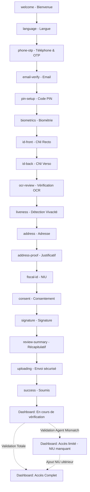

# UX/UI Inventory & Stitch Prompts — bicec-veripass (v2.1)

> **Version**: 2.1 — Intègre retours de revue du 2026-02-22  
> **Personas** : Marie (Mobile), Jean (Agent Agence), Thomas (Superviseur National AML/CFT), Sylvie (Direction)  
> **Palette BICEC** : Orange Primaire `#E37B03` (Cercle logo), Brun Foncé `#4A2205` (Cheval logo), Bleu d'Action `#2563EB`  
> **Typo** : Inter / Sans-serif · Icônes : Lucide (outline)  
> **Composants Prototype** : Logos carrés coins arrondis (3xl), listes avec icônes Lucide, inputs OTP segmentés  

---

## 1. Décisions & Hypothèses

| # | Décision | Justification |
|---|---|---|
| 1 | **Auto-extraction Paradigm** : L'IA extrait, Marie confirme/corrige. Pas de formulaire vide. | Badges Vert/Orange/Rouge selon confiance OCR. Réduit erreurs saisie. |
| 2 | **Résilience Offline-first** : Cache SQLite, chunked uploads, autosave, reprise de session. | Délestages fréquents au Cameroun. |
| 3 | **Pas de Wet Signature Mobile** : Signature physique en agence à l'activation finale. | Contrainte réglementaire BEAC. |
| 4 | **GPS simple (pas de carte OSM)** : Bouton "Me localiser" en arrière-plan. | Bande passante et batterie. |
| 5 | **3-Strikes Liveness** : 3 échecs → Fresh Start (wipe cache + retry). | UX transparente et sécurisée. |
| 6 | **3 États d'accès** : RESTRICTED → LIMITED (sans NIU) → FULL. Chaque état = un dashboard distinct. | 3 maquettes mobiles nécessaires. |
| 7 | **Split View Evidence-first** (Jean) : Preuve 50% gauche, données 50% droite. | Cognitive ease — jamais valider sans voir la preuve. |
| 8 | **Audit Trail Obligatoire** : Override/rejet → Reason dropdown obligatoire. | Compliance COBAC. Chaque action loguée. |
| 9 | **Stratégie Monitoring Duale** : **MVP** = onglet Métriques minimaliste intégré au back-office maison (quelques graphiques de base suffisent pour la démo). **Phase 2** = ajouter Grafana OSS on-prem si l'équipe gagne en capacité opérationnelle. Séparation souveraine : le back-office maison gère RBAC fin, traçabilité, actions métier, export conformité. Grafana (à terme) ne reçoit que des métriques agrégées, zéro PII. | Grafana est pertinent à terme (alerting unifié, provisioning as-code) mais son installation (Prometheus, datasources, dashboards) est un effort non négligeable sur une config single-machine MVP. |
| 10 | **Dual-Auth Recovery** : Téléphone + Email capturés tôt. Fallback si un OTP échoue. | Résilience d'authentification. |
| 11 | **Esthétique Officielle BICEC + Glassmorphism** : Palette institutionnelle Orange `#E37B03`, Brun `#4A2205`, Bleu `#2563EB`. La version Mobile doit intégrer des effets de **Glassmorphism** (verre givré, translucidité) et **Skeuomorphism léger** (ombres douces 3D). | L'UI mobile doit avoir un rendu moderne et texturé, pas juste du flat design. |
| 12 | **Composants Prototype Réels** : Les prompts Stitch reflètent les patterns implémentés : logos carrés aux coins arrondis, listes de contrôle avec icônes Lucide, inputs OTP segmentés. | Cohérence entre prototype Flutter existant et maquettes Stitch. |
| 13 | **Geo-Routing & Load Balancing = Backend invisible** : Affectation dossier→agence→agent 100% automatisée (GPS + quartier ENEO + dispo agents). Pas d'écran de tri manuel. | Fluidité pour Marie. Thomas ne route pas manuellement. |
| 14 | **Thomas = Superviseur National AML/CFT** : Screening PEP/listes noires, déduplication inter-comptes, CRUD agences, provisioning batch Amplitude, métriques nationales. Son dashboard montre les alertes AML actives, pas une file de dossiers à router. | Son périmètre est la conformité nationale, pas l'opérationnel de tri. |
| 15 | **Périmètre du Livrable (Focus UX/UI)** : Le scope se limite strictement à l'expérience utilisateur (User Journeys, Flowmaps, State Machines). | L'Architecture technique (C4, Séquence, API) sera gérée par une autre équipe ultérieurement. |

---

## 2. Inventaire des Écrans — Mobile (Marie)

### Tableau Récapitulatif

| ID | Nom écran | Objectif | Composants UI clés | Actions | États & erreurs | Navigation |
|---|---|---|---|---|---|---|
| **M-A01** | Splash / Welcome | Accueillir, rassurer | Logo carré gradient, Liste bénéfices Lucide, CTA | `Commencer` | Loading, Offline alert | → M-A02 |
| **M-A02** | Phone OTP | Lier device au numéro | Numpad, Champ +237, Timer resend | `Envoyer code` | Format invalide, Timeout | ← M-A01 → M-A03 |
| **M-A03** | OTP Verification | Confirmer le code | Input OTP segmenté 6 digits, Countdown | `Vérifier` | Code incorrect, Expiré | ← M-A02 → M-A04 |
| **M-A04** | Email Magic Link | Auth secondaire | Champ email, Instruction | `Envoyer le lien` | Format invalide, Lien expiré | ← M-A03 → M-A05 |
| **M-A05** | PIN Setup | Sécuriser l'app | 2x Numpad 6 digits, Toggle biométrie | `Créer PIN` | PIN trop simple, Mismatch | ← M-A04 → M-B01 |
| **M-B01** | Onboarding Intro | Expliquer le parcours | Carrousel 3 slides, Progress bar | `C'est parti` | N/A | ← M-A05 → M-B02 |
| **M-B02** | CNI Capture (Recto) | Capturer recto CNI | Camera plein écran, Masque coins | Auto-capture / `Manuel` | Flou, Reflets | ← M-B01 → M-B03 |
| **M-B03** | CNI Capture (Verso) | Capturer verso CNI | Idem M-B02 | Auto-capture / `Manuel` | Idem | ← M-B02 → M-B04 |
| **M-B04** | CNI Processing | Feedback IA en cours | Spinner + animation scan | N/A (auto) | Timeout, Retry | ← M-B03 → M-B05 |
| **M-B05** | OCR Review | Valider extraction IA | Cartes champs + badges V/O/R | `Corriger`, `Tout valider` | Champ obligatoire vide | ← M-B04 → M-B06 |
| **M-B06** | Selfie / Liveness | Anti-spoofing | Ovale caméra, Instructions animées | `Commencer` | Trop sombre, Strike 1-2-3 | ← M-B05 → M-B07 ou M-B08 |
| **M-B07** | Liveness Success | Confirmer réussite | Checkmark animé vert | `Continuer` | N/A | ← M-B06 → M-C01 |
| **M-B08** | Fresh Start (3-Strikes) | Gérer échec liveness | Bottom sheet erreur, Bouton destructif | `Recommencer (Wipe)` | Bloquant | ← M-B06 → M-A01 |
| **M-C01** | Adresse Structurée | Saisir Région/Ville/Quartier | Dropdowns cascadés, Champ libre | `Suivant` | Champ manquant | ← M-B07 → M-C02 |
| **M-C02** | ENEO Capture | Preuve d'adresse | Camera/Upload, Bouton GPS | `Scanner`, `Locate` | GPS refusé, Trop lourd | ← M-C01 → M-C03 |
| **M-C03** | ENEO OCR Review | Valider extraction ENEO | Champs + badges confiance | `Corriger`, `Valider` | Illisible | ← M-C02 → M-D01 |
| **M-D01** | NIU Fiscal (DGI) | Saisir NIU | Input numérique, Aide (?) | `Vérifier`, `Plus tard` | Format invalide | ← M-C03 → M-E01 |
| **M-E01** | Récapitulatif | Résumer le dossier complet | Liste résumé scrollable, miniatures CNI/selfie | `Tout est correct` | Champ à corriger | ← M-D01 → M-E01b |
| **M-E01b** | Consentement (CGU) | Accepter 3 conditions | 3 Checkboxes (CGU, Privacy, Data Processing), liens PDF | `Soumettre mon dossier` | Case non cochée | ← M-E01 → M-E02 |
| **M-E02** | Upload & Encryption | Feedback d'envoi sécurisé | Progress bar chunked | N/A (auto) | Coupure réseau (retry) | ← M-E01b → M-E03 |
| **M-E03** | Soumission Confirmée | Confirmer succès | Checkmark animé, N° dossier | `Aller au dashboard` | N/A | ← M-E02 → M-F01 |
| **M-F01** | Dashboard (RESTRICTED) | Attente validation agent | Header gradient orange, Sections Disponible/Bloqué, cadenas | `Support`, `Refresh` | Loading, Offline | ← M-E03 |
| **M-F02** | Dashboard (LIMITED) | Compte validé, NIU manquant | Solde visible, Bannière alerte NIU, Plafonds | `Ajouter NIU`, Actions plafonnées | Plafond atteint | ← M-F01 (auto) |
| **M-F03** | Dashboard (FULL) | Accès complet | Solde, Carte virtuelle, Quick actions, Historique | Toutes opérations | Standards fintech | ← M-F02 (auto) |

---

### Détails & Prompts Stitch — Mobile

#### M-A01 : Splash / Welcome
- **Layout** : Logo carré gradient orange→brun (3xl rounded), titre bold, liste verticale de bénéfices en petites cartes grises (bg-slate-50) avec icônes Lucide `check`, CTA orange fixé en bas.
- **Règles UX** : Bouton ≥ 48×48dp. Vérification réseau transparente.
- **Microcopy** : *FR: "Votre banque, en 15 minutes." — EN: "Your bank, in 15 mins."*
- **Prompt Stitch** :
  > A mobile app welcome screen for BICEC VeriPass. Use a vibrant #E37B03 orange brand color. The background features subtle colorful abstract blur spheres. The core UI elements use a 'glassmorphism' style with frosted glass panels and translucent blurred backgrounds. The logo is a square with 3xl rounded corners with a gradient from #E37B03 to #4A2205, featuring a soft 3D skeuomorphic pop. Below the title, a vertical list of benefits using Lucide 'check' icons inside frosted glass cards. At the bottom, a large fixed 3D-looking primary button in orange #E37B03. Font: Inter/Sans-serif.

#### M-A02 : Phone OTP
- **Layout** : Back arrow, titre "Votre numéro", champ +237 avec flag Cameroun, numpad natif, lien "Utiliser un email".
- **Microcopy** : *FR: "Nous vous enverrons un code de vérification." — EN: "We'll send you a verification code."*
- **Prompt Stitch** :
  > A mobile phone number input screen for BICEC VeriPass. A background with subtle abstract blurred shapes. The main container is a frosted glass (glassmorphism) semi-transparent card holding the UI. Back arrow top left, step indicator '1 of 5'. Large heading 'Your phone number'. Phone input field has a soft inner shadow (skeuomorphic) with a Cameroon flag prefix. Secondary link 'Use email instead'. Large 3D orange #E37B03 rounded button at bottom 'Send code'. Inter font, Lucide icons.

#### M-A03 : OTP Verification
- **Layout** : 6 cases carrées séparées (input OTP segmenté), countdown timer pour resend, lien "Renvoyer le code".
- **Microcopy** : *FR: "Entrez le code reçu par SMS." — EN: "Enter the code received by SMS."*
- **Prompt Stitch** :
  > A mobile OTP verification screen. Subtle gradient background. The UI is housed in a translucent frosted glassmorphism panel. 6 separate square input boxes, each with a soft skeuomorphic inner shadow (embossed look), for the verification code. Countdown timer below. A 'Resend code' text link. A large tactile 3D orange #E37B03 confirmation button at bottom. Inter font, BICEC VeriPass branding.

#### M-A04 : Email Magic Link
- **Layout** : Icône email Lucide, champ email, CTA, texte explicatif.
- **Prompt Stitch** :
  > A mobile email verification screen for BICEC VeriPass. Lucide mail icon centered at top. Heading 'Verify your email'. Single email input with rounded borders. Orange #E37B03 button 'Send magic link'. Step indicator at top. Inter font, spacious layout, white background.

#### M-A05 : PIN Setup
- **Layout** : Titre, 6 dots, numpad custom, toggle biométrie avec icône Lucide `fingerprint`.
- **Prompt Stitch** :
  > A mobile PIN creation screen. Soft gradient background. Heading 'Create your PIN'. Six circular dots in a row inside a glassmorphic container. Custom numeric keypad with large soft 3D skeuomorphic round buttons (raised effect). Toggle switch at bottom labeled 'Enable fingerprint' with Lucide fingerprint icon. Orange #E37B03 accent on active dots. Inter font, premium glass UI aesthetic.

#### M-B02 : CNI Capture (Recto)
- **Layout** : Camera plein écran, masque sombre, découpe rectangle ID, coins blancs épais animés (pulse), texte instruction flottant.
- **Règles UX** : Détection netteté on-device. Contour vert si aligné. FAB capture manuelle après 5s.
- **Microcopy** : *FR: "Cadrez votre CNI ici. Évitez les reflets." — EN: "Frame your ID here. Avoid glare."*
- **Prompt Stitch** :
  > A mobile ID card scanning screen. Full-screen camera view with dark translucent overlay. Center: rounded-rectangle cutout for ID card. Four corner brackets with thick white borders pulsing subtly. Instruction text floats above cutout. Close button top left with Lucide X icon. Dark premium capture experience.

#### M-B05 : OCR Review
- **Layout** : Liste de cartes pour champs extraits (Nom, Prénom, N° CNI). Chaque carte : label petit texte + valeur bold + badge confiance (V/O). CTA orange en bas.
- **Règles UX** : Tap sur carte orange → bottom sheet correction. Rouges bloquent le CTA.
- **Microcopy** : *FR: "Vérifiez les informations extraites de votre carte." — EN: "Review the details extracted from your ID."*
- **Prompt Stitch** :
  > A mobile data verification screen for BICEC VeriPass. The background features subtle blurred color spots. List of frosted glassmorphism cards for extracted fields (First Name, Last Name, ID number), displaying a semi-transparent blur effect. Include a bright glossy status badge (Green/Orange) for confidence. Large tactile 3D orange #E37B03 button fixed at the bottom. Clean xl rounded corners.

#### M-B06 : Selfie / Liveness
- **Layout** : Fond sombre, ovale central filaire blanc, instructions animées (flèches tourner tête), compteur tentatives (1/3).
- **Prompt Stitch** :
  > A mobile liveness selfie screen. Dark background. Large white oval outline centered for face. Animated directional arrows. Attempt counter '1/3' top right. Instruction text at bottom in white. Orange #E37B03 accent on start button. Secure biometric UI.

#### M-B08 : Fresh Start (3-Strikes)
- **Layout** : Bottom sheet 60% sur fond flouté, icône bouclier rouge Lucide, texte explicatif bold, bouton destructif rouge pleine largeur.
- **Prompt Stitch** :
  > A mobile error bottom sheet overlaid on blurred background. Rounded top corners. Red Lucide shield-alert icon at top. Bold typography explaining failure. Red CTA button full width. Reassuring but serious tone.

#### M-C01 : Adresse Structurée
- **Layout** : 4 dropdowns cascadés (Région→Ville→Quartier→Commune) + champ libre lieu dit. CTA orange.
- **Prompt Stitch** :
  > A mobile address form screen. Abstract soft gradient background. Four stacked dropdown selectors using a frosted glassmorphism effect. Below, a free-text input 'Neighborhood' with an inner shadow skeuomorphic depth. Orange #E37B03 tactile 3D button at bottom 'Next'. Step indicator top. Inter font, Lucide chevron-down icons in dropdowns, BICEC VeriPass branding.

#### M-C02 : ENEO Capture
- **Layout** : Zone upload (dashed border, icône caméra Lucide), bouton secondaire "Me localiser" GPS, aperçu miniature.
- **Prompt Stitch** :
  > A mobile document upload screen. Central upload zone with dashed border and Lucide camera icon. Secondary outlined button with Lucide map-pin icon 'Locate me'. File preview thumbnail. Orange #E37B03 primary button at bottom. White background, BICEC VeriPass aesthetic.

#### M-D01 : NIU Fiscal (DGI)
- **Layout** : Input numérique large, bouton aide (?) → bottom sheet "Où trouver mon NIU ?", lien "Plus tard".
- **Règles UX** : "Plus tard" → LIMITED_ACCESS. NIU ajoutable depuis M-F02 plus tard.
- **Prompt Stitch** :
  > A mobile tax ID input screen. Heading 'Your Tax ID (NIU)'. Large input field with numeric mask. Lucide help-circle icon next to label opening an overlay. Secondary link 'Add later'. Orange #E37B03 button 'Verify'. Step indicator top, Inter font, BICEC VeriPass branding.

#### M-E01 : Récapitulatif
- **Layout** : Liste résumé scrollable : nom, prénom, CNI n°, adresse, NIU (si saisi). Miniatures photos CNI + selfie. CTA "Tout est correct".
- **Règles UX** : Tap sur un champ permet de revenir à l'écran de correction correspondant. Écran dédié — le consentement est sur l'écran suivant.
- **Prompt Stitch** :
  > A mobile KYC summary/review screen. Soft abstract background. Scrollable list of frosted glassmorphic cards showing extracted data: name, ID number, address, with small photo thumbnails of ID card and selfie. Each section has a subtle edit Lucide pencil icon. A large skeuomorphic 3D orange #E37B03 button at bottom 'Everything is correct'. Translucent blur effects throughout. Inter font, BICEC VeriPass branding.

#### M-E01b : Consentement (CGU)
- **Layout** : 3 checkboxes empilées verticalement, chacune avec un lien vers le PDF correspondant : (1) Conditions Générales d'Utilisation, (2) Politique de Confidentialité, (3) Consentement au traitement des données. CTA "Soumettre mon dossier" désactivé tant que les 3 ne sont pas cochées.
- **Microcopy** : *FR: "Lisez et acceptez chaque condition pour continuer." — EN: "Read and accept each condition to continue."*
- **Prompt Stitch** :
  > A mobile consent screen for BICEC VeriPass. White background. Heading 'Before submitting'. Three vertically stacked checkbox items, each with a Lucide file-text icon and linked text: 'Terms and Conditions', 'Privacy Policy', 'Consent to Data Processing'. Each has a small 'Read' link in blue #2563EB. A large orange #E37B03 button at bottom 'Submit my application', grayed out until all 3 boxes are checked. Inter font, clean and legal-feeling design.

#### M-F01 : Dashboard (RESTRICTED)
- **Layout** : Header gradient orange. Section "Disponible" avec cartes blanches + checkmarks verts. Section "Bloqué" avec cartes grises + icônes ban. Tap sur bloqué → notification "Validation en cours". Nav bar bottom verrouillée.
- **Prompt Stitch** :
  > A mobile dashboard in 'Restricted' state. Soft background. Top header has an orange gradient brand block with translucent properties. Below, a section titled 'Disponible' shows a list of frosted glass cards with bright glossy green checkmark badges. A second section 'Bloqué' shows glass cards with flat gray ban icons. Clicks on blocked items trigger an embossed skeuomorphic notification 'Validation en cours'. Navigation bar at the bottom with grayed-out locked icons. Glassmorphism aesthetic.

#### M-F02 : Dashboard (LIMITED)
- **Layout** : Header nom + avatar. Solde visible. Bannière alerte orange "Ajoutez votre NIU". Quick actions avec plafonds affichés.
- **Prompt Stitch** :
  > A mobile fintech dashboard, limited state. User greeting with avatar and visible balance. Prominent orange banner card with Lucide alert-triangle: 'Add your NIU to unlock full access'. Quick action buttons with small limit labels. Bottom nav mostly active. Orange #E37B03 accents, Inter font.

#### M-F03 : Dashboard (FULL ACCESS)
- **Layout** : Dashboard complet. Solde, sparkline dépenses, carte virtuelle preview, quick actions, historique transactions.
- **Prompt Stitch** :
  > A full mobile fintech dashboard. Subtle background gradient. Top area houses a translucent glassmorphic panel with the balance prominent at top and a mini expense sparkline chart. Below, a 3D skeuomorphic virtual card preview with a metallic or frosted texture. Quick action grid where buttons pop up slightly (skeuomorphism). Transaction history list in a frosted glass container. Full bottom nav active. Orange #E37B03 accents, clean Inter font, BICEC VeriPass branding.

---

## 3. Inventaire des Écrans — Back-Office Desktop

### A. Authentification & Accès

| ID | Nom vue | Objectif | Composants UI clés | Actions | Navigation |
|---|---|---|---|---|---|
| **A-L01** | Back-Office Login (Multi-Persona) | Identifier le persona (démo) | 3 cartes interactives (Jean, Thomas, Sylvie), Logo BICEC | `Se connecter en tant que...` | → A-J02 / A-T02 / S-S01 |

#### A-L01 : Back-Office Login
- **Layout** : Logo BICEC VeriPass centré. Titre "Accès Collaborateurs". 3 grandes cartes verticales : Jean (Lucide `UserCheck`), Thomas (Lucide `ShieldAlert`), Sylvie (Lucide `BarChart`). Hover : bordure orange.
- **Prompt Stitch** :
  > A professional back-office portal login screen. Clean white background with subtle geometric pattern. Center-aligned BICEC VeriPass logo. Title: 'Accès Collaborateurs'. Three vertical interactive cards representing roles: 1. Jean (Validation KYC), 2. Thomas (AML & Fraude), 3. Sylvie (Direction & Metrics). Each card has a different Lucide icon (UserCheck, ShieldAlert, BarChart). Hover effect on cards using #E37B03 orange borders. Modern premium enterprise look.

---

### B. Espace Agent d'Agence (Jean)

| ID | Nom vue | Objectif | Composants UI clés | Actions | Navigation |
|---|---|---|---|---|---|
| **A-J02** | Agent Dashboard | Accueil agent | Stats jour + agence, KPI ring (FTR), Bouton "Ma file" | `Voir ma file`, `Mes stats` | ← A-L01 → A-J03 / A-J05 |
| **A-J03** | Validation Queue | File de dossiers | Data table, Filtres, Tags SLA/priorité | `Ouvrir dossier` | ← A-J02 → A-J04 |
| **A-J04** | Side-by-Side Review | Décision validation | Split 50/50 (preuve ↔ données), ✓/✗ par champ | `Approve`, `Reject`, `Request Info` | ← A-J03 |
| **A-J05** | My Performance | Stats personnelles + agence | Ring objectif jour, FTR semaine, KPIs agence globaux | Consultation | ← A-J02 |

#### A-J02 : Agent Dashboard
- **Layout** : Sidebar nav gauche. Header (nom agent, agence, date). 3 stat cards : Mes dossiers aujourd'hui, En attente agence, FTR agence %. Ring progression quotidienne. Table 5 derniers dossiers.
- **Règles UX** : Refresh 30s. Badge notification sur "Ma file" si nouveaux dossiers.
- **Prompt Stitch** :
  > A desktop agent dashboard for KYC. Left sidebar navigation. Top: 3 stat cards (My cases today, Agency pending, Agency FTR %). Centered circular progress ring for daily target. Compact data table of 5 recent cases with status badges. Enterprise SaaS, Inter font, #E37B03 orange accents, white background.

#### A-J04 : Side-by-Side Review
- **Layout** : Split 50/50. Gauche : image avec zoom/rotation. Droite : formulaire champs OCR, ✓/✗ par champ, ✗ → dropdown raison obligatoire. Barre action bas : "Approve All", "Reject", "Request Info".
- **Règles UX** : Pas de validation globale si un champ faible confiance n'est pas approuvé manuellement. Audit trail chaque clic.
- **Prompt Stitch** :
  > A desktop document verification screen. Split view 50/50. Left: high-res ID image with zoom/rotate controls. Right: scrollable form with extracted fields. Next to every field: green checkmark and red X buttons. X click reveals mandatory rejection reason dropdown. Bottom action bar: 'Approve All', 'Reject', 'Request Info'. Enterprise SaaS, Inter font, gray borders, high contrast.

#### A-J05 : My Performance
- **Layout** : Ring chart objectif quotidien. Line chart FTR semaine. **Section "Mon agence"** : KPIs globaux agence (total dossiers, FTR collectif, charge moyenne). Liste dossiers récents.
- **Règles UX** : Pas de classement entre agents (éviter compétition toxique). Les KPIs agence montrent la force du collectif.
- **Prompt Stitch** :
  > A desktop personal KPI dashboard. Circular progress ring 'my tasks completed vs target'. Line graph weekly FTR trend. Below, an 'Agency overview' section with aggregate cards: total cases, collective FTR, average workload. Recent cases table. Inter font, #E37B03 highlights, spacious white layout with rounded corners.

---

### C. Espace Superviseur National AML/CFT (Thomas)

> **Rappel** : Le routing des dossiers vers agences et le load balancing entre agents sont **100% automatiques côté backend**. Thomas ne fait pas de tri manuel. Son dashboard montre les **alertes AML actives**, pas une file de dossiers à router.

| ID | Nom vue | Objectif | Composants UI clés | Actions | Navigation |
|---|---|---|---|---|---|
| **A-T02** | Superviseur Dashboard | Vue d'ensemble nationale AML | Stats agrégées, Alertes AML actives, Indicateurs agences | `Voir alertes`, `Gérer agences` | ← A-L01 → A-T03/T05/T06/T07/T08 |
| **A-T03** | AML/CFT Screening Queue | Alertes PEP, listes noires, sanctions | Table alertes, Filtres sévérité/type, Badges R/Y/G | `Investiguer`, `Escalader` | ← A-T02 → A-T04 |
| **A-T04** | Screening Detail | Analyser une alerte | Profil client vs Hit PEP/Sanction, Score match | `Clear`, `Confirm Match`, `Escalate` | ← A-T03 |
| **A-T05** | Conflict Resolver (Déduplication) | Doublons inter-comptes | 2 profils côte à côte, Heatmap similitudes, Photos | `Merge`, `Reject as Fraud`, `Escalate` | ← A-T02 |
| **A-T06** | Administration Agences | CRUD agences BICEC | Table agences, Formulaire modal | `Ajouter`, `Modifier`, `Désactiver` | ← A-T02 |
| **A-T07** | Amplitude Batch Monitor | Provisioning batchs | Timeline batchs, Statut ✓/⚠/✗, Logs | `Retry batch`, `Details` | ← A-T02 |
| **A-T08** | Métriques Nationales | KPIs agrégés multi-agences | Charts par agence, Taux approbation, Délais | `Filtrer agence/période` | ← A-T02 |

#### A-T02 : Superviseur Dashboard
- **Layout** : Sidebar nav gauche. Header "Supervision Nationale". Bandeau alertes critiques (nombre PEP/Watchlist actives). 3 stat cards : Agences actives, Dossiers nationaux/jour, Alertes AML ouvertes. En dessous : charts résumé (répartition par agence, taux approbation national).
- **Prompt Stitch** :
  > A desktop national supervisor dashboard. Left dark sidebar. Header 'National Supervision'. Alert banner showing active AML alerts count in red. Three stat cards: Active Agencies, National Daily Cases, Open AML Alerts. Below: bar chart of cases per agency and a line chart of national approval rate. Enterprise SaaS, dark sidebar, white main area, #E37B03 orange accents.

#### A-T03 : AML Screening Queue
- **Layout** : Table dense : ID alerte, Nom client, Type (PEP/Sanctions/Watchlist), Sévérité (R/Y/G), Date, Action. Filtres au-dessus.
- **Règles UX** : Rouges en premier. Pas de "bulk dismiss" — traitement individuel (compliance).
- **Prompt Stitch** :
  > A desktop AML screening queue. Dense data table: Alert ID, Client Name, Type (PEP/Sanctions/Watchlist), Severity badge (red/yellow/green), Date, Action button. Red severity sorted to top. Filter bar with dropdowns above. Enterprise compliance SaaS, dark sidebar, Inter font.

#### A-T04 : Screening Detail
- **Layout** : Gauche : profil client (photo, KYC). Droite : hit PEP/Sanction (source, score match %). Barre action bas : "Clear" (vert), "Confirm Match" (rouge), "Escalate" (orange).
- **Règles UX** : Toute action loguée. "Confirm Match" → workflow gel de compte.
- **Prompt Stitch** :
  > A desktop AML screening detail. Split layout. Left: client profile card with photo and KYC data. Right: PEP/Sanctions hit card with source, listed name, country, match score % badge. Bottom bar: green 'Clear', red 'Confirm Match', orange 'Escalate'. Compliance-focused enterprise design.

#### A-T05 : Conflict Resolver
- **Layout** : 2 colonnes profils. Champs identiques surlignés orange. Photos face-to-face + badge % similitude.
- **Règles UX** : Seuil ≥80%. Escalation obligatoire si incertitude.
- **Prompt Stitch** :
  > A desktop fraud resolution screen. Two side-by-side profile cards. Matching fields highlighted orange. Two faces with similarity % badge between them. 'Escalate' and 'Reject Duplicate' buttons. Enterprise SaaS, dense data display, Inter font.

#### A-T06 : Administration Agences
- **Layout** : Table : Code, Nom, Ville, Statut toggle, Nb agents, Actions. Bouton "Ajouter agence". Modal CRUD.
- **Règles UX** : Désactivation ≠ suppression (empêche le routing, préserve les données).
- **Prompt Stitch** :
  > A desktop admin page for branch management. Data table: code, name, city, status toggle, agent count. 'Add Agency' button top right. Modals for create/edit. Enterprise SaaS, blue #2563EB accents, Inter font, gray borders.

#### A-T07 : Amplitude Batch Monitor
- **Layout** : Timeline verticale des batchs (date, count, statut ✓/⚠/✗). Clic → détail avec liste comptes individuels.
- **Règles UX** : "Retry" ne renvoie que les échoués.
- **Prompt Stitch** :
  > A desktop batch monitoring dashboard. Vertical timeline of batch jobs: timestamp, count, status badge (green/yellow/red). Click reveals detail panel listing individual accounts. Enterprise monitoring UI, Inter font, data-dense.

---

## 4. Inventaire des Vues — Supervision (Sylvie)

### Dashboards Métier (Back-Office Web)

> **MVP** : Ces vues sont intégrées au back-office maison comme onglets/pages. Grafana OSS sera ajouté en Phase 2 si capacité opérationnelle suffisante.

| ID | Nom du Dashboard | Objectif | KPI principaux |
|---|---|---|---|
| **S-S01** | Command Center | Santé globale en un coup d'œil | Funnel drop-off %, Volume jour, Alertes services R/Y/G |
| **S-S02** | Agent Load Balancing | Répartition de charge | Queue depth/agent, Avg Handle Time, Backlog |
| **S-S03** | KYC Quality | Qualité des validations | OCR confidence distribution, Liveness pass rate, Top 5 raisons rejet |
| **S-S04** | SLA & Operations | Respect engagements | Temps moyen traitement, % dans SLA, Violations trend |
| **S-S05** | Audit Log Viewer | Traçabilité COBAC | Historique complet : qui, quoi, quand, pourquoi |

#### S-S01 : Command Center
- **Layout** : Bandeau statut services R/Y/G en haut. 3 big number cards (Soumis/En cours/Validés). Funnel chart central grande taille. Cartes secondaires (Temps moyen, Queue Depth).
- **Règles UX** : Drill-down : clic barre funnel filtre. Auto-refresh 60s.
- **Prompt Stitch** :
  > A desktop analytics command center. Dark mode with sleek accents. Header: system status badges (R/Y/G dots) for services. Top: 3 large number cards. Center: large funnel chart showing drop-offs by step. Bottom: data cards 'Avg Approval Time' and 'Queue Depth'. High contrast, futuristic yet professional, Inter font.

#### S-S05 : Audit Log Viewer
- **Layout** : Barre recherche + date range picker + filtres (user, type action). Table dense : Timestamp, User, Action, Target, Reason, IP. Export CSV/PDF.
- **Règles UX** : Lecture seule. Export filtré pour auditeur COBAC. Événements immutables.
- **Prompt Stitch** :
  > A desktop audit log viewer. Top search bar with date range picker and filter dropdowns. Dense data table: Timestamp, User, Action, Target, Reason, IP. Export button top right for CSV/PDF. Compliance enterprise design, Inter font, high density.

### Métriques Techniques (Phase 2 — Grafana OSS)

| ID | Périmètre | Panels prévus |
|---|---|---|
| **G-01** | Services AI | OCR latency p50/p95, Liveness latency, Error rate, Uptime % |
| **G-02** | API Gateway | Request rate, Error rate 4xx/5xx, Latency distribution |
| **G-03** | Infrastructure | CPU, RAM, Disk, DB connections, Queue depth |

> **Séparation souveraine** : Grafana ne recevra que des métriques agrégées (zéro PII). Les données nominatives restent exclusivement dans le back-office web maison.

---

## 5. Navigation & Architecture de l'Information

### Mobile — Flow principal



### Desktop — Sidebar par persona

```
Jean (Agent)                    Thomas (Superviseur AML)       Sylvie (Direction)
├── Dashboard (A-J02)           ├── Dashboard (A-T02)          ├── Command Center (S-S01)
│   ├── Mes stats + Agence      │   ├── Alertes AML actives    ├── Load Balancing (S-S02)
├── Ma File (A-J03)             ├── Screening AML (A-T03)      ├── Qualité KYC (S-S03)
│   └── Dossier (A-J04)        │   └── Détail (A-T04)         ├── SLA & Ops (S-S04)
├── My Performance (A-J05)      ├── Déduplication (A-T05)      ├── Audit Log (S-S05)
                                ├── Admin Agences (A-T06)      └── (Phase 2: Grafana)
                                ├── Batch Amplitude (A-T07)
                                └── Métriques (A-T08)
```

---

## 6. Priorités de Maquettage

### 🔴 P0 — Cœur du produit (à designer en premier)
1. **M-B02** CNI Capture — cœur de l'onboarding
2. **M-B05** OCR Review — paradigme auto-extraction
3. **M-B06** Selfie / Liveness — friction #1
4. **M-A01** Welcome — première impression BICEC
5. **A-J04** Side-by-Side Review — cœur du back-office
6. **M-F01** Dashboard RESTRICTED — état le plus fréquent

### 🟡 P1 — Important
7. **M-A02/A03** Phone OTP + Verify
8. **M-E01/E01b** Récapitulatif + Consentement
9. **A-L01** Login multi-persona
10. **A-J03** Validation Queue
11. **A-T03** AML Screening Queue
12. **M-D01** NIU Fiscal
13. **M-F02** Dashboard LIMITED

### 🟢 P2 — Complet
14. Autres écrans mobile (A04, A05, B01, C01-C03, etc.)
15. Jean : Dashboard + My Performance
16. Thomas : Admin Agences, Batch Amplitude, Métriques
17. Sylvie : Command Center, Audit Log, autres dashboards
18. Grafana panels → Phase 2, configuration uniquement
