# BICEC VeriPass — Vue d'Ensemble

**Architecture consolidée C4 (Context → Container → Component → Code)**


| Champ | Valeur |
| --- | --- |
| Version du document | 1.0.0 |
| Date de génération | 2026-06-02 |
| Langue principale | Français |
| Statut | Source of truth — handover |
| Audience | Équipe IT BICEC, mainteneurs, successeurs, agents de revue |
| Périmètre applicatif | KYC onboarding, stockage d'identité vérifiée, garde-fou d'éligibilité pour les apps mobiles aval |
| Hors-périmètre (verrouillé) | DGI, Sopra Amplitude, core banking — voir § 0.3 |

---

## Table des matières

- [0. Couverture et cadrage](#0-couverture-et-cadrage)
  - 0.1 [Comment lire ce document](#01-comment-lire-ce-document)
  - 0.2 [Résumé exécutif (one-pager)](#02-résumé-exécutif-one-pager)
  - 0.3 [Périmètre explicite et hors-périmètre verrouillé](#03-périmètre-explicite-et-hors-périmètre-verrouillé)
  - 0.4 [Légende visuelle des diagrammes](#04-légende-visuelle-des-diagrammes)
- [1. Niveau 1 — System Context (C4 L1)](#1-niveau-1--system-context-c4-l1)
  - 1.1 [Diagramme de contexte système](#11-diagramme-de-contexte-système)
  - 1.2 [Zones de confiance et frontières de sécurité](#12-zones-de-confiance-et-frontières-de-sécurité)
  - 1.3 [Texte — Positionnement produit et invariants métier](#13-texte--positionnement-produit-et-invariants-métier)
- [2. Niveau 2 — Containers (C4 L2)](#2-niveau-2--containers-c4-l2)
  - 2.1 [Vue d'ensemble des containers](#21-vue-densemble-des-containers)
  - 2.2 [Topologie des volumes Docker externes](#22-topologie-des-volumes-docker-externes)
  - 2.3 [Routage Nginx public](#23-routage-nginx-public)
  - 2.4 [Tableau détaillé des 13 containers](#24-tableau-détaillé-des-13-containers)
- [3. Niveau 3 — Components (C4 L3)](#3-niveau-3--components-c4-l3)
  - 3.1 [Backend — entry point et router API](#31-backend--entry-point-et-router-api)
  - 3.2 [Backend — modules métier](#32-backend--modules-métier)
  - 3.3 [Backend — `core/*`, `db/*`, `services/*`, `tasks/*`](#33-backend--core-db-services-tasks)
  - 3.4 [Mobile PWA — route map, contexts, services](#34-mobile-pwa--route-map-contexts-services)
  - 3.5 [Backoffice SPA — route map, pages, services](#35-backoffice-spa--route-map-pages-services)
- [4. Niveau 4 — Code (C4 L4) — parcours critiques](#4-niveau-4--code-c4-l4--parcours-critiques)
  - 4.1 [Machine d'état KYC et access_level](#41-machine-détat-kyc-et-access_level)
  - 4.2 [Séquence du parcours KYC complet](#42-séquence-du-parcours-kyc-complet)
  - 4.3 [Pipeline OCR et biométrie](#43-pipeline-ocr-et-biométrie)
  - 4.4 [Topologie Celery et beat schedule](#44-topologie-celery-et-beat-schedule)
  - 4.5 [Modèle de données consolidé](#45-modèle-de-données-consolidé)
  - 4.6 [Séquence de la revue backoffice](#46-séquence-de-la-revue-backoffice)
  - 4.7 [Cycle de vie d'un dossier (vue gitGraph)](#47-cycle-de-vie-dun-dossier-vue-gitgraph)
  - 4.8 [Matrice RBAC](#48-matrice-rbac)
  - 4.9 [Happy-path end-to-end](#49-happy-path-end-to-end)
  - 4.10 [Handoff mobile aval (app-link)](#410-handoff-mobile-aval-app-link)
- [5. Opérations et handover](#5-opérations-et-handover)
  - 5.1 [Topologie de déploiement](#51-topologie-de-déploiement)
  - 5.2 [Topologie backup et rétention](#52-topologie-backup-et-rétention)
  - 5.3 [Carte d'observabilité](#53-carte-dobservabilité)
  - 5.4 [Où changer quoi](#54-où-changer-quoi)
  - 5.5 [Invariants critiques](#55-invariants-critiques)
  - 5.6 [Commandes smoke (copier-coller)](#56-commandes-smoke-copier-coller)
  - 5.7 [Zones à risque connu](#57-zones-à-risque-connu)
  - 5.8 [Glossaire FR/EN](#58-glossaire-fren)
  - 5.9 [Versioning et changelog](#59-versioning-et-changelog)
- [6. Annexes](#6-annexes)
  - A [Index croisé master ↔ docs détaillées](#annexe-a--index-croisé-master--docs-détaillées)
  - B [Rendu SVG, PNG et PDF — comment régénérer](#annexe-b--rendu-svg-png-et-pdf--comment-régénérer)
  - C [Note d'autorité documentaire](#annexe-c--note-dautorité-documentaire)

---

## 0. Couverture et cadrage

### 0.1 Comment lire ce document

Ce document est conçu pour être lu **de haut en bas**. À chaque section, vous trouverez :

1. Un **diagramme Mermaid** (rendu natif dans GitHub, VS Code, Obsidian, et la plupart des viewers Markdown). Des copies SVG et PNG sont disponibles sous [`docs/c4-architecture/diagrams/`](./c4-architecture/diagrams/) pour impression, inclusion dans un PDF et insertion dans Word.
2. Un **texte explicatif** court (rôle, acteurs, frontières).
3. Un **cross-link** vers la documentation détaillée correspondante dans `docs/` (la « doc de référence »). Cette doc de référence reste la vérité de détail ; le présent document est la vérité d'ensemble.

**Si vous n'avez que 10 minutes**, lisez § 0.2, § 1.1, § 2.1, § 3.1, § 4.1, § 4.9.

**Si vous avez 1 heure**, lisez toutes les sections C4 dans l'ordre (sections 1 → 2 → 3 → 4), puis § 5.4 et § 5.5.

**Si vous prenez en main le projet**, lisez tout, puis exécutez les commandes de § 5.6.

### 0.2 Résumé exécutif (one-pager)

BICEC VeriPass est une **plateforme souveraine de KYC digital** pour la BICEC. Elle remplace un parcours d'onboarding en agence par un parcours mobile-first où un client capture ses pièces d'identité, confirme l'extraction OCR, passe une épreuve de vivacité, soumet son consentement, et attend une **décision humaine** par un agent backoffice.

**Trois surfaces utilisateurs, un cœur backend :**

| Surface | URL | Utilisateur | Rôle |
| --- | --- | --- | --- |
| PWA Mobile | `https://localhost/mobile/` | Marie (cliente) | Capture KYC, dashboard, handoff vers apps aval |
| SPA Backoffice | `https://localhost/back-office/` | Jean / Thomas / Sylvie / Admin IT | Validation KYC, conformité AML, centre de commande, administration |
| API + docs | `https://localhost/api/v1/docs` | Développeurs / Intégrateurs | FastAPI async, OpenAPI |

**Règle métier fondamentale :** l'automatisation prépare le dossier, mais l'approbation KYC est **décidée par un humain**. VeriPass stocke l'identité KYC vérifiée dans sa propre base et agit comme un **garde-fou d'authentification et d'éligibilité** avant d'envoyer l'utilisateur vers les autres applications mobiles BICEC (BI PAY, BICEC Mobile-Banking, BICEC Wallet).

**Stack technique :** Python 3.11 + FastAPI + SQLAlchemy async + Alembic + PostgreSQL 17 + Redis 7 + Celery + React 19 + TypeScript + Vite + TanStack Query + Docker Compose + Nginx + PaddleOCR + GLM-OCR + MediaPipe + MiniFASNet + DeepFace + Sentry + Flower.

**Volumes Docker externes critiques (NE PAS supprimer) :** `code_db_storage`, `code_documents_storage`, `code_db_backups`, `code_models_storage`.

### 0.3 Périmètre explicite et hors-périmètre verrouillé

> **Note d'autorité.** Aucun document historique, prototype, ou note d'agent ne peut redéfinir ce périmètre. Voir l'[Annexe C](#annexe-c--note-dautorité-documentaire).

**Dans le périmètre (in-scope) :**

- Onboarding KYC mobile (CNI, selfie/liveness, justificatif de domicile, NIU, consentements, signature).
- Stockage d'identité vérifiée en PostgreSQL + fichiers KYC en volume externe.
- Backoffice de validation, AML/CFT, gestion des agences, administration des agents.
- Authentification client (OTP, PIN, passkey/WebAuthn) et agent (email/mot de passe).
- Garde-fou d'éligibilité pour les apps mobiles aval via app-link / fallback App Store / Google Play.
- Mode souverain / offline-first (modèles IA locaux, pas de dépendance réseau).
- Backups PostgreSQL quotidiens + archives chiffrées des documents KYC.

**Hors-périmètre, verrouillé (NON) :**

- ❌ **Intégration DGI** (Direction Générale des Impôts). Aucune couche DGI, aucun mock DGI, aucune route `/dgi/*`.
- ❌ **Intégration Sopra Amplitude.** Aucun client Amplitude, aucun état de provisioning Amplitude, aucune route `/amplitude/*` ou équivalent.
- ❌ **Intégration core banking.** Pas d'adaptateur core banking. Les flux monétaires (cartes, virements, épargne) sont des **coquilles produit locales** (`modules/banking/`) et ne représentent pas un adaptateur réel.
- ❌ **Provisioning de compte aval dans une banque tierce.** L'accès aux apps aval (BI PAY, Mobile-Banking, Wallet) se fait par **handoff mobile OS-aware** (app-link → fallback store), pas par provisioning côté VeriPass.

### 0.4 Légende visuelle des diagrammes

Tous les diagrammes de ce document respectent les conventions suivantes :

| Élément | Signification |
| --- | --- |
| **Gris** | Niveau 1 — System Context (personnes, systèmes externes) |
| **Bleu** | Niveau 2 — Containers (processus / conteneurs Docker) |
| **Orange** | Niveau 3 — Components (modules / fichiers / services) |
| **Vert** | Niveau 4 — Code (parcours critiques, états, séquences) |
| Flèche pleine | Appel synchrone |
| Flèche pointillée | Appel asynchrone ou événement |
| Double flèche | Flux de données persistant |
| `subgraph ... end` | Limite de couche ou de domaine |

Chaque diagramme est numéroté (`X.Y`) et un cross-link pointe vers la doc détaillée correspondante.

---

## 1. Niveau 1 — System Context (C4 L1)

Le diagramme de contexte montre **qui** utilise VeriPass, **avec quoi** il interagit, et **où** se trouvent les frontières de confiance.

### 1.1 Diagramme de contexte système

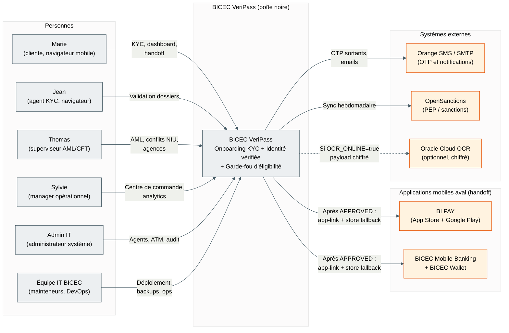
```mermaid
%%{init: {'theme': 'base', 'themeVariables': {'primaryColor': '#ECEFF1','primaryTextColor':'#000','primaryBorderColor':'#455A64','lineColor':'#455A64'}}}%%
flowchart LR
    subgraph Acteurs["Personnes"]
        M["Marie<br/>(cliente, navigateur mobile)"]
        J["Jean<br/>(agent KYC, navigateur)"]
        T["Thomas<br/>(superviseur AML/CFT)"]
        S["Sylvie<br/>(manager opérationnel)"]
        AIT["Admin IT<br/>(administrateur système)"]
        MAINT["Équipe IT BICEC<br/>(mainteneurs, DevOps)"]
    end

    subgraph VeriPass["BICEC VeriPass (boîte noire)"]
        VP["BICEC VeriPass<br/>Onboarding KYC + Identité vérifiée<br/>+ Garde-fou d'éligibilité"]
    end

    subgraph AppsAval["Applications mobiles aval (handoff)"]
        BIPAY["BI PAY<br/>(App Store + Google Play)"]
        WALLET["BICEC Mobile-Banking<br/>+ BICEC Wallet"]
    end

    subgraph Externes["Systèmes externes"]
        SMS["Orange SMS / SMTP<br/>(OTP et notifications)"]
        OS["OpenSanctions<br/>(PEP / sanctions)"]
        OCR_CLOUD["Oracle Cloud OCR<br/>(optionnel, chiffré)"]
    end

    M -->|KYC, dashboard,<br/>handoff| VP
    J -->|Validation dossiers| VP
    T -->|AML, conflits NIU,<br/>agences| VP
    S -->|Centre de commande,<br/>analytics| VP
    AIT -->|Agents, ATM, audit| VP
    MAINT -->|Déploiement,<br/>backups, ops| VP

    VP -->|OTP sortants,<br/>emails| SMS
    VP -->|Sync hebdomadaire| OS
    VP -.->|Si OCR_ONLINE=true<br/>payload chiffré| OCR_CLOUD

    VP -->|Après APPROVED :<br/>app-link + store fallback| BIPAY
    VP -->|Après APPROVED :<br/>app-link + store fallback| WALLET

    classDef ext fill:#FFF3E0,stroke:#E65100,color:#000
    class SMS,OS,OCR_CLOUD,BIPAY,WALLET ext
```

**Lecture du diagramme.** Marie utilise VeriPass depuis son navigateur mobile pour faire son KYC. Jean, Thomas, Sylvie, et Admin IT utilisent VeriPass depuis leurs navigateurs backoffice. Quand un dossier est approuvé, VeriPass agit comme un **garde-fou** : il ne fait pas d'intégration avec les apps aval, il indique au mobile quelle app-link essayer et quel store fallback utiliser. Côté externe, VeriPass délègue uniquement l'envoi d'OTP/SMS, la synchronisation PEP/sanctions, et (optionnellement) le fallback OCR cloud. Tout le reste tourne en local.

### 1.2 Zones de confiance et frontières de sécurité

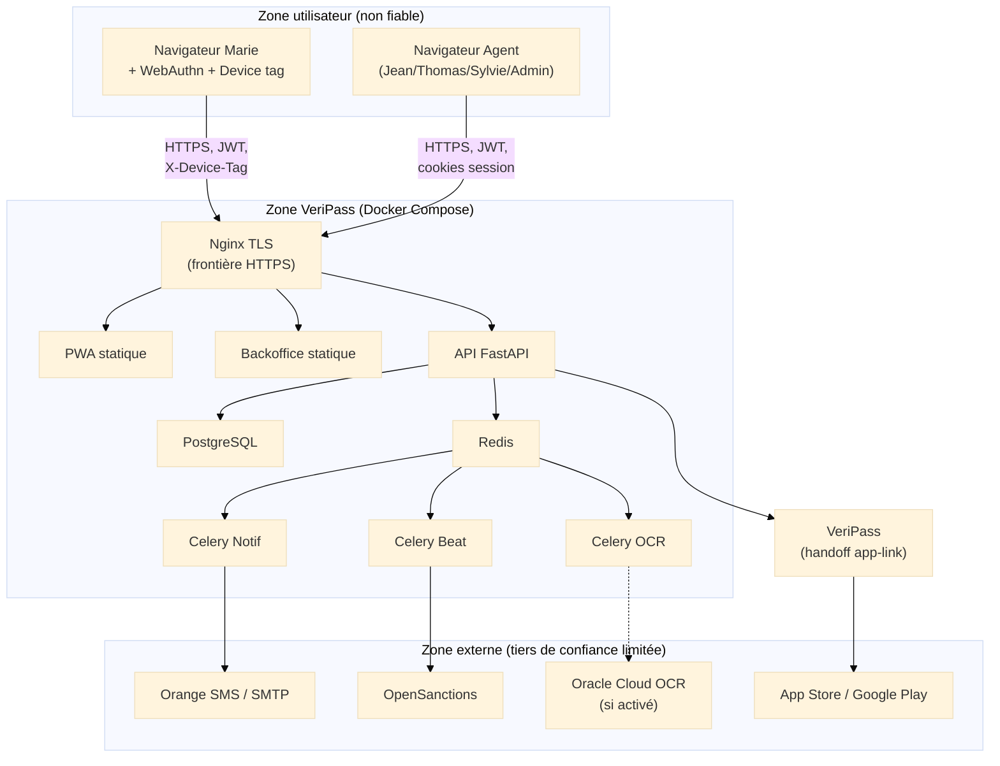
```mermaid
%%{init: {'theme': 'base'}}%%
flowchart TB
    subgraph ZU["Zone utilisateur (non fiable)"]
        NB["Navigateur Marie<br/>+ WebAuthn + Device tag"]
        NAG["Navigateur Agent<br/>(Jean/Thomas/Sylvie/Admin)"]
    end

    subgraph ZVP["Zone VeriPass (Docker Compose)"]
        NGX["Nginx TLS<br/>(frontière HTTPS)"]
        PWA["PWA statique"]
        BO["Backoffice statique"]
        API["API FastAPI"]
        DB["PostgreSQL"]
        REDIS["Redis"]
        W1["Celery OCR"]
        W2["Celery Notif"]
        W3["Celery Beat"]
    end

    subgraph ZE["Zone externe (tiers de confiance limitée)"]
        SMS["Orange SMS / SMTP"]
        OS["OpenSanctions"]
        OC["Oracle Cloud OCR<br/>(si activé)"]
        ST["App Store / Google Play"]
    end

    NB -->|HTTPS, JWT,<br/>X-Device-Tag| NGX
    NAG -->|HTTPS, JWT,<br/>cookies session| NGX
    NGX --> PWA
    NGX --> BO
    NGX --> API
    API --> DB
    API --> REDIS
    REDIS --> W1
    REDIS --> W2
    REDIS --> W3
    W2 --> SMS
    W3 --> OS
    W1 -.-> OC
    VP_OK["VeriPass<br/>(handoff app-link)"] --> ST
    API --> VP_OK
```

**Lecture du diagramme.** La seule frontière de confiance entre l'utilisateur et VeriPass est **Nginx en HTTPS**. Tout le reste (API, DB, Redis, workers) est interne au réseau Docker `veripass-net`. Les appels aux systèmes externes sont sortants et limités à des usages précis (OTP, sanctions, OCR cloud optionnel). Les apps aval sont atteintes par **redirection côté mobile**, pas par intégration côté VeriPass.

### 1.3 Texte — Positionnement produit et invariants métier

**Positionnement.** VeriPass est **un système d'onboarding KYC et de stockage d'identité vérifiée**, pas un adaptateur vers les systèmes internes de la banque. Il ne crée pas de compte dans un core banking ; il décide qu'un utilisateur peut, après approbation humaine, accéder aux apps mobiles aval via des liens OS-aware.

**Invariants métier (à ne jamais transgresser) :**

1. L'approbation KYC est **toujours humaine**. Aucune transition vers `APPROVED` ne peut être déclenchée par un processus automatique.
2. Le `status` (cycle de vie) et l'`access_level` (permission) sont **deux dimensions orthogonales**. Ne jamais les fusionner.
3. L'accès aux apps aval est un **handoff mobile**, pas une intégration backend.
4. Le `status` `APPROVED` mappe (par défaut) sur `LIMITED_ACCESS`. L'accès `FULL_ACCESS` est un cas séparé qui n'est pas dans le périmètre actuel.
5. Le `status` `FRAUD_SUSPECT` mappe (par défaut) sur `DISABLED`.
6. `PENDING_INFO` reste **éditable** côté client pour permettre la resoumission des pièces demandées.

> **Cross-link.** Détail dans [`docs/project-overview.md`](./project-overview.md) § « State And Access Model » et [`docs/data-models.md`](./data-models.md) § « KYC Tables ». Diagramme équivalent dans [`docs/diagrams/statechart-access.md`](./diagrams/statechart-access.md).

---

## 2. Niveau 2 — Containers (C4 L2)

Le diagramme de containers montre **les processus conteneurisés** et leurs relations.

### 2.1 Vue d'ensemble des containers

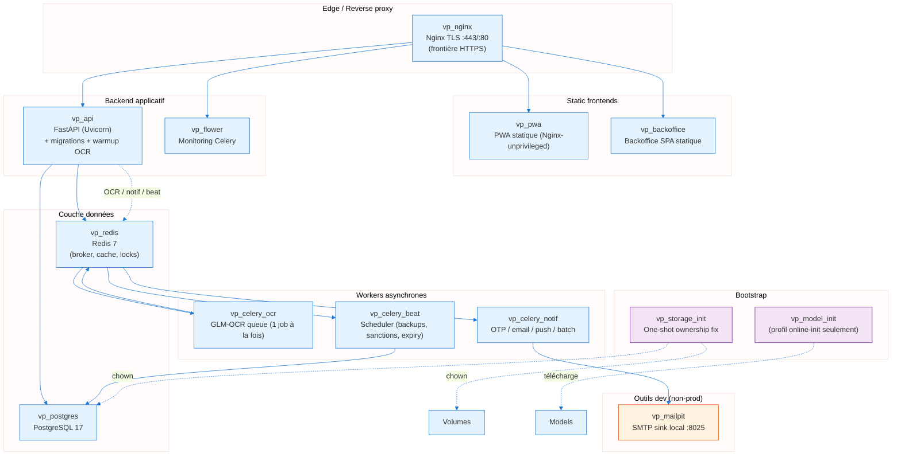
```mermaid
%%{init: {'theme': 'base', 'themeVariables': {'primaryColor': '#E3F2FD','primaryBorderColor':'#1976D2','lineColor':'#1976D2'}}}%%
flowchart TB
    subgraph Edge["Edge / Reverse proxy"]
        NGX["vp_nginx<br/>Nginx TLS :443/:80<br/>(frontière HTTPS)"]
    end

    subgraph Static["Static frontends"]
        PWA["vp_pwa<br/>PWA statique (Nginx-unprivileged)"]
        BO["vp_backoffice<br/>Backoffice SPA statique"]
    end

    subgraph App["Backend applicatif"]
        API["vp_api<br/>FastAPI (Uvicorn)<br/>+ migrations + warmup OCR"]
        FWR["vp_flower<br/>Monitoring Celery"]
    end

    subgraph Data["Couche données"]
        PG["vp_postgres<br/>PostgreSQL 17"]
        RD["vp_redis<br/>Redis 7<br/>(broker, cache, locks)"]
    end

    subgraph Workers["Workers asynchrones"]
        OCR["vp_celery_ocr<br/>GLM-OCR queue (1 job à la fois)"]
        NOT["vp_celery_notif<br/>OTP / email / push / batch"]
        BEAT["vp_celery_beat<br/>Scheduler (backups, sanctions, expiry)"]
    end

    subgraph Dev["Outils dev (non-prod)"]
        MP["vp_mailpit<br/>SMTP sink local :8025"]
    end

    subgraph Init["Bootstrap"]
        SI["vp_storage_init<br/>One-shot ownership fix"]
        MI["vp_model_init<br/>(profil online-init seulement)"]
    end

    NGX --> PWA
    NGX --> BO
    NGX --> API
    NGX --> FWR

    API --> PG
    API --> RD
    API -.->|OCR / notif / beat| RD

    RD --> OCR
    RD --> NOT
    RD --> BEAT

    NOT --> MP
    BEAT --> PG
    OCR --> RD

    SI -.->|chown| PG
    SI -.->|chown| Volumes
    MI -.->|télécharge| Models

    classDef dev fill:#FFF3E0,stroke:#E65100
    class MP dev
    classDef init fill:#F3E5F5,stroke:#6A1B9A
    class SI,MI init
```

**Lecture du diagramme.** 13 conteneurs au total (hors init), organisés en 5 zones : Edge (Nginx), Static (PWA + Backoffice), App (API + Flower), Data (Postgres + Redis), Workers (3 Celery), Dev (Mailpit). Le conteneur `vp_storage_init` est un one-shot qui fixe les permissions des volumes au démarrage. `vp_model_init` n'est utilisé que derrière le profil `online-init` pour bootstrapper les modèles (en mode souverain, les modèles sont déjà montés depuis l'hôte via `OFFLINE_MODELS_DIR`).

### 2.2 Topologie des volumes Docker externes

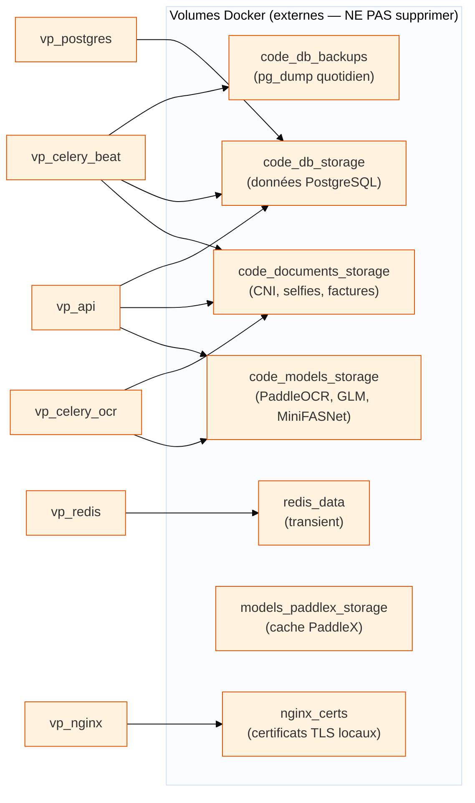
```mermaid
%%{init: {'theme': 'base', 'themeVariables': {'primaryColor': '#FFF3E0','primaryBorderColor':'#E65100'}}}%%
flowchart LR
    subgraph V["Volumes Docker (externes — NE PAS supprimer)"]
        DBV["code_db_storage<br/>(données PostgreSQL)"]
        DBB["code_db_backups<br/>(pg_dump quotidien)"]
        DOCV["code_documents_storage<br/>(CNI, selfies, factures)"]
        MODV["code_models_storage<br/>(PaddleOCR, GLM, MiniFASNet)"]
        RDV["redis_data<br/>(transient)"]
        PXV["models_paddlex_storage<br/>(cache PaddleX)"]
        NCV["nginx_certs<br/>(certificats TLS locaux)"]
    end

    API[vp_api] --> DBV
    API --> DOCV
    API --> MODV
    BEAT[vp_celery_beat] --> DBB
    BEAT --> DBV
    BEAT --> DOCV
    OCR[vp_celery_ocr] --> DOCV
    OCR --> MODV
    PG[vp_postgres] --> DBV
    RD[vp_redis] --> RDV
    NGX[vp_nginx] --> NCV
```

**Lecture du diagramme.** Trois volumes sont **persistants et critiques** : `code_db_storage` (données métier), `code_documents_storage` (fichiers KYC), `code_db_backups` (sauvegardes). Tout script de cleanup (docker prune, docker compose down -v) qui toucherait à ces volumes est **interdit sauf demande explicite**.

> **Cross-link.** Détail dans [`docs/deployment-guide.md`](./deployment-guide.md) § « External Volumes » et [`docs/operations-runbook.md`](./operations-runbook.md) § « Disk Space Is Low ».

### 2.3 Routage Nginx public

```mermaid
%%{init: {'theme': 'base', 'themeVariables': {'primaryColor': '#E1F5FE','primaryBorderColor':'#0277BD'}}}%%
flowchart LR
    CLIENT["Navigateur<br/>(HTTPS)"] --> NGX{"vp_nginx<br/>:443 → :8443"}

    NGX -->|/health| HCHECK["API /api/health"]
    NGX -->|/api/v1/auth/*<br/>(rate-limit strict)| AUTHR["vp_api<br/>(module auth)"]
    NGX -->|/api/v1/*<br/>(rate-limit normal)| APIR["vp_api<br/>(modules)"]
    NGX -->|/api/v1/sentry-proxy/*| SEN["vp_api<br/>(proxy Sentry)"]
    NGX -->|/sentry-proxy/*| SEN

    NGX -->|/mobile/*<br/>/assets/*<br/>/icons/*<br/>/manifest.json| PWA["vp_pwa<br/>(fallback SPA index.html)"]
    NGX -->|/back-office/*<br/>/backoffice/* → 301| BO["vp_backoffice<br/>(fallback SPA index.html)"]
    NGX -->|/* (non app)| REDIR["301 → /back-office/"]

    NGX -->|/flower/*| FL["vp_flower<br/>(auth basic)"]
    NGX -->|/ → /api/v1/docs<br/>/api/docs| DOCS["vp_api<br/>(Swagger UI)"]

    classDef strict fill:#FFEBEE,stroke:#C62828
    class AUTHR strict
```

**Lecture du diagramme.** Nginx est la seule porte d'entrée publique. Il applique :

- **Redirection HTTP → HTTPS** systématique.
- **Rate-limit strict** sur `/api/v1/auth/*` (zone dédiée).
- **Rate-limit normal** sur le reste de l'API.
- **Headers de sécurité** centralisés (`security_headers.conf`).
- **Fallback SPA** : toute URL non trouvée sous `/mobile/*` ou `/back-office/*` renvoie `index.html` pour gérer les deep-links (ex : `/back-office/validation/dossier/abc-123`).
- **Timeouts étendus** sur les routes OCR et liveness.
- **Redirection `/backoffice/` → `/back-office/`** (alias historique).
- **Proxy Sentry** : `/api/v1/sentry-proxy/*` et `/sentry-proxy/*` permettent de garder les envois Sentry en same-origin.

### 2.4 Tableau détaillé des 13 containers

| Service | Conteneur | Image de base | Ports hôte | Volumes montés | Dépend de | Healthcheck | Profil |
| --- | --- | --- | --- | --- | --- | --- | --- |
| `nginx` | `vp_nginx` | `nginx-unprivileged` (build local) | `443:8443`, `80:8080`, `127.0.0.1:8081:8081` | `nginx.conf:ro`, `security_headers.conf:ro`, `ssl/:ro` | `api` (healthy), `pwa`, `backoffice`, `flower` | non exposé (auto-start OK) | default |
| `pwa` | `vp_pwa` | `nginx-unprivileged` | (interne) | (statique uniquement) | `api` (started) | non | default |
| `backoffice` | `vp_backoffice` | `nginx-unprivileged` | (interne) | (statique uniquement) | `api` (started) | non | default |
| `api` | `vp_api` | `python:3.11-slim` + backend | `8001:8000` (debug) | `code_db_storage`, `code_documents_storage`, `code_models_storage`, `code_models_paddlex_storage` | `postgres` (healthy), `redis` (healthy), `storage_init` (completed) | `curl /api/health` | default |
| `postgres` | `vp_postgres` | `postgres:17` | `15432:5432` (debug) | `code_db_storage` | — | `pg_isready` | default |
| `redis` | `vp_redis` | `redis:7` | `16379:6379` (debug) | `redis_data` | — | `redis-cli ping` | default |
| `celery_ocr` | `vp_celery_ocr` | backend (même image que `api`) | (interne) | `code_documents_storage`, `code_models_storage` | `redis`, `api` (healthy) | Celery inspect ping | default |
| `celery_notifications` | `vp_celery_notif` | backend | (interne) | `code_db_storage` (lecture) | `postgres`, `redis` | Celery inspect ping | default |
| `celery_beat` | `vp_celery_beat` | backend | (interne) | `code_db_storage`, `code_db_backups`, `code_documents_storage`, `/var/run/docker.sock` (⚠) | `postgres`, `redis` | process check | default |
| `mailpit` | `vp_mailpit` | `mailpit` | `8025:8025` (UI), `1025:1025` (SMTP) | — | — | HTTP `/` | default (dev) |
| `flower` | `vp_flower` | backend (même image) | (interne) | — | `redis` | HTTP `/` | default |
| `storage_init` | `vp_storage_init` | `alpine` | — | `code_db_storage`, `code_documents_storage`, `code_models_storage`, `code_db_backups` | — | one-shot (exit 0) | default |
| `model_init` | `vp_model_init` | `python:3.11-slim` | — | `code_models_storage` | `storage_init` | one-shot | `online-init` uniquement |

> ⚠ **Docker socket sur celery_beat** : nécessaire pour les tâches de prune disk ; à restreindre en production (voir § 5.7).
>
> **Cross-link.** Détail complet dans [`docs/deployment-guide.md`](./deployment-guide.md) et `code/docker-compose.yml`.

---

## 3. Niveau 3 — Components (C4 L3)

Le diagramme de composants montre les **modules applicatifs** et leurs relations.

### 3.1 Backend — entry point et router API

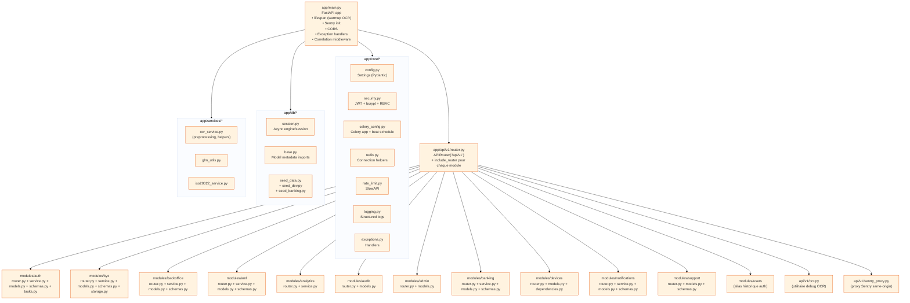
```mermaid
%%{init: {'theme': 'base', 'themeVariables': {'primaryColor': '#FFF3E0','primaryBorderColor':'#E65100'}}}%%
flowchart TB
    MAIN["app/main.py<br/>FastAPI app<br/>• lifespan (warmup OCR)<br/>• Sentry init<br/>• CORS<br/>• Exception handlers<br/>• Correlation middleware"] --> ROUTER["app/api/v1/router.py<br/>APIRouter('/api/v1')<br/>+ include_router pour chaque module"]

    ROUTER --> AUTH["modules/auth<br/>router.py + service.py + models.py + schemas.py + tasks.py"]
    ROUTER --> KYC["modules/kyc<br/>router.py + service.py + models.py + schemas.py + storage.py"]
    ROUTER --> BACK["modules/backoffice<br/>router.py + service.py + models.py + schemas.py"]
    ROUTER --> AML["modules/aml<br/>router.py + service.py + models.py + schemas.py"]
    ROUTER --> ANA["modules/analytics<br/>router.py + service.py"]
    ROUTER --> AUD["modules/audit<br/>router.py + models.py"]
    ROUTER --> ADM["modules/admin<br/>router.py + models.py"]
    ROUTER --> BAN["modules/banking<br/>router.py + service.py + models.py + schemas.py"]
    ROUTER --> DEV["modules/devices<br/>router.py + models.py + dependencies.py"]
    ROUTER --> NOT["modules/notifications<br/>router.py + service.py + models.py + schemas.py"]
    ROUTER --> SUP["modules/support<br/>router.py + models.py + schemas.py"]
    ROUTER --> USR["modules/users<br/>(alias historique auth)"]
    ROUTER --> OCR["api/v1/ocr.py<br/>(utilitaire debug OCR)"]
    ROUTER --> SEN["api/v1/sentry_proxy.py<br/>(proxy Sentry same-origin)"]

    MAIN --> CORE
    MAIN --> DB
    MAIN --> SVC

    subgraph CORE["app/core/*"]
        CONF["config.py<br/>Settings (Pydantic)"]
        SEC["security.py<br/>JWT + bcrypt + RBAC"]
        CEL["celery_config.py<br/>Celery app + beat schedule"]
        RED["redis.py<br/>Connection helpers"]
        RL["rate_limit.py<br/>SlowAPI"]
        LOG["logging.py<br/>Structured logs"]
        EXC["exceptions.py<br/>Handlers"]
    end

    subgraph DB["app/db/*"]
        SES["session.py<br/>Async engine/session"]
        BAS["base.py<br/>Model metadata imports"]
        SD["seed_data.py<br/>+ seed_dev.py<br/>+ seed_banking.py"]
    end

    subgraph SVC["app/services/*"]
        OCRS["ocr_service.py<br/>(preprocessing, helpers)"]
        GLM["glm_utils.py"]
        ISO["iso20022_service.py"]
    end
```

**Lecture du diagramme.** L'application est un **monolithe modulaire FastAPI** organisé en domaines (`modules/*`). Chaque module suit la convention `router.py + service.py + models.py + schemas.py`. Le routeur racine (`api/v1/router.py`) inclut tous les routers de modules. Les couches transverses (`core/`, `db/`, `services/`, `tasks/`) sont partagées par les modules.

### 3.2 Backend — modules métier


```mermaid
%%{init: {'theme': 'base', 'themeVariables': {'primaryColor': '#FFF3E0','primaryBorderColor':'#E65100'}}}%%
flowchart LR
    subgraph M_AUTH["modules/auth"]
        A1["OTP (phone, email)"]
        A2["PIN setup/verify"]
        A3["Passkey / WebAuthn"]
        A4["Agent login + refresh"]
        A5["Refresh tokens + révocation jti"]
        A6["Soft-delete compte client"]
    end

    subgraph M_KYC["modules/kyc"]
        K1["Sessions KYC"]
        K2["Capture CNI / bill / selfie"]
        K3["OCR review / confirm / merge"]
        K4["Liveness / biométrie"]
        K5["Address / NIU / consent / signature"]
        K6["Readiness + submit"]
        K7["ATM catalog"]
    end

    subgraph M_BO["modules/backoffice"]
        B1["Queue + dossier detail"]
        B2["Décisions (approve/reject/info/fraud)"]
        B3["Assign / auto-assign"]
        B4["Support threads"]
        B5["OCR correction"]
    end

    subgraph M_AML["modules/aml"]
        L1["Alerts AML (PEP/sanctions)"]
        L2["Conflits NIU / doublons"]
        L3["Document expiry"]
        L4["Agencies CRUD"]
        L5["Listes internes (CSV)"]
        L6["Batch jobs"]
        L7["Notify-global"]
    end

    subgraph M_ANA["modules/analytics"]
        N1["Dashboard (role-aware)"]
        N2["Funnel / documents / fraud"]
        N3["Compliance / operations"]
        N4["Marketing / QA / technical"]
    end

    subgraph M_AUD["modules/audit"]
        U1["Audit log listing"]
        U2["Export COBAC"]
    end

    subgraph M_ADM["modules/admin"]
        D1["Agent CRUD + reset password"]
        D2["Users list"]
    end

    subgraph M_BAN["modules/banking"]
        G1["Cards freeze"]
        G2["Transfers + ISO 20022"]
        G3["Transactions + savings pockets"]
    end

    subgraph M_DEV["modules/devices"]
        V1["Device registration + tag"]
        V2["X-Device-Tag enforcement"]
    end

    subgraph M_NOT["modules/notifications"]
        O1["In-app inbox"]
        O2["Preferences + push subscriptions"]
    end

    subgraph M_SUP["modules/support"]
        S1["Threads + messages"]
        S2["Attachments (limites)"]
    end

    M_AUTH --> M_DEV
    M_AUTH --> M_KYC
    M_KYC --> M_AML
    M_KYC --> M_SUP
    M_BO --> M_KYC
    M_BO --> M_AML
    M_AML --> M_KYC
    M_ANA --> M_KYC
    M_ANA --> M_AML
    M_ANA --> M_BO
    M_AUD --> M_BO
    M_ADM --> M_AUTH
    M_BAN --> M_DEV
    M_BAN --> M_KYC
    M_NOT --> M_AUTH
```

**Lecture du diagramme.** Les modules sont fortement interconnectés : `kyc` est le module central (tous les autres le lisent ou l'écrivent), `auth` est traversé par toutes les routes protégées, `backoffice` orchestre la validation humaine. `banking` est volontairement isolé des modules `auth`/`kyc` au-delà de la lecture de `access_level` et `device_tag` — c'est la **coquille produit locale** (voir § 0.3).

### 3.3 Backend — `core/*`, `db/*`, `services/*`, `tasks/*`

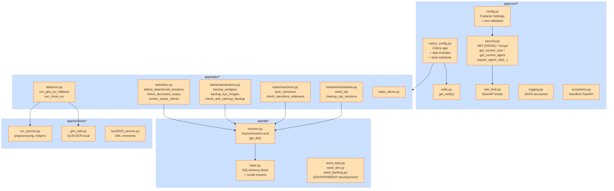
```mermaid
%%{init: {'theme': 'base', 'themeVariables': {'primaryColor': '#FFE0B2','primaryBorderColor':'#E65100'}}}%%
flowchart TB
    subgraph CORE["app/core/*"]
        CONF["config.py<br/>Pydantic Settings<br/>+ env validation"]
        SEC["security.py<br/>JWT (HS256) + bcrypt<br/>get_current_user / get_current_agent<br/>require_agent_role(...)"]
        CEL["celery_config.py<br/>Celery app<br/>+ task includes<br/>+ beat schedule"]
        RED["redis.py<br/>get_redis()"]
        RL["rate_limit.py<br/>SlowAPI limiter"]
        LOG["logging.py<br/>JSON structured"]
        EXC["exceptions.py<br/>Handlers FastAPI"]
    end

    subgraph DB["app/db/*"]
        SES["session.py<br/>AsyncSessionLocal<br/>get_db()"]
        BAS["base.py<br/>SQLAlchemy Base<br/>+ model imports"]
        SD["seed_data.py<br/>seed_dev.py<br/>seed_banking.py<br/>(ENVIRONMENT=development)"]
    end

    subgraph SVC["app/services/*"]
        OCRS["ocr_service.py<br/>preprocessing, helpers"]
        GLM["glm_utils.py<br/>GLM-OCR local"]
        ISO["iso20022_service.py<br/>XML virements"]
    end

    subgraph TASKS["app/tasks/*"]
        OCRT["tasks/ocr.py<br/>run_glm_ocr_fallback<br/>run_cloud_ocr"]
        KYCT["tasks/kyc.py<br/>detect_abandoned_sessions<br/>check_document_expiry<br/>screen_active_clients"]
        MAINT["tasks/maintenance.py<br/>backup_postgres<br/>backup_kyc_images<br/>check_and_catchup_backup"]
        SANCT["tasks/sanctions.py<br/>sync_sanctions<br/>check_sanctions_staleness"]
        AUTHT["modules/auth/tasks.py<br/>send_otp<br/>cleanup_otp_sessions"]
        DEMOT["tasks_demo.py"]
    end

    CONF --> SEC
    SEC --> RL
    SES --> BAS
    CEL --> RED
    CEL --> TASKS
    OCRT --> GLM
    OCRT --> OCRS
    KYCT --> SES
    MAINT --> SES
    SANCT --> SES
    AUTHT --> SES
```

**Lecture du diagramme.** Les couches transverses sont strictement isolées par responsabilité :

- `core/*` : configuration, sécurité, Celery, Redis, rate limit, logs.
- `db/*` : engine SQLAlchemy async, base, seeds (uniquement en `ENVIRONMENT=development`).
- `services/*` : logique métier transverse (OCR, ISO 20022).
- `tasks/*` : workers Celery. Chaque module peut avoir son propre fichier `tasks.py` ; les tâches planifiées sont dans `tasks/maintenance.py`, `tasks/sanctions.py`, `tasks/kyc.py`. `tasks_demo.py` contient les helpers d'évidence (à ne pas traiter comme contrat métier).

> **Cross-link.** Détail dans [`docs/source-tree-analysis.md`](./source-tree-analysis.md) § « Backend Tree ».

### 3.4 Mobile PWA — route map, contexts, services

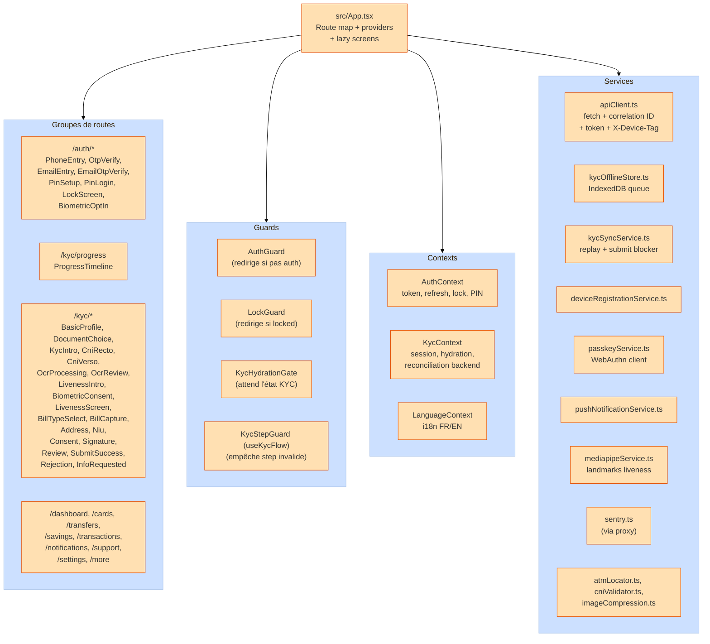
```mermaid
%%{init: {'theme': 'base', 'themeVariables': {'primaryColor': '#FFE0B2','primaryBorderColor':'#E65100'}}}%%
flowchart TB
    APP["src/App.tsx<br/>Route map + providers<br/>+ lazy screens"] --> ROUTES

    subgraph ROUTES["Groupes de routes"]
        R1["/auth/*<br/>PhoneEntry, OtpVerify,<br/>EmailEntry, EmailOtpVerify,<br/>PinSetup, PinLogin, LockScreen,<br/>BiometricOptIn"]
        R2["/kyc/progress<br/>ProgressTimeline"]
        R3["/kyc/*<br/>BasicProfile, DocumentChoice,<br/>KycIntro, CniRecto, CniVerso,<br/>OcrProcessing, OcrReview,<br/>LivenessIntro, BiometricConsent,<br/>LivenessScreen,<br/>BillTypeSelect, BillCapture,<br/>Address, Niu,<br/>Consent, Signature,<br/>Review, SubmitSuccess,<br/>Rejection, InfoRequested"]
        R4["/dashboard, /cards, /transfers,<br/>/savings, /transactions,<br/>/notifications, /support,<br/>/settings, /more"]
    end

    APP --> GUARDS

    subgraph GUARDS["Guards"]
        G1["AuthGuard<br/>(redirige si pas auth)"]
        G2["LockGuard<br/>(redirige si locked)"]
        G3["KycHydrationGate<br/>(attend l'état KYC)"]
        G4["KycStepGuard (useKycFlow)<br/>(empêche step invalide)"]
    end

    APP --> CTX

    subgraph CTX["Contexts"]
        C1["AuthContext<br/>token, refresh, lock, PIN"]
        C2["KycContext<br/>session, hydration,<br/>reconciliation backend"]
        C3["LanguageContext<br/>i18n FR/EN"]
    end

    APP --> SVC

    subgraph SVC["Services"]
        S1["apiClient.ts<br/>fetch + correlation ID<br/>+ token + X-Device-Tag"]
        S2["kycOfflineStore.ts<br/>IndexedDB queue"]
        S3["kycSyncService.ts<br/>replay + submit blocker"]
        S4["deviceRegistrationService.ts"]
        S5["passkeyService.ts<br/>WebAuthn client"]
        S6["pushNotificationService.ts"]
        S7["mediapipeService.ts<br/>landmarks liveness"]
        S8["sentry.ts<br/>(via proxy)"]
        S9["atmLocator.ts, cniValidator.ts,<br/>imageCompression.ts"]
    end
```

**Lecture du diagramme.** Le mobile suit un schéma **RouteMap → Providers → Guards → Contexts → Services → Views**. Les KYC views sont nombreuses (~25 écrans) et strictement ordonnées par `useKycFlow`. Le mode offline est supporté par IndexedDB (`kycOfflineStore`) et un service de replay (`kycSyncService`) qui empêche la soumission tant que la queue n'est pas vidée.

> **Cross-link.** Détail dans [`docs/component-inventory.md`](./component-inventory.md) § « Mobile PWA ».

### 3.5 Backoffice SPA — route map, pages, services

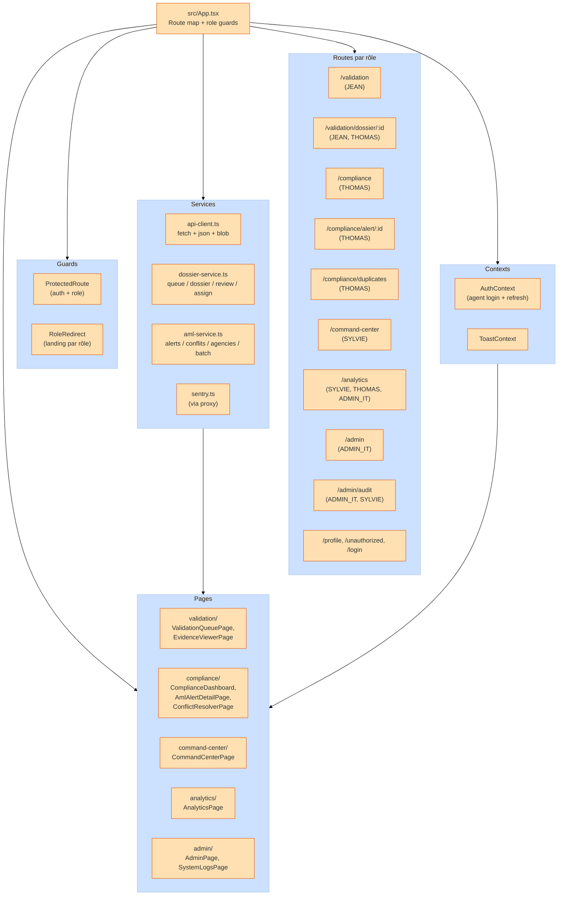
```mermaid
%%{init: {'theme': 'base', 'themeVariables': {'primaryColor': '#FFE0B2','primaryBorderColor':'#E65100'}}}%%
flowchart TB
    APP["src/App.tsx<br/>Route map + role guards"] --> ROUTES

    subgraph ROUTES["Routes par rôle"]
        R1["/validation<br/>(JEAN)"]
        R2["/validation/dossier/:id<br/>(JEAN, THOMAS)"]
        R3["/compliance<br/>(THOMAS)"]
        R4["/compliance/alert/:id<br/>(THOMAS)"]
        R5["/compliance/duplicates<br/>(THOMAS)"]
        R6["/command-center<br/>(SYLVIE)"]
        R7["/analytics<br/>(SYLVIE, THOMAS, ADMIN_IT)"]
        R8["/admin<br/>(ADMIN_IT)"]
        R9["/admin/audit<br/>(ADMIN_IT, SYLVIE)"]
        R10["/profile, /unauthorized, /login"]
    end

    APP --> CTX

    subgraph CTX["Contexts"]
        C1["AuthContext<br/>(agent login + refresh)"]
        C2["ToastContext"]
    end

    APP --> GUARDS

    subgraph GUARDS["Guards"]
        G1["ProtectedRoute<br/>(auth + role)"]
        G2["RoleRedirect<br/>(landing par rôle)"]
    end

    APP --> SVC

    subgraph SVC["Services"]
        S1["api-client.ts<br/>fetch + json + blob"]
        S2["dossier-service.ts<br/>queue / dossier / review / assign"]
        S3["aml-service.ts<br/>alerts / conflits / agencies / batch"]
        S4["sentry.ts<br/>(via proxy)"]
    end

    APP --> PAGES

    subgraph PAGES["Pages"]
        P1["validation/<br/>ValidationQueuePage,<br/>EvidenceViewerPage"]
        P2["compliance/<br/>ComplianceDashboard,<br/>AmlAlertDetailPage,<br/>ConflictResolverPage"]
        P3["command-center/<br/>CommandCenterPage"]
        P4["analytics/<br/>AnalyticsPage"]
        P5["admin/<br/>AdminPage, SystemLogsPage"]
    end

    SVC --> PAGES
    CTX --> PAGES
```

**Lecture du diagramme.** Le backoffice est une SPA avec un **routeur protégé par rôle**. Les pages sont regroupées par rôle (`validation` pour Jean, `compliance` pour Thomas, `command-center` pour Sylvie, `admin` pour Admin IT) avec un partage de certains écrans (`analytics` est multi-rôles). Les services `dossier-service.ts` et `aml-service.ts` encapsulent les appels API par domaine.

> **Cross-link.** Détail dans [`docs/component-inventory.md`](./component-inventory.md) § « Backoffice SPA » et [`docs/api-contracts.md`](./api-contracts.md) § « Backoffice API ».

---

## 4. Niveau 4 — Code (C4 L4) — parcours critiques

Cette section présente les diagrammes au niveau du code pour les **parcours les plus critiques** : état KYC, soumission, OCR/biométrie, Celery, modèle de données, RBAC, handoff aval.

### 4.1 Machine d'état KYC et access_level

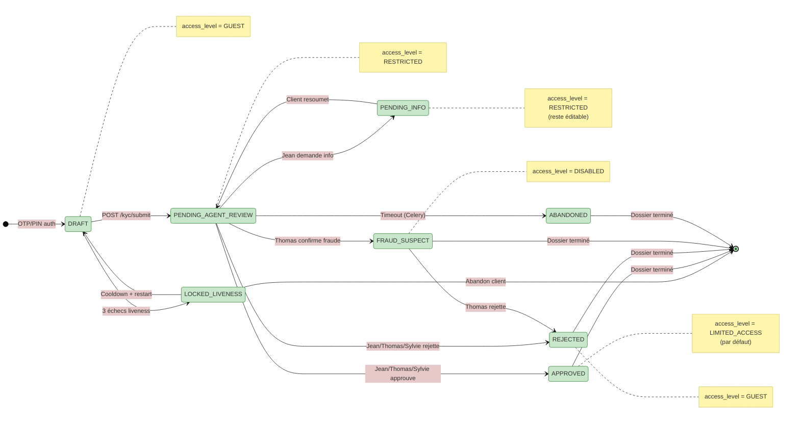
```mermaid
%%{init: {'theme': 'base', 'themeVariables': {'primaryColor': '#C8E6C9','primaryBorderColor':'#2E7D32'}}}%%
stateDiagram-v2
    direction LR
    [*] --> DRAFT : OTP/PIN auth
    DRAFT --> LOCKED_LIVENESS : 3 échecs liveness
    LOCKED_LIVENESS --> DRAFT : Cooldown + restart
    LOCKED_LIVENESS --> [*] : Abandon client
    DRAFT --> PENDING_AGENT_REVIEW : POST /kyc/submit
    PENDING_AGENT_REVIEW --> PENDING_INFO : Jean demande info
    PENDING_INFO --> PENDING_AGENT_REVIEW : Client resoumet
    PENDING_AGENT_REVIEW --> APPROVED : Jean/Thomas/Sylvie approuve
    PENDING_AGENT_REVIEW --> REJECTED : Jean/Thomas/Sylvie rejette
    PENDING_AGENT_REVIEW --> FRAUD_SUSPECT : Thomas confirme fraude
    PENDING_AGENT_REVIEW --> ABANDONED : Timeout (Celery)
    APPROVED --> [*] : Dossier terminé
    REJECTED --> [*] : Dossier terminé
    FRAUD_SUSPECT --> REJECTED : Thomas rejette
    FRAUD_SUSPECT --> [*] : Dossier terminé
    ABANDONED --> [*] : Dossier terminé

    note right of DRAFT
        access_level = GUEST
    end note
    note right of PENDING_AGENT_REVIEW
        access_level = RESTRICTED
    end note
    note right of PENDING_INFO
        access_level = RESTRICTED
        (reste éditable)
    end note
    note right of APPROVED
        access_level = LIMITED_ACCESS
        (par défaut)
    end note
    note right of FRAUD_SUSPECT
        access_level = DISABLED
    end note
    note right of REJECTED
        access_level = GUEST
    end note
```

**Lecture du diagramme.** Le `status` (cycle de vie) et l'`access_level` (permission) sont **deux dimensions parallèles** :

| `status` | `access_level` par défaut | Éditable ? |
| --- | --- | --- |
| `DRAFT` | `GUEST` | oui |
| `LOCKED_LIVENESS` | `RESTRICTED` | non |
| `PENDING_AGENT_REVIEW` | `RESTRICTED` | non |
| `PENDING_INFO` | `RESTRICTED` | **oui** (resoumission possible) |
| `APPROVED` | `LIMITED_ACCESS` | non |
| `FRAUD_SUSPECT` | `DISABLED` | non |
| `REJECTED` | `GUEST` | non |
| `ABANDONED` | `GUEST` | non |

> **Source de vérité :** `code/backend/app/modules/kyc/schemas.py` (énumérations `KYCStatus`, `AccessLevel`) et `code/backend/app/modules/kyc/service.py` (transitions). Voir [`docs/data-models.md`](./data-models.md) § « KYC Tables ».

### 4.2 Séquence du parcours KYC complet

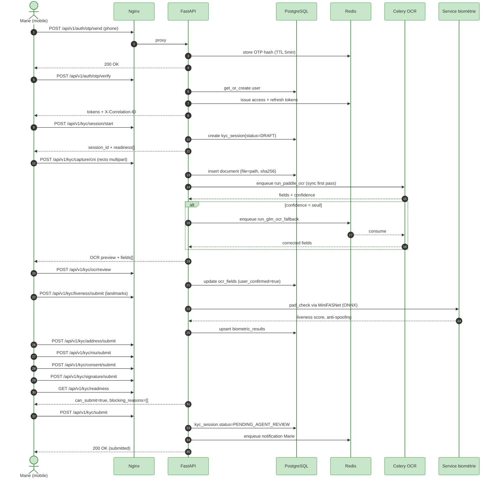
```mermaid
%%{init: {'theme': 'base', 'themeVariables': {'primaryColor': '#C8E6C9','primaryBorderColor':'#2E7D32'}}}%%
sequenceDiagram
    autonumber
    actor M as Marie (mobile)
    participant NGX as Nginx
    participant API as FastAPI
    participant DB as PostgreSQL
    participant RD as Redis
    participant OCR as Celery OCR
    participant BIO as Service biométrie

    M->>NGX: POST /api/v1/auth/otp/send (phone)
    NGX->>API: proxy
    API->>RD: store OTP hash (TTL 5min)
    API-->>M: 200 OK
    M->>NGX: POST /api/v1/auth/otp/verify
    API->>DB: get_or_create user
    API->>RD: issue access + refresh tokens
    API-->>M: tokens + X-Correlation-ID
    M->>NGX: POST /api/v1/kyc/session/start
    API->>DB: create kyc_session(status=DRAFT)
    API-->>M: session_id + readiness[]
    M->>NGX: POST /api/v1/kyc/capture/cni (recto multipart)
    API->>DB: insert document (file=path, sha256)
    API->>OCR: enqueue run_paddle_ocr (sync first pass)
    OCR-->>API: fields + confidence
    alt confidence < seuil
        API->>RD: enqueue run_glm_ocr_fallback
        RD-->>OCR: consume
        OCR-->>API: corrected fields
    end
    API-->>M: OCR preview + fields[]
    M->>NGX: POST /api/v1/kyc/ocr/review
    API->>DB: update ocr_fields (user_confirmed=true)
    M->>NGX: POST /api/v1/kyc/liveness/submit (landmarks)
    API->>BIO: pad_check via MiniFASNet (ONNX)
    BIO-->>API: liveness score, anti-spoofing
    API->>DB: upsert biometric_results
    M->>NGX: POST /api/v1/kyc/address/submit
    M->>NGX: POST /api/v1/kyc/niu/submit
    M->>NGX: POST /api/v1/kyc/consent/submit
    M->>NGX: POST /api/v1/kyc/signature/submit
    M->>NGX: GET /api/v1/kyc/readiness
    API-->>M: can_submit=true, blocking_reasons=[]
    M->>NGX: POST /api/v1/kyc/submit
    API->>DB: kyc_session.status=PENDING_AGENT_REVIEW
    API->>RD: enqueue notification Marie
    API-->>M: 200 OK (submitted)
```

**Lecture du diagramme.** Le parcours complet comporte ~15 appels. Trois points d'attention :

1. **PaddleOCR synchrone** au premier passage ; **GLM-OCR asynchrone** en fallback.
2. **MiniFASNet** est invoqué côté serveur (sur le SELFIE capturé), pas côté client.
3. **`/kyc/readiness`** est un GET idempotent qui calcule l'état de complétude avant la soumission.

> **Cross-link.** Détail dans [`docs/architecture.md`](./architecture.md) § « KYC Submission Flow » et [`docs/api-contracts.md`](./api-contracts.md) § « KYC API ».

### 4.3 Pipeline OCR et biométrie

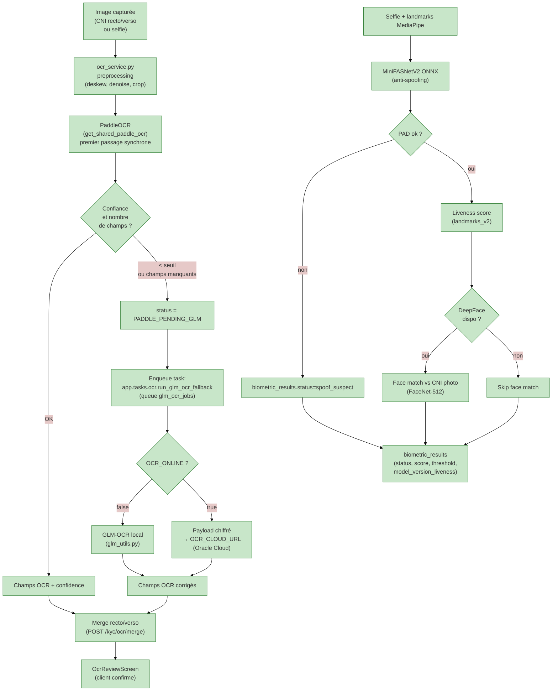
```mermaid
%%{init: {'theme': 'base', 'themeVariables': {'primaryColor': '#C8E6C9','primaryBorderColor':'#2E7D32'}}}%%
flowchart TB
    IMG["Image capturée<br/>(CNI recto/verso<br/>ou selfie)"] --> PRE["ocr_service.py<br/>preprocessing<br/>(deskew, denoise, crop)"]
    PRE --> PADDLE["PaddleOCR<br/>(get_shared_paddle_ocr)<br/>premier passage synchrone"]
    PADDLE --> CONF{Confiance<br/>et nombre<br/>de champs ?}
    CONF -->|OK| OUT1["Champs OCR + confidence"]
    CONF -->|< seuil<br/>ou champs manquants| FLAG["status = PADDLE_PENDING_GLM"]
    FLAG --> ENQ["Enqueue task:<br/>app.tasks.ocr.run_glm_ocr_fallback<br/>(queue glm_ocr_jobs)"]
    ENQ --> GLM{OCR_ONLINE ?}
    GLM -->|false| LOCAL["GLM-OCR local<br/>(glm_utils.py)"]
    GLM -->|true| CLOUD["Payload chiffré<br/>→ OCR_CLOUD_URL<br/>(Oracle Cloud)"]
    LOCAL --> OUT2["Champs OCR corrigés"]
    CLOUD --> OUT2

    OUT1 --> MERGE["Merge recto/verso<br/>(POST /kyc/ocr/merge)"]
    OUT2 --> MERGE
    MERGE --> REVIEW["OcrReviewScreen<br/>(client confirme)"]

    IMG_S["Selfie + landmarks MediaPipe"] --> PAD["MiniFASNetV2 ONNX<br/>(anti-spoofing)"]
    PAD --> PAD_RES{"PAD ok ?"}
    PAD_RES -->|non| LIVFAIL["biometric_results.status=spoof_suspect"]
    PAD_RES -->|oui| LIVSCORE["Liveness score<br/>(landmarks_v2)"]
    LIVSCORE --> DFACE{"DeepFace<br/>dispo ?"}
    DFACE -->|oui| FM["Face match vs CNI photo<br/>(FaceNet-512)"]
    DFACE -->|non| FMNA["Skip face match"]
    FM --> BIOOUT["biometric_results<br/>(status, score, threshold,<br/>model_version_liveness)"]
    FMNA --> BIOOUT
    LIVFAIL --> BIOOUT
```

**Lecture du diagramme.** Le pipeline OCR est **sync pour PaddleOCR, async pour GLM-OCR**. Le pipeline biométrique est **sync et local** (MiniFASNet sur l'image SELFIE déjà stockée, landmarks fournis par le mobile). Les modèles sont montés depuis `OFFLINE_MODELS_DIR` en mode souverain. Le SHA-256 du modèle MiniFASNet est validé contre `MINIFASNET_MODEL_SHA256` quand fourni.

> **Cross-link.** Détail dans [`docs/architecture.md`](./architecture.md) § « OCR And Biometrics ».

### 4.4 Topologie Celery et beat schedule

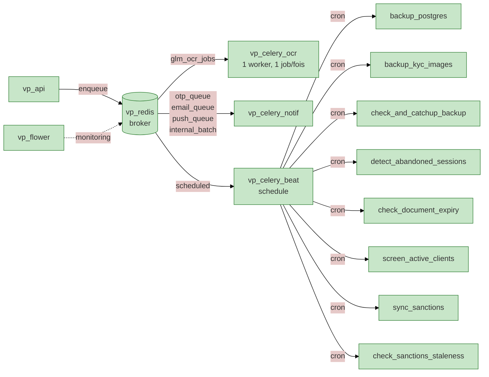
```mermaid
%%{init: {'theme': 'base', 'themeVariables': {'primaryColor': '#C8E6C9','primaryBorderColor':'#2E7D32'}}}%%
flowchart LR
    API[vp_api] -->|enqueue| RD[(vp_redis<br/>broker)]

    RD -->|glm_ocr_jobs| OCR[vp_celery_ocr<br/>1 worker, 1 job/fois]
    RD -->|otp_queue<br/>email_queue<br/>push_queue<br/>internal_batch| NOT[vp_celery_notif]
    RD -->|scheduled| BEAT[vp_celery_beat<br/>schedule]

    BEAT -->|cron| MAINT[backup_postgres]
    BEAT -->|cron| KIMG[backup_kyc_images]
    BEAT -->|cron| CATCH[check_and_catchup_backup]
    BEAT -->|cron| ABAN[detect_abandoned_sessions]
    BEAT -->|cron| EXP[check_document_expiry]
    BEAT -->|cron| SCR[screen_active_clients]
    BEAT -->|cron| SAN[sync_sanctions]
    BEAT -->|cron| STAL[check_sanctions_staleness]

    FWR[vp_flower] -.->|monitoring| RD
```

**Beat schedule (extrait) :**

| Job | Schedule (UTC) | Implémentation | Notes |
| --- | --- | --- | --- |
| `backup-db-daily` | 01:00 quotidien | `tasks/maintenance.py:backup_postgres` | `pg_dump` vers `code_db_backups` ; gated par `ENABLE_BACKUPS=true` |
| `backup-images-weekly` | Dimanche 02:00 | `tasks/maintenance.py:backup_kyc_images` | Archive chiffrée des `code_documents_storage` ; nécessite `BACKUP_ENCRYPTION_KEY` |
| `check-backup-catchup-daily` | 03:30 quotidien | `tasks/maintenance.py:check_and_catchup_backup` | Déclenche un backup images si pas récent |
| `detect-abandoned-sessions` | 03:00 quotidien | `tasks/kyc.py` | Marque les sessions KYC abandonnées |
| `check-document-expiry-daily` | 03:20 quotidien | `tasks/kyc.py` | Signale les documents expirant |
| `screen-active-clients-daily` | 04:30 quotidien | `tasks/kyc.py` | Re-screening sanctions des clients actifs |
| `sync-sanctions-weekly` | Lundi 02:00 | `tasks/sanctions.py` | Refresh OpenSanctions |
| `check-sanctions-staleness` | 04:00 quotidien | `tasks/sanctions.py` | Sync si données plus vieilles que le seuil |

> **Cross-link.** Détail dans [`docs/architecture.md`](./architecture.md) § « Async Jobs ».

### 4.5 Modèle de données consolidé


```mermaid
%%{init: {'theme': 'base', 'themeVariables': {'primaryColor': '#C8E6C9','primaryBorderColor':'#2E7D32'}}}%%
erDiagram
    USERS ||--o{ KYC_SESSIONS : "ouvre"
    USERS ||--o{ DEVICE_REGISTRATIONS : "possède"
    USERS ||--o{ BANK_CARDS : "possède"
    USERS ||--o{ TRANSFERS : "initie"
    USERS ||--o{ TRANSACTIONS : "a"
    USERS ||--o{ SAVINGS_POCKETS : "possède"
    USERS ||--o{ NOTIFICATIONS : "reçoit"
    USERS ||--o{ PUSH_SUBSCRIPTIONS : "possède"
    USERS ||--o{ NOTIFICATION_PREFERENCES : "configure"
    USERS ||--o{ OTP_SESSIONS : "reçoit"
    USERS ||--o{ TOKEN_REVOCATIONS : "révoque"
    USERS ||--o{ WEBAUTHN_CREDENTIALS : "possède"

    AGENTS ||--o{ DOSSIER_ASSIGNMENTS : "assigné"
    AGENTS ||--o{ VALIDATION_DECISIONS : "décide"
    AGENCIES ||--o{ AGENTS : "emploie"
    AGENCIES ||--o{ KYC_SESSIONS : "reçoit"

    KYC_SESSIONS ||--o{ DOCUMENTS : "contient"
    KYC_SESSIONS ||--o{ VALIDATION_DECISIONS : "revue"
    KYC_SESSIONS ||--o{ DOSSIER_ASSIGNMENTS : "assigné"
    KYC_SESSIONS ||--o{ AML_ALERTS : "déclenche"
    KYC_SESSIONS ||--o{ DUPLICATE_CHECKS : "comparé"
    KYC_SESSIONS ||--o| BIOMETRIC_RESULTS : "a"
    KYC_SESSIONS ||--o| CONSENT_RECORDS : "a"
    KYC_SESSIONS ||--o{ SUPPORT_THREADS : "discute"
    KYC_SESSIONS ||--o{ NOTIFICATIONS : "reçoit"

    DOCUMENTS ||--o{ OCR_FIELDS : "extrait"
    DOCUMENTS ||--o{ SUPPORT_MESSAGES : "attaché"

    SUPPORT_THREADS ||--o{ SUPPORT_MESSAGES : "contient"

    PEP_SANCTIONS ||--o{ AML_ALERTS : "matche"

    PROVISIONING_BATCHES ||--o{ PROVISIONING_BATCH_ITEMS : "contient"
    KYC_SESSIONS ||--o{ PROVISIONING_BATCH_ITEMS : "tracké"

    AUDIT_LOG ||--o{ USERS : "acteur"
    AUDIT_LOG ||--o{ AGENTS : "acteur"
```

**Lecture du diagramme.** Le modèle de données est centré sur `KYC_SESSIONS`. Les tables `BANK_CARDS`, `TRANSFERS`, `TRANSACTIONS`, `SAVINGS_POCKETS` appartiennent au **module banking local** (coquille produit, pas un adaptateur core banking — voir § 0.3). `PROVISIONING_BATCHES` est une table interne d'administration ; son nom évoque le provisioning mais **elle n'est pas une intégration DGI, Sopra, ou core banking** ; c'est un simple suivi de batchs administratifs.

> **Cross-link.** Détail dans [`docs/data-models.md`](./data-models.md).

### 4.6 Séquence de la revue backoffice

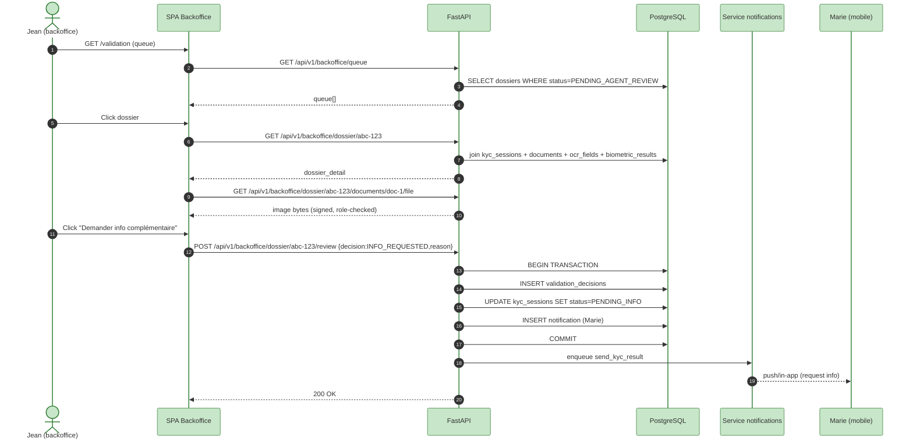
```mermaid
%%{init: {'theme': 'base', 'themeVariables': {'primaryColor': '#C8E6C9','primaryBorderColor':'#2E7D32'}}}%%
sequenceDiagram
    autonumber
    actor J as Jean (backoffice)
    participant BO as SPA Backoffice
    participant API as FastAPI
    participant DB as PostgreSQL
    participant NOT as Service notifications
    participant M as Marie (mobile)

    J->>BO: GET /validation (queue)
    BO->>API: GET /api/v1/backoffice/queue
    API->>DB: SELECT dossiers WHERE status=PENDING_AGENT_REVIEW
    API-->>BO: queue[]
    J->>BO: Click dossier #abc-123
    BO->>API: GET /api/v1/backoffice/dossier/abc-123
    API->>DB: join kyc_sessions + documents + ocr_fields + biometric_results
    API-->>BO: dossier_detail
    BO->>API: GET /api/v1/backoffice/dossier/abc-123/documents/doc-1/file
    API-->>BO: image bytes (signed, role-checked)
    J->>BO: Click "Demander info complémentaire"
    BO->>API: POST /api/v1/backoffice/dossier/abc-123/review {decision:INFO_REQUESTED,reason}
    API->>DB: BEGIN TRANSACTION
    API->>DB: INSERT validation_decisions
    API->>DB: UPDATE kyc_sessions SET status=PENDING_INFO
    API->>DB: INSERT notification (Marie)
    API->>DB: COMMIT
    API->>NOT: enqueue send_kyc_result
    NOT-->>M: push/in-app (request info)
    API-->>BO: 200 OK
```

**Lecture du diagramme.** Toutes les décisions sont **transactionnelles** et **traçables** (table `validation_decisions` append-only, `audit_log` mis à jour). La notification à Marie est asynchrone. Les fichiers sont servis par un endpoint dédié qui re-vérifie le rôle de l'agent.

> **Cross-link.** Détail dans [`docs/api-contracts.md`](./api-contracts.md) § « Backoffice API ».

### 4.7 Cycle de vie d'un dossier (vue gitGraph)

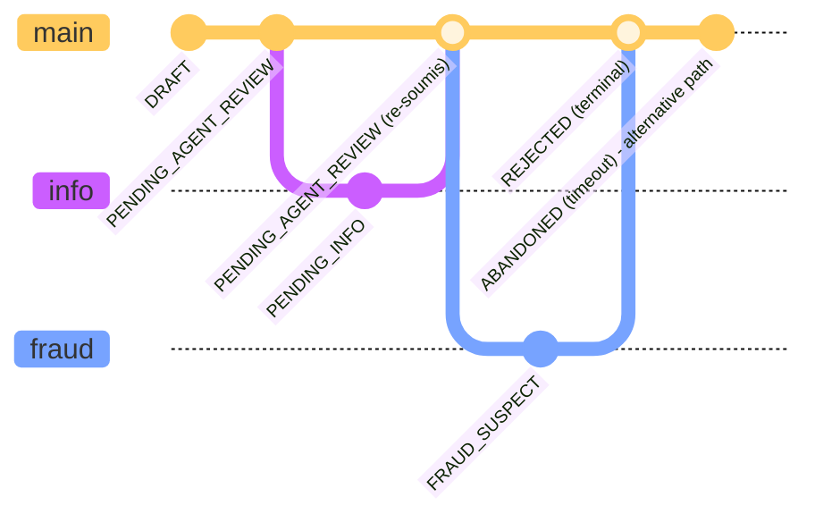
```mermaid
%%{init: {'theme': 'base'}}%%
gitGraph
    commit id: "DRAFT"
    commit id: "PENDING_AGENT_REVIEW"
    branch info
    checkout info
    commit id: "PENDING_INFO"
    checkout main
    merge info id: "PENDING_AGENT_REVIEW (re-soumis)"
    branch fraud
    checkout fraud
    commit id: "FRAUD_SUSPECT"
    checkout main
    merge fraud id: "REJECTED (terminal)"
    checkout main
    commit id: "ABANDONED (timeout) - alternative path"
```

**Lecture du diagramme.** Cette vue `gitGraph` modélise les **branches de cycle de vie** d'un dossier. La branche `info` représente un aller-retour `PENDING_INFO → PENDING_AGENT_REVIEW` ; la branche `fraud` représente un cas `FRAUD_SUSPECT → REJECTED` ; le chemin direct `ABANDONED` est un chemin terminal alternatif. Le commit final valide le `APPROVED → LIMITED_ACCESS`.

### 4.8 Matrice RBAC

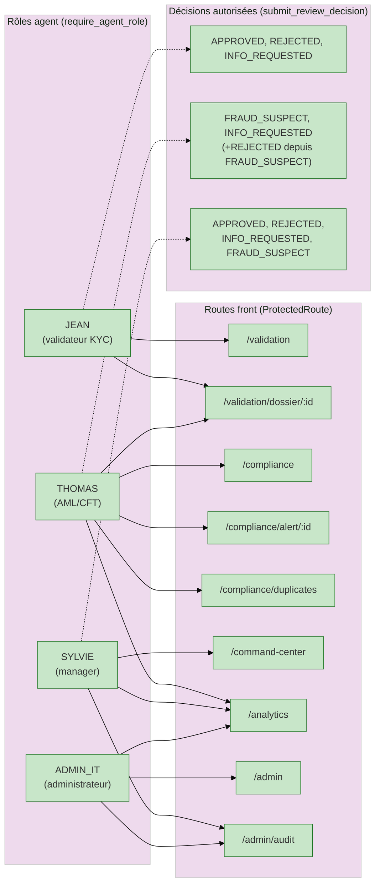
```mermaid
%%{init: {'theme': 'base', 'themeVariables': {'primaryColor': '#C8E6C9','primaryBorderColor':'#2E7D32'}}}%%
flowchart LR
    subgraph ROLES["Rôles agent (require_agent_role)"]
        JEAN["JEAN<br/>(validateur KYC)"]
        THOMAS["THOMAS<br/>(AML/CFT)"]
        SYLVIE["SYLVIE<br/>(manager)"]
        AIT["ADMIN_IT<br/>(administrateur)"]
    end

    subgraph FRONT["Routes front (ProtectedRoute)"]
        F1["/validation"]
        F2["/validation/dossier/:id"]
        F3["/compliance"]
        F4["/compliance/alert/:id"]
        F5["/compliance/duplicates"]
        F6["/command-center"]
        F7["/analytics"]
        F8["/admin"]
        F9["/admin/audit"]
    end

    subgraph BACK["Décisions autorisées (submit_review_decision)"]
        D1["APPROVED, REJECTED, INFO_REQUESTED"]
        D2["FRAUD_SUSPECT, INFO_REQUESTED<br/>(+REJECTED depuis FRAUD_SUSPECT)"]
        D3["APPROVED, REJECTED,<br/>INFO_REQUESTED, FRAUD_SUSPECT"]
    end

    JEAN --> F1
    JEAN --> F2
    THOMAS --> F2
    THOMAS --> F3
    THOMAS --> F4
    THOMAS --> F5
    THOMAS --> F7
    SYLVIE --> F6
    SYLVIE --> F7
    SYLVIE --> F9
    AIT --> F7
    AIT --> F8
    AIT --> F9

    JEAN -.-> D1
    THOMAS -.-> D2
    SYLVIE -.-> D3
```

**Lecture du diagramme.** Le RBAC est appliqué à **deux endroits** :

1. **Côté backoffice** (routeur React) : `ProtectedRoute` + `RoleRedirect` filtrent l'accès aux pages.
2. **Côté backend** (FastAPI dependencies) : `get_current_agent` + `require_agent_role(...)` filtrent l'accès aux endpoints ET aux décisions.

**Règle d'or :** toute modification de rôle doit être faite **simultanément** des deux côtés, et un test d'accès non-autorisé doit être ajouté.

> **Cross-link.** Détail dans [`docs/api-contracts.md`](./api-contracts.md) § « Decision rules in `submit_review_decision` ».

### 4.9 Happy-path end-to-end

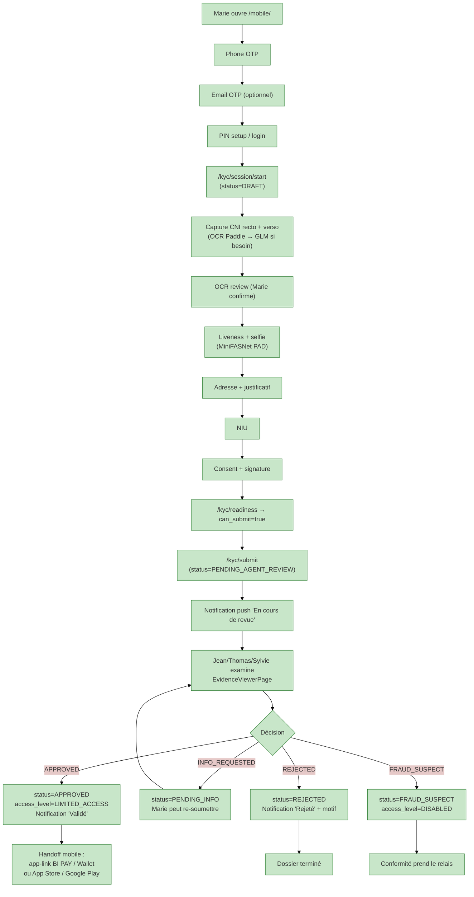
```mermaid
%%{init: {'theme': 'base', 'themeVariables': {'primaryColor': '#C8E6C9','primaryBorderColor':'#2E7D32'}}}%%
flowchart TB
    A["Marie ouvre /mobile/"] --> B["Phone OTP"]
    B --> C["Email OTP (optionnel)"]
    C --> D["PIN setup / login"]
    D --> E["/kyc/session/start<br/>(status=DRAFT)"]
    E --> F["Capture CNI recto + verso<br/>(OCR Paddle → GLM si besoin)"]
    F --> G["OCR review (Marie confirme)"]
    G --> H["Liveness + selfie<br/>(MiniFASNet PAD)"]
    H --> I["Adresse + justificatif"]
    I --> J["NIU"]
    J --> K["Consent + signature"]
    K --> L["/kyc/readiness → can_submit=true"]
    L --> M["/kyc/submit<br/>(status=PENDING_AGENT_REVIEW)"]
    M --> N["Notification push 'En cours de revue'"]
    N --> O["Jean/Thomas/Sylvie examine<br/>EvidenceViewerPage"]
    O --> P{Décision}
    P -->|APPROVED| Q["status=APPROVED<br/>access_level=LIMITED_ACCESS<br/>Notification 'Validé'"]
    P -->|INFO_REQUESTED| R["status=PENDING_INFO<br/>Marie peut re-soumettre"]
    R --> O
    P -->|REJECTED| S["status=REJECTED<br/>Notification 'Rejeté' + motif"]
    P -->|FRAUD_SUSPECT| T["status=FRAUD_SUSPECT<br/>access_level=DISABLED"]

    Q --> U["Handoff mobile :<br/>app-link BI PAY / Wallet<br/>ou App Store / Google Play"]
    S --> V["Dossier terminé"]
    T --> W["Conformité prend le relais"]
```

**Lecture du diagramme.** Le happy-path est linéaire avec un seul aller-retour possible (PENDING_INFO). L'approbation débloque l'access_level `LIMITED_ACCESS` et déclenche le handoff OS-aware vers les apps aval. Les chemins `REJECTED` et `FRAUD_SUSPECT` sont terminaux.

> **Cross-link.** Détail dans [`docs/maintainer-handbook.md`](./maintainer-handbook.md) § « Main Workflows ».

### 4.10 Handoff mobile aval (app-link)

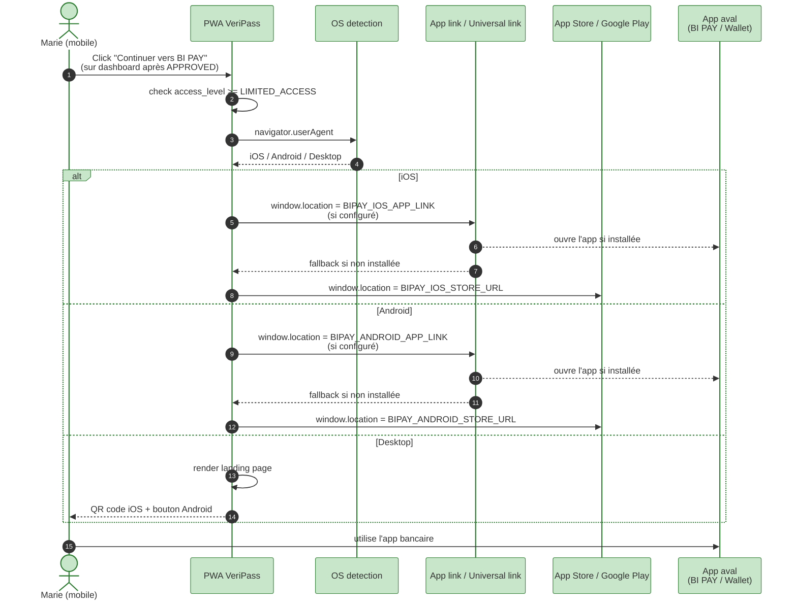
```mermaid
%%{init: {'theme': 'base', 'themeVariables': {'primaryColor': '#C8E6C9','primaryBorderColor':'#2E7D32'}}}%%
sequenceDiagram
    autonumber
    actor M as Marie (mobile)
    participant APP as PWA VeriPass
    participant OS as OS detection
    participant APPLNK as App link / Universal link
    participant STORE as App Store / Google Play
    participant BANK as App aval<br/>(BI PAY / Wallet)

    M->>APP: Click "Continuer vers BI PAY"<br/>(sur dashboard après APPROVED)
    APP->>APP: check access_level >= LIMITED_ACCESS
    APP->>OS: navigator.userAgent
    OS-->>APP: iOS / Android / Desktop
    alt iOS
        APP->>APPLNK: window.location = BIPAY_IOS_APP_LINK<br/>(si configuré)
        APPLNK-->>BANK: ouvre l'app si installée
        APPLNK-->>APP: fallback si non installée
        APP->>STORE: window.location = BIPAY_IOS_STORE_URL
    else Android
        APP->>APPLNK: window.location = BIPAY_ANDROID_APP_LINK<br/>(si configuré)
        APPLNK-->>BANK: ouvre l'app si installée
        APPLNK-->>APP: fallback si non installée
        APP->>STORE: window.location = BIPAY_ANDROID_STORE_URL
    else Desktop
        APP->>APP: render landing page
        APP-->>M: QR code iOS + bouton Android
    end
    M->>BANK: utilise l'app bancaire
```

**Lecture du diagramme.** Le handoff est **uniquement côté mobile**, basé sur des **variables d'environnement** (jamais de chaîne hard-codée) :

| Variable | Usage |
| --- | --- |
| `BIPAY_IOS_STORE_URL` | App Store fallback iOS pour BI PAY |
| `BIPAY_ANDROID_STORE_URL` | Google Play fallback Android pour BI PAY |
| `BIPAY_APP_LINK` | Universal/app link optionnel iOS+Android |
| `BICEC_WALLET_IOS_STORE_URL` | App Store fallback iOS pour Wallet / Mobile-Banking |
| `BICEC_WALLET_ANDROID_STORE_URL` | Google Play fallback Android pour Wallet / Mobile-Banking |
| `BICEC_WALLET_APP_LINK` | Universal/app link optionnel iOS+Android |

**Valeurs publiques de référence** (à confirmer avec BICEC avant release) :

| Destination | iOS | Android |
| --- | --- | --- |
| BI PAY | `https://apps.apple.com/us/app/bipay-bicec-mobile-wallet/id1532756992` | `https://play.google.com/store/apps/details?id=com.bicec.bipay` |
| BICEC Mobile-Banking | `https://apps.apple.com/us/app/bicec-mobile-banking/id1011209991` | (à confirmer) |

> **Cross-link.** Détail dans [`docs/api-contracts.md`](./api-contracts.md) § « Downstream App Handoff ».

---

## 5. Opérations et handover

### 5.1 Topologie de déploiement

```mermaid
%%{init: {'theme': 'base', 'themeVariables': {'primaryColor': '#E8EAF6','primaryBorderColor':'#283593'}}}%%
flowchart TB
    HOST["Hôte (Windows + WSL2<br/>ou Linux)"] --> DC["Docker Desktop / Engine"]
    DC --> COMPOSE["docker compose -f code/docker-compose.yml"]

    COMPOSE --> NGX[vp_nginx]
    COMPOSE --> PWA[vp_pwa]
    COMPOSE --> BO[vp_backoffice]
    COMPOSE --> API[vp_api]
    COMPOSE --> PG[vp_postgres]
    COMPOSE --> RD[vp_redis]
    COMPOSE --> OCR[vp_celery_ocr]
    COMPOSE --> NOT[vp_celery_notif]
    COMPOSE --> BEAT[vp_celery_beat]
    COMPOSE --> MP[vp_mailpit]
    COMPOSE --> FWR[vp_flower]
    COMPOSE --> SI[vp_storage_init]

    SI --> DBV[(code_db_storage)]
    SI --> DBB[(code_db_backups)]
    SI --> DOCV[(code_documents_storage)]
    SI --> MODV[(code_models_storage)]
```

**Cross-link.** [`docs/deployment-guide.md`](./deployment-guide.md).

### 5.2 Topologie backup et rétention

```mermaid
%%{init: {'theme': 'base', 'themeVariables': {'primaryColor': '#E8EAF6','primaryBorderColor':'#283593'}}}%%
flowchart LR
    BEAT[vp_celery_beat] -->|01:00 UTC| PG_BAK["pg_dump → /backups/db<br/>(code_db_backups)"]
    BEAT -->|Dimanche 02:00 UTC| KYC_BAK["Archive chiffrée<br/>(code_documents_storage)"]
    BEAT -->|03:30 UTC| CATCH["check_and_catchup_backup<br/>(déclenche KYC_BAK si manquant)"]

    PG_BAK -->|Rétention locale| POL1["Politique: voir retention-policy.md"]
    KYC_BAK -->|Chiffrement AES| KEY["BACKUP_ENCRYPTION_KEY"]

    subgraph RESTORE["Restauration (procédure manuelle)"]
        R1["1. Stop api + workers"]
        R2["2. Charger archive pg_dump"]
        R3["3. pg_restore"]
        R4["4. Restart api + workers"]
    end

    PG_BAK -.-> RESTORE
    KYC_BAK -.-> RESTORE
```

**Rétention** :

| Donnée | Localisation | Backup | Rétention |
| --- | --- | --- | --- |
| PostgreSQL | `code_db_storage` | `code_db_backups` (`/backups/db`) | Selon `retention-policy.md` |
| KYC documents | `code_documents_storage` | archive chiffrée locale | Selon `retention-policy.md` |
| Modèles OCR/IA | `code_models_storage` (bind mount) | image / archive | Hors ligne ; pas un backup applicatif |
| Redis | `redis_data` | aucun (transient) | n/a |

> **Cross-link.** [`docs/retention-policy.md`](./retention-policy.md) et [`docs/deployment-guide.md`](./deployment-guide.md) § « Backups ».

### 5.3 Carte d'observabilité

```mermaid
%%{init: {'theme': 'base', 'themeVariables': {'primaryColor': '#E8EAF6','primaryBorderColor':'#283593'}}}%%
flowchart TB
    subgraph HEALTH["Health endpoints"]
        H1["GET /api/health (Nginx)"]
        H2["GET /api/v1/auth/health"]
        H3["GET /api/v1/sentry-proxy/health"]
    end

    subgraph LOGS["Logs"]
        L1["JSON structured (app/core/logging.py)"]
        L2["docker compose logs --tail api"]
        L3["docker compose logs celery_*"]
    end

    subgraph MON["Monitoring"]
        F["Flower (vp_flower)<br/>https://localhost/flower/"]
    end

    subgraph ERR["Error tracking"]
        S1["Sentry backend (SENTRY_DSN_BACKEND)"]
        S2["Sentry mobile (VITE_SENTRY_DSN_MOBILE)"]
        S3["Sentry backoffice (VITE_SENTRY_DSN_BACKOFFICE)"]
        SP["/api/v1/sentry-proxy<br/>(same-origin)"]
    end

    HEALTH --> ONCALL["On-call / Mainteneur"]
    LOGS --> ONCALL
    F --> ONCALL
    ERR --> ONCALL
```

> **Cross-link.** [`docs/operations-runbook.md`](./operations-runbook.md).

### 5.4 Où changer quoi

| Demande de changement | Fichiers principaux | Vérifier aussi |
| --- | --- | --- |
| Ajouter un écran mobile KYC | `code/mobile/src/App.tsx`, `code/mobile/src/views/kyc/*`, `code/mobile/src/hooks/useKycFlow.tsx`, `code/mobile/src/contexts/KycContext.tsx` | backend `modules/kyc/router.py`, tests E2E mobile |
| Ajouter un appel API mobile | `code/mobile/src/services/apiClient.ts` (ou service de feature) | router backend, types TS, tests |
| Modifier les champs OCR | `code/backend/app/modules/kyc/service.py`, `code/backend/app/services/ocr_service.py` | écrans OCR mobile et backoffice |
| Modifier le scoring liveness | `code/backend/app/modules/kyc/service.py` | `code/mobile/src/views/kyc/LivenessScreen.tsx` |
| Modifier la readiness de soumission | `code/backend/app/modules/kyc/router.py` | `code/mobile/src/views/kyc/ReviewScreen.tsx` |
| Modifier la queue backoffice | `code/backend/app/modules/backoffice/router.py` | `code/backoffice/src/services/dossier-service.ts`, pages validation |
| Modifier AML | `code/backend/app/modules/aml/service.py`, `code/backend/app/modules/aml/router.py` | pages compliance |
| Modifier analytics | `code/backend/app/modules/analytics/service.py` | `code/backoffice/src/pages/analytics/AnalyticsPage.tsx` |
| Ajouter une table | modèle SQLAlchemy + migration Alembic + schemas Pydantic + tests + `docs/data-models.md` | — |
| Modifier une config déploiement | `code/docker-compose.yml`, `code/.env.example`, `code/infra/nginx/nginx.conf` | — |
| Modifier un job planifié | `code/backend/app/core/celery_config.py` (beat), implémentation tâche, worker Compose | idempotence de la tâche |
| Modifier un rôle | `require_agent_role(...)` backend + routes backoffice + `ProtectedRoute` + tests 401/403 | — |

### 5.5 Invariants critiques

1. **Ne jamais supprimer les volumes Docker persistants** (`code_db_storage`, `code_documents_storage`, `code_db_backups`) comme fix ponctuel.
2. **Les fichiers KYC** vivent dans le volume de documents ; PostgreSQL ne stocke que les chemins et les SHA-256.
3. **`status` (KYC) et `access_level` (permission) sont deux dimensions orthogonales** — ne jamais les fusionner.
4. **`APPROVED` mappe par défaut sur `LIMITED_ACCESS`.**
5. **`FRAUD_SUSPECT` mappe sur `DISABLED`.**
6. **`PENDING_INFO` reste éditable** côté client (le client doit pouvoir uploader les pièces demandées).
7. **Toute vérification de rôle agent** doit être faite côté backend ET reflétée côté frontend (routes + `ProtectedRoute`).
8. **Le `X-Device-Tag` est obligatoire** sur les actions sensibles dès qu'un user a au moins un device actif enregistré.
9. **`OTP_MODE=dev_local` est strictement interdit en production** (rejeté au démarrage par `core/config.py`).
10. **`OCR_ONLINE=false`** est la valeur normale en mode souverain / démo offline.
11. **VeriPass n'est PAS** une intégration DGI, Sopra Amplitude, ou core banking. Tout document historique qui le dit est obsolète sur ce point.
12. **Le handoff vers BI PAY / Wallet / Mobile-Banking** se fait par **app-link + fallback store**, jamais par intégration backend.
13. **Le `openapi-spec.json` statique** peut être périmé ; le runtime `/api/v1/openapi.json` et `/api/v1/docs` font foi.

### 5.6 Commandes smoke (copier-coller)

> **Pré-requis** : Docker Desktop (WSL2 activé) et PowerShell sur Windows, ou Docker + bash sur Linux.

```powershell
# 1. Copier la config et créer les volumes
copy code\.env.example code\.env
notepad code\.env
.\code\scripts\ensure_docker_volumes.ps1

# 2. Construire et démarrer la stack MVP
docker compose -f code/docker-compose.yml build
docker compose -f code/docker-compose.yml up -d api pwa backoffice postgres redis celery_ocr celery_notifications celery_beat mailpit nginx flower

# 3. Vérifier l'état
docker compose -f code/docker-compose.yml ps

# 4. Smoke test
Invoke-RestMethod http://localhost:8001/api/health
.\code\scripts\smoke_mvp_docker.ps1

# 5. Migrations
docker compose -f code/docker-compose.yml exec -T api alembic current
docker compose -f code/docker-compose.yml exec -T api alembic upgrade head

# 6. Backend tests
docker compose -f code/docker-compose.yml exec -T api pytest

# 7. Mobile (hors stack)
cd code\mobile
bun install
bun run test
bun run build

# 8. Backoffice (hors stack)
cd code\backoffice
bun install
bun run test
bunx tsc --noEmit
bun run build

# 9. URLs manuelles à vérifier
# - https://localhost/mobile/
# - https://localhost/back-office/
# - https://localhost/api/v1/docs
# - https://localhost/flower/
# - http://localhost:8025/  (Mailpit)
```

### 5.7 Zones à risque connu

| Zone | Pourquoi c'est risqué | Comment travailler prudemment |
| --- | --- | --- |
| Warmup OCR | Modèles lourds, premier appel, pression mémoire | Vérifier logs, montages modèles, mémoire WSL2, isoler les changements |
| Readiness KYC | Beaucoup de champs, conditions offline | Tester sessions partielles + happy-path complet |
| RBAC backoffice | Double enforcement front/back | Mettre à jour les deux, tester les chemins non autorisés |
| Migrations Alembic | Volumes persistants en production | Backup avant toute migration risquée |
| Pathing Nginx | `/mobile/`, `/back-office/`, deep-links | Tester le refresh direct sur routes imbriquées |
| Celery beat | Backups, pruning, sanctions, expiry | Vérifier le schedule et l'idempotence des tâches |
| Docker socket (celery_beat) | Puissant, dangereux en production | Restreindre ou redéfinir pour la production |
| Fichiers evidence | Volumineux, générés | Régénérer plutôt qu'éditer à la main |
| Modèles hors-ligne | Gigas, montage obligatoire | Garder `OFFLINE_MODELS_DIR` synchronisé entre dev/prod |
| `BACKUP_ENCRYPTION_KEY` | Ne doit jamais être `JWT_SECRET` | Forcer valeur distincte en CI |

### 5.8 Glossaire FR/EN

| FR | EN | Signification |
| --- | --- | --- |
| KYC | KYC | Know Your Customer — identification client |
| PWA | PWA | Progressive Web App |
| SPA | SPA | Single Page Application |
| OCR | OCR | Reconnaissance optique de caractères |
| PAD | PAD | Presentation Attack Detection (anti-spoofing) |
| PEP | PEP | Personnes Exposées Politiquement |
| AML/CFT | AML/CFT | Anti-Money Laundering / Counter Financing of Terrorism |
| COBAC | COBAC | Commission Bancaire d'Afrique Centrale (régulateur) |
| NIU | NIU | Numéro d'Identification Unique (fiscal Cameroun) |
| CNI | CNI | Carte Nationale d'Identité |
| RGPD / CGU | GDPR / ToS | Conformité et conditions d'usage |
| App-link | App link / Universal link | Schéma d'URL profond vers une app native |
| DGI | DGI | Direction Générale des Impôts (hors périmètre) |
| Sopra Amplitude | Sopra Amplitude | Core banking éditeur (hors périmètre) |
| Beat | Beat | Scheduler Celery |
| Handoff | Handoff | Transfert OS-aware vers une autre app |

### 5.9 Versioning et changelog

- **Version du document** : 1.0.0 (2026-06-02).
- **Politique** : tout changement de portée, d'architecture majeure, ou d'invariant doit être reflété ici et dans `docs/documentation-authority.md`.
- **Render** : régénérer les SVG, les PNG et le PDF via `docs/c4-architecture/render.ps1` (Windows) ou `docs/c4-architecture/render.sh` (Linux/WSL). Voir [Annexe B](#annexe-b--rendu-svg-png-et-pdf--comment-régénérer).
- **Changelog** :

| Date | Version | Auteur | Note |
| --- | --- | --- | --- |
| 2026-06-02 | 1.0.0 | Ken | Création du document maître C4, re-cadrage DGI/Amplitude, handoff mobile aval explicite. |

---

## 6. Annexes

### Annexe A — Index croisé master ↔ docs détaillées

| Section master | Doc de référence | Diagrammes liés |
| --- | --- | --- |
| § 0 Cadrage | [`docs/project-overview.md`](./project-overview.md), [`docs/documentation-authority.md`](./documentation-authority.md) | — |
| § 1 Contexte | [`docs/project-overview.md`](./project-overview.md) § « Main Users » | `docs/diagrams/use-case-diagrams.md`, `docs/diagrams/user-personas.md`, `docs/diagrams/user-journey-maps.md` |
| § 2 Containers | [`docs/architecture.md`](./architecture.md) § « Container Architecture » | — |
| § 2.3 Nginx | [`docs/architecture.md`](./architecture.md) § « Nginx Routing » | — |
| § 3.1 Backend entry | [`docs/architecture.md`](./architecture.md) § « Backend Architecture » | — |
| § 3.2 Modules | [`docs/component-inventory.md`](./component-inventory.md) | `docs/diagrams/architecture/sitemap-diagram.md` |
| § 3.3 Transverse | [`docs/source-tree-analysis.md`](./source-tree-analysis.md) § « Backend Tree » | — |
| § 3.4 Mobile | [`docs/component-inventory.md`](./component-inventory.md) § « Mobile PWA » | `docs/diagrams/flows/*` |
| § 3.5 Backoffice | [`docs/component-inventory.md`](./component-inventory.md) § « Backoffice SPA » | — |
| § 4.1 État KYC | [`docs/data-models.md`](./data-models.md) § « KYC Tables » | `docs/diagrams/statechart-access.md` (re-authored) |
| § 4.2 Séquence KYC | [`docs/architecture.md`](./architecture.md) § « KYC Submission Flow » | `docs/diagrams/sequence-capture-upload.md` (re-authored) |
| § 4.3 OCR/biométrie | [`docs/architecture.md`](./architecture.md) § « OCR And Biometrics » | — |
| § 4.4 Celery | [`docs/architecture.md`](./architecture.md) § « Async Jobs » | — |
| § 4.5 Modèle | [`docs/data-models.md`](./data-models.md) | `docs/diagrams/er-application.md` (re-authored) |
| § 4.6 Revue BO | [`docs/api-contracts.md`](./api-contracts.md) § « Backoffice API » | — |
| § 4.8 RBAC | [`docs/api-contracts.md`](./api-contracts.md) | — |
| § 4.10 Handoff | [`docs/api-contracts.md`](./api-contracts.md) § « Downstream App Handoff » | — |
| § 5 Opérations | [`docs/operations-runbook.md`](./operations-runbook.md), [`docs/deployment-guide.md`](./deployment-guide.md) | `docs/diagrams/information-architecture.md` (re-authored) |
| § 5.4 Change map | [`docs/maintainer-handbook.md`](./maintainer-handbook.md) § « Where To Make Changes » | — |
| § 5.5 Invariants | [`docs/maintainer-handbook.md`](./maintainer-handbook.md) § « Critical Invariants » | — |
| § 5.6 Smoke | [`docs/development-guide.md`](./development-guide.md), [`docs/operations-runbook.md`](./operations-runbook.md) | — |

### Annexe B — Rendu SVG, PNG et PDF — comment régénérer

Les diagrammes de ce document sont en syntaxe **Mermaid** et sont rendus nativement par GitHub, VS Code, Obsidian, etc. Pour des exports SVG / PNG / PDF :

**Pré-requis :**

- Node.js 18+
- `npm i -g @mermaid-js/mermaid-cli` (binaire `mmdc`)
- (optionnel, pour le PDF) Pandoc + Chrome / chrome-headless-shell ou WeasyPrint

**Windows (PowerShell) :**

```powershell
cd docs\c4-architecture
.\render.ps1            # SVG + PNG
.\render.ps1 -Pdf       # SVG + PNG + PDF
```

**Linux / WSL :**

```bash
cd docs/c4-architecture
./render.sh             # SVG + PNG
./render.sh --pdf       # SVG + PNG + PDF
```

Les fichiers produits :

- `docs/c4-architecture/diagrams/c4-{level}-{num}-{slug}.svg` — un SVG par diagramme.
- `docs/c4-architecture/diagrams/c4-{level}-{num}-{slug}.png` — un PNG haute résolution par diagramme, avec layout `elk`, adapté à Word.
- `docs/c4-architecture/BICEC-VERIPASS-VUE-ENSEMBLE.pdf` — PDF imprimable A4.
- `docs/c4-architecture/mermaid/*.mmd` — sources Mermaid extraites (pour édition sans toucher au master).

> **Note.** Les scripts ne sont pas exécutés automatiquement par opencode. Ils sont fournis pour que l'équipe BICEC puisse régénérer les artefacts après une édition du document maître. Voir [`docs/c4-architecture/render.ps1`](./c4-architecture/render.ps1) et [`docs/c4-architecture/render.sh`](./c4-architecture/render.sh) pour le détail.

### Annexe C — Note d'autorité documentaire

> **Source of truth = code + ce document maître.**

Ce document maître (`BICEC-VERIPASS-VUE-ENSEMBLE.md`) et les fichiers `code/*` font foi pour l'architecture, le périmètre, et le comportement courant du système. Les autres documents de `docs/` restent **référence de détail** (deep-dive) lorsqu'ils sont à jour.

Les documents suivants sont **historiques** et ne doivent pas être utilisés pour définir le comportement, le périmètre, ou la roadmap :

- Tous les fichiers sous `docs/diagrams/_obsolete/`
- `docs/agents_output/` (consolidations de prototypes)
- `docs/integration-analysis/`, `docs/integration-analysis-gatekeeper.md`
- `docs/consultant-integration-prompt.md`, `docs/stitch-prompts.md`
- Tous les diagrammes de `docs/diagrams/` qui mentionnent DGI, Sopra Amplitude, ou core banking (leurs versions re-authored se trouvent dans `docs/diagrams/` racine).

En cas de conflit entre ce document et un document plus ancien, **ce document prévaut** sauf mention explicite dans `docs/documentation-authority.md`.

---

**Fin du document.**
