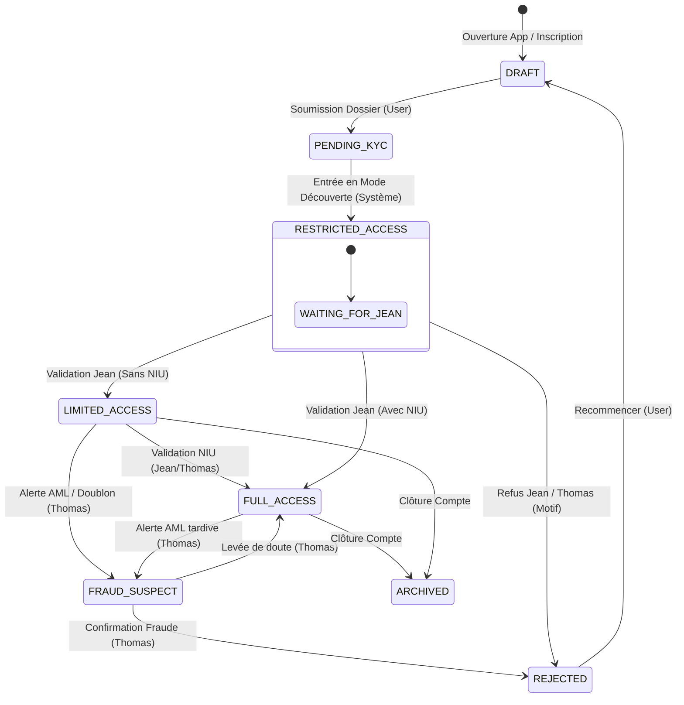

# ADR-001 – États d’accès et transitions

*   **Statut** : Accepté
*   **Date** : 2026-02-26
*   **Auteur** : Expert Product/UX Engineer

## 1. Contexte et Problématique

Le projet **bicec-veripass** doit digitaliser l'onboarding KYC de la BICEC tout en respectant des contraintes réglementaires et techniques strictes :
*   **Contraintes COBAC (R-2023/01)** : Nécessité d'un "Human-in-the-Loop" (validation manuelle obligatoire) et traçabilité complète.
*   **Contraintes UX** : Marie (l'entrepreneuse) doit pouvoir reprendre sa session en cas de coupure (Délestage/3G instable). Le parcours doit être fluide (<11 min) mais sécurisé (lockout après 3 échecs de liveness).
*   **Contraintes d'Infrastructure** : Déploiement 100% On-Premise sur des machines i3/16GB, imposant une gestion efficace des données et des états.
*   **Besoin métier** : Différencier les niveaux d'accès (RESTRICTED vs LIMITED vs FULL) pour offrir une valeur immédiate (découverte des services) tout en limitant les risques avant validation complète.

## 2. Décision : Modélisation des États KYC

### 2.1. Définition des États

| État | Description |
| :--- | :--- |
| **DRAFT** | Session locale en cours sur le mobile. Données non encore soumises au backend. |
| **PENDING_KYC** | Dossier soumis par l'utilisateur, en attente de revue par Jean (Agent KYC). |
| **RESTRICTED_ACCESS** | État post-soumission (Marie découvre l'app en lecture seule) ou suite à une expiration de document. |
| **LIMITED_ACCESS** | Dossier validé par Jean mais NIU non vérifié (déclaratif). Opérations de sortie bloquées. |
| **FULL_ACCESS** | Dossier complet et NIU validé. Toutes les fonctionnalités bancaires sont actives. |
| **REJECTED** | Dossier refusé par Jean ou Thomas (motif technique ou non-conformité). |
| **FRAUD_SUSPECT** | Dossier marqué comme suspect par Thomas (AML/CFT) suite à une alerte PEP/Sanctions ou doublon. |
| **ARCHIVED** | Client inactif ou dossier clôturé après une longue période. |

### 2.2. Diagramme d'États (Mermaid)

### 2.3. Matrice des Transitions

| Déclencheur | État Initial | État Final | Acteur | Condition / Pourquoi |
| :--- | :--- | :--- | :--- | :--- |
| **Soumission** | DRAFT | PENDING_KYC | Utilisateur | Fin du parcours mobile, signature digitale. |
| **Passage Vitrine** | PENDING_KYC | RESTRICTED_ACCESS | Système | Permet à Marie d'explorer les offres BICEC. |
| **Approbation Partielle** | RESTRICTED_ACCESS | LIMITED_ACCESS | Jean | Identité OK, mais NIU manquant ou déclaratif. |
| **Approbation Totale** | RESTRICTED_ACCESS | FULL_ACCESS | Jean | Identité OK + NIU valide (attestation). |
| **Vérification NIU** | LIMITED_ACCESS | FULL_ACCESS | Jean / Thomas | Le NIU est validé a posteriori. |
| **Alerte AML** | N'importe lequel | FRAUD_SUSPECT | Thomas | Match PEP/Sanctions trouvé ou suspicion fraude. |
| **Refus** | N'importe lequel | REJECTED | Jean / Thomas | Document illisible, usurpation, ou non-conformité. |
| **Timeout / Expiration** | FULL_ACCESS | RESTRICTED_ACCESS | Système | Document KYC expiré (ex: CNI périmée). |

## 3. Détails de Mise en Œuvre

### 3.1. Mapping Base de Données (PostgreSQL)

Le modèle de données doit intégrer les colonnes suivantes dans la table `clients` ou `kyc_dossiers` :
*   `kyc_status` (ENUM) : `DRAFT`, `PENDING_KYC`, `VALIDATED`, `REJECTED`, `FRAUD`
*   `access_level` (ENUM) : `RESTRICTED`, `LIMITED`, `FULL`
*   `is_niu_verified` (BOOLEAN) : Pour distinguer LIMITED (false) de FULL (true).
*   `validation_step` (STRING) : `JEAN_REVIEW`, `THOMAS_AML`, `PROVISIONING`.
*   `timestamps` : `submitted_at`, `validated_at`, `rejected_at`.
*   `audit_trail` (JSONB) : Log de toutes les actions (qui a changé l'état et pourquoi).

### 3.2. Logique de Gating (Mobile & Back)

*   **Mobile (Frontend)** :
    *   `access_level == RESTRICTED` : Banner orange "⏳ En cours de validation". Boutons d'actions avec tooltips "Disponible après validation".
    *   `access_level == LIMITED` : Banner jaune "⚠️ Complétez votre NIU". Blocage des opérations sortantes (Virements, Cash-Out) via un middleware API.
*   **Back-Office (Portal)** :
    *   **Jean** voit les dossiers en `PENDING_KYC`.
    *   **Thomas** voit les dossiers en `FRAUD_SUSPECT` ou les erreurs de provisioning Amplitude.
    *   **Système** automatise le passage en `PROVISIONING` vers Sopra Amplitude dès que l'approbation Jean est reçue.

## 4. Conséquences

*   **Impact API** : Chaque endpoint sensible (virements, cartes) doit vérifier le `access_level` en base avant exécution.
*   **Compatibilité** : Ces états sont 100% cohérents avec la spec UX v2.1 et les FR16/FR45 du PRD.
*   **Performance** : L'utilisation d'ENUMs et d'index sur `kyc_status` garantit des temps de réponse <3s pour les dashboards managers (Sylvie).
*   **Audit** : Le SHA-256 integrity hash doit être recalculé à chaque changement d'état pour garantir l'immutabilité de l'historique réglementaire.
