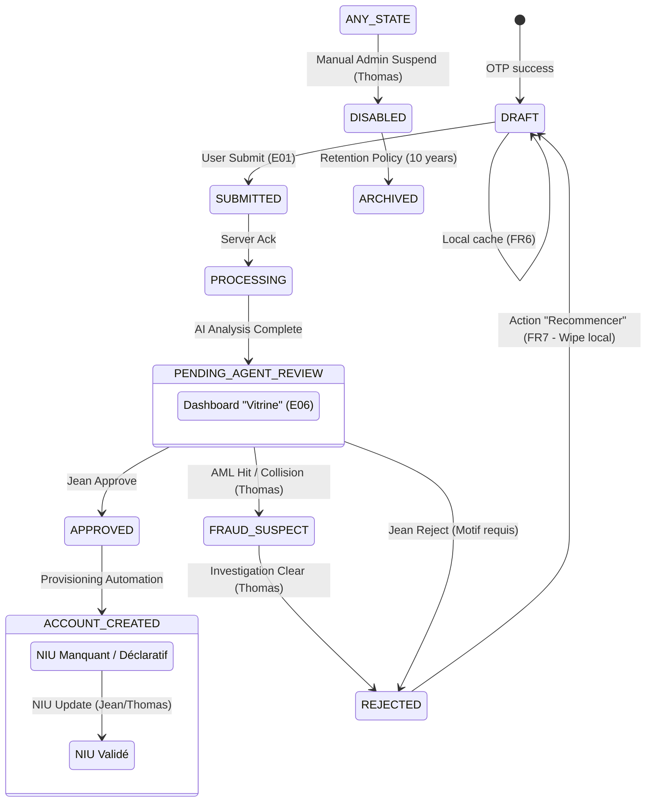

# ADR-001 – États d’accès et transitions

**Statut :** ACCEPTÉ  
**Auteur :** Ken / Junior Product-UX Engineer  
**Date :** 2026-02-27  

## Contexte
La conformité COBAC (R-2023/01) impose une validation humaine ("Human-in-the-Loop") pour toute ouverture de compte. Parallèlement, la loi 2024-017 (Cameroun) exige une souveraineté totale des données.  
D'un point de vue UX, nous devons gérer la résilience locale (FR6, FR7), la découverte des services post-soumission (FR39-47) et les accès restreints (FR16).

## Décision

Nous adoptons un modèle d'états hybride dissociant le **cycle de vie interne** (`lifecycle_state`) et les **paliers d'accès utilisateur** (`access_tier`).

### 1. Mapping Lifecycle vs Access Tier

| Lifecycle State (Interne) | Access Tier (Externe) | Description |
| :--- | :--- | :--- |
| `DRAFT` | `GUEST` | Session locale uniquement (Persistence local cache). |
| `SUBMITTED` | `RESTRICTED_ACCESS` | Dossier reçu par le serveur, en cours de traitement initial. |
| `PROCESSING` | `RESTRICTED_ACCESS` | AI Engine (OCR, Biométrie) en cours d'exécution. |
| `PENDING_AGENT_REVIEW` | `RESTRICTED_ACCESS` | En attente de validation par Jean. Dashboard "Vitrine". |
| `APPROVED` | `LIMITED_ACCESS` (par défaut) | Validé par Jean. Provisionné dans Amplitude. |
| `ACCOUNT_CREATED` | `LIMITED_ACCESS` or `FULL_ACCESS` | Statut final basé sur la validité du NIU. |
| `REJECTED` | `GUEST` | Dossier refusé. Redirection vers écran de relance (B10_Fail). |
| `FRAUD_SUSPECT` | `DISABLED` | Alertes Thomas (AML, Collision). Accès bloqué. |

### 2. Diagramme d'états (Mermaid)

### 3. Logique des Transitions (Détail)

| Transition | Acteur | Déclencheur | Justification Métier |
| :--- | :--- | :--- | :--- |
| **DRAFT → SUBMITTED** | Utilisateur | Bouton "Soumettre" | Consentements validés (D01) et données capturées. |
| **PENDING → APPROVED** | Jean | Clic "Approuver" | Identité confirmée via comparateur side-by-side (J08). |
| **APPROVED → LIMITED** | Système | Logic NIU | Si `niu_type` est 'declarative' (FR16). |
| **REJECTED → DRAFT** | Utilisateur | Clic "Recommencer" | Autorise une nouvelle tentative propre (FR7). |
| **PENDING → FRAUD** | Thomas | AML Alert | Empêche toute activation tant que Thomas n'a pas tranché. |

## Détails de mise en œuvre

### Mapping Base de Données (PostgreSQL)
- `lifecycle_state` (Enum) : Statut fin pour le queuing back-office.
- `access_tier` (Enum) : Statut macro pour les permissions API/Front.
- `niu_validated` (Boolean) : Flag déclencheur pour le passage LIMITED → FULL.
- `last_transition_at` : Timestamp pour le monitoring SLA de Sylvie (FR34).
- `metadata_integrity_hash` : SHA-256 du dossier pour l'audit COBAC (FR36).

## Conséquences

- **Mobile** : Utilisation d'un `AccessTierProvider` pour gérer dynamiquement les bannières et le blocage des fonctions (épargne, virements si LIMITED).
- **Back-Office** : Priorisation des files par `lifecycle_state`. Thomas gère les transitions complexes (FRAUD, Déduplication).
- **API** : Les permissions sont calculées sur `access_tier`. Les opérations financières sont rejetées si `access_tier != FULL_ACCESS`.
