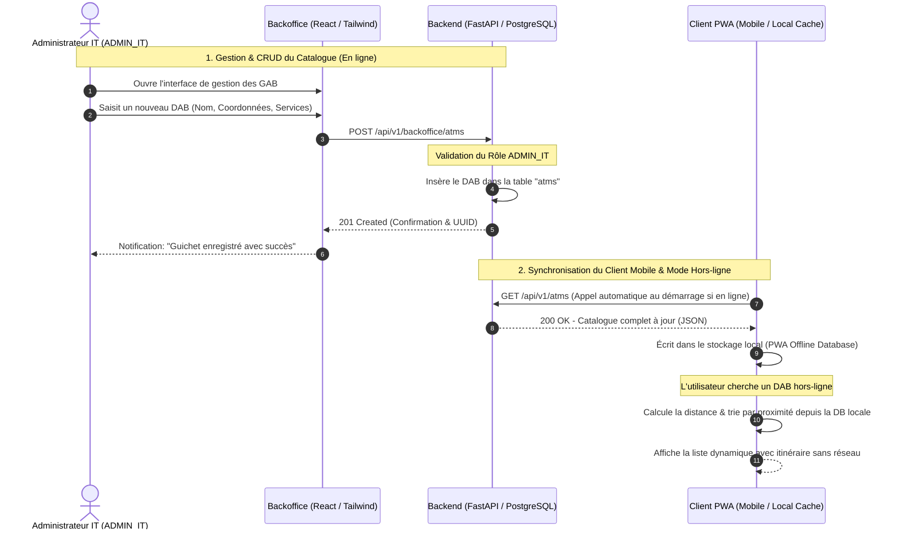

# ADR-017: Gestion dynamique du catalogue des GAB / DAB depuis le Backoffice

* **Statut** : Accepté / Approuvé (En cours d'implémentation)
* **Date** : 2026-05-24
* **Auteur** : Antigravity (Advanced Agentic Coding Engineering)

---

## 1. Contexte & Problématique

Dans les versions précédentes, la liste des Guichets Automatiques de Billets (GAB / DAB) de la BICEC était intégrée directement sous la forme d'un tableau JSON statique compilé dans le code de la PWA mobile client (`code/mobile/src/services/atmLocator.ts`).

Cette approche statique pose d'importantes limites opérationnelles :
1. **Zéro Évolutivité** : Toute ouverture d'un nouveau guichet, retrait d'un guichet défectueux, ou modification de l'état/services d'un DAB exigeait une recompilation et un re-déploiement de la PWA mobile.
2. **Aucune Administration** : L'équipe de gestion opérationnelle de la banque ne disposait d'aucun moyen simple de piloter le réseau de DAB en temps réel.
3. **Risque de Désynchronisation** : Les utilisateurs finaux naviguaient sur des données potentiellement erronées ou obsolètes en cas de défaillances réseau non documentées en dur.

---

## 2. Décision Architecturale

Pour garantir la souveraineté, la flexibilité et la conformité du système VeriPass, nous décidons d'introduire une architecture **dynamique, pilotée par base de données, et synchronisable hors-ligne**.

Les piliers de cette décision sont :
1. **Stockage Centralisé** : Création d'une table relationnelle PostgreSQL `atms` contenant la localisation, le statut, les tiers d'accès et les services proposés pour chaque guichet.
2. **Administration IT Dédiée** : Restreindre la gestion (Ajout, Modification, Suppression) de ce catalogue au rôle **`ADMIN_IT`** (Administrateur IT) via le Backoffice.
3. **Synchronisation Hors-Ligne (Offline-First Sync)** : La PWA client interroge l'endpoint public pour mettre à jour son stockage local (`localStorage` / `IndexedDB`) lorsqu'elle est en ligne, garantissant un fonctionnement 100% hors-ligne fluide et peu coûteux en requêtes réseau.

---

## 3. Diagramme de Séquence (Mermaid)

Voici le flux complet d'interaction pour la gestion et la synchronisation en mode hors-ligne :

---

## 4. Impacts et Conséquences

* **Positif** : Autonomie complète de l'équipe d'administration de la BICEC pour ajouter/éditer des guichets sans intervention des développeurs.
* **Positif** : Consommation de bande passante minimale : la PWA n'effectue la synchronisation du catalogue qu'une fois au démarrage si le réseau est disponible.
* **Positif** : Expérience utilisateur (UX) irréprochable et performante en mode hors-ligne.
* **Neutre** : Nécessite une migration de base de données initiale (Alembic) pour créer la table `atms`.
