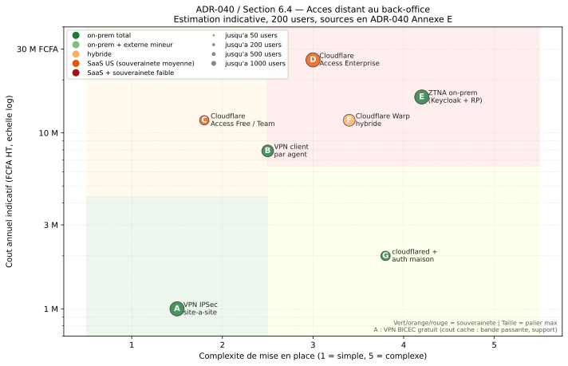
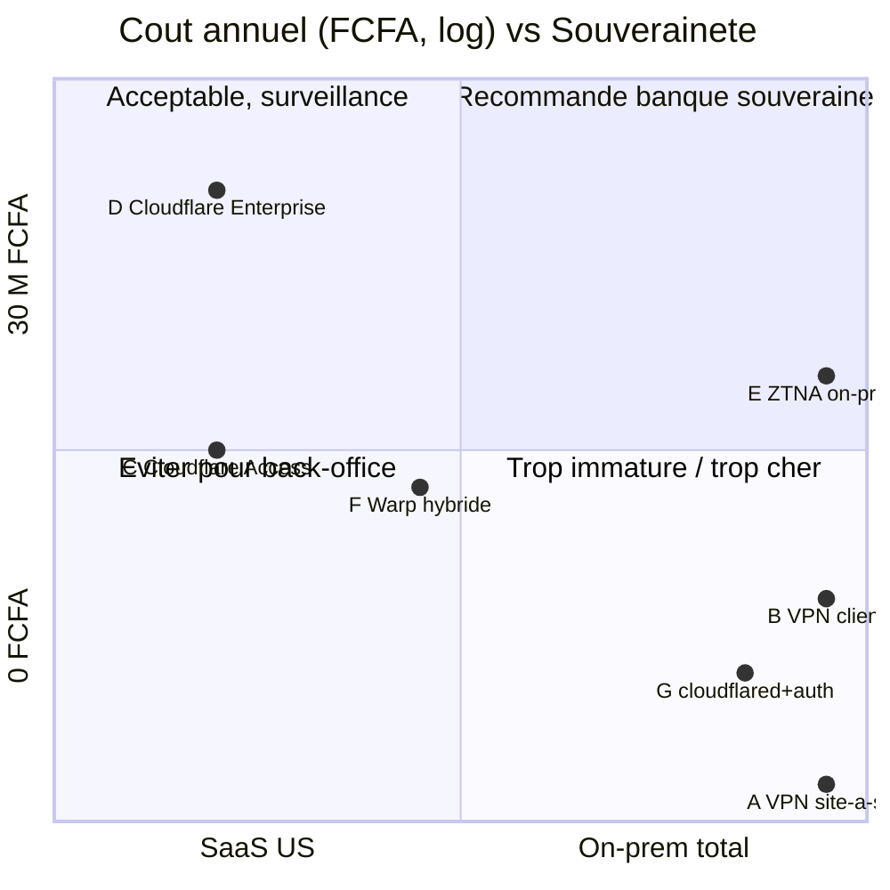

# ADR-040 — Accès distant au back-office multi-agences

| Champ | Valeur |
| --- | --- |
| Date | 2026-06-04 |
| Statut | Proposé |
| Auteur | Stage Xp-X5 |
| Décideurs | Équipe technique BICEC, RSSI, DSI |
| Référence master | [`docs/BICEC-VERIPASS-VUE-ENSEMBLE.md` § 6.4](../BICEC-VERIPASS-VUE-ENSEMBLE.md#64--accès-distant-au-back-office-multi-agences) |

## 1. Contexte

BICEC compte environ 600 collaborateurs répartis sur 40 agences au Cameroun. Le back-office VeriPass (revue KYC, validation AML, export de dossiers) doit être accessible aux :

- Agents en agence (≈ 100, en supposant 2-3 par agence en moyenne).
- Directeurs d'agence et leurs suppléants (≈ 60).
- Chefs de département + DG adjoint (≈ 20).
- Pool central (auditeurs KYC, support, admins VeriPass) (≈ 20).

Soit environ **200 utilisateurs back-office** à terme, avec une marge de croissance portant l'estimation haute à 250.

La PWA VeriPass est **publique** (exposée via `cloudflared`, sur Internet). Le back-office doit rester **strictement interne** : aucune URL publique ne doit permettre d'atteindre `/back-office`, même indirectement.

Aujourd'hui, la BICEC exploite un **VPN IPSec site-à-site** qui relie les agences au réseau central et qui sert déjà au core banking, aux GAB, et aux applications internes. Le `cloudflared` actuel n'expose que la PWA (quick tunnel en dev, named tunnel à mettre en prod sur `bicec.cm`).

La question tranchée par cet ADR est : **comment les agents distants accèdent au back-office VeriPass, et à quel coût, en préservant la souveraineté de l'infrastructure bancaire ?**

## 2. Décision

Par défaut, le back-office reste accessible via le **VPN IPSec site-à-site BICEC existant** (option A). C'est la solution déjà en place pour les autres outils internes, sans coût additionnel, sans rupture avec les pratiques de la banque.

En parallèle, le `quick tunnel` `trycloudflare.com` utilisé en dev est remplacé par un **named tunnel Cloudflare** sur le domaine `bicec.cm` (ou sous-domaine `veripass.bicec.cm`). Procédure en [Annexe D](#annexe-d--procédure-de-transfert-dns-vers-named-tunnel). Le `cloudflared` reste **gratuit** aussi longtemps qu'on n'active pas d'autres services Cloudflare (Access, WAF, Magic Transit).

À partir de **50 utilisateurs back-office**, l'option C (Cloudflare Access Team) est à reconsidérer si la souveraineté bancaire relâche ses contraintes ; sinon, l'option A tient sans problème jusqu'à 1 000+ utilisateurs.

## 3. Options considérées

Sept options ont été étudiées. Toutes chiffrent l'accès distant au back-office (pas la PWA, déjà couverte par le tunnel).

| # | Option | Type | Souveraineté | Auditabilité | Complexité | Coût (200 users) |
| --- | --- | --- | --- | --- | --- | --- |
| **A** | VPN IPSec site-à-site BICEC | On-prem | ★★★★★ | Logs NOC BICEC | Faible | ~0 FCFA (intégration) |
| **B** | VPN client par agent (FortiClient, GlobalProtect, etc.) | On-prem | ★★★★★ | Logs NOC | Moyenne | 3,3 M – 7,9 M FCFA/an |
| **C** | Cloudflare Access Free (≤50) / Team | SaaS | ★★☆ | Logs Cloudflare | Faible | 0 – 11,8 M FCFA/an |
| **D** | Cloudflare Access Enterprise | SaaS | ★★☆ | Logs Cloudflare | Moyenne | ~26 M FCFA/an |
| **E** | ZTNA on-prem (Keycloak + reverse proxy interne) | On-prem | ★★★★★ | SIEM interne | Haute | 13 M – 16 M FCFA/an |
| **F** | Cloudflare Warp hybride | Hybride | ★★★ | Logs Cloudflare | Moyenne | 11,8 M FCFA/an |
| **G** | `cloudflared` + auth maison (Keycloak/Biscuit) | On-prem | ★★★★★ | Logs internes | Haute | ~2 M FCFA/an |

### 3.1 Détail des options

**A — VPN IPSec site-à-site BICEC (recommandée).** Toutes les agences ont déjà un tunnel permanent vers le datacenter central. L'option A ne nécessite qu'une ACL autorisant les nouvelles IP du back-office VeriPass, ce qui est marginal en coût et en complexité. Aucun agent ne change ses habitudes. **Souveraineté totale, alignement avec le core banking, auditabilité par le NOC.**

**B — VPN client par agent.** Chaque agent installe un client (FortiClient, GlobalProtect, OpenVPN) sur son poste. Convient si certains agents ne sont pas dans une agence fixe (télétravail, déplacements). Coût additionnel : licences + maintenance + support NOC. **Même souveraineté que A, mais surface d'attaque légèrement plus grande (endpoint).**

**C — Cloudflare Access (Free ≤50, Team 50+).** Authentification Zero Trust devant le back-office, via le tunnel `cloudflared` déjà en place. Tier gratuit jusqu'à 50 utilisateurs, puis plan Team à 5-7 USD/user/mois. **Souveraineté moyenne (données transitent par Cloudflare, US). Intéressant si on veut une MFA moderne et du SSO, mais dépend d'un tiers.**

**D — Cloudflare Access Enterprise.** SLA, logs avancés, support 24/7. Sur devis (souvent 8-15 USD/user/mois). **Coût prohibitif à 200+ users si on n'a pas de besoin Enterprise strict.**

**E — ZTNA on-prem (Keycloak + reverse proxy).** Authentification centralisée sur Keycloak (open source, souverain) + reverse proxy interne (HAProxy, Traefik) qui exige une authentification avant de router vers le back-office. **Souveraineté maximale, mais demande de l'expertise (Keycloak n'est pas trivial à opérer). ROI pas justifié à 200 users ; pertinent à 1 000+ ou si la souveraineté devient critique.**

**F — Cloudflare Warp hybride.** Mixe de Warp (client léger) et de règles Cloudflare. Compromis coût / souveraineté. **Positionné en backup, pas en production.**

**G — `cloudflared` + auth maison.** On garde `cloudflared` pour la PWA, et on monte une couche d'authentification maison (Keycloak ou Biscuit) en interne. **Pas de valeur ajoutée par rapport à A pour 200 users.**

## 4. Grille de coûts par palier

Estimation indicative, **sources en [Annexe E](#annexe-e--sources-des-estimations)**. À valider avec les achats et le RSSI avant tout investissement.

| Option | 50 users | 200 users | 500 users | 1 000 users |
| --- | --- | --- | --- | --- |
| A — VPN site-à-site | 0 | 0 | 0 | 0 |
| B — VPN client | 1,3 M / an | 5,3 M / an | 13 M / an | 26 M / an |
| C — Cloudflare Access (Free / Team) | 0 | 11,8 M / an | 29 M / an | 60 M / an |
| D — Cloudflare Access Enterprise | Sur devis | ~26 M / an | ~65 M / an | ~130 M / an |
| E — ZTNA on-prem (Keycloak) | 8 M (setup) + 1 M / an | 13 M (amorti) | 16 M / an | 25 M / an |
| F — Cloudflare Warp hybride | 1 M (setup) + 2 M / an | 11,8 M / an | 20 M / an | 32 M / an |
| G — `cloudflared` + auth maison | 0 + 1 M (dev) | 0 + 1,5 M / an | Non viable | Non viable |

> Toutes les valeurs sont en **FCFA HT** (1 € ≈ 655,957 FCFA, indexation BCEAO).

> Pour A, "0 FCFA" cache des coûts réels : bande passante inter-sites, support NOC, mise à jour éventuelle des équipements VPN. Ces coûts sont mutualisés avec le reste du SI et ne sont pas attribuables au seul back-office VeriPass.

## 5. Conséquences

### 5.1 Positives

- **Alignement maximal** avec les autres outils internes de la banque (core banking, GAB, applications métier).
- **Souveraineté préservée** : aucune donnée de back-office ne transite par un service externe.
- **Coût marginal nul** : le VPN central est déjà amorti sur les autres applications.
- **Auditabilité par le NOC BICEC** : les logs d'accès sont ceux du SI existant, déjà outillés et supervisés.
- **Pas de nouveau fournisseur critique** : pas de dépendance SaaS nouvelle à intégrer dans la politique RSSI.

### 5.2 Négatives

- **Pas de MFA granulaire natif** au niveau applicatif (VeriPass a son propre login, mais le canal réseau ne fait pas de MFA). Mitigation : OTP SMS/email déjà implémenté dans le back-office (cf. module `auth` du code).
- **Dépendance au VPN central** : si le VPN tombe, le back-office est injoignable. Mitigation : redondance des équipements VPN (déjà en place), mode dégradé possible via accès direct à la salle serveur pour les cas critiques.
- **Latence inter-agences** : si la WAN entre une agence et le datacenter est saturée, l'accès back-office ralentit. Mitigation : QoS sur les flux VeriPass (à mettre en place si nécessaire).

### 5.3 Risques résiduels

- **Évolution de la souveraineté bancaire** : si la COSEC ou un audit externe impose des journaux d'accès applicatifs plus fins que les logs VPN, on devra basculer sur E (ZTNA on-prem) ou D (Cloudflare Enterprise). Voir [§ 6.4.7 du master](../BICEC-VERIPASS-VUE-ENSEMBLE.md#647-triggers-dévolution).
- **Croissance du nombre d'agents** : à 500+ users, l'option A tient toujours mais l'option E devient économiquement intéressante (cf. grille de l'[Annexe A](#annexe-a--grille-de-coûts-détaillée)).

## 6. Options écartées et raisons

| Option | Raison d'écartement |
| --- | --- |
| **C** (Cloudflare Access Free / Team) | Souveraineté moyenne (données transitent par Cloudflare US). La hiérarchie bancaire peut refuser un SaaS étranger sur le canal d'accès au back-office. À reconsidérer uniquement si la souveraineté relâche ses contraintes. |
| **D** (Cloudflare Access Enterprise) | Coût disproportionné à 200 users (~26 M FCFA/an). Aucune valeur ajoutée suffisante par rapport à A pour ce palier. |
| **E** (ZTNA on-prem Keycloak) | Expertise manquante côté BICEC (Keycloak demande du temps d'appropriation). ROI négatif à 200 users. À reconsidérer à 1 000+ users ou si la souveraineté devient critique. |
| **F** (Cloudflare Warp hybride) | Même remarque que C sur la souveraineté, sans l'avantage du tier gratuit. Positionné en backup uniquement. |
| **G** (`cloudflared` + auth maison) | Pas de valeur ajoutée par rapport à A pour 200 users. Le coût de mise en place (Keycloak) est comparable à E sans les bénéfices. |

## 7. Triggers de revue

Cet ADR est à reconsidérer si l'un de ces événements se produit :

- **> 50 utilisateurs back-office** : réévaluer l'option C (gratuite jusqu'à 50).
- **> 200 utilisateurs** : réévaluer sérieusement E si la souveraineté est non-négociable, sinon basculer sur C.
- **Audit COSEC exigeant des logs applicatifs fins** : basculer sur D ou E.
- **Incident VPN central impactant > 4 heures** : préparer un canal de secours (F) sans le mettre en prod.
- **Refus formel de la hiérarchie** de tout SaaS étranger : E devient prioritaire à 1 000+ users.
- **Changement de la politique de souveraineté** bancaire (ex. : nouvelle directive COSEC) : revoir l'ensemble des options.

---

## Annexe A — Grille de coûts détaillée

> Estimation indicative en FCFA HT. Sources en [Annexe E](#annexe-e--sources-des-estimations).

| Option | Setup unique | Coût mensuel (200 users) | Coût annuel | Commentaires |
| --- | --- | --- | --- | --- |
| **A — VPN site-à-site BICEC** | ~500 k (ACL + tests) | 0 FCFA | ~0 FCFA | Mutualisé avec le reste du SI. |
| **B — VPN client** | ~1-2 M (déploiement) | 270 k – 660 k FCFA | 3,3 M – 7,9 M FCFA | Licences type FortiClient, GlobalProtect, OpenVPN Access. |
| **C — Cloudflare Access (Free ≤50)** | 0 | 0 FCFA (≤50) | 0 FCFA | Tier gratuit jusqu'à 50 utilisateurs. |
| **C — Cloudflare Access (Team)** | 0 | 980 k FCFA | 11,8 M FCFA | 5-7 USD/user/mois, parité EUR/USD ~1, XAF indexé. |
| **D — Cloudflare Access Enterprise** | Variable | 2,1 M FCFA | ~26 M FCFA | 8-15 USD/user/mois, sur devis, SLA + support. |
| **E — ZTNA on-prem (Keycloak)** | 5-15 M | 1,1 M – 1,3 M FCFA | 13 M – 16 M FCFA | Inclut setup Keycloak, reverse proxy, formation. |
| **F — Cloudflare Warp hybride** | 1-2 M | 980 k FCFA | 11,8 M FCFA | Compromis coût / souveraineté. |
| **G — `cloudflared` + auth maison** | 1-2 M | 125 k FCFA | ~2 M FCFA | Pas de valeur ajoutée par rapport à A. |

> Hypothèse de conversion : 1 € ≈ 655,957 FCFA (BCEAO). Tarifs Cloudflare au 2026-06. À reconfirmer.

## Annexe B — Diagramme Pareto

Le Pareto SVG est généré une fois pour toutes par [`docs/c4-architecture/scripts/generate_pareto.py`](../c4-architecture/scripts/generate_pareto.py). Il n'est **pas** régénéré automatiquement par `render.sh` — c'est un artefact statique, versionné.



> *Axe X : complexité de mise en place. Axe Y : coût annuel FCFA (échelle log). Couleur : souveraineté (vert = on-prem, orange = hybride, rouge = SaaS). Taille du point : palier max supporté (50 / 200 / 500 / 1 000 users).*

### Lecture

- **A** (VPN site-à-site) et **B** (VPN client) sont en bas à gauche : faible coût, faible complexité, souveraineté maximale.
- **C** (Cloudflare Access Team) est en bas à droite : complexité faible, coût modéré, souveraineté moyenne.
- **D** (Enterprise) est en haut à droite : coût prohibitif, complexité moyenne, souveraineté moyenne.
- **E** (ZTNA on-prem) est en haut au centre : coût modéré, complexité haute, souveraineté maximale.
- **G** (`cloudflared` + auth maison) est en bas au centre : coût très faible, complexité haute, souveraineté maximale.

La zone verte (en haut à gauche) représente la combinaison idéale banque souveraine ; la zone rouge (en bas à droite), les options à éviter pour le back-office.

## Annexe C — Matrice souveraineté × coût (vue d'ensemble)



> Cette matrice est une vue simplifiée ; le Pareto SVG en Annexe B est l'analyse fine (échelle log, taille des points par palier max).

## Annexe D — Procédure de transfert DNS vers Named Tunnel

> Cette procédure suppose que le `cloudflared` actuel utilise un `quick tunnel` (`trycloudflare.com`, URL jetable). Elle documente le passage à un `named tunnel` sur le domaine `bicec.cm` (ou sous-domaine `veripass.bicec.cm`).

### D.1 Pré-requis

- Un compte Cloudflare (gratuit) : <https://dash.cloudflare.com/sign-up>.
- Accès au registrar du domaine `bicec.cm` (probablement ANTIC ou un registrar accrédité .cm).
- `cloudflared` installé sur la machine qui héberge VeriPass (déjà en place, cf. `code/docker-compose.yml` profil `public-demo`).
- Droits pour modifier la zone DNS du domaine.

### D.2 Étapes

1. **Créer le compte Cloudflare** et ajouter le domaine `bicec.cm` (ou `veripass.bicec.cm` si on préfère isoler sur un sous-domaine).
2. **Cloudflare scanne les enregistrements DNS existants** et les importe automatiquement. Vérifier que les enregistrements existants (MX, A, etc.) sont corrects.
3. **Cloudflare fournit deux nameservers** (ex. : `ada.ns.cloudflare.com`, `bob.ns.cloudflare.com`). Copier ces valeurs.
4. **Chez le registrar .cm**, remplacer les nameservers actuels par ceux fournis par Cloudflare. Délai de propagation typique : 24 à 48 heures (parfois plus pour les ccTLD comme `.cm`).
5. **Vérifier la propagation** :
   ```bash
   dig NS bicec.cm @8.8.8.8
   # Doit retourner les nameservers Cloudflare
   ```
6. **Dans le dashboard Cloudflare**, créer un tunnel :
   - Zero Trust → Networks → Tunnels → Create a tunnel
   - Type : Cloudflared
   - Nom : `veripass-prod`
   - Cloudflare fournit un `Tunnel ID` et un `credentials.json` (à stocker de manière sécurisée).
7. **Configurer le routage du tunnel** :
   - Subdomain : `pwa`
   - Domain : `veripass.bicec.cm` (ou `bicec.cm` selon le choix de l'étape 1)
   - Service : `http://vp_nginx:80` (ou directement `http://vp_pwa:80` si on veut court-circuiter Nginx pour la PWA).
   - ⚠️ **Ne pas router le back-office ici.** Seul le sous-domaine `pwa` est exposé.
8. **Côté serveur**, créer le fichier de config `cloudflared` :
   ```yaml
   # /etc/cloudflared/config.yml
   tunnel: <TUNNEL_ID>
   credentials-file: /etc/cloudflared/credentials.json

   ingress:
     - hostname: pwa.veripass.bicec.cm
       service: http://vp_nginx:80
     - service: http_status:404
   ```
9. **Mettre à jour le `docker-compose.yml`** : remplacer le service `cloudflared_quick` par un service `cloudflared_named`, qui monte le `credentials.json` et le `config.yml`.
10. **Tester** :
    ```bash
    curl -I https://pwa.veripass.bicec.cm/mobile/
    # Doit retourner 200 OK (avec le bon certificat Cloudflare)
    ```
11. **Désactiver le Quick Tunnel** dans le `docker-compose.yml` (commenter ou retirer le service `cloudflared_quick`).
12. **Documenter le rollback** : si le named tunnel tombe, le quick tunnel peut être réactivé en quelques minutes pour les démos (URL changera, mais la PWA reste joignable).

### D.3 Limites et pièges

- **Délai de propagation DNS** : `.cm` peut être plus lent que `.com`. Prévoir 48 à 72 heures.
- **Certificats TLS** : Cloudflare fournit automatiquement un certificat Let's Encrypt. Pas besoin de gérer les certificats manuellement.
- **Quota du tier gratuit** : le named tunnel en lui-même est **illimité** sur le tier gratuit. Ce qui devient payant, c'est l'ajout de **Cloudflare Access** (auth Zero Trust) ou du **WAF avancé** (cf. ADR § 3).
- **Le `cloudflared` ne masque pas tout** : l'IP du serveur reste visible dans les logs Cloudflare. Pour les paranoïaques, le tier Enterprise de Cloudflare masque aussi l'IP source. Pas nécessaire pour VeriPass.
- **Pas de fallback automatique** vers le quick tunnel : en cas de panne, basculer manuellement.

## Annexe E — Sources des estimations

> Toutes les valeurs en FCFA sont des **estimations 2026**, à valider avec les achats et le RSSI avant tout investissement.

| Source | URL | Données utilisées |
| --- | --- | --- |
| Cloudflare pricing public | <https://www.cloudflare.com/plans/> | Tarifs Access Free, Team, Enterprise. |
| Cloudflare Zero Trust pricing | <https://www.cloudflare.com/products/zero-trust/> | Détail des plans Access. |
| Cloudflare WAF pricing | <https://www.cloudflare.com/products/web-application-firewall/> | Limites du tier gratuit. |
| Keycloak (open source) | <https://www.keycloak.org/> | Coût d'ops estimé sur retours terrain. |
| FortiClient / GlobalProtect | Tarifs éditeur (variables selon volume) | Fourchette VPN client. |
| OpenVPN Access Server | <https://openvpn.net/as/> | Alternative open source au VPN client. |
| Retour d'expérience terrain | Banques similaires en Afrique centrale (CEMAC) | Estimations de setup, support, bande passante. |
| BCEAO / XAF | <https://www.bceao.int/> | Taux de conversion EUR ↔ FCFA (1 € ≈ 655,957 FCFA). |

> **Caveat** : les comparaisons internationales de prix SaaS fluctuent avec le taux de change. Les valeurs Team/Enterprise en USD ont été converties en EUR puis en FCFA via le taux BCEAO. Une dérive de ±10 % du taux de change ne change pas l'ordre de grandeur des conclusions.
