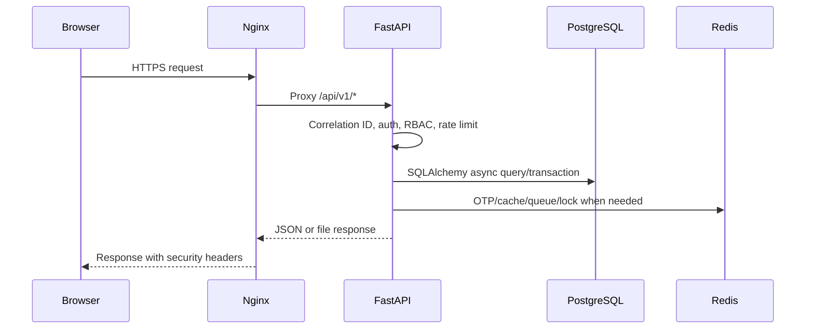
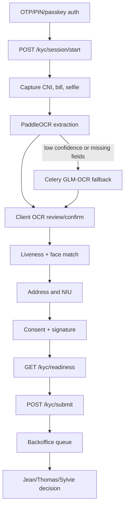

# BICEC VeriPass Architecture

Updated: 2026-05-28

This document explains the current implemented architecture. It favors the code currently under `code/` over older planning diagrams.

## System Classification

BICEC VeriPass is a multi-part web system:

- Backend: FastAPI service with async SQLAlchemy, PostgreSQL, Redis, Celery.
- Mobile frontend: React/Vite PWA served at `/mobile/`.
- Backoffice frontend: React/Vite SPA served at `/back-office/`.
- Infrastructure: Docker Compose with Nginx TLS reverse proxy, external persistent volumes, local/offline AI model mounts.

## Container Architecture

| Service | Container | Purpose | Key dependencies |
| --- | --- | --- | --- |
| `nginx` | `vp_nginx` | TLS entry point, reverse proxy, security headers, path routing | `api`, `pwa`, `backoffice`, `flower` |
| `pwa` | `vp_pwa` | Static mobile PWA build | Nginx-unprivileged image |
| `backoffice` | `vp_backoffice` | Static backoffice SPA build | Nginx-unprivileged image |
| `api` | `vp_api` | FastAPI application, migrations, seed data, OCR warmup | PostgreSQL, Redis, storage volumes, offline model mount |
| `storage_init` | `vp_storage_init` | One-shot volume directory ownership fix | `documents_storage`, `models_storage` |
| `model_init` | `vp_model_init` | Optional online model bootstrap profile | `online-init` profile only |
| `celery_ocr` | `vp_celery_ocr` | GLM-OCR queue worker, one job at a time | Redis, API health, model/document volumes |
| `celery_notifications` | `vp_celery_notif` | OTP/email/push/internal batch/sanctions queues | PostgreSQL, Redis, Mailpit or external SMTP |
| `celery_beat` | `vp_celery_beat` | Scheduled jobs | PostgreSQL, Redis, db backup volume, Docker socket |
| `postgres` | `vp_postgres` | Main database | `db_storage`, `db_backups` |
| `redis` | `vp_redis` | Broker, result backend, locks, TTL data | `redis_data` |
| `mailpit` | `vp_mailpit` | Local SMTP sink | none |
| `flower` | `vp_flower` | Celery monitoring UI | Redis |

## Nginx Routing

Nginx listens inside the container on 8080 and 8443. Host ports are:

- `https://localhost/mobile/` -> mobile PWA.
- `https://localhost/back-office/` -> backoffice SPA.
- `https://localhost/api/` and `https://localhost/api/v1/...` -> FastAPI.
- `https://localhost/health` -> FastAPI `/api/health`.
- `https://localhost/flower/` -> Flower.

Important reverse-proxy details:

- HTTP redirects to HTTPS.
- `/backoffice/` redirects to `/back-office/`.
- Static asset fallbacks handle deep-linked backoffice routes.
- OCR, KYC capture, and liveness paths have extended `proxy_read_timeout` values.
- `/api/v1/auth/` has a stricter Nginx rate-limit zone than general API traffic.
- Security headers and CSP are centralized in `code/infra/nginx/nginx.conf` and `security_headers.conf`.

## Backend Architecture

Backend entry points:

| File | Responsibility |
| --- | --- |
| `code/backend/app/main.py` | FastAPI app, lifespan, Sentry setup, CORS, exception handlers, correlation middleware, router inclusion, health endpoint |
| `code/backend/app/api/v1/router.py` | Registers all API v1 module routers |
| `code/backend/app/core/config.py` | Pydantic settings and env validation |
| `code/backend/app/core/security.py` | JWT, password/PIN hashing, current user/agent dependencies, RBAC |
| `code/backend/app/core/celery_config.py` | Celery app, included task modules, beat schedule |
| `code/backend/app/db/session.py` | Async engine/session and DB connectivity |
| `code/backend/alembic/versions/` | Database migrations |

The backend uses a feature-module layout. Each domain usually owns:

- `models.py`: SQLAlchemy tables.
- `schemas.py`: Pydantic request/response contracts.
- `router.py`: FastAPI endpoints and dependency wiring.
- `service.py`: domain logic not tied to HTTP.

Backend modules:

| Module | Responsibility |
| --- | --- |
| `auth` | Client OTP, email OTP, PIN, passkeys, agent login, refresh tokens, account deletion |
| `kyc` | KYC sessions, document upload/capture, OCR review, liveness, address, NIU, consent, signature, readiness, ATMs |
| `backoffice` | Queue, dossier detail, review decisions, assignment, support threads, OCR correction, audit views |
| `admin` | Admin agent management |
| `aml` | AML alerts, NIU conflicts, document expiry, agencies, batch jobs, global notifications |
| `analytics` | Dashboard, funnel, OCR performance, fraud, compliance, operations, marketing, QA, technical metrics |
| `audit` | Audit log listing and COBAC export |
| `banking` | Local post-KYC product shell for guarded actions; not a DGI, Sopra Amplitude, or core banking integration |
| `devices` | Device registration and device-tag enforcement |
| `notifications` | In-app notifications, preferences, push subscriptions |
| `support` | Client support thread and attachment APIs |

## Request Flow

## KYC Submission Flow

## OCR And Biometrics

OCR is split into fast local extraction and fallback extraction:

- PaddleOCR is loaded by `get_shared_paddle_ocr()` in `code/backend/app/modules/kyc/service.py`.
- Startup can warm PaddleOCR with a generated text image to avoid poor first-request output.
- Documents below confidence or field-count thresholds can be marked `PADDLE_PENDING_GLM`.
- `app.tasks.ocr.run_glm_ocr_fallback` runs in the `glm_ocr_jobs` queue.
- If `OCR_ONLINE=true`, the worker sends an encrypted payload to `OCR_CLOUD_URL`; otherwise it runs local GLM-OCR.

Biometrics are handled through:

- MediaPipe landmark data from mobile liveness screens.
- Backend liveness scoring from landmarks.
- DeepFace verification where model dependencies are available.
- `biometric_results` table stores face match score, status, detector, threshold, liveness, and anti-spoofing metadata.

## Async Jobs

Celery includes these task modules:

- `app.tasks.maintenance`: PostgreSQL backups, encrypted KYC image backups, disk checks, backup catch-up.
- `app.tasks.sanctions`: OpenSanctions sync and staleness checks.
- `app.tasks.kyc`: abandoned session detection, document-expiry handling, active client screening.
- `app.tasks.ocr`: GLM fallback or cloud OCR.
- `app.modules.auth.tasks`: OTP send and OTP session cleanup.
- `app.tasks_demo`: demo and evidence helpers.

Beat schedule highlights:

| Job | Schedule | Purpose |
| --- | --- | --- |
| `backup-db-daily` | 01:00 UTC daily | `pg_dump` to `/backups/db` when `ENABLE_BACKUPS=true` |
| `backup-images-weekly` | Sunday 02:00 UTC | Encrypted document-volume archive when configured |
| `check-backup-catchup-daily` | 03:30 UTC daily | Trigger image backup if no recent archive exists |
| `sync-sanctions-weekly` | Monday 02:00 UTC | Refresh PEP/sanctions source data |
| `check-sanctions-staleness` | 04:00 UTC daily | Sync if sanctions data is older than threshold |
| `detect-abandoned-sessions` | 03:00 UTC daily | Mark stale sessions |
| `check-document-expiry-daily` | 03:20 UTC daily | Flag expiring documents |
| `screen-active-clients-daily` | 04:30 UTC daily | Screen active clients against sanctions |

## Mobile PWA Architecture

Mobile entry points:

| File | Responsibility |
| --- | --- |
| `code/mobile/src/App.tsx` | Route map, providers, auth guards, KYC guards |
| `code/mobile/src/contexts/AuthContext.tsx` | Token/session state, PIN lock behavior, session-expiry handling |
| `code/mobile/src/contexts/KycContext.tsx` | Current KYC session and reconciliation with backend |
| `code/mobile/src/services/apiClient.ts` | JSON API client, correlation IDs, device tags, token handling |
| `code/mobile/src/services/kycOfflineStore.ts` | IndexedDB offline queue/persistence |
| `code/mobile/src/services/kycSyncService.ts` | Offline replay and submission blocker logic |
| `code/mobile/src/hooks/useKycFlow.tsx` | Guarding and reconciliation for KYC steps |

Mobile route groups:

- `/auth/*`: phone/email OTP, PIN setup/login, lock screen, passkey opt-in.
- `/kyc/*`: KYC intro, document selection, CNI capture, OCR review, liveness, bill, address, NIU, consent, signature, review, success/rejection/info requested.
- Dashboard: `/dashboard`, `/cards`, `/transfers`, `/savings`, `/transactions`, `/notifications`, `/support`, `/settings`, `/more`.

### Downstream Mobile App Handoff

After KYC approval, VeriPass can act as the guardrail that decides whether a user is eligible to continue into another BICEC mobile app. This is a frontend/mobile handoff pattern, not a backend integration with external banking systems.

The handoff should be configuration-driven:

| Destination | iOS value | Android value | Fallback |
| --- | --- | --- | --- |
| BI PAY | App Store URL and optional universal link | Google Play URL and optional Android app link/custom scheme | Store page |
| BICEC Mobile-Banking or BICEC Wallet | Confirmed App Store URL and optional universal link | Confirmed Google Play URL and optional app link/custom scheme | Store page |

Recommended flow:

1. Confirm the current user has an approved KYC session and allowed access level.
2. Detect iOS, Android, or desktop from the client platform.
3. If an app link/deep link is configured, try it first.
4. If the app is not installed or no deep link is configured, redirect to the matching App Store or Google Play URL.
5. On desktop, show a QR code or a neutral landing page with both store choices.

Do not hard-code package IDs or store URLs in components. Keep them in environment/config values so BICEC can update app destinations without code changes.

## Backoffice Architecture

Backoffice entry points:

| File | Responsibility |
| --- | --- |
| `code/backoffice/src/App.tsx` | Role-protected route map |
| `code/backoffice/src/contexts/AuthContext.tsx` | Agent login, refresh token behavior, current agent |
| `code/backoffice/src/services/api-client.ts` | Backoffice API helpers |
| `code/backoffice/src/services/dossier-service.ts` | Queue, dossier, assignment, review APIs |
| `code/backoffice/src/services/aml-service.ts` | AML and compliance APIs |
| `code/backoffice/src/components/layout/*` | Header, sidebar, shell |
| `code/backoffice/src/components/shared/*` | Dossier evidence widgets |

Backoffice route ownership:

| Route | Roles | Purpose |
| --- | --- | --- |
| `/validation` | `JEAN` | KYC queue |
| `/validation/dossier/:id` | `JEAN`, `THOMAS` | Evidence viewer and dossier actions |
| `/compliance` | `THOMAS` | AML dashboard |
| `/compliance/alert/:id` | `THOMAS` | AML alert detail |
| `/compliance/duplicates` | `THOMAS` | NIU conflict resolver |
| `/command-center` | `SYLVIE` | Operational load and command center |
| `/analytics` | `SYLVIE`, `THOMAS`, `ADMIN_IT` | Analytics dashboards |
| `/admin` | `ADMIN_IT` | Agent and ATM administration |
| `/admin/audit` | `ADMIN_IT`, `SYLVIE` | Audit/system logs |
| `/profile` | authenticated agents | Agent profile |

## Security Boundaries

| Boundary | Mechanism |
| --- | --- |
| Browser to stack | HTTPS through Nginx, CSP and security headers |
| Client auth | OTP/email OTP, PIN, access token, refresh token |
| Agent auth | Email/password, agent access token, role enforcement |
| JWT | HS256 only, token `type` validation, refresh-token `jti` revocation |
| Sensitive mobile actions | Device tags after registration |
| KYC documents | Stored in external document volume, referenced by DB path and SHA-256 |
| RBAC | FastAPI dependencies: `get_current_user`, `get_current_agent`, `require_agent_role` |
| Rate limits | SlowAPI plus Nginx auth/API zones |
| Observability privacy | Sentry proxy forwards envelopes server-side |

## Source Of Truth

Use these files when implementation and old docs disagree:

| Topic | Source |
| --- | --- |
| API router registration | `code/backend/app/api/v1/router.py` |
| KYC states/access tiers | `code/backend/app/modules/kyc/schemas.py` |
| Backoffice decisions/RBAC | `code/backend/app/modules/backoffice/router.py` |
| Environment settings | `code/backend/app/core/config.py` and `code/.env.example` |
| Docker services | `code/docker-compose.yml` |
| Nginx public paths | `code/infra/nginx/nginx.conf` |
| Mobile routes | `code/mobile/src/App.tsx` |
| Backoffice routes | `code/backoffice/src/App.tsx` |
| DB schema | `code/backend/app/modules/*/models.py` and `code/backend/alembic/versions/` |
