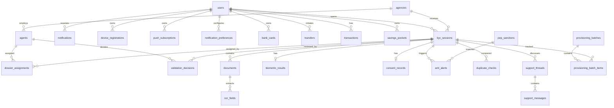

# Data Models

Updated: 2026-05-28

Primary sources:

- SQLAlchemy models: `code/backend/app/modules/*/models.py`
- Alembic migrations: `code/backend/alembic/versions/`
- Reference DDL: `docs/schema/ddl-complete.sql`

## Storage Principles

- PostgreSQL stores identity, workflow, audit, notification, AML, local product-shell, and metadata records.
- KYC files are stored on the external Docker volume mounted at `/data/documents`; the database stores relative paths, document type, size, OCR metadata, and SHA-256 hashes.
- PostgreSQL data lives in the external Docker volume `code_db_storage`.
- Database backups live in the external Docker volume `code_db_backups`.
- KYC document volume is named `code_documents_storage` by default.
- Redis stores transient OTP/rate-limit/queue data and Celery broker/result state.

Do not delete Docker volumes during maintenance unless the user explicitly asks for a destructive reset.

## High-Level ERD



## Authentication Tables

| Table | Model | Purpose |
| --- | --- | --- |
| `users` | `auth.models.User` | Client identity, phone/email, PIN hash, language, role, soft delete, lockout counters |
| `agents` | `auth.models.Agent` | Backoffice users, role, agency, password hash, load-balancing fields, availability |
| `otp_sessions` | `auth.models.OTPSession` | OTP hash, expiry, attempts, used flag, request IP |
| `token_revocations` | `auth.models.TokenRevocation` | Refresh-token revocation list by `jti` |
| `webauthn_credentials` | `auth.models.WebAuthnCredential` | Passkey credential, public key, sign count, device tag |
| `webauthn_challenges` | `auth.models.WebAuthnChallenge` | Register/auth challenge lifecycle |

Notes:

- `users.is_deleted` blocks authentication while retaining data for compliance.
- Agent roles are enum values: `JEAN`, `THOMAS`, `SYLVIE`, `ADMIN_IT`.
- `ADMIN_IT` is a role. The demo seed account is not the role itself.

## KYC Tables

| Table | Model | Purpose |
| --- | --- | --- |
| `kyc_sessions` | `kyc.models.KYCSession` | Main dossier state, access level, address, NIU, confidence, lifecycle timestamps |
| `documents` | `kyc.models.Document` | File path, type, hash, OCR status, OCR engine, raw OCR JSON, quality metrics |
| `ocr_fields` | `kyc.models.OCRField` | Extracted fields, confidence, human corrections |
| `biometric_results` | `kyc.models.BiometricResult` | Liveness, anti-spoofing, face-match scores/status/reasons |
| `validation_decisions` | `kyc.models.ValidationDecision` | Agent decision, reason, IP, timestamp |
| `dossier_assignments` | `kyc.models.DossierAssignment` | Current and historical dossier-agent assignments |
| `aml_alerts` | `kyc.models.AmlAlert` | AML/PEP/sanctions alert status, match score, justification |
| `pep_sanctions` | `kyc.models.PEPSanctions` | Synced sanctions targets |
| `duplicate_checks` | `kyc.models.DuplicateCheck` | Potential duplicate/NIU conflict records |
| `consent_records` | `kyc.models.ConsentRecord` | CGU/privacy/data-processing acceptance and versions |
| `support_threads` | `kyc.models.SupportThread` | Client-backoffice support thread per session |
| `support_messages` | `kyc.models.SupportMessage` | Message content, sender, attachment metadata |
| `notifications` | `kyc.models.Notification` | In-app notification inbox |
| `atms` | `kyc.models.ATM` | ATM/GAB catalog and access-tier metadata |

Important `kyc_sessions` fields:

- `status`: workflow lifecycle, such as `DRAFT`, `PENDING_AGENT_REVIEW`, `PENDING_INFO`, `APPROVED`, `FRAUD_SUSPECT`, `REJECTED`.
- `access_level`: permission tier such as `GUEST`, `RESTRICTED`, `LIMITED_ACCESS`, `FULL_ACCESS`, `DISABLED`.
- `niu_type`, `niu_number`, `niu_declarative`: determine account completeness and access limitations.
- `last_step_completed`: mobile resume/reconciliation hint.
- `confidence_score_global`: computed confidence for review prioritization.
- `submission_ip`: audit value captured on submit.

## Admin And Internal Batch Tables

| Table | Model | Purpose |
| --- | --- | --- |
| `agencies` | `admin.models.Agency` | Agency code/name/city/activity |
| `provisioning_batches` | `admin.models.ProvisioningBatch` | Legacy/internal batch lifecycle used by admin and AML views |
| `provisioning_batch_items` | `admin.models.ProvisioningBatchItem` | Per-session internal batch item status and references |

These table names exist in the current schema and code, but they are not a DGI, Sopra Amplitude, or core banking integration contract. Treat them as internal/admin batch records unless the code is intentionally renamed later.

## Banking Tables

| Table | Model | Purpose |
| --- | --- | --- |
| `bank_cards` | `banking.models.BankCard` | Demo card metadata with encrypted sensitive values |
| `transfers` | `banking.models.Transfer` | Transfer requests and ISO 20022 metadata/XML |
| `transactions` | `banking.models.Transaction` | Account transaction history |
| `savings_pockets` | `banking.models.SavingsPocket` | Savings goals/pockets |

The banking module is a local post-KYC product shell and guarded-action surface. Do not treat it as a real core banking adapter. BI PAY, BICEC Mobile-Banking, or BICEC Wallet access should be handled by OS-aware app handoff links, not by adding DGI/Sopra/core-banking coupling to these tables.

## Device And Notification Tables

| Table | Model | Purpose |
| --- | --- | --- |
| `device_registrations` | `devices.models.DeviceRegistration` | User device fingerprint, device tag, active flag, last seen |
| `push_subscriptions` | `notifications.models.PushSubscription` | Web push subscription keys and metadata |
| `notification_preferences` | `notifications.models.NotificationPreference` | Official channel, push toggle, in-app toggle |

Device behavior:

- If a user has no active device registration, first registration is allowed.
- After at least one active registration exists, sensitive operations require matching `X-Device-Tag`.

## Audit Tables

| Table | Model | Purpose |
| --- | --- | --- |
| `audit_log` | `audit.models.AuditLog` | Actor, action, table, record id, old/new data, timestamp, client IP |

Audit logs are produced for KYC review, assignment, document classification, backups, and other compliance-relevant actions.

## Analytics And DWH

The analytics implementation combines direct operational queries with a DWH/event layer.

Migration `029_dwh_analytics_events.py` creates:

- Schema `dwh`.
- Table `dwh.fact_kyc_events`.
- Indexes on `occurred_at`, `event_type`, and `session_id`.
- Foreign keys to DWH dimensions such as `dwh.dim_users`, `dwh.dim_agencies`, `dwh.dim_agents`, and `dwh.dim_time` if present from earlier migrations.

Analytics service responsibilities:

- Track events best-effort from backend workflows.
- Refresh funnel snapshots.
- Record OCR performance.
- Produce dashboard, funnel, document, fraud, compliance, operations, marketing, QA, and technical metrics.

## Migration Strategy

Current migration folder has 24 migration files, ending with `029_dwh_analytics_events.py` in the scanned working tree.

Rules for maintainers:

1. Change SQLAlchemy models first.
2. Add or update Pydantic schemas if API payloads change.
3. Create an Alembic migration.
4. Run `alembic upgrade head` inside the API container.
5. Add/update tests for the changed table or workflow.
6. Update this document if a table, state, or retention rule changes.

Common commands:

```powershell
docker compose -f code/docker-compose.yml exec -T api alembic current
docker compose -f code/docker-compose.yml exec -T api alembic upgrade head
docker compose -f code/docker-compose.yml exec -T api alembic revision --autogenerate -m "short description"
```

## Retention And Backup

| Data | Location | Backup path | Notes |
| --- | --- | --- | --- |
| PostgreSQL | `code_db_storage` | `code_db_backups` / `/backups/db` | `backup_postgres` gated by `ENABLE_BACKUPS=true` |
| KYC documents | `code_documents_storage` | local encrypted image archives | `backup_kyc_images` gated by `ENABLE_BACKUPS=true` and `BACKUP_ENCRYPTION_KEY` |
| OCR/AI models | `models_storage`, offline bind mount | image/archive process | Do not rely on online downloads for demos |
| Redis | `redis_data` | normally transient | OTP and queues should be treated as ephemeral |

The project intentionally avoids PostgreSQL BYTEA storage for KYC images. Store large files in the document volume and keep path/hash metadata in PostgreSQL.
