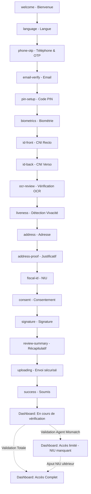
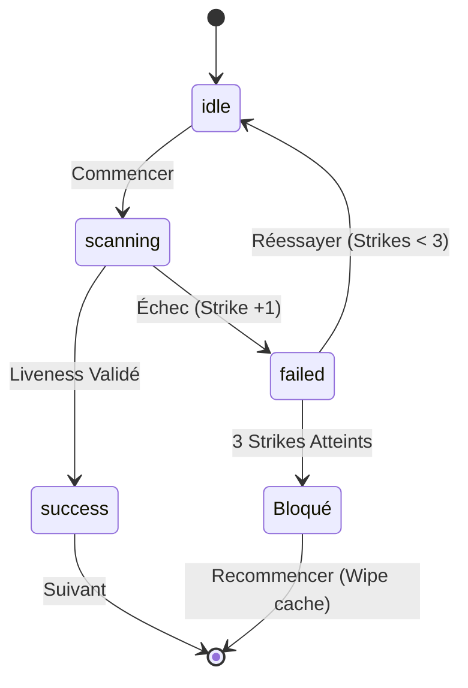
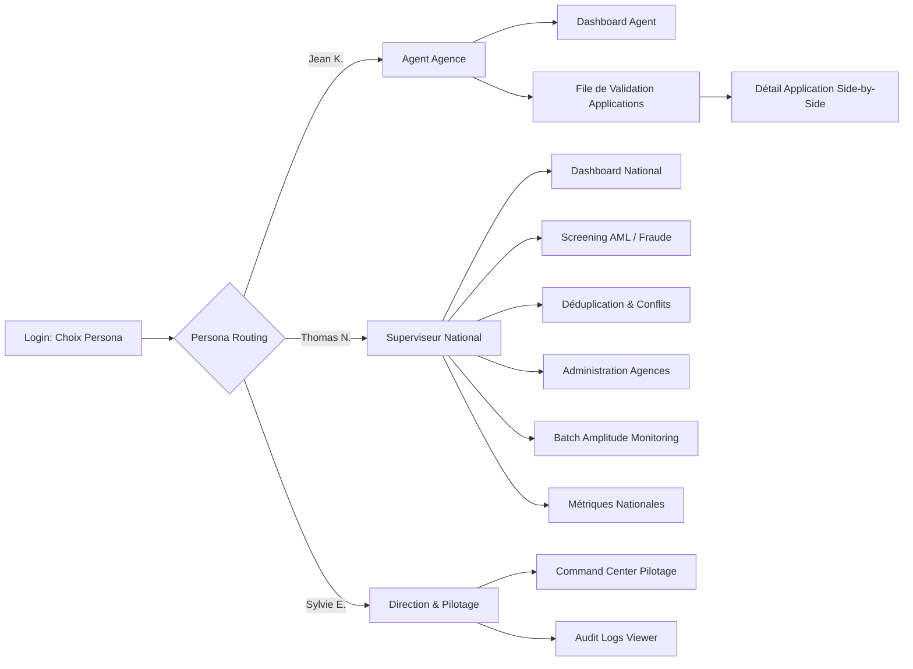

# ADR: Authoritative State & Flow Mapping

**Date:** 2026-02-23
**Context:** The interactive MVP prototype (`MobileOnboarding.tsx` and `BackOffice.tsx`) has been finalized and validated. Previous planning artifacts contained discrepancies and outdated steps. This document establishes the authoritative flow, state machines, and UX mapping based exactly on the prototype's implementation.

## 1. Mobile Onboarding Flow (The 18-Step Sequence)

The mobile onboarding follows a strict, linear 18-step sequence before reaching the post-submission dashboard states.

## 2. Liveness State Machine

The liveness step (Step 10) contains its own internal state machine to handle the 3-strikes rule and camera interactions.

## 3. Back-Office Persona Flow & Views

The Back-Office is governed by a Strict Role-Based Access Control (RBAC) mapping to specific React views.

