# Sitemap Diagram — BICEC VeriPass

**Version:** 1.0  
**Date:** 2026-02-26  
**Auteur:** Ken (UX Designer)

---

## Vue d'ensemble

Ce diagramme présente la structure complète du site (sitemap) pour les 3 produits BICEC VeriPass:
- Application Mobile (Modules A→G)
- Back-Office Agents (Jean/Thomas)
- Command Center (Sylvie)

---

## Sitemap Complet (Mermaid)

```mermaid
graph TD
    %% ========== ROOT ==========
    ROOT[BICEC VeriPass Platform]
    
    %% ========== MOBILE APP ==========
    ROOT --> MOBILE[📱 Application Mobile]
    
    MOBILE --> MOD_A[Module A: Secure Entry]
    MOD_A --> A01[A01 Splash & Language]
    MOD_A --> A02[A02 Welcome Value Prop]
    MOD_A --> A03[A03 Phone Entry]
    MOD_A --> A04[A04 OTP Verify Phone]
    MOD_A --> A05[A05 Email Entry]
    MOD_A --> A06[A06 Email Verification]
    MOD_A --> A07[A07 PIN Setup]
    MOD_A --> A08[A08 Biometric Opt-in]
    MOD_A --> A09[A09 What You Need]
    MOD_A --> A10[A10 Progress Timeline]
    
    MOBILE --> MOD_B[Module B: Identity & Liveness]
    MOD_B --> B01[B01 CNI Intro]
    MOD_B --> B02[B02 CNI Recto Guidance]
    MOD_B --> B03[B03 CNI Recto Capture]
    MOD_B --> B04[B04 Capture Success]
    MOD_B --> B05[B05 CNI Verso Guidance]
    MOD_B --> B06[B06 CNI Verso Capture]
    MOD_B --> B07[B07 OCR Processing]
    MOD_B --> B08[B08 OCR Review & Edit]
    MOD_B --> B09[B09 Liveness Intro]
    MOD_B --> B10[B10 Liveness Challenge]
    MOD_B --> B10_FAIL[B10_Fail Lockout & Fresh Start]
    MOD_B --> B11[B11 Liveness Success]
    
    MOBILE --> MOD_C[Module C: Localization & Fiscal]
    MOD_C --> C01[C01 Address Cascade]
    MOD_C --> C02[C02 GPS Button Optional]
    MOD_C --> C03[C03 Utility Proof Intro]
    MOD_C --> C04[C04 Utility Capture]
    MOD_C --> C05[C05 NIU Choice]
    MOD_C --> C06[C06 NIU Entry/Upload]
    
    MOBILE --> MOD_D[Module D: Consent & Signatures]
    MOD_D --> D01[D01 Consent 3 Checkboxes]
    MOD_D --> D02[D02 Digital Capture]
    
    MOBILE --> MOD_E[Module E: Submission & Discovery]
    MOD_E --> E01[E01 Review Summary]
    MOD_E --> E02[E02 Secure Upload]
    MOD_E --> E03[E03 Success Celebration]
    MOD_E --> E04[E04 Plan Discovery]
    MOD_E --> E05[E05 Personalization]
    MOD_E --> E06[E06 RESTRICTED_ACCESS Dashboard]
    MOD_E --> E07[E07 Rejection Notification]
    
    MOBILE --> MOD_F[Module F: Account Management]
    MOD_F --> F00[F00 Push Notification Invitation Agence]
    MOD_F --> F01[F01_AGENCY Physical Agency Visit]
    MOD_F --> F02[F02 Home Dashboard FULL_ACCESS]
    MOD_F --> F03[F03 Home Dashboard LIMITED_ACCESS]
    MOD_F --> F04[F04 Account Detail]
    MOD_F --> F05[F05 Cards Manager]
    MOD_F --> F06[F06 Linked Accounts]
    
    MOBILE --> MOD_G[Module G: Feature Shells]
    MOD_G --> G01[G01 Recurring Transfers]
    MOD_G --> G02[G02 Add Money Flow]
    MOD_G --> G03[G03 Withdraw Flow]
    
    %% ========== BACK-OFFICE JEAN ==========
    ROOT --> BACKOFFICE[🖥️ Back-Office Portal]
    
    BACKOFFICE --> JEAN[👤 Jean - Agent KYC]
    JEAN --> J01[J01 Login Email/Password]
    JEAN --> J02[J02 Validation Queue Dashboard]
    JEAN --> J03[J03 Queue Filters]
    J03 --> J03A[By Priority]
    J03 --> J03B[By FIFO]
    J03 --> J03C[By Confidence]
    JEAN --> J04[J04 Dossier Detail View]
    JEAN --> J05[J05 Side-by-Side Evidence Viewer]
    J05 --> J05A[CNI Recto/Verso High-Res]
    J05 --> J05B[Selfie vs CNI Photo]
    J05 --> J05C[Utility Bill Review]
    J05 --> J05D[Wet Signature Agency Only]
    JEAN --> J06[J06 OCR Data Review]
    JEAN --> J07[J07 Manual Edit with Justification]
    JEAN --> J08[J08 Decision Panel]
    J08 --> J08A[Approve]
    J08 --> J08B[Reject with Reason]
    J08 --> J08C[Request Info]
    JEAN --> J09[J09 Audit Log View]
    
    %% ========== BACK-OFFICE THOMAS ==========
    BACKOFFICE --> THOMAS[🛡️ Thomas - AML/CFT Supervisor]
    THOMAS --> T01[T01 Login Email/Password]
    THOMAS --> T02[T02 National Supervisor Dashboard]
    THOMAS --> T03[T03 AML Screening Queue]
    T03 --> T03A[PEP Alerts]
    T03 --> T03B[Sanctions Alerts]
    T03 --> T03C[Watchlist Alerts]
    THOMAS --> T04[T04 Screening Detail]
    T04 --> T04A[Profile vs PEP/Sanction Hit]
    T04 --> T04B[Match Score %]
    T04 --> T04C[Actions Clear/Confirm/Escalate]
    THOMAS --> T05[T05 Conflict Resolver Deduplication]
    T05 --> T05A[Side-by-Side Profile Comparison]
    T05 --> T05B[Similarity Heatmap]
    T05 --> T05C[Actions Merge/Reject/Escalate]
    THOMAS --> T06[T06 Agency Administration]
    T06 --> T06A[CRUD Table]
    THOMAS --> T07[T07 Amplitude Batch Monitor]
    T07 --> T07A[Timeline View]
    T07 --> T07B[Per-Dossier Status]
    T07 --> T07C[Retry Failed Items]
    THOMAS --> T08[T08 National Metrics]
    
    %% ========== COMMAND CENTER SYLVIE ==========
    ROOT --> COMMAND[📊 Command Center]
    
    COMMAND --> SYLVIE[👩‍💼 Sylvie - Manager]
    SYLVIE --> S01[S01 Login Email/Password]
    SYLVIE --> S02[S02 Command Center Dashboard]
    SYLVIE --> S03[S03 Big Numbers View]
    S03 --> S03A[Avg Validation Time SLA]
    S03 --> S03B[Success Rate FTR]
    S03 --> S03C[Active Agents Count]
    S03 --> S03D[Queue Depth]
    SYLVIE --> S04[S04 Funnel Graph]
    S04 --> S04A[Drop-off by Module A-E]
    SYLVIE --> S05[S05 System Health R/Y/G]
    S05 --> S05A[AI Services Status OCR/Liveness]
    S05 --> S05B[API Latency]
    SYLVIE --> S06[S06 Agent Performance]
    S06 --> S06A[Jean's Metrics]
    S06 --> S06B[Thomas's Metrics]
    SYLVIE --> S07[S07 Load Balancing View]
    S07 --> S07A[Agent Capacity Green/Yellow/Red]
    SYLVIE --> S08[S08 Audit Trail & Compliance Export]
    
    %% ========== STYLING ==========
    style ROOT fill:#E37B03,stroke:#333,stroke-width:3px,color:#fff
    style MOBILE fill:#2563EB,stroke:#333,stroke-width:2px,color:#fff
    style BACKOFFICE fill:#10B981,stroke:#333,stroke-width:2px,color:#fff
    style COMMAND fill:#F59E0B,stroke:#333,stroke-width:2px,color:#fff
    
    style MOD_A fill:#E3F2FD,stroke:#2563EB,stroke-width:2px
    style MOD_B fill:#E3F2FD,stroke:#2563EB,stroke-width:2px
    style MOD_C fill:#E3F2FD,stroke:#2563EB,stroke-width:2px
    style MOD_D fill:#E3F2FD,stroke:#2563EB,stroke-width:2px
    style MOD_E fill:#E3F2FD,stroke:#2563EB,stroke-width:2px
    style MOD_F fill:#E3F2FD,stroke:#2563EB,stroke-width:2px
    style MOD_G fill:#E3F2FD,stroke:#2563EB,stroke-width:2px
    
    style JEAN fill:#D1FAE5,stroke:#10B981,stroke-width:2px
    style THOMAS fill:#D1FAE5,stroke:#10B981,stroke-width:2px
    style SYLVIE fill:#FEF3C7,stroke:#F59E0B,stroke-width:2px
```

---

## Statistiques

### Application Mobile
- **7 Modules** (A→G)
- **52 Écrans** au total
- **Profondeur maximale**: 3 niveaux

### Back-Office Agents
- **2 Rôles** (Jean, Thomas)
- **27 Vues** au total
- **Profondeur maximale**: 2 niveaux

### Command Center
- **1 Rôle** (Sylvie)
- **14 Vues** au total
- **Profondeur maximale**: 2 niveaux

### Total Plateforme
- **93 Écrans/Vues** uniques
- **3 Produits** distincts
- **4 Personas** (Marie, Jean, Thomas, Sylvie)

---

## Conventions de Navigation

### Mobile (Onboarding)
- **Type**: Linéaire avec progression
- **Retour**: Bouton back disponible (sauf écrans critiques)
- **Sortie**: Logout, Session Timeout, 3-Strike Lockout

### Mobile (Post-Activation)
- **Type**: Tab-based navigation (Bottom Nav)
- **Tabs**: Home, Invest, Transfers, Crypto, Lifestyle
- **Sortie**: Logout, Session Timeout

### Back-Office
- **Type**: Dashboard-centric avec drill-down
- **Navigation**: Breadcrumbs + Back button
- **Sortie**: Logout, Session Timeout

### Command Center
- **Type**: Dashboard-only (read-only)
- **Navigation**: Tab switching entre vues
- **Sortie**: Logout, Session Timeout

---

## Références

- **Information Architecture**: `docs/diagrams/architecture/information-architecture.md`
- **User Journey Maps**: `docs/diagrams/user-journey-maps.md`
- **UX Spec v2**: `_bmad-output/planning-artifacts/ux-design-specification-v2.md`
