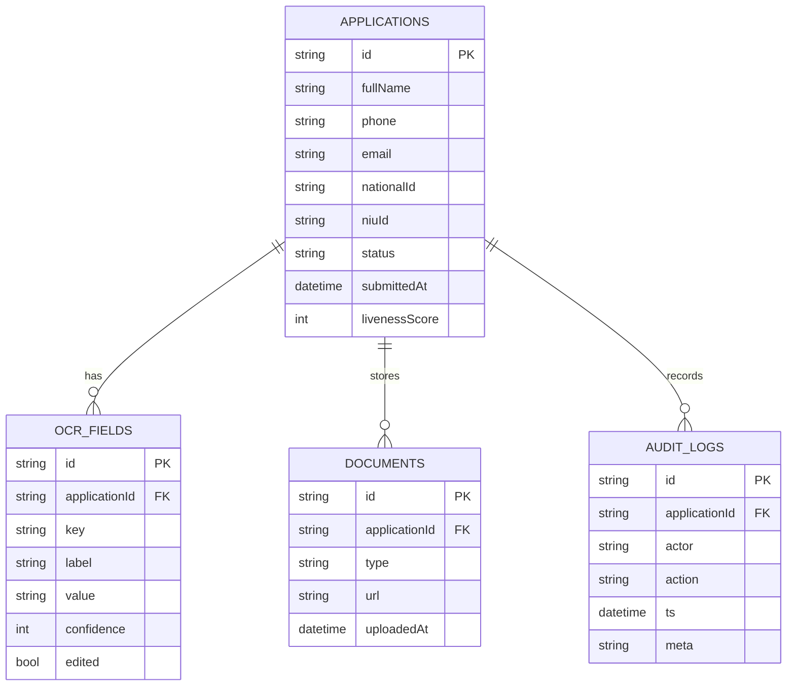

```mermaid
erDiagram
  APPLICATIONS {
    string id PK
    string fullName
    string phone
    string email
    string nationalId
    string niuId
    string status
    datetime submittedAt
    int livenessScore
  }
  OCR_FIELDS {
    string id PK
    string applicationId FK
    string key
    string label
    string value
    int confidence
    bool edited
  }
  DOCUMENTS {
    string id PK
    string applicationId FK
    string type
    string url
    datetime uploadedAt
  }
  AUDIT_LOGS {
    string id PK
    string applicationId FK
    string actor
    string action
    datetime ts
    string meta
  }

  APPLICATIONS ||--o{ OCR_FIELDS: has
  APPLICATIONS ||--o{ DOCUMENTS: stores
  APPLICATIONS ||--o{ AUDIT_LOGS: records
```
