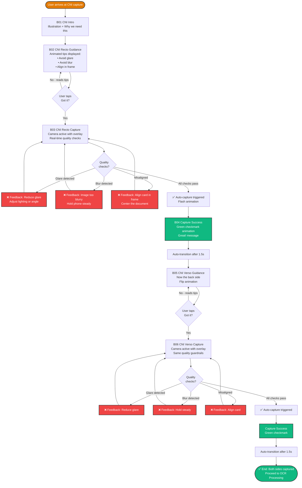

# CNI Capture Task Flow — BICEC VeriPass

**Nom officiel:** CNI Capture Task Flow  
**Version:** 1.0  
**Date:** 2026-02-26  
**Auteur:** Ken (UX Designer)

---

## Description

Ce micro-flux détaille le processus de capture de la Carte Nationale d'Identité (CNI) camerounaise, incluant les guidances, validations qualité, et gestion d'erreurs.

---

## Task Flow Diagram (Mermaid)

---

## Détails Techniques

### Quality Checks (Real-Time)

#### 1. Glare Detection
- **Algorithme**: Analyse des zones surexposées (pixels >240/255)
- **Seuil**: >15% de la zone document = glare détecté
- **Feedback**: "Réduisez les reflets - Ajustez l'éclairage ou l'angle"
- **Action**: Retry capture

#### 2. Blur Detection
- **Algorithme**: Laplacian variance (mesure de netteté)
- **Seuil**: Variance <100 = blur détecté
- **Feedback**: "Image trop floue - Stabilisez votre téléphone"
- **Action**: Retry capture

#### 3. Alignment Check
- **Algorithme**: Détection des contours du document
- **Seuil**: Document doit occuper 60-80% du cadre
- **Feedback**: "Alignez la carte dans le cadre - Centrez le document"
- **Action**: Retry capture

#### 4. Auto-Capture Trigger
- **Condition**: Tous les checks passent pendant 0.5s consécutives
- **Action**: Flash blanc + capture automatique
- **Feedback**: Vibration haptique légère

### Performance Requirements

- **Frame Rate**: >15 FPS sur Android 8.0 (NFR2)
- **Latency**: Quality checks <100ms par frame
- **Capture Resolution**: 1920x1080 minimum
- **Compression**: JPEG quality 90% pour upload

### Error Handling

| Erreur | Cause | Feedback | Action |
|--------|-------|----------|--------|
| Glare | Éclairage excessif | "Réduisez les reflets" | Retry |
| Blur | Mouvement ou focus | "Stabilisez votre téléphone" | Retry |
| Misalignment | Cadrage incorrect | "Centrez le document" | Retry |
| Timeout | >60s sans capture | "Besoin d'aide?" + Skip option | Retry or Skip |
| Camera Permission | Permission refusée | "Autorisation caméra requise" | Settings |

### Accessibility

- **Visual**: High contrast overlay (white on dark)
- **Motor**: Large capture area (no precise tapping required)
- **Cognitive**: Animated tips with illustrations
- **Auditory**: Visual-only feedback (no audio required)

---

## User Experience Notes

### Success Factors
- **Auto-capture**: Élimine le besoin de bouton manuel
- **Real-time feedback**: Guidance immédiate pour corriger
- **Celebration moment**: Checkmark animation renforce la confiance

### Pain Points Addressed
- **Glare**: Commun avec CNI plastifiées camerounaises
- **Blur**: Fréquent avec téléphones Android 8 (pas de stabilisation optique)
- **Alignment**: Utilisateurs novices ont du mal à cadrer

### Timing
- **Recto capture**: 30-60 secondes (avec retries)
- **Verso capture**: 20-40 secondes (utilisateur comprend le processus)
- **Total**: 1-2 minutes pour les deux faces

---

## Références

- **End-to-End Flow**: `docs/diagrams/flows/end-to-end-user-flow.md`
- **OCR Review Flow**: `docs/diagrams/flows/ocr-review-task-flow.md`
- **UX Spec v2**: `_bmad-output/planning-artifacts/ux-design-specification-v2.md` (Module B)
- **PRD**: `_bmad-output/planning-artifacts/prd.md` (FR2, FR3, NFR2)
