# End-to-End User Flow Diagram — BICEC VeriPass

**Nom officiel:** Global User Flow Diagram  
**Version:** 1.0  
**Date:** 2026-02-26  
**Auteur:** Ken (UX Designer)

---

## Description

Ce diagramme présente le parcours utilisateur complet (end-to-end) pour l'application mobile BICEC VeriPass, du premier lancement jusqu'à l'activation du compte. Il couvre uniquement le parcours mobile (Marie), pas les workflows back-office.

---

## Flow Macro Unique (Mermaid)

```mermaid
graph TD
    %% ========== PHASE 1: DÉMARRAGE ==========
    START([👤 Marie ouvre l'app]) --> A01[A01 Splash & Language<br/>FR/EN Selection]
    A01 --> A02[A02 Welcome Value Prop<br/>3 Pillars: Speed/Security/Modern]
    
    %% ========== PHASE 2: AUTHENTIFICATION ==========
    A02 --> A03[A03 Phone Entry<br/>+237 6XX XXX XXX]
    A03 --> A04[A04 OTP Verify Phone<br/>6-digit SMS code]
    A04 --> A05[A05 Email Entry<br/>example@mail.com]
    A05 --> A06[A06 Email Verification<br/>6-digit code or link]
    A06 --> A07[A07 PIN Setup<br/>6-digit PIN]
    A07 --> A08[A08 Biometric Opt-in<br/>Face ID/Fingerprint optional]
    A08 --> A09[A09 What You Need<br/>Checklist: CNI, NIU, Utility Bill]
    A09 --> A10[A10 Progress Timeline<br/>4 stages visualization]
    
    %% ========== PHASE 3: IDENTITÉ ==========
    A10 --> B01[B01 CNI Intro<br/>Why we need this]
    B01 --> B02[B02 CNI Recto Guidance<br/>Animated tips: Glare/Blur/Alignment]
    B02 --> B03[B03 CNI Recto Capture<br/>Auto-capture with quality checks]
    B03 --> B04[B04 Capture Success<br/>Green checkmark animation]
    B04 --> B05[B05 CNI Verso Guidance<br/>Flip animation]
    B05 --> B06[B06 CNI Verso Capture<br/>Auto-capture back side]
    B06 --> B07[B07 OCR Processing<br/>Loading animation]
    B07 --> B08[B08 OCR Review & Edit<br/>🟢🟠🔴 Confidence badges<br/>Inline editing]
    
    B08 --> B08_CHECK{All fields<br/>validated?}
    B08_CHECK -->|🟠🔴 remain| B08
    B08_CHECK -->|All 🟢| B09
    
    B09[B09 Liveness Intro<br/>Quick selfie check] --> B10[B10 Liveness Challenge<br/>Circular frame, randomized prompts]
    
    B10 --> B10_CHECK{Liveness<br/>success?}
    B10_CHECK -->|Fail 1-2| B10_RETRY[Retry with guidance]
    B10_RETRY --> B10
    B10_CHECK -->|Fail 3| B10_FAIL[B10_Fail Lockout<br/>Session terminated<br/>Recommencer button]
    B10_FAIL --> B10_WIPE{User clicks<br/>Recommencer?}
    B10_WIPE -->|Yes| WIPE[Wipe session data]
    WIPE --> A01
    B10_WIPE -->|No| END_LOCKOUT([End: User exits])
    
    B10_CHECK -->|Success| B11[B11 Liveness Success<br/>Success animation]
    
    %% ========== PHASE 4: DOMICILE & FISCAL ==========
    B11 --> C01[C01 Address Cascade<br/>Région → Ville → Quartier → Commune<br/>+ Lieu-dit]
    C01 --> C02[C02 GPS Button Optional<br/>Utiliser ma position actuelle]
    C02 --> C02_CHECK{GPS<br/>used?}
    C02_CHECK -->|Yes| C02_GPS[Capture GPS coordinates<br/>Show privacy notice]
    C02_GPS --> C02_VALIDATE{Distance<br/>check}
    C02_VALIDATE -->|>X km| C02_WARN[⚠️ Warning: GPS far from Quartier<br/>Non-blocking]
    C02_WARN --> C03
    C02_VALIDATE -->|OK| C03
    C02_CHECK -->|No/Skip| C03
    
    C03[C03 Utility Proof Intro<br/>ENEO/CAMWATER toggle] --> C04[C04 Utility Capture<br/>Camera capture with quality checks]
    C04 --> C05[C05 NIU Choice<br/>Upload vs Manual Entry]
    C05 --> C05_CHECK{NIU<br/>method?}
    C05_CHECK -->|Upload| C06A[C06 NIU Upload<br/>Attestation photo]
    C05_CHECK -->|Manual| C06B[C06 NIU Manual Entry<br/>Format validation<br/>⚠️ LIMITED_ACCESS warning]
    C05_CHECK -->|Skip| C06C[Skip NIU<br/>⚠️ LIMITED_ACCESS warning]
    
    C06A --> D01
    C06B --> D01
    C06C --> D01
    
    %% ========== PHASE 5: CONSENTEMENT ==========
    D01[D01 Consent 3 Checkboxes<br/>☐ CGU<br/>☐ Privacy Policy<br/>☐ Data Processing] --> D01_CHECK{All 3<br/>checked?}
    D01_CHECK -->|No| D01
    D01_CHECK -->|Yes| D02[D02 Digital Capture<br/>Touchscreen authorization<br/>Timestamped]
    
    %% ========== PHASE 6: SOUMISSION ==========
    D02 --> E01[E01 Review Summary<br/>Final checklist of all data]
    E01 --> E02[E02 Secure Upload<br/>Chunked progress<br/>Resilient retry]
    
    E02 --> E02_CHECK{Upload<br/>success?}
    E02_CHECK -->|Network fail| E02_RETRY[Retry with exponential backoff<br/>Local cache preserved]
    E02_RETRY --> E02
    E02_CHECK -->|Success| E03
    
    E03[E03 Success Celebration<br/>Confetti animation<br/>Dossier soumis!] --> E04[E04 Plan Discovery<br/>Swipeable cards<br/>Ultra/Premium/Standard]
    E04 --> E05[E05 Personalization<br/>Interest chips<br/>Invest/Save/Travel]
    E05 --> E06[E06 RESTRICTED_ACCESS Dashboard<br/>⏳ En cours de validation<br/>Full app in vitrine mode<br/>Read-only features]
    
    %% ========== PHASE 7: VALIDATION BACKEND (JEAN) ==========
    E06 -.->|Backend| JEAN_QUEUE[Jean's Validation Queue]
    JEAN_QUEUE --> JEAN_REVIEW[Jean reviews dossier<br/>Side-by-side evidence]
    JEAN_REVIEW --> JEAN_DECISION{Jean's<br/>decision?}
    
    JEAN_DECISION -->|Reject| E07[E07 Rejection Notification<br/>Push notification + reason<br/>Options: Retry or Contact Support]
    E07 --> END_REJECT([End: User must retry or contact support])
    
    JEAN_DECISION -->|Request Info| JEAN_INFO[Push notification<br/>Request clarification]
    JEAN_INFO --> E06
    
    JEAN_DECISION -->|Approve| THOMAS_QUEUE[Thomas's AML/CFT Queue]
    
    %% ========== PHASE 8: COMPLIANCE (THOMAS) ==========
    THOMAS_QUEUE --> THOMAS_AML{AML<br/>alert?}
    THOMAS_AML -->|Yes| THOMAS_REVIEW[Thomas reviews PEP/Sanctions]
    THOMAS_REVIEW --> THOMAS_DECISION{Thomas's<br/>decision?}
    THOMAS_DECISION -->|Block| THOMAS_BLOCK[Account frozen<br/>Escalate to compliance]
    THOMAS_BLOCK --> END_BLOCK([End: Account blocked])
    THOMAS_DECISION -->|Clear| THOMAS_CLEAR[Alert cleared<br/>Proceed to provisioning]
    THOMAS_CLEAR --> AMPLITUDE
    THOMAS_AML -->|No alert| AMPLITUDE
    
    %% ========== PHASE 9: PROVISIONING ==========
    AMPLITUDE[Amplitude Batch Provisioning<br/>Automated account creation] --> AMPLITUDE_CHECK{Provisioning<br/>success?}
    AMPLITUDE_CHECK -->|Fail| AMPLITUDE_RETRY[Retry failed items<br/>Thomas monitors]
    AMPLITUDE_RETRY --> AMPLITUDE
    AMPLITUDE_CHECK -->|Success| F00
    
    %% ========== PHASE 10: ACTIVATION ==========
    F00[F00 Push Notification<br/>Invitation Agence<br/>Votre compte est prêt!] --> F01[F01_AGENCY Physical Agency Visit<br/>Wet signature 3x paper<br/>Pick up card<br/>NIU validation if needed]
    
    F01 --> F01_CHECK{NIU<br/>validated?}
    F01_CHECK -->|No NIU or Declarative| F03[F03 Home Dashboard<br/>LIMITED_ACCESS<br/>⚠️ Complétez votre NIU<br/>Locked: Transfers, Cards, Crypto]
    F01_CHECK -->|NIU validated| F02[F02 Home Dashboard<br/>FULL_ACCESS<br/>All features unlocked]
    
    F03 --> F03_NIU{User adds<br/>NIU later?}
    F03_NIU -->|Yes| F03_UPLOAD[Upload NIU attestation]
    F03_UPLOAD --> JEAN_NIU[Jean validates NIU]
    JEAN_NIU --> F02
    F03_NIU -->|No| F03_CONTINUE[Continue with LIMITED_ACCESS]
    
    F02 --> BANKING[🏦 Full Banking Features<br/>F04 Account Detail<br/>F05 Cards Manager<br/>F06 Linked Accounts<br/>G01-G03 Feature Shells]
    F03_CONTINUE --> BANKING_LIMITED[🏦 Limited Banking Features<br/>View balance, Deposits only<br/>Locked: Transfers, Cards, Crypto]
    
    BANKING --> END_SUCCESS([✅ End: Active FULL_ACCESS account])
    BANKING_LIMITED --> END_LIMITED([⚠️ End: Active LIMITED_ACCESS account])
    
    %% ========== STYLING ==========
    style START fill:#E37B03,stroke:#333,stroke-width:3px,color:#fff
    style END_SUCCESS fill:#10B981,stroke:#333,stroke-width:3px,color:#fff
    style END_LIMITED fill:#F59E0B,stroke:#333,stroke-width:3px,color:#fff
    style END_REJECT fill:#EF4444,stroke:#333,stroke-width:3px,color:#fff
    style END_BLOCK fill:#EF4444,stroke:#333,stroke-width:3px,color:#fff
    style END_LOCKOUT fill:#EF4444,stroke:#333,stroke-width:3px,color:#fff
    
    style B10_FAIL fill:#EF4444,stroke:#333,stroke-width:2px,color:#fff
    style E07 fill:#EF4444,stroke:#333,stroke-width:2px,color:#fff
    style THOMAS_BLOCK fill:#EF4444,stroke:#333,stroke-width:2px,color:#fff
    
    style E03 fill:#10B981,stroke:#333,stroke-width:2px,color:#fff
    style F02 fill:#10B981,stroke:#333,stroke-width:2px,color:#fff
    
    style E06 fill:#F59E0B,stroke:#333,stroke-width:2px,color:#fff
    style F03 fill:#F59E0B,stroke:#333,stroke-width:2px,color:#fff
```

---

## Points Clés du Flow

### Phases Principales
1. **Démarrage** (A01-A10): Authentification et préparation
2. **Identité** (B01-B11): Capture CNI + Liveness avec 3-strike lockout
3. **Domicile & Fiscal** (C01-C06): Adresse + NIU (optionnel)
4. **Consentement** (D01-D02): 3 checkboxes + signature digitale
5. **Soumission** (E01-E06): Upload + Célébration + Discovery
6. **Validation Backend** (Jean): Revue manuelle obligatoire
7. **Compliance** (Thomas): AML/CFT screening
8. **Provisioning** (Amplitude): Création compte automatisée
9. **Activation** (F00-F01): Visite agence + signature papier
10. **Banking** (F02/F03 + G-series): Accès complet ou limité

### Points de Décision Critiques
- **B08_CHECK**: Validation OCR (🟢🟠🔴 badges)
- **B10_CHECK**: Liveness success/fail (3-strike system)
- **C02_CHECK**: GPS optionnel
- **C05_CHECK**: NIU upload/manual/skip
- **D01_CHECK**: 3 checkboxes consent
- **E02_CHECK**: Upload success/retry
- **JEAN_DECISION**: Approve/Reject/Request Info
- **THOMAS_AML**: Alert screening
- **F01_CHECK**: NIU validation status

### Points de Sortie
- **END_SUCCESS**: Compte FULL_ACCESS actif ✅
- **END_LIMITED**: Compte LIMITED_ACCESS actif ⚠️
- **END_REJECT**: Dossier rejeté par Jean ❌
- **END_BLOCK**: Compte bloqué par Thomas (AML) ❌
- **END_LOCKOUT**: 3-strike liveness lockout ❌

### Résilience
- **E02_RETRY**: Upload retry avec cache local
- **B10_RETRY**: Liveness retry (1-2 attempts)
- **AMPLITUDE_RETRY**: Provisioning retry (Thomas monitore)

---

## Temps Estimés

| Phase | Durée Estimée | Cumul |
|-------|---------------|-------|
| Démarrage (A01-A10) | 3-5 min | 5 min |
| Identité (B01-B11) | 5-7 min | 12 min |
| Domicile & Fiscal (C01-C06) | 2-3 min | 15 min |
| Consentement (D01-D02) | 1 min | 16 min |
| Soumission (E01-E06) | 2 min | 18 min |
| **Total Mobile** | **15-18 min** | **18 min** |
| Validation Jean | 3-5 min | - |
| Compliance Thomas | 5-10 min (si alerte) | - |
| Provisioning Amplitude | Batch automatique | - |
| **Total End-to-End** | **<2h (SLA)** | **<2h** |

---

## Références

- **User Journey Maps**: `docs/diagrams/user-journey-maps.md`
- **Task Flow Diagrams**: `docs/diagrams/flows/cni-capture-task-flow.md`, etc.
- **State Machine**: `docs/diagrams/states/kyc-account-access-state-machine.md`
- **UX Spec v2**: `_bmad-output/planning-artifacts/ux-design-specification-v2.md`
