# Liveness Verification Task Flow — BICEC VeriPass

**Nom officiel:** Liveness Verification Task Flow  
**Version:** 1.0  
**Date:** 2026-02-26  
**Auteur:** Ken (UX Designer)

---

## Description

Ce micro-flux détaille le processus de vérification de vivacité (liveness) avec le système de 3 tentatives (3-strike lockout) et gestion des échecs.

---

## Task Flow Diagram (Mermaid)

```mermaid
graph TD
    START([OCR data validated]) --> B09[B09 Liveness Intro<br/>Quick selfie check<br/>Privacy reassurance]
    
    B09 --> B09_READY{User taps<br/>Continue?}
    B09_READY -->|Yes| B10_INIT
    B09_READY -->|No - reads info| B09
    
    %% ========== ATTEMPT 1 ==========
    B10_INIT[B10 Liveness Challenge<br/>Attempt 1/3<br/>Circular frame active]
    
    B10_INIT --> B10_DETECT{Face<br/>detected?}
    B10_DETECT -->|No| B10_NO_FACE[❌ Feedback: Position your face<br/>Move closer or adjust lighting]
    B10_NO_FACE --> B10_INIT
    
    B10_DETECT -->|Yes| B10_PROMPT[Randomized prompt displayed:<br/>• Smile<br/>• Turn left<br/>• Turn right<br/>• Blink]
    
    B10_PROMPT --> B10_ACTION{User performs<br/>action?}
    B10_ACTION -->|Timeout 5s| B10_TIMEOUT[❌ Timeout<br/>Please respond to prompt]
    B10_TIMEOUT --> B10_PROMPT
    
    B10_ACTION -->|Action detected| B10_VERIFY[DeepFace + MiniFASNet<br/>Liveness score calculated]
    
    B10_VERIFY --> B10_SCORE{Liveness<br/>score?}
    
    B10_SCORE -->|>85% Pass| B11[B11 Liveness Success<br/>Success animation<br/>Identity verified!]
    B11 --> END_SUCCESS([✅ End: Liveness verified<br/>Proceed to Address])
    
    B10_SCORE -->|<85% Fail| B10_FAIL1[❌ Attempt 1 Failed<br/>Liveness not confirmed]
    
    %% ========== ATTEMPT 2 ==========
    B10_FAIL1 --> B10_RETRY1[Retry guidance displayed:<br/>• Find better lighting<br/>• Remove glasses if any<br/>• Look straight at camera<br/>2 attempts remaining]
    
    B10_RETRY1 --> B10_READY2{User taps<br/>Retry?}
    B10_READY2 -->|Yes| B10_ATTEMPT2[B10 Liveness Challenge<br/>Attempt 2/3]
    B10_READY2 -->|No - exits| END_EXIT([User exits app])
    
    B10_ATTEMPT2 --> B10_DETECT2{Face<br/>detected?}
    B10_DETECT2 -->|No| B10_NO_FACE2[❌ Feedback: Position your face]
    B10_NO_FACE2 --> B10_ATTEMPT2
    
    B10_DETECT2 -->|Yes| B10_PROMPT2[Randomized prompt<br/>Different from Attempt 1]
    B10_PROMPT2 --> B10_ACTION2{User performs<br/>action?}
    B10_ACTION2 -->|Timeout| B10_TIMEOUT2[❌ Timeout]
    B10_TIMEOUT2 --> B10_PROMPT2
    
    B10_ACTION2 -->|Action detected| B10_VERIFY2[Liveness score calculated]
    B10_VERIFY2 --> B10_SCORE2{Liveness<br/>score?}
    
    B10_SCORE2 -->|>85% Pass| B11
    B10_SCORE2 -->|<85% Fail| B10_FAIL2[❌ Attempt 2 Failed]
    
    %% ========== ATTEMPT 3 ==========
    B10_FAIL2 --> B10_RETRY2[Retry guidance displayed:<br/>• Ensure good lighting<br/>• Remove any face coverings<br/>• Keep hair away from face<br/>1 attempt remaining]
    
    B10_RETRY2 --> B10_READY3{User taps<br/>Retry?}
    B10_READY3 -->|Yes| B10_ATTEMPT3[B10 Liveness Challenge<br/>Attempt 3/3 FINAL]
    B10_READY3 -->|No - exits| END_EXIT
    
    B10_ATTEMPT3 --> B10_DETECT3{Face<br/>detected?}
    B10_DETECT3 -->|No| B10_NO_FACE3[❌ Feedback: Position your face]
    B10_NO_FACE3 --> B10_ATTEMPT3
    
    B10_DETECT3 -->|Yes| B10_PROMPT3[Randomized prompt<br/>Different from Attempts 1 & 2]
    B10_PROMPT3 --> B10_ACTION3{User performs<br/>action?}
    B10_ACTION3 -->|Timeout| B10_TIMEOUT3[❌ Timeout]
    B10_TIMEOUT3 --> B10_PROMPT3
    
    B10_ACTION3 -->|Action detected| B10_VERIFY3[Liveness score calculated]
    B10_VERIFY3 --> B10_SCORE3{Liveness<br/>score?}
    
    B10_SCORE3 -->|>85% Pass| B11
    B10_SCORE3 -->|<85% Fail| B10_FAIL3[❌ Attempt 3 Failed<br/>3-STRIKE LOCKOUT]
    
    %% ========== 3-STRIKE LOCKOUT ==========
    B10_FAIL3 --> B10_LOCKOUT[B10_Fail Lockout Screen<br/>Désolé pour la gêne...<br/>Session terminated message<br/>Options:<br/>• Visit local agency<br/>• Start over]
    
    B10_LOCKOUT --> B10_LOCKOUT_ACTION{User clicks<br/>Recommencer?}
    B10_LOCKOUT_ACTION -->|Yes| B10_WIPE[Wipe session data<br/>Clear local cache<br/>Reset all progress]
    B10_WIPE --> END_RESTART([🔄 End: Restart from A01 Splash])
    
    B10_LOCKOUT_ACTION -->|No - exits| END_LOCKOUT([❌ End: User exits<br/>Must visit agency or retry later])
    
    %% ========== STYLING ==========
    style START fill:#E37B03,stroke:#333,stroke-width:2px,color:#fff
    style END_SUCCESS fill:#10B981,stroke:#333,stroke-width:3px,color:#fff
    style END_RESTART fill:#F59E0B,stroke:#333,stroke-width:3px,color:#fff
    style END_LOCKOUT fill:#EF4444,stroke:#333,stroke-width:3px,color:#fff
    style END_EXIT fill:#9CA3AF,stroke:#333,stroke-width:2px,color:#fff
    
    style B11 fill:#10B981,stroke:#333,stroke-width:2px,color:#fff
    
    style B10_FAIL1 fill:#EF4444,stroke:#333,stroke-width:2px,color:#fff
    style B10_FAIL2 fill:#EF4444,stroke:#333,stroke-width:2px,color:#fff
    style B10_FAIL3 fill:#EF4444,stroke:#333,stroke-width:2px,color:#fff
    style B10_LOCKOUT fill:#EF4444,stroke:#333,stroke-width:3px,color:#fff
    
    style B10_RETRY1 fill:#F59E0B,stroke:#333,stroke-width:2px,color:#fff
    style B10_RETRY2 fill:#F59E0B,stroke:#333,stroke-width:2px,color:#fff
```



---

## Détails Techniques

### Liveness Detection Stack

#### 1. Face Detection (DeepFace)
- **Modèle**: MTCNN (Multi-task Cascaded Convolutional Networks)
- **Output**: Bounding box + 5 facial landmarks
- **Latency**: <500ms sur CPU i3

#### 2. Anti-Spoofing (MiniFASNet)
- **Modèle**: Mini Fast-FAS Network
- **Input**: Cropped face region (112x112)
- **Output**: Liveness score 0-1
- **Seuil**: >0.85 = Live, <0.85 = Spoof/Fail

#### 3. Action Verification
- **Smile**: Mouth aspect ratio change >0.3
- **Turn Left/Right**: Head pose estimation (yaw angle >15°)
- **Blink**: Eye aspect ratio drop <0.2 for 100-300ms

### Randomized Prompts

```python
PROMPTS = [
    {"action": "smile", "text": "Souriez maintenant", "icon": "😊"},
    {"action": "turn_left", "text": "Tournez la tête à gauche", "icon": "⬅️"},
    {"action": "turn_right", "text": "Tournez la tête à droite", "icon": "➡️"},
    {"action": "blink", "text": "Clignez des yeux", "icon": "👁️"}
]

# Ensure different prompts across attempts
def get_prompt(attempt, previous_prompts):
    available = [p for p in PROMPTS if p not in previous_prompts]
    return random.choice(available)
```

### 3-Strike System Logic

```python
class LivenessAttempt:
    max_attempts = 3
    current_attempt = 0
    
    def verify(self, score):
        self.current_attempt += 1
        
        if score >= 0.85:
            return "SUCCESS"
        
        if self.current_attempt < self.max_attempts:
            return f"RETRY_{self.current_attempt}"
        
        # 3rd failure = lockout
        return "LOCKOUT"
```

### Lockout Message (Ken's Exact Copy)

**French:**
> Désolé pour la gêne, mais pour des raisons techniques/de sécurité, nous sommes obligés de terminer cette session. Ne vous inquiétez pas, vous avez toujours la possibilité d'aller dans une agence locale proche de chez vous, ou de recommencer dès le début.

**English:**
> Sorry for the inconvenience, but for technical/security reasons, we must end this session. Don't worry, you can still visit a local branch near you, or start over.

### Session Wipe Logic

```python
def wipe_session():
    # Clear local SQLite cache
    db.execute("DELETE FROM session_cache WHERE user_id = ?", [user_id])
    
    # Clear encrypted files
    os.remove(f"cache/{user_id}_cni_recto.enc")
    os.remove(f"cache/{user_id}_cni_verso.enc")
    os.remove(f"cache/{user_id}_selfie.enc")
    
    # Reset progress
    session.clear()
    
    # Redirect to A01 Splash
    navigate_to("A01_Splash")
```

---

## User Experience Notes

### Success Factors
- **Clear guidance**: Animated prompts show exactly what to do
- **Progressive difficulty**: Same process, but user learns from failures
- **Empathetic lockout**: Message acknowledges frustration, offers alternatives

### Pain Points Addressed
- **Poor lighting**: Guidance suggests "Find better lighting"
- **Glasses/accessories**: Guidance suggests removal
- **Nervousness**: Randomized prompts reduce predictability stress

### Timing
- **Per attempt**: 10-15 seconds (detection + prompt + verification)
- **Total (success)**: 10-15 seconds (1 attempt)
- **Total (3 failures)**: 30-45 seconds + lockout screen

### Lockout Rationale
- **Security**: Prevents brute-force spoofing attacks
- **UX**: Avoids infinite frustration loop
- **Compliance**: COBAC requires human-in-the-loop for edge cases

---

## Accessibility

- **Visual**: High contrast circular frame, large prompts
- **Motor**: No precise gestures required (just smile/turn/blink)
- **Cognitive**: Simple one-action prompts, clear retry guidance
- **Auditory**: Visual-only (no audio required)

---

## Références

- **End-to-End Flow**: `docs/diagrams/flows/end-to-end-user-flow.md`
- **OCR Review Flow**: `docs/diagrams/flows/ocr-review-task-flow.md`
- **UX Spec v2**: `_bmad-output/planning-artifacts/ux-design-specification-v2.md` (Module B, Screens B09-B11, B10_Fail)
- **PRD**: `_bmad-output/planning-artifacts/prd.md` (FR3, FR4, FR7, NFR2)
