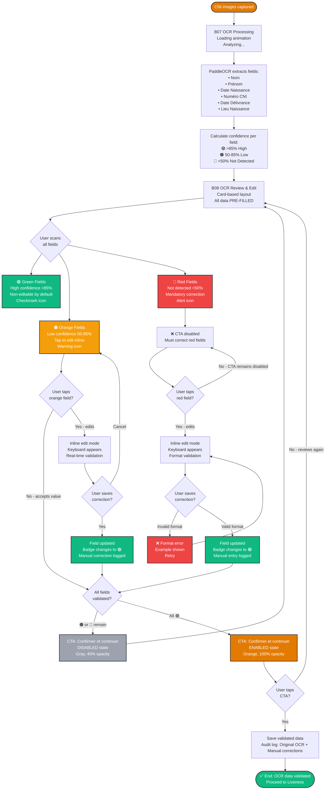

# OCR Review Task Flow — BICEC VeriPass

**Nom officiel:** OCR Review Task Flow  
**Version:** 1.0  
**Date:** 2026-02-26  
**Auteur:** Ken (UX Designer)

---

## Description

Ce micro-flux détaille le processus de revue et correction des données extraites par OCR depuis la CNI. Il implémente le paradigme "Auto-Extraction" où l'utilisateur ne remplit jamais de formulaires vides, mais confirme/corrige des données pré-remplies avec badges de confiance.

---

## Task Flow Diagram (Mermaid)



---

## Détails Techniques

### Confidence Calculation

#### PaddleOCR Output
```json
{
  "nom": {
    "text": "MBARGA",
    "confidence": 0.92
  },
  "prenom": {
    "text": "Jean",
    "confidence": 0.88
  },
  "date_naissance": {
    "text": "15/03/1985",
    "confidence": 0.76
  },
  "numero_cni": {
    "text": "123456789",
    "confidence": 0.45
  }
}
```

#### Badge Assignment Logic
```python
def assign_badge(confidence):
    if confidence >= 0.85:
        return "🟢 HIGH"  # Green - Non-editable by default
    elif confidence >= 0.50:
        return "🟠 LOW"   # Orange - Tap to edit
    else:
        return "🔴 NOT_DETECTED"  # Red - Mandatory correction
```

### Field Validation Rules

| Field | Format | Example | Validation |
|-------|--------|---------|------------|
| Nom | Alpha only | MBARGA | Regex: `^[A-ZÀ-Ÿ\s-]+$` |
| Prénom | Alpha only | Jean | Regex: `^[A-ZÀ-Ÿa-zà-ÿ\s-]+$` |
| Date Naissance | DD/MM/YYYY | 15/03/1985 | Age 18-100 years |
| Numéro CNI | 9 digits | 123456789 | Regex: `^\d{9}$` |
| Date Délivrance | DD/MM/YYYY | 10/01/2020 | After Date Naissance |
| Lieu Naissance | Alpha + spaces | Yaoundé | Regex: `^[A-ZÀ-Ÿa-zà-ÿ\s-]+$` |

### Inline Editing UX

#### Orange Field (Low Confidence)
```
┌─────────────────────────────────────┐
│ 🟠 Date de Naissance                │
│ ┌─────────────────────────────────┐ │
│ │ 15/03/1985                      │ │ ← Tap to edit
│ └─────────────────────────────────┘ │
│ Confiance: 76% - Vérifiez SVP      │
└─────────────────────────────────────┘
```

#### Red Field (Not Detected)
```
┌─────────────────────────────────────┐
│ 🔴 Numéro CNI                       │
│ ┌─────────────────────────────────┐ │
│ │ [Vide - Saisissez manuellement] │ │ ← Must fill
│ └─────────────────────────────────┘ │
│ Format: 9 chiffres (ex: 123456789) │
└─────────────────────────────────────┘
```

#### Green Field (High Confidence)
```
┌─────────────────────────────────────┐
│ 🟢 Nom                              │
│ MBARGA                              │ ← Non-editable (tap to unlock)
│ ✓ Validé                            │
└─────────────────────────────────────┘
```

### Audit Trail

Every correction is logged for Jean's review:

```json
{
  "field": "date_naissance",
  "ocr_value": "15/03/1985",
  "ocr_confidence": 0.76,
  "user_correction": "15/03/1986",
  "correction_timestamp": "2026-02-26T14:32:15Z",
  "correction_type": "MANUAL_EDIT"
}
```

---

## User Experience Notes

### Auto-Extraction Paradigm
- **NO blank forms**: All fields pre-filled by AI
- **User role**: Validator, not data entry clerk
- **Cognitive load**: Reduced from "fill 6 fields" to "verify 6 fields"

### Confidence Badges
- **🟢 Green**: Builds trust ("AI got it right")
- **🟠 Orange**: Prompts attention ("Please verify")
- **🔴 Red**: Clear action required ("Must correct")

### Inline Editing
- **No modals**: Edit directly in card (Revolut pattern)
- **No separate screens**: Keeps context visible
- **Real-time validation**: Immediate feedback on format errors

### CTA Gating
- **Disabled state**: Clear visual (gray, 40% opacity)
- **Enabled state**: Vibrant orange, 100% opacity
- **Logic**: Prevents submission with unresolved 🟠🔴 fields

### Timing
- **OCR Processing**: 3-5 seconds
- **User Review**: 1-2 minutes (depends on corrections needed)
- **Total**: 1.5-2.5 minutes

---

## Accessibility

- **Visual**: High contrast badges (WCAG AA compliant)
- **Motor**: Large tap targets (48x48dp minimum)
- **Cognitive**: Clear icons + text labels (not color-only)
- **Screen Readers**: Badge states announced ("High confidence, validated")

---

## Références

- **CNI Capture Flow**: `docs/diagrams/flows/cni-capture-task-flow.md`
- **End-to-End Flow**: `docs/diagrams/flows/end-to-end-user-flow.md`
- **UX Spec v2**: `_bmad-output/planning-artifacts/ux-design-specification-v2.md` (Module B, Screen B08)
- **PRD**: `_bmad-output/planning-artifacts/prd.md` (FR5, FR20, FR24)
