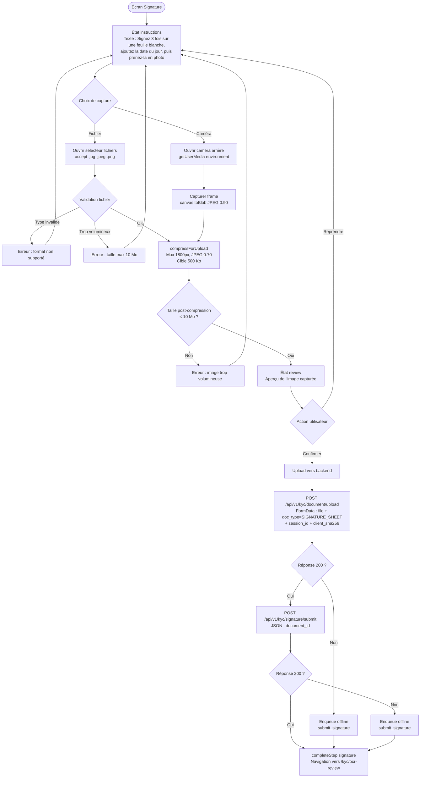

# Flux de capture signature manuscrite — BICEC VeriPass

**Version:** 1.0
**Date:** 2026-06-17

---

## Description

Ce flux détaille la capture et l'upload d'une feuille de papier blanc comportant 3 signatures manuscrites et la date du jour. L'image est ensuite compressée, uploadée en tant que document `SIGNATURE_SHEET`, puis liée à l'enregistrement de consentement de la session KYC.

Le dessin sur canvas (ancien flux) a été supprimé. La caméra est le mode de capture prioritaire, avec un sélecteur de fichier en fallback (JPG/PNG uniquement, pas de PDF).

---

## Flux Mermaid

---

## États de l'écran

| État | UI | Comportement |
| --- | --- | --- |
| `instructions` | `ScreenLayoutV2`, texte d'instruction, boutons Capturer / Choisir un fichier | État initial |
| `camera` | Plein écran, flux vidéo, overlay cadre, bouton capture | Caméra arrière prioritaire, fallback caméra frontale |
| `review` | Aperçu image, boutons Reprendre / Confirmer | Compression appliquée, vérification taille |
| `uploading` | Indicateur de progression | Upload en cours |

---

## Points d'intégration

- **Compression :** `compressForUpload()` depuis `src/utils/imageCompression.ts` (max 1800px, JPEG 0.70, cible 500 Ko, fallback 0.55)
- **Intégrité :** SHA-256 calculé via `crypto.subtle.digest`, envoyé comme `client_sha256`
- **Offline :** `enqueueOfflineSignature()` depuis `kycSyncService.ts`, op_type `submit_signature`
- **Replay offline :** upload du document `SIGNATURE_SHEET` puis appel `signature/submit` avec le `document_id`
- **OCR :** le pipeline OCR n'est pas déclenché pour `SIGNATURE_SHEET` (absent de `OCR_ENABLED_DOC_TYPES`)
- **Backoffice :** le document `SIGNATURE_SHEET` apparaît automatiquement comme onglet dans `EvidenceViewerPage` via le chargement dynamique des documents du dossier
