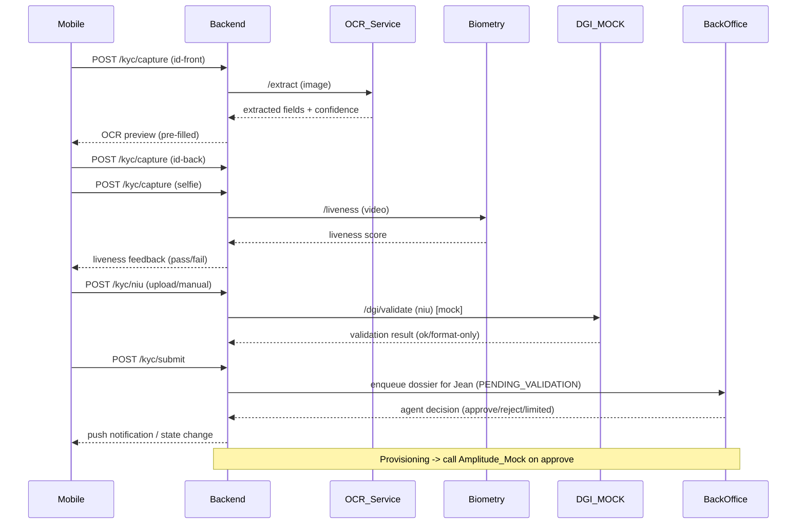

```mermaid
sequenceDiagram
  participant Mobile
  participant Backend
  participant OCR as OCR_Service
  participant BIOMET as Biometry
  participant DGI as DGI_MOCK
  participant BackOffice

  Mobile->>Backend: POST /kyc/capture (id-front)
  Backend->>OCR: /extract (image)
  OCR-->>Backend: extracted fields + confidence
  Backend-->>Mobile: OCR preview (pre-filled)

  Mobile->>Backend: POST /kyc/capture (id-back)
  Mobile->>Backend: POST /kyc/capture (selfie)
  Backend->>BIOMET: /liveness (video)
  BIOMET-->>Backend: liveness score
  Backend-->>Mobile: liveness feedback (pass/fail)

  Mobile->>Backend: POST /kyc/niu (upload/manual)
  Backend->>DGI: /dgi/validate (niu) [mock]
  DGI-->>Backend: validation result (ok/format-only)

  Mobile->>Backend: POST /kyc/submit
  Backend->>BackOffice: enqueue dossier for Jean (PENDING_VALIDATION)
  BackOffice-->>Backend: agent decision (approve/reject/limited)
  Backend-->>Mobile: push notification / state change

  Note over Backend,BackOffice: Provisioning -> call Amplitude_Mock on approve
```
