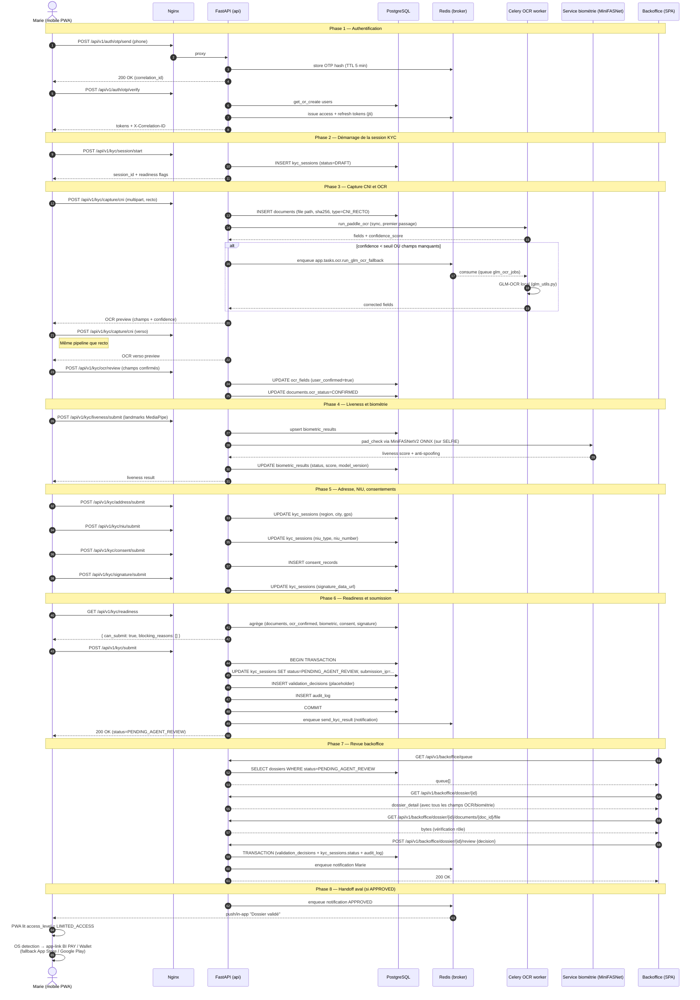

# Diagramme de séquence — capture et soumission KYC (version courante)

> **Note d'autorité, 2026-06-02 :** ce diagramme remplace `sequence-capture-upload-mermaid.md` (déplacé dans `docs/diagrams/_obsolete/`). Il ne contient **aucune** référence à la DGI, à Sopra Amplitude, ou à un core banking. La séquence illustre le parcours réel implémenté dans `code/backend/app/modules/kyc/` et `code/backend/app/tasks/ocr.py`.
>
> **Document maître :** [`../BICEC-VERIPASS-VUE-ENSEMBLE.md`](../BICEC-VERIPASS-VUE-ENSEMBLE.md) § 4.2.

## Ce que ce diagramme **ne montre pas** (volontairement)

- **Aucun appel DGI.** La validation NIU côté VeriPass est limitée à des contrôles de format et à la gestion `niu_type ∈ {MISSING, DECLARATIVE, UPLOADED}`.
- **Aucun appel Sopra Amplitude.** Aucune route `/amplitude/*` n'existe dans le code.
- **Aucun appel core banking.** Le module `banking/` est une coquille produit locale (cards, transfers, transactions, savings) qui n'est pas connectée à un adaptateur core banking externe.
- **Aucun provisioning de compte aval.** Le passage d'un client vers BI PAY, BICEC Mobile-Banking, ou BICEC Wallet est un **handoff mobile** (app-link + store fallback), pas un provisioning côté VeriPass.
