# State Machine KYC - Version 3 (Updated)

**Date:** 2026-03-04  
**Version:** 3.0  
**Auteur:** Ken-André  
**Contexte:** Diagramme d'état mis à jour selon les retours du 2026-03-04

## Notes importantes sur cette version

### Clarifications sur les niveaux d'accès (access_level)

Les `access_level` ne sont **PAS** des états de la state machine KYC, mais des **attributs de permission** qui évoluent en parallèle du workflow principal. Voici la logique corrigée :

1. **RESTRICTED_ACCESS** : État par défaut pendant tout le parcours d'onboarding (DRAFT → PENDING_KYC → attente validation). L'utilisateur peut consulter l'app en mode "vitrine" mais ne peut effectuer aucune opération bancaire.

2. **Validation par Jean** : Dès que Jean pré-approuve le dossier (avec ou sans NIU), l'utilisateur reçoit une notification SMS/in-app pour venir en agence. À ce stade, le provisioning Amplitude démarre en parallèle (orchestré par Thomas) mais n'est **pas bloquant** pour la suite.

3. **Activation en agence** : C'est l'agent en agence qui active physiquement le compte après signature wet 3x. À ce moment :
   - **Si NIU valide** : `access_level = FULL_ACCESS`
   - **Si NIU déclaratif ou absent** : `access_level = LIMITED_ACCESS`

4. **Provisioning Amplitude** : C'est un processus parallèle géré par Thomas. Même si le batch Amplitude échoue ou est en attente, cela ne bloque pas l'activation du compte côté BICEC. Thomas peut retry à tout moment.

5. **Rôle de Thomas** : Thomas intervient de manière **non-bloquante** sur plusieurs points :
   - Screening AML/PEP (peut mettre en COMPLIANCE_REVIEW)
   - Gestion des erreurs de provisioning Amplitude
   - Suspension de comptes (DISABLED) pour fraude avérée
   - Mais ses actions ne bloquent pas le flow principal Marie → Jean → Agence

### Différence OLAP vs OLTP

**OLTP (Online Transaction Processing)** :
- Base de données opérationnelle en temps réel
- Optimisée pour les INSERT/UPDATE/DELETE rapides
- Utilisée pour : création de sessions KYC, validation par Jean, mise à jour des statuts
- Exemple : PostgreSQL avec tables `kyc_sessions`, `users`, `documents`

**OLAP (Online Analytical Processing)** :
- Entrepôt de données (Data Warehouse) pour l'analyse
- Optimisée pour les requêtes complexes d'agrégation (SUM, AVG, GROUP BY)
- Utilisée pour : dashboards Sylvie, funnel analytics, SLA monitoring
- Exemple : Star Schema dans PostgreSQL avec tables `fact_kyc_events`, `dim_users`, `dim_time`

Dans notre architecture, nous utilisons **PostgreSQL pour les deux** (OLTP + OLAP) car le volume MVP est faible. En Phase 2, on pourrait séparer avec un ETL vers un vrai DWH.

---

## Diagramme d'état KYC (Mermaid avec config ELK)

```mermaid
%% {init: {'theme':'base', 'layout':'elk', 'themeVariables': { 'primaryColor':'#E3F2FD','primaryTextColor':'#000','primaryBorderColor':'#1976D2','lineColor':'#1976D2','secondaryColor':'#FFF3E0','tertiaryColor':'#F3E5F5'}}}%%
stateDiagram-v2
    direction TB
    
    [*] --> DRAFT : Marie crée session<br>(access_level = RESTRICTED)

    note right of DRAFT
        Étapes de capture:<br>
        - CNI Recto/Verso<br>
        - Liveness (max 3 tentatives)<br>
        - Adresse + Facture<br>
        - NIU (optionnel)<br>
        - Consentements
    end note

    DRAFT --> LOCKED_LIVENESS : 3 échecs liveness<br>consécutifs
    
    note right of LOCKED_LIVENESS
        Cooldown 15s avant nouvelle session<br>
        + vérification user.lockout_count_24h ≤ 30<br>
        (résout E02 + E05)
    end note
    
    LOCKED_LIVENESS --> DRAFT : Clic "Recommencer"<br>(après cooldown, cache purgé)
    LOCKED_LIVENESS --> [*] : Clic "Aller en agence"

    DRAFT --> PENDING_KYC : Marie soumet<br>(access_level reste RESTRICTED)

    note right of PENDING_KYC
        File d'attente Jean<br>
        Scoring automatique de confiance<br>
        Détection doublons en arrière-plan
    end note

    PENDING_KYC --> PENDING_INFO : Jean demande<br>info/doc supplémentaire
    
    PENDING_INFO --> PENDING_KYC : Marie renvoie<br>le document (messagerie)
    
    note right of PENDING_INFO
        Timeout : si inactif > 7 jours<br>
        → Celery notifie Jean + Marie<br>
        (résout E08)
    end note

    %% Branche AML/Compliance (Thomas - Non bloquante pour le flow principal)
    PENDING_KYC --> COMPLIANCE_REVIEW : Alerte AML<br>auto-détectée
    
    note right of COMPLIANCE_REVIEW
        Thomas examine PEP/Sanctions<br>
        Processus parallèle, peut prendre du temps<br>
        N'empêche pas Jean de continuer si faux positif
    end note
    
    COMPLIANCE_REVIEW --> PENDING_KYC : Thomas efface<br>faux positif
    COMPLIANCE_REVIEW --> MONITORED : Thomas confirme PEP<br>(compte actif, surveillé)
    COMPLIANCE_REVIEW --> DISABLED : Thomas confirme<br>fraude avérée

    PENDING_KYC --> REJECTED : Jean rejette<br>(fraude évidente uniquement)
    
    REJECTED --> [*] : Notification Marie<br>+ motif

    %% Validation Jean → Notification Agence
    PENDING_KYC --> VALIDATED_PENDING_AGENCY : Jean pré-approuve<br>(avec ou sans NIU)
    
    note right of VALIDATED_PENDING_AGENCY
        SMS + Notification in-app envoyés<br>
        "Venez en agence pour finaliser"<br>
        <br>
        Provisioning Amplitude démarre en parallèle<br>
        (géré par Thomas, non bloquant)
    end note

    %% Activation en agence (point critique)
    VALIDATED_PENDING_AGENCY --> ACTIVATED_LIMITED : Signature agence effectuée<br>SANS NIU valide<br>(access_level = LIMITED_ACCESS)
    
    VALIDATED_PENDING_AGENCY --> ACTIVATED_FULL : Signature agence effectuée<br>AVEC NIU valide<br>(access_level = FULL_ACCESS)

    note right of ACTIVATED_LIMITED
        Autorisations LIMITED_ACCESS:<br>
        ✅ Dépôts (Cash-In)<br>
        ✅ Consultation solde<br>
        ✅ Virements sortants<br>
        ✅ Retraits (Cash-Out)<br>
        ✅ Émission carte<br>
        ✅ Découverte services<br>
        ❌ Crypto<br>
        ❌ Épargne<br>
        ❌ Investissements<br>
        ❌ Crédit
    end note

    note right of ACTIVATED_FULL
        Autorisations FULL_ACCESS:<br>
        ✅ Toutes fonctionnalités débloquées<br>
        ✅ Crypto, Épargne, Investissements<br>
        ✅ Crédit (selon scoring)
    end note

    %% Upgrade LIMITED → FULL
    ACTIVATED_LIMITED --> ACTIVATED_FULL : Marie uploade NIU<br>+ Agent agence revalide

    %% Gestion expiration documents
    ACTIVATED_FULL --> EXPIRY_WARNING : Système détecte<br>doc expirant < 30j
    
    EXPIRY_WARNING --> PENDING_RESUBMIT : Jean notifie Marie<br>(délai 30 jours)
    
    PENDING_RESUBMIT --> ACTIVATED_FULL : Marie soumet + Jean réapprouve
    PENDING_RESUBMIT --> ACTIVATED_LIMITED : Délai dépassé<br>(access_level rétrogradé)

    %% Branche Monitored (PEP confirmé)
    MONITORED --> ACTIVATED_FULL : Surveillance levée<br>(après période observation)
    MONITORED --> DISABLED : Fraude confirmée<br>après surveillance

    %% Suspensions par Thomas (peut intervenir à tout moment)
    ACTIVATED_FULL --> DISABLED : Thomas suspend<br>(fraude/AML)
    ACTIVATED_LIMITED --> DISABLED : Thomas suspend
    MONITORED --> DISABLED : Thomas suspend

    %% États finaux
    DISABLED --> [*] : Compte définitivement<br>désactivé

    %% ========== PROVISIONING AMPLITUDE (Processus parallèle) ==========
    
    note left of VALIDATED_PENDING_AGENCY
        PROVISIONING AMPLITUDE (Parallèle):<br>
        <br>
        Thomas lance batch Amplitude API<br>
        États possibles:<br>
        - PROVISIONING (en cours)<br>
        - OPS_ERROR (timeout 5min)<br>
        - OPS_CORRECTION (erreur format/NIU collision)<br>
        <br>
        ⚠️ Ces états n'impactent PAS le flow principal<br>
        Thomas peut retry à tout moment<br>
        Le compte reste actif côté BICEC
    end note
```

![State SVG Diagram](https://mermaid.ink/svg/pako:eNqNWN1u28gVfpUBi0BSI8e2HNmOsBuApqhAu7JkSIq2aV0YY3JkT0JxuDOk1t7Al10gwAIFelm0wF70Iu51L3qvN8kL9BX6zVASKZFK4osg4syc3--c8828tzzhM6tlPXlC3vOQxy3yvhLfshmrtCrXVLFKnVQCei-SGB9Y8E7_NusTKjm9Dpiq4AipRJLPqLx3RCAkdv7OPeo0Ou1KfbUwZnfxevHg4CBbORPSZ3K9dvji5LjdwHLAQ1b8qpgnQj-vqdPpHLlaXsxkzDdWjtxmp1l5eHh48uQyvAxVTGPW5vRG0tnevHEZEvz5XDIv5iIk47P0S_rvn37_Z7K395K0h3ZnTFrkHP4y4snFIyOKKYUT31zLl1Xqefh1FbA5C8i3ZOiOxsOuM3bbNa1SSwpFzIjkN7cxEdNUXrqg_xYfYhoxRXzIplGcSNbSYrMNe8Tpd8kQNor9CZNKbC_3-JyFMIFUZ_SOHJGYhfATH1Vte6vtS2xk5CnpUE_r2t7Q774mVRHpcIQsKJx3RKggHdkPY5UusNA3Dq6cTcOlA9cbON-77ated-L23dEIITwii0fvlnmKBEubtQLkU-F7EvOpyidgM2xb0jKrHCECX_wUksOmInROwxgnEyQj2MhTduApmS8eJZ9yj5q0J4rJZ4Hw3gHjV55Iwviq8fyWfPrwL3J0sHm0iuwrbCPuQQNy3INmbTsKmf3b_ufB5ATcI5cWsipmCKbH5KWVoimSi4-KeEun6gAFIkaiRN4sHmu7BWu0rsXa8F3CJkJvtOxLq5icC7ff7vZfXX3_xlljG57NWFwENTCDTHwR2DmRWcQ6HGnwKzTWqGTkO0a3sjHyhOThDaFJLGZIyI8JM7UgwimnMH5zd3vxGC-r1RfJdQDoGD-l5IuPku1FAQ3LcZl3OB-Abr8zQAS0YdA7o6FvVPJwKvZ94RGVRFGweNSIp-gU-QRviNgVVMnCueBGpo6E8BItCrWK-CI92FLbDfq8hiwIYz5jGoQtojjhISqZT8lLckLeikSqzYB9-uVvxGGAw70WDdCnOQB4jXk74X1aKw8jxsSZRF6ASfu8t--IWRSYPJHq-BYJVLqJIDtIzY8J1SmPYBSB69NA_ETQ8kOPRzSolWfFGZxf9Lp233Gvhu6k6_4AJ21YHxt12lqNkz0_hQFa8e7YFUTlAphayu7oDDMGRlzsj-CDhtVW-C6k0IWQKBJRSYNg8TFgdRIxxChCZtFOiZ-g486irYP9Cr4t_m1qF6qW8NKwjnmYoDqRuilN7hAexZGX3W2kGJIi1FYOTac0rZii6HIx54N-dzwYuu1MiKk8OTNhMb0ALSpCYA3M6qgHOWcckVh1o3LB7e7IPuuVyTXmSZogGlQ3YpPEcjQM3e9c3XBW9SnZW4ZGYqxailg8zrlvWksS6t6hi2ujoNYysi7ZN4Ww7P7rMnhKZsJEaw30CQ24n-4y6nUtbZy10_ZaavvE7nXbNhRfrVbsV27febPyBX3-cY9GkdSzKu25c-YRkRBF0dQwiD_TF3YJz7XV8xFqfMNaHmp9RPeje9T5Jl4vrQkG8s_Z0Ejrdor2EnC1Gk_Z_kKZzLmetLqT27olxDo5KFMQPNQIpGb1s9VzbgwG9PoSKXU4mzWQ3X3IBiDnqWuZ1dVIcLRXT3IzSpandyZDZ8p2xt2JWex1z7sp3Eb8JqSaIK3korTQcBKAVZs_svsjw5XmGiKsjAcuZV3ZjoMZvZHLr7Sm87rX-7Ip9sR1vmCKFpTZUYanQgiy_Njot5IrE2e15dUWU_30j7_oAR0t_hODjDpU3e51w1pxj2aRSRCnqVMgOqy4Z4JZa1gmNsgYOFDFPUMWS8rXugZJXKJs8WHGDQkEk5IxK7XY0zWoZwyAPueI3dauf_5KHHkfxaL4ffEBwL0JWXGlG4KBx9Cd-lEmcvHo87gc37vyo3O5Kzm5PJdkZozBjnvGVKSDTtc1BqjSRWpqDXgqiXHqd33tZ_0Lfpkjxi9SVSzQCU4J3u46fh3hPoZusao-3WYzN4vVWVolKdlKokBoUaiHtKXrDh2vCkeytEZyul9pV3QDuYu4pEtemVI0ta3faNLK3T9cdIdvrn6wh30Ury7RexUvPs5Mw9O8xKBBk8dULCz4BleJt_kesCUjP9JBtF-fwdXVpFjxtvWkqkJNQDlEpoyvVkZK11I-E66U8GNOpNN18biaR18lKuuW7dQemAWug7tcyRUCgZFC59nwhgKXPMfoAJSZT6qgHSuusOYYGU0pb5FLTmJ4KBQuW-PqMhXp654ALMS1LnCT5lLBOdLSSenF2hAjcClP5dTlfBklKmKhMqWYTTNMJM0WMZSgmoVcksVvJNYkeyZyZKUEZkUKpYwGP8d_9sGKa58rlJ1CvuD_9ua1l_q9Ai1XE4PkbnmrXB3LXURTzohsT_WjEm772ldTFug5mkoiSTmp367_yMVwMOmOugNTF7bmluPXbRe4KKHitdzBAlsK2PQrydJOlZmi1ufozzJYKf6uaezd5kiQfdHd3L2MINi54vr9rPDes2FOFdzGM1W-vW1wMbpyh8PBkFTj5Y2wiftM6T5nMByCBkMmBIKRaWonJO7b-5o6eCIIDH2rfc7LT3__7X___Stukwqs27gQVvgsQjJ1j72wR8VbXmmYTD1IzO77rVLY3N3T1WdQlL4_pNdcD-QCbPGs67jO5kSx6taN5L7VimXC6taMwT3903qv911a5tHy0mrhvz7D_SiIL616upS-b6ZrLHin30seIC6i4R-FmK0kojPe3FqtKQ0UfiWRnz0mrrfAGP2UmYSx1TptHhkZVuu9dWe1Gs1njebp8ekx_j05Omk-f1637q3W3uGLZ43T58cvjg5ODk8Pmi8aD3XrZ6P28FmjcXx0cnhycPzitNk4Pj2pW8zXffI8fbM1T7cP_weoVvu8)


---

## Rendu SVG

Pour générer le SVG avec la configuration ELK (layout optimisé), suivez ces étapes :

1. Copiez le code Mermaid ci-dessus
2. Allez sur [Mermaid Live Editor](https://mermaid.ai/live)
3. Collez le code
4. Exportez en SVG
5. Uploadez le SVG sur GitHub Gist ou un CDN
6. Le lien sera automatiquement transformé en image par GitHub

**Note** : GitHub ne supporte pas encore le layout ELK nativement, donc le code s'affichera avec le message "Unable to render rich display". C'est normal et attendu. L'important est d'avoir le code source correct et le SVG exporté.

---

## Tableau récapitulatif des états

| État | Description | access_level | Acteur principal | Bloquant ? |
|------|-------------|--------------|------------------|------------|
| **DRAFT** | Session en cours de création | RESTRICTED | Marie | Non |
| **LOCKED_LIVENESS** | 3 échecs liveness | RESTRICTED | Système | Oui (60s cooldown) |
| **PENDING_KYC** | Dossier soumis, en attente validation | RESTRICTED | Jean | Non |
| **PENDING_INFO** | Jean demande info supplémentaire | RESTRICTED | Marie | Non (timeout 7j) |
| **COMPLIANCE_REVIEW** | Alerte AML en cours d'examen | RESTRICTED | Thomas | Non (parallèle) |
| **MONITORED** | PEP confirmé, compte surveillé | FULL_ACCESS | Thomas | Non |
| **REJECTED** | Dossier rejeté par Jean | N/A | Jean | Oui (final) |
| **VALIDATED_PENDING_AGENCY** | Pré-approuvé, attente visite agence | RESTRICTED | Marie | Non |
| **ACTIVATED_LIMITED** | Compte actif, NIU manquant | LIMITED_ACCESS | Agent agence | Non |
| **ACTIVATED_FULL** | Compte actif, KYC complet | FULL_ACCESS | Agent agence | Non |
| **EXPIRY_WARNING** | Document expirant détecté | FULL_ACCESS | Système | Non |
| **PENDING_RESUBMIT** | Attente resoumission document | FULL_ACCESS | Marie | Non (30j) |
| **DISABLED** | Compte suspendu/désactivé | N/A | Thomas | Oui (final) |

---

## Processus parallèles (non représentés dans la state machine principale)

### Provisioning Amplitude (géré par Thomas)

Ce processus démarre après `VALIDATED_PENDING_AGENCY` mais n'est **pas bloquant** :

```
VALIDATED_PENDING_AGENCY
    ↓
[Batch Amplitude lancé par Thomas]
    ↓
PROVISIONING (en cours)
    ↓
    ├─→ SUCCESS (compte créé dans Amplitude)
    ├─→ OPS_ERROR (timeout 5min) → Thomas retry
    └─→ OPS_CORRECTION (erreur format/collision NIU) → Thomas corrige + retry
```

**Important** : Même si le provisioning échoue, le compte reste actif côté BICEC. Thomas peut relancer le batch à tout moment sans impacter l'utilisateur.

### Analytics & Monitoring (géré par Sylvie)

Processus continu en arrière-plan 

Ces processus lisent les données OLTP et alimentent les tables OLAP pour les dashboards.

---