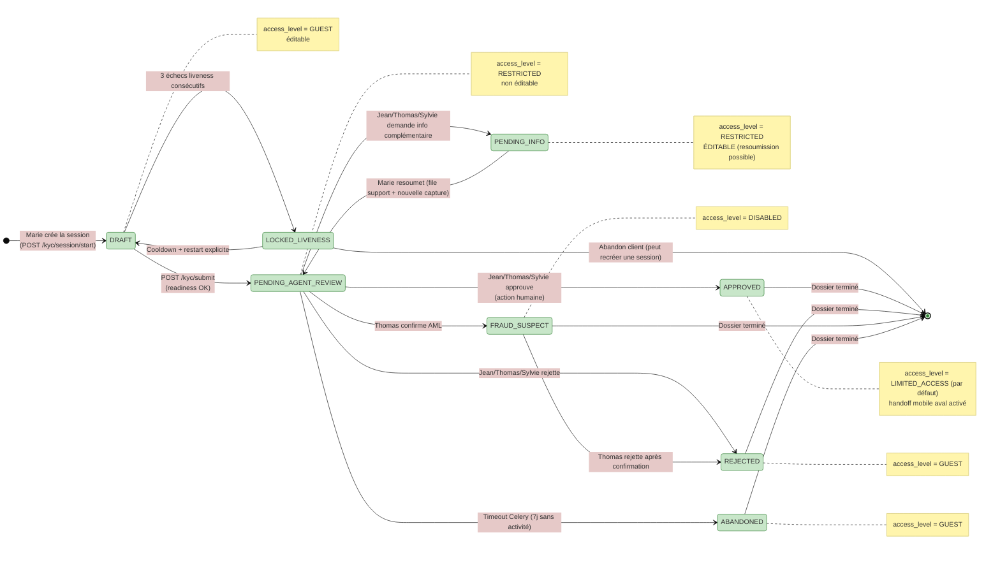

# Machine d'état KYC — version courante

> **Note d'autorité, 2026-06-02 :** ce diagramme est la source de vérité pour la machine d'état KYC. Il remplace `state-machine-kyc-v3-updated.md` (déplacé dans `docs/diagrams/_obsolete/`), qui contenait des références obsolètes à la DGI, à Sopra Amplitude, et à des états de provisioning bancaire qui n'existent pas dans le système.
>
> **Implémentation de référence :** `code/backend/app/modules/kyc/schemas.py` (énumérations `KYCStatus`, `AccessLevel`) et `code/backend/app/modules/kyc/service.py` (transitions).
>
> **Document maître :** [`../BICEC-VERIPASS-VUE-ENSEMBLE.md`](../BICEC-VERIPASS-VUE-ENSEMBLE.md) § 4.1.

## Règles générales

1. `status` (cycle de vie) et `access_level` (permission) sont **deux dimensions orthogonales**.
2. Toute transition vers `APPROVED` est **décidée par un humain** (Jean, Thomas, ou Sylvie).
3. `PENDING_INFO` reste **éditable** côté client pour permettre la resoumission.
4. Le handoff vers les apps aval (BI PAY, Wallet) est un **app-link côté mobile**, pas une intégration backend.

## Diagramme

## Tableau récapitulatif

| `status` | `access_level` par défaut | Éditable ? | Acteur principal | Bloquant ? |
| --- | --- | --- | --- | --- |
| `DRAFT` | `GUEST` | oui | Marie | non |
| `LOCKED_LIVENESS` | `RESTRICTED` | non | Système | oui (cooldown 60s) |
| `PENDING_AGENT_REVIEW` | `RESTRICTED` | non | Jean/Thomas/Sylvie | non |
| `PENDING_INFO` | `RESTRICTED` | **oui** | Marie | non (timeout 7j) |
| `APPROVED` | `LIMITED_ACCESS` | non | Jean/Thomas/Sylvie | oui (handoff débloqué) |
| `FRAUD_SUSPECT` | `DISABLED` | non | Thomas | oui (terminal) |
| `REJECTED` | `GUEST` | non | Jean/Thomas/Sylvie | oui (terminal) |
| `ABANDONED` | `GUEST` | non | Système (Celery) | oui (terminal) |

## Différences avec la version historique

- **DGI** : aucune référence. Pas de route `/dgi/validate`, pas d'état lié.
- **Sopra Amplitude** : aucune référence. Pas de provisioning batch Amplitude, pas d'état `PROVISIONING`/`OPS_ERROR`/`OPS_CORRECTION`.
- **Core banking** : aucune référence. Pas d'état `ACTIVATED_LIMITED`/`ACTIVATED_FULL`/`EXPIRY_WARNING`/`PENDING_RESUBMIT` côté VeriPass. Ces états ne sont pas la responsabilité de VeriPass.
- **Handoff aval** : représenté uniquement comme **app-link côté mobile** déclenché après `APPROVED → LIMITED_ACCESS`. Pas d'intégration backend avec les apps aval.
