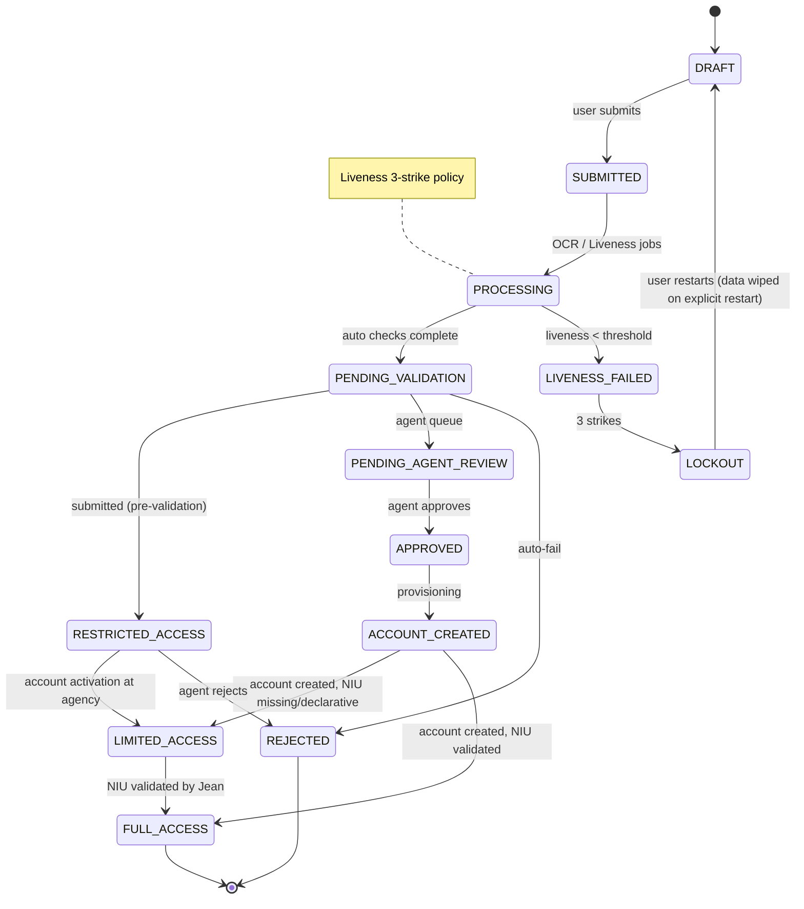

```mermaid
stateDiagram-v2
  %% Access & Dossier Statechart — canonical from UX Spec v2 (2026-02-18)
  [*] --> DRAFT
  DRAFT --> SUBMITTED : user submits
  SUBMITTED --> PROCESSING : OCR / Liveness jobs
  PROCESSING --> PENDING_VALIDATION : auto checks complete
  PENDING_VALIDATION --> RESTRICTED_ACCESS : submitted (pre-validation)
  PENDING_VALIDATION --> PENDING_AGENT_REVIEW : agent queue
  PENDING_AGENT_REVIEW --> APPROVED : agent approves
  APPROVED --> ACCOUNT_CREATED : provisioning
  ACCOUNT_CREATED --> LIMITED_ACCESS : account created, NIU missing/declarative
  ACCOUNT_CREATED --> FULL_ACCESS : account created, NIU validated
  LIMITED_ACCESS --> FULL_ACCESS : NIU validated by Jean
  RESTRICTED_ACCESS --> LIMITED_ACCESS : account activation at agency
  RESTRICTED_ACCESS --> REJECTED : agent rejects
  PENDING_VALIDATION --> REJECTED : auto-fail
  REJECTED --> [*]
  FULL_ACCESS --> [*]
  %% Liveness failure submachine
  note left of PROCESSING: Liveness 3-strike policy
  PROCESSING --> LIVENESS_FAILED : liveness < threshold
  LIVENESS_FAILED --> LOCKOUT : 3 strikes
  LOCKOUT --> DRAFT : user restarts (data wiped on explicit restart)
```

[Draft Statechart](https://shd101wyy.gallerycdn.vsassets.io/extensions/shd101wyy/markdown-preview-enhanced/0.8.20/1761999371305/Microsoft.VisualStudio.Services.VSIXPackage)