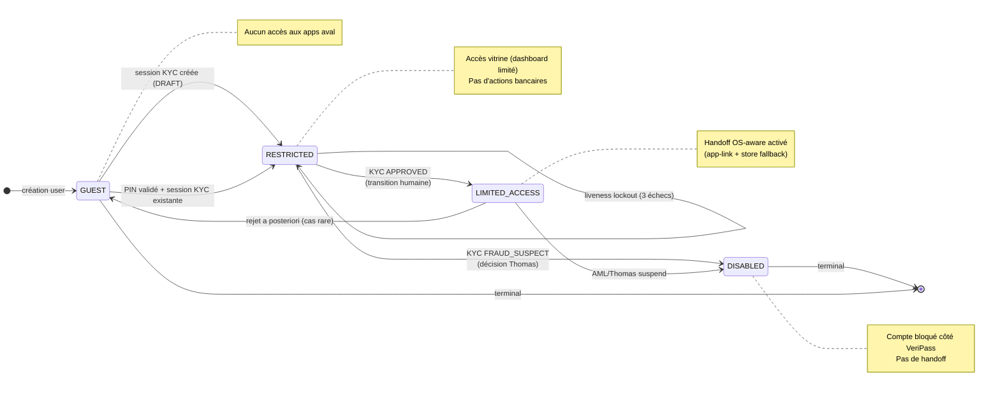

# Statechart — `access_level` (version courante)

> **Note d'autorité, 2026-06-02 :** ce diagramme remplace `statechart-access-mermaid.md` (déplacé dans `docs/diagrams/_obsolete/`). Il décrit **uniquement** les niveaux d'accès contrôlés par VeriPass. Il ne représente pas le cycle de vie d'un compte bancaire aval (qui n'est pas la responsabilité de VeriPass).
>
> **Implémentation de référence :** `code/backend/app/modules/kyc/schemas.py` (énumération `AccessLevel`).
>
> **Document maître :** [`../BICEC-VERIPASS-VUE-ENSEMBLE.md`](../BICEC-VERIPASS-VUE-ENSEMBLE.md) § 4.1.

## Règle d'or

`access_level` est une **dimension de permission orthogonale au `status` KYC**. Il est mis à jour :

- à l'ouverture de session (`GUEST`),
- à la soumission (`RESTRICTED`),
- à l'approbation (`LIMITED_ACCESS` par défaut),
- à la détection de fraude (`DISABLED`),
- lors d'un lockout liveness (`RESTRICTED`),
- lors d'un rejet ou abandon (`GUEST`).

## Différences avec la version historique

- **Pas de `FULL_ACCESS`** dans le périmètre actuel. Le `APPROVED` mappe **par défaut** sur `LIMITED_ACCESS`. Le passage à un éventuel `FULL_ACCESS` est une décision produit future, pas un état actuel.
- **Pas de `ACCOUNT_CREATED`** : VeriPass ne crée pas de compte dans un core banking.
- **Pas de transition `LIMITED_ACCESS → FULL_ACCESS`** par validation NIU : la validation NIU ne se traduit pas par un upgrade d'access_level dans la version courante.
- **Pas d'`EXPIRY_WARNING` / `PENDING_RESUBMIT`** : ces états relèvent de la gestion documentaire au niveau de VeriPass (cf. `tasks/kyc.py:check_document_expiry`) mais n'entraînent **pas** un cycle d'access_level en soi.
