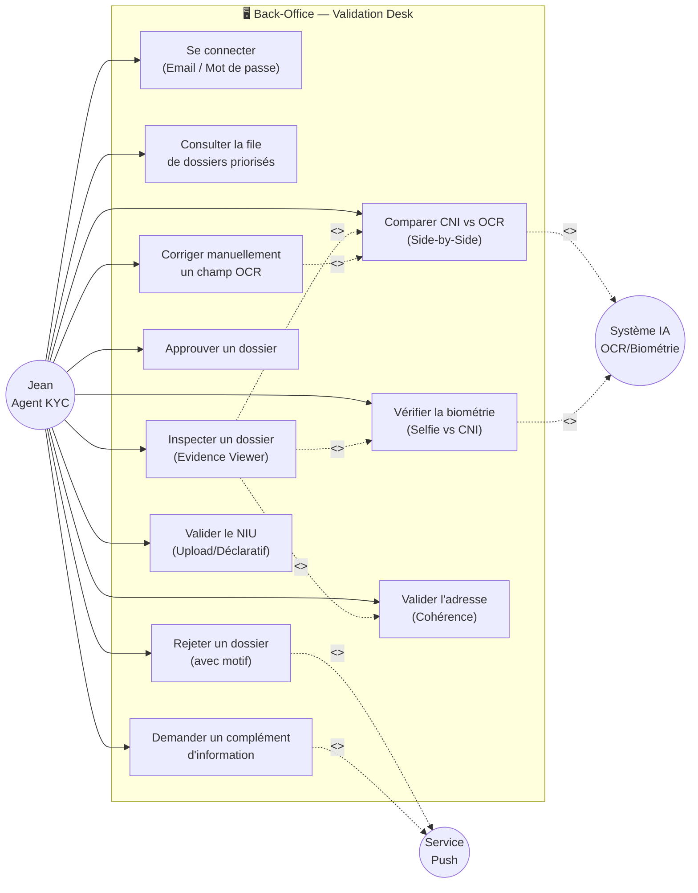
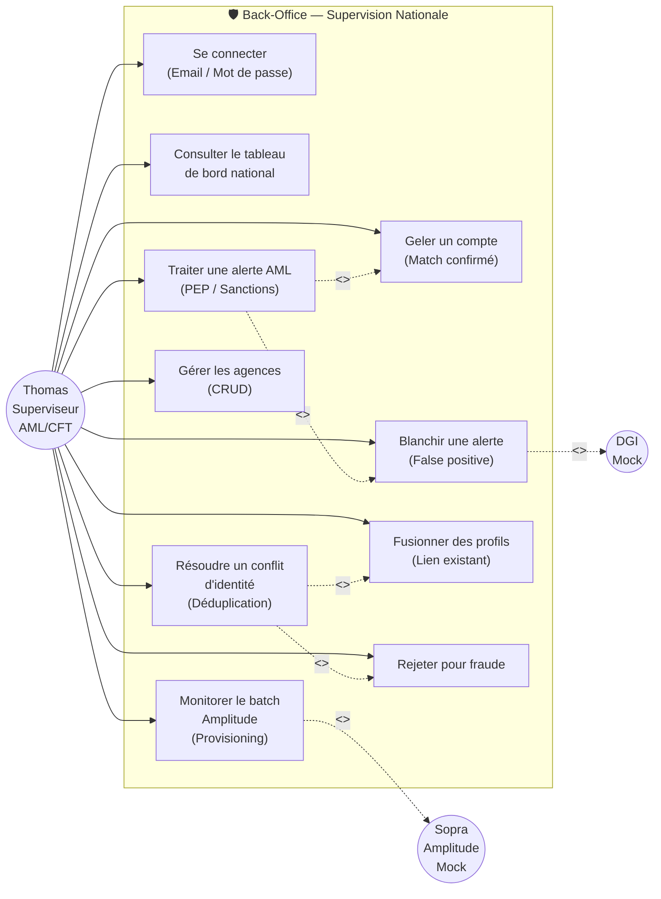
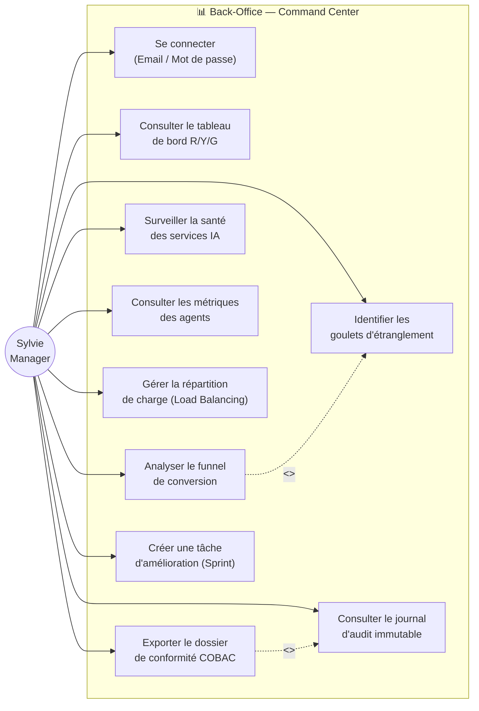
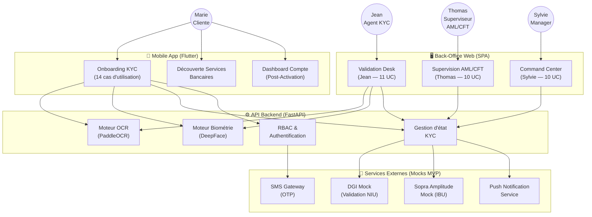

# Diagrammes de Cas d'Utilisation — BICEC VeriPass

**Date :** 2026-02-25  
**Source :** PRD v1 (2026-02-23), UX Design Specification v2.1 (2026-02-24)

---

## 1. Vue d'ensemble des Acteurs

| Acteur | Type | Description |
|:---|:---|:---|
| **Marie** (Cliente) | Primaire | Nouvelle cliente entrepreneur, utilisatrice de l'app mobile Flutter |
| **Jean** (Agent KYC) | Primaire | Validateur interne, back-office web — Validation Desk |
| **Thomas** (Superviseur AML/CFT) | Primaire | Superviseur national conformité — AML, Déduplication, Administration |
| **Sylvie** (Manager) | Primaire | Directrice d'agence/centrale — Command Center Dashboard |
| **Système IA** (PaddleOCR / DeepFace) | Secondaire (Système) | Moteur souverain d'OCR et de biométrie |
| **DGI Mock** | Secondaire (Externe) | Service simulé de validation fiscale (NIU) |
| **Sopra Amplitude Mock** | Secondaire (Externe) | Service simulé de provisioning bancaire (IBU) |
| **Service SMS/Push** | Secondaire (Externe) | Envoi OTP (SMS) et notifications de statut (Push) |

---

## 2. Diagramme Principal — Système KYC Onboarding Mobile (Marie)

```mmd
graph LR
    %% ========== ACTEUR ==========
    Marie((Marie<br/>Cliente))

    %% ========== CAS D'UTILISATION ==========
    subgraph "📱 Système Mobile — Onboarding KYC"
        UC1["S'authentifier<br/>(OTP SMS/Email + PIN)"]
        UC2["Configurer la biométrie<br/>(Face ID / Empreinte)"]
        UC3["Capturer le CNI<br/>(Recto + Verso)"]
        UC4["Revoir les données OCR<br/>(Confirmation IA)"]
        UC5["Effectuer le test<br/>de Liveness"]
        UC6["Saisir l'adresse<br/>(Cascade)"]
        UC7["Fournir la preuve<br/>de domicile<br/>(ENEO/CAMWATER)"]
        UC8["Soumettre le NIU<br/>(Upload ou Déclaratif)"]
        UC9["Accepter les CGU<br/>(3 consentements)"]
        UC10["Signer numériquement<br/>le contrat"]
        UC11["Soumettre le dossier<br/>(Upload sécurisé)"]
        UC12["Découvrir les services<br/>bancaires<br/>(Plans / Personnalisation)"]
        UC13["Reprendre une session<br/>interrompue"]
        UC14["Utiliser le GPS<br/>(Vérification optionnelle)"]
    end

    %% ========== SYSTÈMES EXTERNES ==========
    SMS((Service<br/>SMS/Push))
    IA((Système IA<br/>OCR/Biométrie))

    %% ========== RELATIONS ==========
    Marie --> UC1
    Marie --> UC2
    Marie --> UC3
    Marie --> UC4
    Marie --> UC5
    Marie --> UC6
    Marie --> UC7
    Marie --> UC8
    Marie --> UC9
    Marie --> UC10
    Marie --> UC11
    Marie --> UC12
    Marie --> UC13
    Marie --> UC14

    UC1 -.->|<<include>>| SMS
    UC3 -.->|<<include>>| IA
    UC4 -.->|<<include>>| IA
    UC5 -.->|<<include>>| IA
    UC7 -.->|<<include>>| IA
```

### Détail des cas d'utilisation — Marie

| ID | Cas d'utilisation | FR associés | Pré-condition | Post-condition |
|:---|:---|:---|:---|:---|
| UC1 | S'authentifier (OTP + PIN) | FR1 | Aucune | Session authentifiée, PIN créé |
| UC2 | Configurer la biométrie | FR1 (enhanced) | UC1 complété | Biométrie optionnelle configurée |
| UC3 | Capturer le CNI (R+V) | FR2, FR3 | UC1 complété | Images CNI capturées et validées qualité |
| UC4 | Revoir les données OCR | FR5, FR24 | UC3 complété | Données extraites confirmées/corrigées |
| UC5 | Effectuer test Liveness | FR4, FR7 | UC3 complété | Selfie vérifié ou lockout 3 strikes |
| UC6 | Saisir l'adresse (Cascade) | FR9 | UC5 complété | Adresse structurée enregistrée |
| UC7 | Fournir preuve domicile | FR12, FR13 | UC6 complété | Facture capturée et analysée |
| UC8 | Soumettre le NIU | FR14, FR15, FR16 | UC7 complété | NIU validé ou mode LIMITED_ACCESS |
| UC9 | Accepter les CGU | FR17 | UC8 complété | 3 consentements explicites enregistrés |
| UC10 | Signer numériquement | FR18 | UC9 complété | Signature horodatée stockée |
| UC11 | Soumettre le dossier | FR6 | UC10 complété | Dossier transmis, statut PENDING_KYC |
| UC12 | Découvrir services bancaires | FR39-FR47 | UC11 complété | Mode vitrine / découverte |
| UC13 | Reprendre session interrompue | FR6, NFR8 | Session en cours existante | Reprise sans perte de données |
| UC14 | Utiliser le GPS | FR10, FR11 | UC6 en cours | Coordonnées GPS enregistrées |

---

## 3. Diagramme — Back-Office Validation (Jean)



### Détail des cas d'utilisation — Jean

| ID | Cas d'utilisation | FR associés | Description |
|:---|:---|:---|:---|
| UCJ1 | Se connecter | NFR4 | Authentification Email/Password (pas d'AD) |
| UCJ2 | Consulter la file priorisée | FR26, FR26b | FIFO + priorité + score de confiance global + load balancing |
| UCJ3 | Inspecter un dossier | FR27 | Vue détaillée avec onglets Evidence |
| UCJ4 | Comparer CNI vs OCR | FR27 | Vue haute-résolution side-by-side (Recto, Verso) |
| UCJ5 | Vérifier la biométrie | FR22, FR23 | Comparaison Selfie ↔ Photo CNI avec score |
| UCJ6 | Valider l'adresse | FR13 | Cohérence cascade adresse + zone agence utilitaire |
| UCJ7 | Corriger manuellement | FR27 (override) | Édition avec justification obligatoire + audit log |
| UCJ8 | Approuver un dossier | FR29 | Envoi vers la file Thomas (Provisioning) |
| UCJ9 | Rejeter un dossier | FR29 | Push notification au client avec motif |
| UCJ10 | Demander complément | FR29 | Push notification "Request Info" |
| UCJ11 | Valider le NIU | FR14-FR16 | Détermination FULL_ACCESS ou LIMITED_ACCESS |

---

## 4. Diagramme — Back-Office Supervision AML/CFT (Thomas)



### Détail des cas d'utilisation — Thomas

| ID | Cas d'utilisation | FR associés | Description |
|:---|:---|:---|:---|
| UCT1 | Se connecter | NFR4 | Email/Password, rôle AML/CFT Superviseur |
| UCT2 | Tableau de bord national | FR33 | Vue d'ensemble : AML Queue, Conflits, Agences, Batch |
| UCT3 | Traiter alerte AML | FR31 | Side-by-side profil vs hit PEP/Sanctions + scoring |
| UCT4 | Résoudre conflit identité | FR32 | Déduplication : comparer et fusionner/rejeter |
| UCT5 | Gérer les agences (CRUD) | FR33 | Créer / Modifier / Désactiver agences BICEC |
| UCT6 | Monitorer batch Amplitude | FR33 | Timeline des provisioning ✓/⚠/✗, retry erreurs |
| UCT7 | Geler un compte | FR31 | Action sur match confirmé — escalade |
| UCT8 | Blanchir une alerte | FR31 | Clôture faux positif avec justification loguée |
| UCT9 | Fusionner des profils | FR32 | Lien nouveau dossier → compte existant |
| UCT10 | Rejeter pour fraude | FR32 | Blocage et flag du dossier |

---

## 5. Diagramme — Back-Office Management (Sylvie)



### Détail des cas d'utilisation — Sylvie

| ID | Cas d'utilisation | FR associés | Description |
|:---|:---|:---|:---|
| UCS1 | Se connecter | NFR4 | Email/Password, rôle Manager |
| UCS2 | Dashboard R/Y/G | FR34 | Big Numbers : SLA, FTR, Queue Depth, Agents actifs |
| UCS3 | Analyser le funnel | FR35 | Drop-off par module (Auth → Identity → Address → Legal → Submit) |
| UCS4 | Identifier bottlenecks | FR35 | Drill-down par module et par période |
| UCS5 | Santé services IA | FR34 | Statut OCR/Liveness/API — Green/Yellow/Red |
| UCS6 | Métriques agents | FR34 | Temps moyen, FTR, dossiers traités par agent |
| UCS7 | Load balancing | FR26b | Redistribuer les dossiers entre agents |
| UCS8 | Export conformité | FR38 | Pack PDF + JSON + Images pour audit COBAC |
| UCS9 | Journal d'audit | FR36 | Log immutable SHA-256 de toute action |
| UCS10 | Créer tâche sprint | UX | Initier une amélioration suite à un bottleneck identifié |

---

## 6. Diagramme Récapitulatif — Vue Système Globale



---

## 7. Matrice de Traçabilité UC ↔ FR

| Cas d'utilisation | Exigences Fonctionnelles |
|:---|:---|
| **Marie — Onboarding** | FR1-FR18 |
| **Marie — Découverte** | FR39-FR47 |
| **Marie — Résilience** | FR6, NFR8 |
| **Jean — Validation** | FR26, FR26b, FR27, FR29 |
| **Jean — OCR Review** | FR5, FR24, FR22-FR25 |
| **Thomas — AML** | FR31, FR32, FR33 |
| **Sylvie — Dashboard** | FR34, FR35, FR36, FR37, FR38 |
| **Tous — Authentification** | FR1 (mobile), NFR4 (back-office) |
| **Tous — Audit** | FR36, FR38 |
