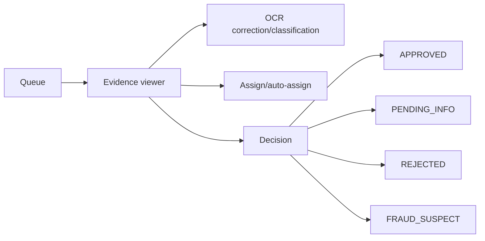
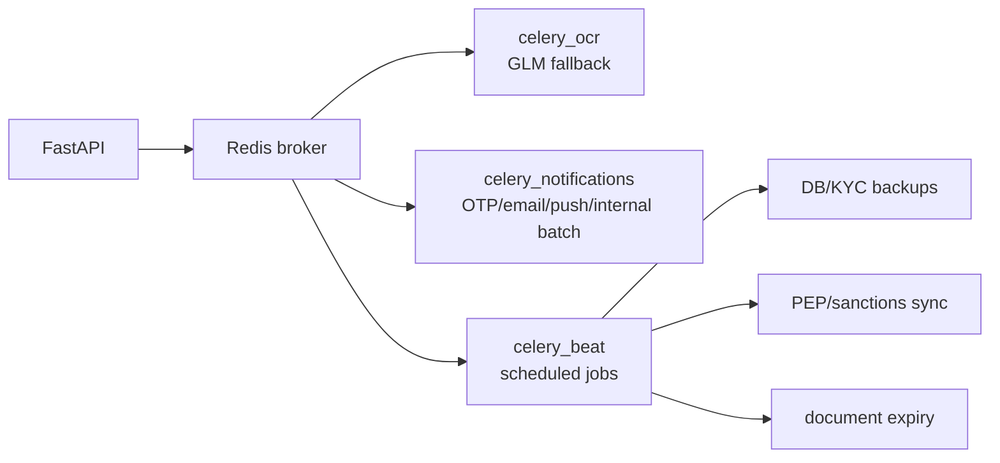

# Maintainer Handbook

Updated: 2026-05-28

This is the handover document to read when you inherit responsibility for the project. Its goal is to make the codebase understandable before you touch code, even if you did not build it and have no prior context.

## One-Page Mental Model

BICEC VeriPass has three user-facing surfaces and one backend core:

1. Marie uses the mobile PWA to create a KYC dossier.
2. The FastAPI backend stores documents, extracts OCR, checks liveness, tracks state, and exposes APIs.
3. Jean, Thomas, Sylvie, and Admin IT use the backoffice SPA to review, supervise, administer, and audit.
4. Docker Compose ties everything together with PostgreSQL, Redis, Celery, Nginx, Mailpit, Flower, and local AI model mounts.

The project is not just screens. It is a regulated workflow. The important invariant is: the system can automate extraction and checks, but human backoffice review controls KYC approval and downstream-app eligibility.

## Reading Order

Read in this order for a complete handover:

1. [Project Overview](./project-overview.md)
2. [Architecture](./architecture.md)
3. [Source Tree Analysis](./source-tree-analysis.md)
4. [Development Guide](./development-guide.md)
5. [API Contracts](./api-contracts.md)
6. [Data Models](./data-models.md)
7. [Component Inventory](./component-inventory.md)
8. [Deployment Guide](./deployment-guide.md)
9. [Operations Runbook](./operations-runbook.md)

Then read the historical/product context only where useful:

- `_bmad-output/planning-artifacts/prd.md`
- `_bmad-output/planning-artifacts/architecture-bicec-veripass.md`
- `_bmad-output/planning-artifacts/ux-design-specification-v2.md`
- `docs/adr/`
- `docs/diagrams/`
- `docs/test-evidence/`

## What Counts As Source Of Truth

| Question | Trust first |
| --- | --- |
| What endpoint exists? | `code/backend/app/api/v1/router.py` and module routers |
| What DB tables exist? | SQLAlchemy models and Alembic migrations |
| What route exists in mobile? | `code/mobile/src/App.tsx` |
| What route exists in backoffice? | `code/backoffice/src/App.tsx` |
| What services run locally? | `code/docker-compose.yml` |
| What public path routes where? | `code/infra/nginx/nginx.conf` |
| Why was a decision made? | ADRs and planning artifacts |

Planning docs explain intent. Code explains current behavior.

## Main Workflows

### Client KYC


### Backoffice Review



### Async Processing



## Critical Invariants

- Never delete persistent Docker volumes as a casual fix.
- KYC file bytes live in the document volume; PostgreSQL stores metadata and hashes.
- `status` and `access_level` are related but different.
- `APPROVED` currently maps to `LIMITED_ACCESS` by default.
- `FRAUD_SUSPECT` maps to `DISABLED`.
- `PENDING_INFO` must stay editable so clients can upload requested information.
- Agent role checks must be enforced in backend and reflected in frontend routes.
- Device tags matter after a mobile user has active registered devices.
- `OTP_MODE=dev_local` must not be used in production.
- `OCR_ONLINE=false` is the normal sovereign/offline demo setting.
- VeriPass is not a DGI, Sopra Amplitude, or core banking integration layer, now or as a planned future path.
- Approved KYC should serve as the eligibility guardrail for BI PAY, BICEC Mobile-Banking, or BICEC Wallet handoff through configured app links/deep links and store fallbacks.
- Historical planning artifacts or diagrams that mention DGI, Sopra Amplitude, or core banking provisioning are obsolete on that point.
- The static `openapi-spec.json` may be stale; runtime FastAPI docs are more reliable.

## Where To Make Changes

| Change request | Main files |
| --- | --- |
| Add mobile KYC screen | `code/mobile/src/App.tsx`, `src/views/kyc`, `src/hooks/useKycFlow.tsx`, `src/contexts/KycContext.tsx` |
| Add mobile API call | `code/mobile/src/services/apiClient.ts` or feature service, backend router |
| Change OCR fields | `code/backend/app/modules/kyc/service.py`, `services/ocr_service.py`, KYC screens |
| Change liveness scoring | `code/backend/app/modules/kyc/service.py`, `views/kyc/LivenessScreen.tsx` |
| Change submit readiness | `code/backend/app/modules/kyc/router.py`, `ReviewScreen.tsx`, tests |
| Change backoffice queue | `modules/backoffice/router.py`, `backoffice/src/services/dossier-service.ts`, validation pages |
| Change AML behavior | `modules/aml/service.py`, `modules/aml/router.py`, compliance pages |
| Change analytics | `modules/analytics/service.py`, `modules/analytics/router.py`, analytics pages |
| Add table | SQLAlchemy model, Alembic migration, schemas, tests, docs |
| Change deployment config | `code/docker-compose.yml`, `code/.env.example`, `code/infra/nginx/nginx.conf` |
| Change scheduled job | `core/celery_config.py`, task implementation, Compose worker |

## Review Checklist For Any Change

Before you mark a task done:

- Did the backend contract change?
- Did frontend TypeScript types change with it?
- Did the DB schema change?
- Is there an Alembic migration?
- Did any KYC state/access transition change?
- Did role access change in both frontend and backend?
- Could the change break offline replay?
- Could the change affect OCR/liveness timeouts?
- Did you update documentation?
- Did you run the narrow test suite?
- Did you run or intentionally skip the smoke/evidence flow?

## Test Strategy

Use focused checks first:

- Backend logic: run backend pytest.
- Mobile component/flow: run mobile Vitest and relevant Playwright spec.
- Backoffice UI: run backoffice Vitest, TypeScript check, and relevant Playwright spec.
- Docker/integration: run the smoke script.

High-signal commands:

```powershell
docker compose -f code/docker-compose.yml exec -T api pytest
cd code\mobile; bun run test; bun run build
cd code\backoffice; bun run test; bunx tsc --noEmit; bun run build
.\code\scripts\smoke_mvp_docker.ps1
```

## Known Risk Areas

| Area | Why it is risky | How to work safely |
| --- | --- | --- |
| OCR startup/warmup | Large models, first-call behavior, memory pressure | Check logs, model mounts, WSL2 memory, keep changes isolated |
| KYC readiness | Many fields and offline replay conditions | Test partial sessions and full happy path |
| Backoffice RBAC | Frontend and backend both enforce roles | Update both and test unauthorized paths |
| Alembic migrations | Persistent DB volumes hold real work | Back up before risky schema changes |
| Nginx pathing | `/mobile/`, `/back-office/`, `/assets/`, and deep links interact | Test direct refresh on nested routes |
| Celery beat | Runs backups, pruning, sanctions, expiry | Check schedule and task idempotency |
| Evidence files | Large generated proof assets | Regenerate rather than hand-edit |

## Common Questions

### Is this a production banking core?

No. It is a KYC onboarding and verified-identity guardrail. Its job is to capture, verify, store, and audit the user's KYC dossier, then let approved users continue toward configured BICEC mobile apps. DGI, Sopra Amplitude, and core banking integration are out of scope and should not be planned as the product's future direction.

### How should VeriPass connect to BI PAY or BICEC Wallet?

Use a mobile handoff. After approval, the frontend should detect the user's OS, try the configured app link/deep link when available, and fall back to the matching App Store or Google Play page. The store URLs and link schemes must be configuration values, not hard-coded strings.

### Why is there both mobile and backoffice?

The mobile PWA is the client acquisition journey. The backoffice is the human-in-the-loop compliance and validation layer required for regulated onboarding.

### Why not store images in PostgreSQL?

The architecture stores files in a persistent document volume and stores metadata/hashes in PostgreSQL. This keeps the database manageable and aligns with long retention of large KYC artifacts.

### Why does `APPROVED` map to `LIMITED_ACCESS`?

The current implementation treats approval as enough to unlock limited guarded actions and downstream-app handoff. Full access must remain a local product decision based on verified KYC completeness and explicit business rules, not on DGI/Sopra/core-banking provisioning.

### Why does the project use both PaddleOCR and GLM-OCR?

PaddleOCR is the fast structured extractor. GLM-OCR is the fallback for low-confidence or semantically difficult extraction, especially when Paddle misses fields.

### Why does Docker Compose mount offline models?

The project targets sovereign/offline operation and unreliable internet environments. Models should be available locally for demos and production-like runs.

### What should a new maintainer do first?

1. Read this handbook.
2. Start Docker stack.
3. Run smoke test.
4. Log in as Jean and Admin IT.
5. Open mobile PWA and walk the KYC happy path.
6. Read the source tree analysis before editing.

## Handoff Protocol

Every future change should leave this trail:

- Issue or task link.
- Files changed.
- Behavior changed.
- Migration needed or not.
- Tests run.
- Screenshots/evidence if UI changed.
- Docs updated.
- Known limitations.
