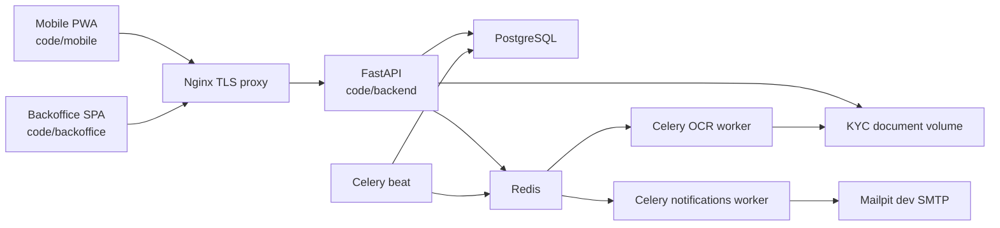

# BICEC VeriPass - Project Onboarding Guide

Updated: 2026-05-27

Audience: new engineers, reviewers, and AI agents joining the project.

Goal: get a full local environment running, understand the repository, and know where to make changes without damaging persistent data.

## What This Project Is

BICEC VeriPass is a sovereign digital KYC onboarding platform for BICEC. The MVP demonstrates:

- Mobile client onboarding for Marie.
- OCR-assisted CNI capture and review.
- Liveness and face matching.
- Human backoffice validation for Jean, Thomas, Sylvie, and Admin IT.
- Auditability, notifications, Celery workers, and local Docker execution.

The MVP does not claim to be a complete core banking system. DGI integration, Sopra Amplitude integration, and transactional core banking are outside the VeriPass product scope and should not be treated as a roadmap path. Approved KYC should instead unlock a guarded handoff toward configured BICEC mobile apps such as BI PAY, BICEC Mobile-Banking, or BICEC Wallet.

## Repository Map

- **[code/backend](../code/backend/)** - FastAPI API, PostgreSQL models, Alembic migrations, OCR, biometrics, Celery tasks.
- **[code/mobile](../code/mobile/)** - React/Vite mobile PWA for the client journey.
- **[code/backoffice](../code/backoffice/)** - React/Vite SPA for backoffice roles.
- **[code/infra](../code/infra/)** - Nginx, TLS, WSL2 template, offline model mounts.
- **[code/scripts](../code/scripts/)** - Volume bootstrap, smoke tests, env encryption, backups, pruning, model prep.
- **[docs](./)** - Project documentation, ADRs, diagrams, troubleshooting, test evidence.
- **[_bmad-output/planning-artifacts](../_bmad-output/planning-artifacts/)** - PRD, architecture, UX spec, epics, backlog.

## First Local Setup

### 1. Prerequisites

Use Windows with Docker Desktop on the WSL2 backend for the primary local workflow.

Required:

- Docker Desktop with WSL2 backend.
- Git.
- PowerShell.
- Bun for frontend development and tests.
- At least 16 GB RAM on the host.

Most backend work can run inside Docker. A local Python environment is useful, but not required for the first successful stack run.

### 2. Configure WSL2 Before Running The Stack

The OCR and worker services are memory-heavy. Configure WSL2 before the first full run:

```powershell
copy code\infra\.wslconfig.template $env:USERPROFILE\.wslconfig
notepad $env:USERPROFILE\.wslconfig
wsl --shutdown
```

In `.wslconfig`, replace `<USERNAME>` in `swapFile` and adjust `processors` for the machine. See **[setup-wsl2-windows.md](./setup-wsl2-windows.md)** for the full procedure.

### 3. Create Local Environment File

```powershell
copy code\.env.example code\.env
notepad code\.env
```

For local development, set at least:

- `DB_PASSWORD`
- `JWT_SECRET`
- `AES_SECRET_KEY`
- `FLOWER_USER`
- `FLOWER_PASSWORD`
- `OTP_MODE=dev_local` unless testing email/SMS behavior.
- `OFFLINE_MODELS_DIR=./infra/models-offline` unless using a different model directory.

Never commit `.env`, `.env.pass`, or decrypted secrets. The encrypted `.env.enc` workflow is documented in **[code/README.md](../code/README.md)**.

### 4. Create Persistent Docker Volumes

The compose file uses external persistent volumes for DB, backups, and KYC documents. Create missing ones without touching existing data:

```powershell
.\code\scripts\ensure_docker_volumes.ps1
```

WSL/Linux equivalent:

```bash
bash code/scripts/ensure_docker_volumes.sh
```

Do not run `docker compose down -v`, `docker volume rm code_db_storage`, `docker volume rm code_documents_storage`, or `docker system prune --volumes` unless the user explicitly asks for destructive reset.

### 5. Start The Full Stack

From the repository root:

```powershell
docker compose -f code/docker-compose.yml up -d api pwa backoffice postgres redis celery_ocr celery_notifications celery_beat mailpit nginx flower
docker compose -f code/docker-compose.yml ps
```

Do not enable the `online-init` profile during normal MVP demos. It is only for online model download/bootstrap.

### 6. Verify The Stack

```powershell
Invoke-RestMethod http://localhost:8001/api/health
.\code\scripts\smoke_mvp_docker.ps1
```

The smoke test checks Docker services, API health, PostgreSQL, Redis, Alembic head, mobile HTTP 200, and backoffice HTTP 200.

## Local URLs

Nginx routes:

- Mobile PWA: `https://localhost/mobile/`
- Backoffice: `https://localhost/back-office/`
- API docs: `https://localhost/api/v1/docs`
- Health: `https://localhost/health`
- Flower via proxy: `https://localhost/flower/`

Direct debug ports:

- Mobile PWA: `http://localhost:3000/mobile/`
- Backoffice: `http://localhost:3001/`
- API health: `http://localhost:8001/api/health`
- API docs: `http://localhost:8001/api/v1/docs`
- Mailpit: `http://localhost:8025/`
- Flower: `http://localhost:5555/`
- PostgreSQL: `localhost:15432`
- Redis: `localhost:16379`

## Seeded Backoffice Accounts

Development seed data is created automatically when `ENVIRONMENT=development`, and can be rerun idempotently.

| Persona | Email | Role | Password |
| --- | --- | --- | --- |
| Jean Dupont | `jean@bicec.cm` | `JEAN` | `password123` |
| Thomas Martin | `thomas@bicec.cm` | `THOMAS` | `password123` |
| Sylvie Bernard | `sylvie@bicec.cm` | `SYLVIE` | `password123` |
| Admin IT | `admin@bicec.cm` | `ADMIN_IT` | `password123` |

If seed data is missing:

```powershell
docker compose -f code/docker-compose.yml exec -T api python scripts/seed_dev.py
```

Optional banking demo data:

```powershell
docker compose -f code/docker-compose.yml exec -T api python scripts/seed_banking.py
```

## How The System Fits Together



## Working In Each Area

### Backend

Main entry points:

- **[code/backend/app/main.py](../code/backend/app/main.py)** - FastAPI application setup.
- **[code/backend/app/api/v1/router.py](../code/backend/app/api/v1/router.py)** - API v1 router aggregation.
- **[code/backend/app/modules](../code/backend/app/modules/)** - Domain modules: auth, KYC, AML, analytics, audit, backoffice, banking, devices, notifications, support, users.
- **[code/backend/alembic/versions](../code/backend/alembic/versions/)** - Database migrations.
- **[code/backend/app/db/seed_data.py](../code/backend/app/db/seed_data.py)** - Development seed agents and agency.

Common commands:

```powershell
docker compose -f code/docker-compose.yml exec -T api pytest
docker compose -f code/docker-compose.yml exec -T api alembic current
docker compose -f code/docker-compose.yml exec -T api alembic upgrade head
```

Create migrations only when the schema changes:

```powershell
docker compose -f code/docker-compose.yml exec -T api alembic revision --autogenerate -m "short description"
```

### Mobile PWA

Main areas:

- **[code/mobile/src/views](../code/mobile/src/views/)** - Screens and feature flows.
- **[code/mobile/src/contexts](../code/mobile/src/contexts/)** - Auth and KYC state providers.
- **[code/mobile/src/services](../code/mobile/src/services/)** - API clients, device registration, offline helpers.
- **[code/mobile/tests/e2e](../code/mobile/tests/e2e/)** - Playwright mobile flows.

Local commands:

```powershell
cd code/mobile
bun install
bun run dev
bun run test
bun run build
bun run test:e2e
```

For MVP evidence runs, use the HTTPS Nginx route as `BASE_URL=https://localhost`.

### Backoffice

Main areas:

- **[code/backoffice/src/pages](../code/backoffice/src/pages/)** - Role pages for validation, compliance, analytics, command center, admin.
- **[code/backoffice/src/services](../code/backoffice/src/services/)** - API clients and domain service wrappers.
- **[code/backoffice/src/hooks](../code/backoffice/src/hooks/)** - Data fetching hooks.
- **[code/backoffice/src/types](../code/backoffice/src/types/)** - Shared TypeScript contracts.
- **[code/backoffice/src/test/e2e](../code/backoffice/src/test/e2e/)** - Playwright role/evidence tests.

Local commands:

```powershell
cd code/backoffice
bun install
bun run dev
bun run test
bunx tsc --noEmit
bun run test:e2e
```

If native host build tooling fails on Windows, validate the production build through Docker:

```powershell
docker compose -f code/docker-compose.yml build backoffice
```

## Common Maintenance Commands

Check running services:

```powershell
docker compose -f code/docker-compose.yml ps
```

Tail API logs:

```powershell
docker compose -f code/docker-compose.yml logs --tail=120 api
```

Rebuild one service:

```powershell
docker compose -f code/docker-compose.yml build api
docker compose -f code/docker-compose.yml up -d api
```

Restart workers after backend task changes:

```powershell
docker compose -f code/docker-compose.yml up -d celery_ocr celery_notifications celery_beat
```

Run the MVP smoke check:

```powershell
.\code\scripts\smoke_mvp_docker.ps1
```

## Documentation Map

Start here:

- **[index.md](./index.md)** - Directory index for `docs/`.
- **[mvp-delivery-runbook-2026-05-20.md](./mvp-delivery-runbook-2026-05-20.md)** - Demo flow and smoke checks.
- **[troubleshooting/dev-environment-bugs.md](./troubleshooting/dev-environment-bugs.md)** - Known local development failures.
- **[troubleshooting/nginx-tls-errors.md](./troubleshooting/nginx-tls-errors.md)** - TLS and Nginx recovery guide.
- **[adr/](./adr/)** - Architecture decision records.
- **[diagrams/](./diagrams/)** - User flows, state machines, and architecture diagrams.

Planning artifacts:

- **[PRD](../_bmad-output/planning-artifacts/prd.md)**
- **[Architecture](../_bmad-output/planning-artifacts/architecture-bicec-veripass.md)**
- **[UX design specification](../_bmad-output/planning-artifacts/ux-design-specification-v2.md)**
- **[Epics](../_bmad-output/planning-artifacts/epics.md)**
- **[Complete backlog](../_bmad-output/planning-artifacts/bicec-veripass-complete-backlog.md)**

## Contribution Rules

See **[code/CONTRIBUTING.md](../code/CONTRIBUTING.md)** for branch naming, Conventional Commits, PR expectations, and code standards.

Default branch workflow:

1. Branch from `develop`.
2. Use focused commits.
3. Add or update tests for behavioral changes.
4. Update docs when behavior, setup, endpoints, or operations change.
5. Open PR back to `develop`.

Suggested commit scopes include `auth`, `kyc`, `ocr`, `biometrics`, `backoffice`, `admin`, `aml`, `analytics`, `infra`, `db`, `notifications`, and `pwa`.

## Safety Rules

- Do not commit cleartext secrets.
- Do not delete or recreate external Docker volumes unless explicitly requested.
- Do not use `docker compose down -v` on a shared or long-lived environment.
- Do not run Docker prune with `--volumes` for this project.
- Keep `OTP_MODE=dev_local` or a safe Mailpit/email mode in local development.
- Keep `OCR_ONLINE=false` unless explicitly testing the Oracle Cloud OCR path.
- Treat `docs/test-evidence/` as generated evidence; avoid editing screenshots and traces by hand.

## First-Day Checklist

- [ ] Read this guide.
- [ ] Configure WSL2 and restart Docker Desktop.
- [ ] Create `code/.env` from `code/.env.example`.
- [ ] Run `ensure_docker_volumes`.
- [ ] Start the Docker stack.
- [ ] Confirm `/api/health` returns `ok`.
- [ ] Run the MVP smoke script.
- [ ] Log in to backoffice as Jean.
- [ ] Open the mobile PWA.
- [ ] Read the MVP runbook and the relevant ADR before making changes.
