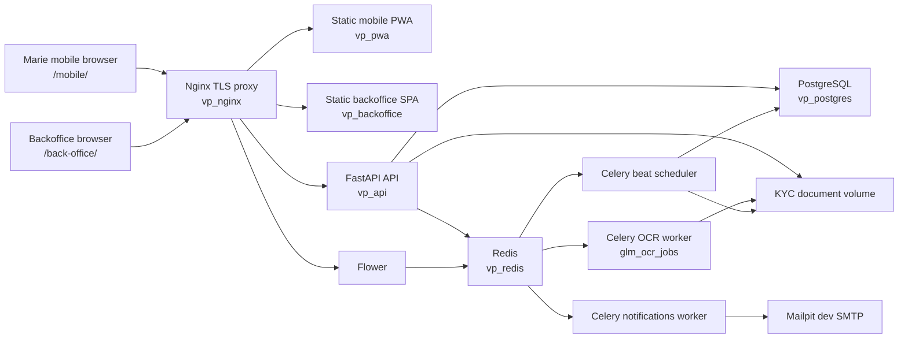

# BICEC VeriPass Project Overview

Updated: 2026-05-28

Audience: new project owners, maintainers, technical reviewers, assigned successors, and AI coding agents.

## What The Project Does

BICEC VeriPass is a sovereign digital KYC onboarding platform for BICEC. It turns a branch-heavy onboarding process into a mobile-first journey where a client captures identity documents, confirms OCR output, completes liveness, submits consent, and waits for a human backoffice decision.

The important product rule is simple: automation prepares the dossier, but KYC approval is human-validated. VeriPass stores the verified KYC identity in its own database and acts as an authentication and eligibility guardrail before sending the user to other BICEC mobile apps.

VeriPass is not a DGI integration, not a Sopra Amplitude integration, and not a core banking integration layer. That scope is out of the product and should not be documented as a roadmap item. Downstream access to BI PAY, BICEC Mobile-Banking, or any BICEC Wallet app should be handled as an OS-aware mobile handoff: use configured app links/deep links when available, then fall back to the App Store or Google Play for the user's OS.

## Main Users

| User | Product role | Main application |
| --- | --- | --- |
| Marie | Client opening or preparing an account | Mobile PWA under `/mobile/` |
| Jean | KYC validator | Backoffice validation queue |
| Thomas | AML/CFT supervisor | Backoffice compliance pages |
| Sylvie | Operations manager | Backoffice command center and analytics |
| Admin IT | System administrator | Backoffice agent and ATM administration |

The persona names are demo fixtures. In production, role identifiers such as `JEAN` and `THOMAS` describe responsibilities, not literal employee names.

## Current Repository Shape

The live project is a multi-part Docker Compose system:

| Part | Path | Responsibility |
| --- | --- | --- |
| Backend API | `code/backend` | FastAPI, SQLAlchemy models, Alembic migrations, OCR, biometrics, auth, RBAC, Celery tasks |
| Mobile PWA | `code/mobile` | React/Vite PWA for client authentication, KYC capture, dashboard, verified-app handoff, support |
| Backoffice SPA | `code/backoffice` | React/Vite SPA for KYC review, AML, analytics, command center, admin |
| Infrastructure | `code/infra` | Nginx TLS proxy, security headers, offline model mounts |
| Scripts | `code/scripts` | Volume bootstrap, smoke checks, env encryption, backups, pruning, evidence helpers |
| Documentation | `docs` | Handover docs, ADRs, diagrams, troubleshooting, test evidence |
| Planning artifacts | `_bmad-output/planning-artifacts` | PRD, architecture plan, UX spec, epics, backlog |

## Runtime System

## Business Workflow

1. Marie authenticates by phone or email OTP, then sets a PIN and may register passkeys.
2. Marie starts or resumes a KYC session.
3. Marie captures CNI recto, CNI verso, selfie/liveness, proof of address, NIU status, consent, and signature.
4. Backend stores files in the document volume, stores metadata in PostgreSQL, and runs OCR/biometric checks.
5. Marie submits the dossier. Backend moves the session to `PENDING_AGENT_REVIEW`.
6. Jean reviews evidence and can approve, reject, request more information, correct OCR, classify complementary documents, or assign dossiers.
7. Thomas handles AML alerts, PEP/sanctions screening, NIU conflicts, document-expiry issues, agencies, and internal batch monitoring.
8. When the dossier is approved, VeriPass can unlock verified-user actions and hand off the user to BI PAY, BICEC Mobile-Banking, or another configured BICEC Wallet destination through mobile app links or store links.
9. Sylvie monitors operations, analytics, service load, SLA health, and queue distribution.
10. Admin IT manages agents and ATMs.

## State And Access Model

The backend separates lifecycle status from client access level.

| Lifecycle status | Access level | Meaning |
| --- | --- | --- |
| `DRAFT` | `GUEST` | Session exists but is still being prepared |
| `PENDING_AGENT_REVIEW` / `PENDING_KYC` | `RESTRICTED` | Submitted or pending human review |
| `PENDING_INFO` | `RESTRICTED` | Client must provide additional data |
| `APPROVED` | `LIMITED_ACCESS` | KYC accepted; verified-app handoff and limited guarded actions can unlock |
| `FRAUD_SUSPECT` | `DISABLED` | Compliance block |
| `REJECTED` / `ABANDONED` | `GUEST` | Terminal or restartable failure states |
| `LOCKED_LIVENESS` | `RESTRICTED` | Liveness lockout path |

The source-of-truth implementation is `code/backend/app/modules/kyc/schemas.py`; older diagrams in `docs/diagrams/` explain intent and historical context.

## Technical Pillars

| Pillar | Implementation |
| --- | --- |
| Sovereignty | Local Docker stack, local PostgreSQL, local Redis, local file volumes, offline model mount by default |
| API | FastAPI under `/api/v1`, async SQLAlchemy, Pydantic schemas |
| Data | PostgreSQL 17, Alembic migrations, external Docker volumes for DB and document storage |
| OCR | PaddleOCR first, GLM-OCR fallback via Celery, optional encrypted Oracle Cloud OCR path when explicitly enabled |
| Biometrics | MediaPipe landmarks from mobile, backend liveness scoring, DeepFace verification where available |
| Async jobs | Celery workers for OCR, notifications, sanctions sync, backups, abandoned sessions, document expiry |
| Security | JWT access/refresh tokens, bcrypt passwords/PINs, refresh-token revocation, agent RBAC, device tags, rate limits |
| Downstream handoff | Configured app links/deep links and App Store/Google Play fallbacks for BI PAY, BICEC Mobile-Banking, or BICEC Wallet destinations |
| Frontends | React/Vite, TanStack Query, local API clients, route-level guards |
| Observability | Health endpoints, structured logs, Sentry proxy, Flower, test-evidence artifacts |

## Read This First

Start with:

1. [Maintainer Handbook](./maintainer-handbook.md)
2. [Architecture](./architecture.md)
3. [Development Guide](./development-guide.md)
4. [API Contracts](./api-contracts.md)
5. [Data Models](./data-models.md)
6. [Operations Runbook](./operations-runbook.md)

For user flows and product intent, keep `_bmad-output/planning-artifacts/prd.md`, `_bmad-output/planning-artifacts/architecture-bicec-veripass.md`, and `_bmad-output/planning-artifacts/ux-design-specification-v2.md` nearby. They are planning sources; the `code/` directory is the implementation source of truth. If those older artifacts mention DGI, Sopra Amplitude, or core banking provisioning, treat those mentions as obsolete.
